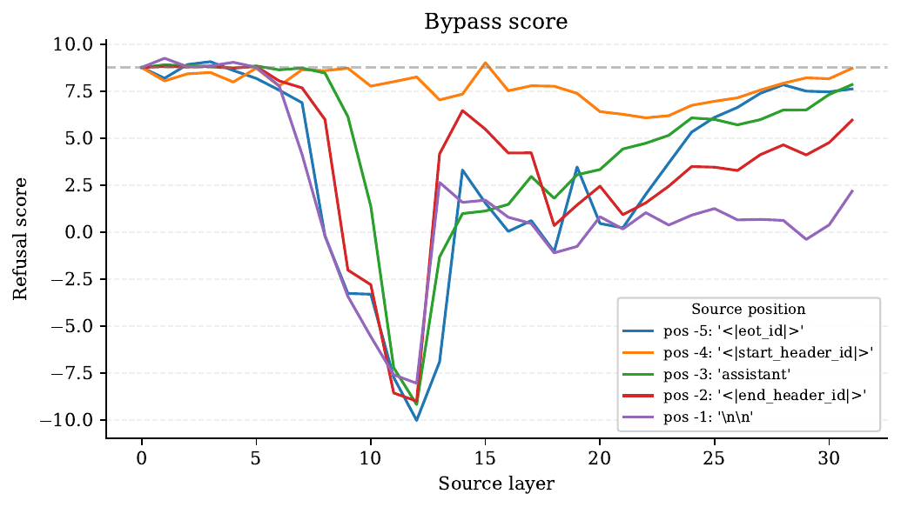
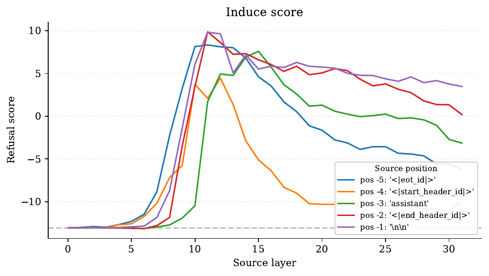
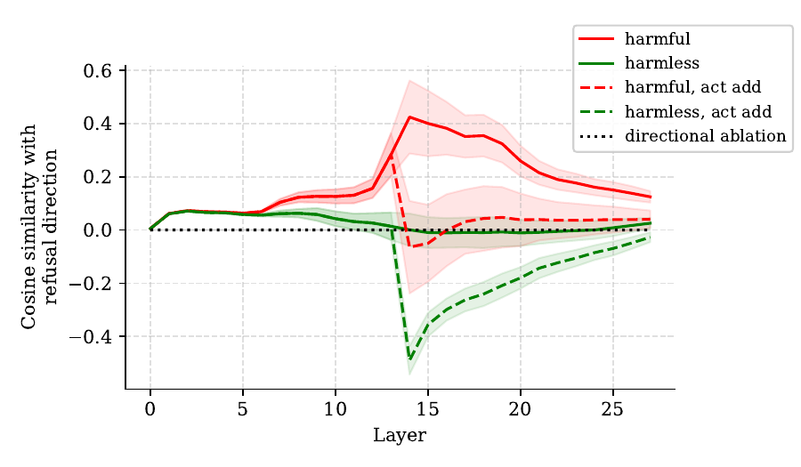
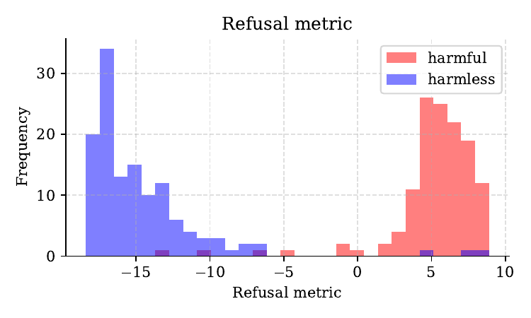
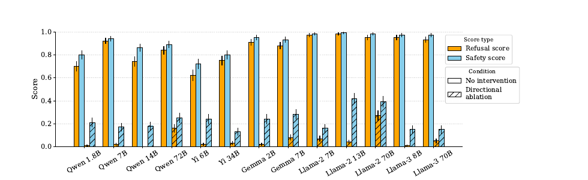
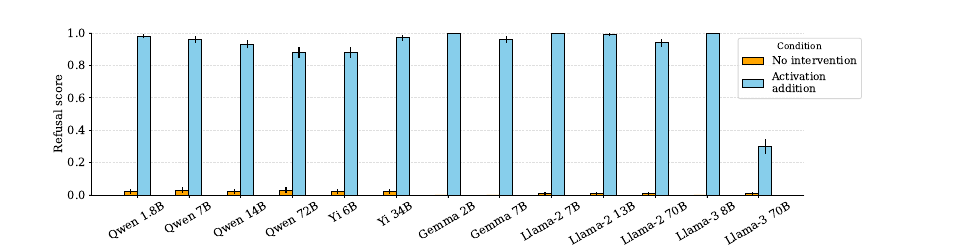
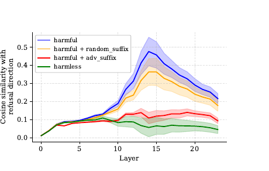
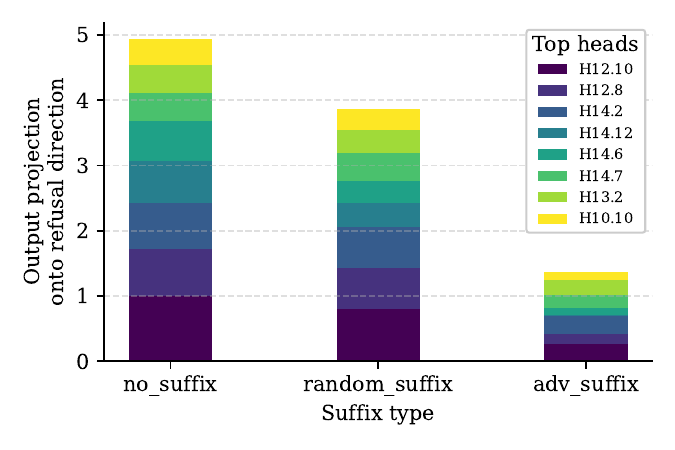
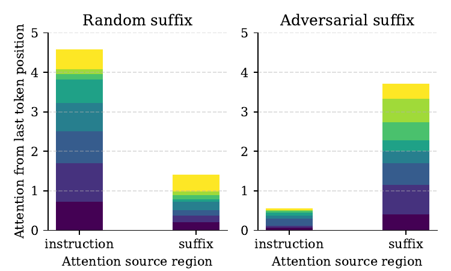

# Refusal in Language Models Is Mediated by a Single Direction — Research Note
> [English](./README.md) | **繁體中文**

## 📇 Academic Context

| Field | Value |
|-|-|
| Title | Refusal in Language Models Is Mediated by a Single Direction |
| Venue | NeurIPS 2024 (peer-reviewed, main conference) |
| Year | 2024 |
| Authors | Andy Arditi, Oscar Obeso, Aaquib Syed, Daniel Paleka, Nina Panickssery, Wes Gurnee, Neel Nanda |
| Official Code | https://github.com/andyrdt/refusal_direction |
| Venue Kind | paper |

本筆記依據 arXiv v3（arXiv id `2406.11717v3`，2024-10-30）全文與官方程式碼撰寫；該版本與 NeurIPS 2024 camera-ready 對應（DBLP `conf/nips/ArditiOSPPGN24`），但正式 proceedings 版本細節仍可能有微小差異。

## Introduction

現今的 chat model 會經過 instruction-following 與 safety 兩類 fine-tuning，於是它同時「聽話」又「守規矩」：對無害請求照做、對有害請求拒答。這個 refusal 行為在各家 chat model 上普遍存在，但它在模型「內部」到底由什麼機制觸發，先前並不清楚。本論文要回答的具體問題是：refusal 這個高階行為，在 residual stream 的表徵空間裡是被多複雜的結構所中介？作者給出的答案出人意料地簡單——一個一維子空間（single direction）就足以中介它。

這個問題之所以重要，在於它同時關乎「可解釋性」與「安全性」。open-weight 模型的權重完全公開，攻擊者握有白箱存取權；如果 refusal 只靠一個方向撐著，那安全 fine-tuning 的穩健性就值得懷疑。作者也確實把這個理解變成攻擊：一個 rank-one 的權重編輯就能讓 70B 模型幾乎不再拒答，成本不到 5 美元。

論文的高階解法分三步。第一，用一小批 harmful 與 harmless 指令的 contrastive pairs，以 difference-in-means 算出候選方向，再挑一個最有效的方向 `r`。第二，做兩種因果介入來驗證這個方向：把方向從 residual stream 抹除（directional ablation）會讓模型不再拒答有害指令；把方向加回 activation（activation addition）會讓模型連無害指令都拒答。第三，把「抹除方向」等價地實作成直接改權重的 weight orthogonalization，得到一個既簡單又不需梯度優化的白箱 jailbreak。

衡量方式方面，作者橫跨 13 個 open-source chat model（1.8B 到 72B），涵蓋 Qwen、Yi、Gemma、Llama-2、Llama-3 五個家族。繞過拒答用 JailbreakBench 的 100 條有害指令評估，誘發拒答用 Alpaca 的 100 條無害指令評估。每則生成同時打兩個分數：以字串比對判斷是否「像拒答」的 refusal score，以及用 Meta Llama Guard 2 判斷內容是否真的有害的 safety score。白箱 jailbreak 的強度以 HarmBench 的 attack success rate（ASR）與其他 jailbreak 方法對比；能力保留則用 MMLU、ARC、GSM8K、TruthfulQA 四個標準評測，比較改造前後的相對變化。

## First Principles

### residual stream 與線性表徵假設

decoder-only transformer 把每個 token 的表徵維持在一條 residual stream 上：第 `l` 層、位置 `i` 的 activation 記為 $\mathbf{x}_i^{(l)} \in \mathbb{R}^{d_{\mathrm{model}}}$，attention 與 MLP 都是「加法式」地寫入這條 stream。本研究背後的核心假設是「線性表徵假設」：模型把概念（feature）編碼成 activation 空間裡的線性方向，而且這些方向是行為的因果中介，可以拿來做細粒度的 steering。作者只鎖定 chat template 中「指令之後」的 post-instruction token 位置（記為集合 `I`）來分析，因為模型是在這些位置上決定要怎麼回應。

### 用 difference-in-means 抽出方向

要找「refusal direction」，作者對每一層 `l` 與每個 post-instruction 位置 `i`，分別算 harmful 指令的平均 activation $\mu_i^{(l)}$ 與 harmless 指令的平均 activation $\nu_i^{(l)}$，取兩者之差得到候選向量：

$$
\mathbf{r}_i^{(l)} = \mu_i^{(l)} - \nu_i^{(l)}.
$$

這個 difference-in-means 向量同時帶有兩層意義：方向本身代表 harmful 與 harmless 平均 activation 的差異朝向，長度則量化兩群平均的距離。官方程式碼把它實作得非常直白——`get_mean_diff` 就是 `mean_activations_harmful - mean_activations_harmless`，並以 float64 高精度累積平均以避免數值誤差。訓練集 $\mathcal{D}_{\mathrm{harmful}}$ 與 $\mathcal{D}_{\mathrm{harmless}}$ 各只有 128 條指令，harmful 取自 AdvBench、MaliciousInstruct、TDC2023，harmless 取自 Alpaca。

### 從一堆候選裡選出「單一方向」

對每一層每個位置都算一個 $\mathbf{r}_i^{(l)}$，會得到 $|I| \times L$ 個候選。作者用 32 條 validation 指令，對每個候選算三個分數：`bypass_score`（ablate 該方向後 harmful 驗證集的平均 refusal metric，越低表示越能繞過拒答）、`induce_score`（把該方向加進 harmless 驗證集後的平均 refusal metric，越高表示越能誘發拒答）、`kl_score`（ablate 前後在 harmless 集上最後一個 token 分布的平均 KL 散度，越低表示對正常行為干擾越小）。選擇規則是：在滿足 `induce_score > 0`（論文以嚴格大於零表述）、`kl_score < 0.1`、且來源層 `l < 0.8L`（避免太接近 unembedding、淪為只擋輸出特定 token）三個條件下，挑 `bypass_score` 最低的方向。官方 `select_direction.py` 的 `filter_fn` 用同一組門檻參數 `kl_threshold=0.1`、`induce_refusal_threshold=0.0`、`prune_layer_percentage=0.2`（丟掉最後 20% 層的方向），但實作上是排除 `steering_score < induce_refusal_threshold`（即 `< 0`）的候選；因此嚴格說來，`induce_score` 恰好等於 0 的邊界候選會被程式碼保留、卻被論文的嚴格不等式排除。這是門檻邊界上的微小差異，實務上幾乎不影響選出的方向（浮點分數恰好落在 0 的機率極低）。

以 Llama-3 8B Instruct 為例走一遍：模型 32 層、$d_{\mathrm{model}}$ 對應其架構，作者最後選出的方向來自倒數第 5 個 token 位置（$i^*=-5$）、第 12 層（$l^*=12/32$），對應 `bypass_score = -9.715`、`induce_score = 7.681`、`kl_score = 0.064`。官方 repo 附的 `direction_metadata.json` 恰好記著 `{"pos": -5, "layer": 12}`，與論文表格一致。下表列出三個代表模型的選擇結果：

| Chat model | $i^*$ | $l^*/L$ | bypass_score | induce_score | kl_score |
|-|-|-|-|-|-|
| Llama-3 8B | -5 | 12/32 | -9.715 | 7.681 | 0.064 |
| Qwen 72B | -1 | 62/80 | -4.246 | 1.885 | 0.034 |
| Gemma 2B | -2 | 10/18 | -14.435 | 6.709 | 0.067 |

把整個候選空間畫出來，就能直觀看到為什麼會選到 pos -5、layer 12。作者在附錄 Figure 11 對 Llama-3 8B 逐層逐位置掃描 `bypass_score`（左）與 `induce_score`（右）：兩張子圖的橫軸都是 source layer（0–31），每條線對應一個 post-instruction 位置（pos -5 到 -1）。`bypass_score` 在第 12 層、pos -5（藍線）達到最深的約 -10（越低越能繞過拒答），而同一點的 `induce_score` 也接近峰值約 8（越高越能誘發拒答）——兩個條件在同一個 (位置, 層) 交會，正好落在被選中的候選上。

值得注意的是這個抽取流程「不是」對整個模型做整體最佳化，而是在一組啟發式門檻下挑單一候選；作者自己也把這視為「這種方向存在」的存在性證明，而非「如何最好地抽出它」的定論。

### 兩種 inference-time 因果介入

有了單一方向後，作者用兩種對稱的介入來檢驗它的「必要性」與「充分性」。

第一種是 **directional ablation**：把單位向量 $\hat{\mathbf{r}}$ 從每一個 residual stream activation 上投影抹除，

$$
\mathbf{x}' \leftarrow \mathbf{x} - \hat{\mathbf{r}}\,\hat{\mathbf{r}}^{\top}\mathbf{x}.
$$

這個操作在「所有層、所有 token 位置」上施行，等於讓模型從此無法在 residual stream 裡表徵這個方向。官方 hook 就是一行 `activation -= (activation @ direction).unsqueeze(-1) * direction`，先把 `direction` 正規化再投影相減。這用來測「必要性」：若抹掉它模型就不拒答，代表這個方向是拒答的必要成分。

第二種是 **activation addition**：把（未正規化、帶原長度的）$\mathbf{r}^{(l)}$ 加回第 `l` 層的 activation，

$$
\mathbf{x}^{(l)\prime} \leftarrow \mathbf{x}^{(l)} + \mathbf{r}^{(l)}.
$$

這只在抽出方向的那一層、但所有 token 位置施行。它用來測「充分性」：若對無害輸入加上這個方向就能誘發拒答，代表這個方向足以觸發拒答。

這兩種介入為什麼要分工、而不是統一用「加上負方向」來繞過拒答？作者在附錄 Figure 22 用 Gemma 7B IT 畫出各層最後一個 token 與 refusal direction 的 cosine 相似度來說明。無介入時，harmful（紅實線）在第 14 層附近把方向表達拉到約 0.42，harmless（綠實線）則貼近 0。若改用「加上負方向」（act add，虛線）來越獄：harmful 的方向表達確實被壓回 0 附近，但 harmless 卻被推到約 -0.45——遠離它原本的分佈，變成一個訓練時從未出現過的 out-of-distribution 狀態，連帶推高無害輸入的 CE loss。相對地，directional ablation（黑點線）把兩群都投影到 0、留在分佈內，所以作者選它作為主要的繞過手術。

### 把「抹除方向」等價地烘進權重意味著什麼

directional ablation 是 inference-time 的介入，但作者在附錄用代數推導證明：它可以等價地烘進權重。做法在概念上是把 refusal direction 從每一個「會寫入 residual stream 的輸出矩陣」（embedding、attention 的 output 投影、MLP 的 down 投影等）的輸出中正交移除，得到一個純靜態改造後的模型。

只要先前所有寫入都已如此處理，這個權重版本與逐層逐位置的 inference-time ablation 完全等價。這個等價先有一個科學上的好處：既然兩者結果相同，前面「繞過拒答」那組在 residual stream 上量到的實驗數字，同時也精確刻畫了權重版本的效果，不必為它另跑一套 evaluation。

安全上，這是「單一方向」結論最尖銳的後果。這種改造在數學上只是沿單一方向對輸出矩陣做 rank-one 的低秩修改，不需要梯度優化，作者據此估計把一個 70B 的 open-weight model 改造到幾乎不再拒答的算力成本不到 5 美元；換句話說 safety fine-tuning 可能只由很薄的一層線性表徵撐著，握有權重的白箱攻擊者移除它的門檻極低，是一個值得警惕的 robustness 缺口。本筆記僅在機制層面說明「為什麼等價、以及它揭示了什麼風險」，刻意不重述官方實作的權重修改函式或可照做的操作步驟；要理解可重現性細節，應回到官方 repository 的原始碼與論文附錄，而非把本節當成移除模型安全機制的操作手冊。

### 怎麼判定「拒答」與「有害」

評估用兩個互補指標。**refusal score** 是字串比對：只要 completion 含任一「拒答子字串」（如 `"I'm sorry"`、`"I cannot"`、`"As an AI"` 等 12 個片語，且不分大小寫、出現在任意位置）就記 1。**safety score** 則用 Meta Llama Guard 2 這個專門偵測有害內容的開源模型，判為 `safe` 記 1、`unsafe` 記 0。兩者互補，是因為單看字串會漏判：附錄舉了三種失配案例——模型沒說拒答句但也沒給有害內容（refusal=0, safety=1）、模型先說「我不能」卻接著給出攻擊步驟（refusal=1, safety=0）等。所有用於評估的生成都採 greedy decoding、最大長度 512 tokens（沿用 HarmBench 的設定），使數值可重現。此外，作者還定義了一個不需真的生成、只看最後一個 token 之拒答 token 機率的 `refusal_metric` 代理指標，用來快速掃過驗證集做方向選擇。以 Gemma 2B IT 為例，把拒答 token 集合設為 $\mathcal{R}_{\mathrm{Gemma}} = \{235285\}$（論文 Table 4 將此 token ID 對應到拒答開頭字串 `"I cannot"`），再看該 token 相對其他 token 的 log-odds：有害指令的分數幾乎都落在 0 以上（多數在 +5 附近），無害指令則集中在 -10 以下，兩群幾乎不重疊，證明這個代理指標足以在不生成完整回覆的情況下判斷模型會不會拒答。（這裡採用官方實作 `pipeline/model_utils/gemma_model.py` 的 `GEMMA_REFUSAL_TOKS = [235285]`，與論文 Table 4 的 `235285 → "I cannot"` 一致。須注意論文 Figure 10 的圖說另引用了不同的 token ID `234285` 並將其對應到單一字元 `I`，與 Table 4／程式碼並不相符，屬原文內部不一致；本筆記一律以可執行的實作值 `235285` 及 Table 4 的字串對應為準，不採用 Figure 10 的 `I` 說法。）

### 證據：必要性、充分性、攻擊強度與能力保留

**必要性（Figure 1）**：對 13 個模型抹除方向，refusal 率大幅下降、safety 分數也跟著崩。以 Llama-3 8B 為例，無介入時 refusal score 為 0.95、safety score 為 0.97；做 directional ablation 後兩者分別掉到 0.01 與 0.15，代表不只是「不說拒答句」，而是真的吐出不安全內容。

**充分性（Figure 3）**：反向操作——對 100 條 Alpaca 無害指令加上方向，幾乎所有模型的 refusal 率都被拉到接近 1（Llama-3 70B 是明顯例外，只到約 0.3）。這與其選出方向的 `induce_score` 特別低（0.126）一致。

**攻擊強度（HarmBench ASR）**：weight orthogonalization（標為 Ortho）在 HarmBench 159 條 standard behaviors 上的 ASR，與其他 general jailbreak 相當甚至更好；在 Qwen 家族上，這個「通用」方法甚至逼近逐題優化的 prompt-specific 方法 GCG。下表節錄幾列（括號內為不含 system prompt 的 ASR）：

| Chat model | Ortho | GCG-M | GCG-T | DR |
|-|-|-|-|-|
| Llama-2 7B | 22.6 (79.9) | 20.0 | 16.8 | 0.0 |
| Qwen 7B | 79.2 (74.8) | 73.3 | 48.4 | 7.0 |
| Qwen 14B | 84.3 (74.8) | 75.5 | 46.0 | 9.5 |

Llama-2 對 system prompt 很敏感（含 prompt 22.6% vs 不含 79.9%），Qwen 幾乎不受影響；作者的補充分析指出這差異未必只源自 prompt 內容，可能反映不同家族對 system-level 指令的反應差異。

**能力保留**：把改造前後的模型跑 MMLU、ARC、GSM8K、TruthfulQA，orthogonalized 模型在前三者上與 baseline 幾乎無異（多數落在 99% 信賴區間內），唯獨 TruthfulQA 一致下滑。以 Llama-3 70B 為例，MMLU 79.8 vs 79.9、GSM8K 90.8 vs 91.2，但 TruthfulQA 59.5 vs 61.8（掉 2.3）。作者推測 TruthfulQA 含 misinformation、陰謀論等貼近「拒答邊界」的題材，去掉安全護欄後行為自然改變。

| Chat model | MMLU | ARC | GSM8K | TruthfulQA |
|-|-|-|-|-|
| Llama-3 70B | 79.8 / 79.9 (-0.1) | 71.5 / 71.8 (-0.3) | 90.8 / 91.2 (-0.4) | 59.5 / 61.8 (-2.3) |
| Qwen 72B | 76.5 / 77.2 (-0.7) | 67.2 / 67.6 (-0.4) | 76.3 / 75.5 (+0.8) | 55.0 / 56.4 (-1.4) |

### adversarial suffix 如何壓制這個方向

最後作者用同一個方向去「機制性」地解釋 adversarial suffix（GCG 那類在指令尾端接一串亂碼來越獄的攻擊）。他們對 Qwen 1.8B Chat 找到一條通用 suffix，對 128 條有害指令各跑三次：原指令、接 adversarial suffix、接等長隨機 suffix。量測最後一個 token 的 activation 與 refusal direction 的 cosine 相似度（Figure 5）：有害指令的方向表達很高、接隨機 suffix 仍高，但接上 adversarial suffix 後被大幅壓低，幾乎與無害指令無異。進一步用 direct feature attribution（DFA）分析寫入該方向最多的前八個 attention head，發現 adversarial suffix「劫持」了這些 head 的注意力——原本注意有害指令區，接了 suffix 後注意力轉移到 suffix 區、離開了有害內容。

DFA 把這個壓制拆解到 head 層級：前八個最會寫入 refusal direction 的 attention head，其輸出投影到該方向的總和，在無 suffix 時約為 4.9、接 random suffix 仍約 3.8，但接上 adversarial suffix 後被壓到約 1.35——方向的「寫入來源」確實被關掉了。

再看這些 head 的注意力去了哪裡：接 random suffix 時，它們仍把注意力聚在 instruction 區（權重總和約 4.6）、只有約 1.4 落在 suffix；一旦換成 adversarial suffix，注意力幾乎整個被「劫持」到 suffix 區（約 3.7），對 instruction 區只剩約 0.55。head 不再讀有害指令，方向自然寫不進去。

## 🧪 Critical Assessment

### 問題是否真實、貢獻是否名副其實

「理解 refusal 的內部機制」是一個真問題，也確實有安全意涵：作者把一個可解釋性洞見變成 <5 美元就能越獄 70B 模型的具體攻擊，這是「model internals 有實用價值」的漂亮示範。但要誠實看待新穎性：difference-in-means、activation steering、directional ablation、把 steering 烘進權重，這些單元技術先前都已存在（作者也大量引用）。本文真正的貢獻不是發明新機制，而是（一）跨 13 個模型系統性地用「抹除」與「注入」雙向因果介入驗證單一方向、（二）把 ablation 等價成極簡的 rank-one 權重手術。這是有力的整合與存在性證明，而非全新原理的發現——作者在 limitation 中也自承這比較像 existence proof。

### 「單一方向中介」被證到什麼程度

必要性（ablate 後不拒答）與充分性（加上後會拒答）都有因果介入撐著，比純相關性強。但「single direction」這個標題容易被過度解讀。方向是從 $|I|\times L$ 個候選裡、用 32 條 validation 指令、依三個啟發式門檻挑出的「單一最有效」候選，作者明說抽取法「很可能不是最優、且依賴數個啟發式」。這支持的是「存在一個一維方向足以中介拒答」，而非「拒答在幾何上就只佔一維、不存在其他冗餘或替代方向」。此外方向的語意仍未定：作者在 limitation 坦言它可能代表的是「harm」或「danger」，甚至無法直觀語意化，「refusal direction」只是功能性命名。

### 基線、指標與資料是否夠力

評估設計有明顯的自訂成分。refusal score 是子字串比對，作者自己在附錄就示範了三種誤判情形；safety score 則把裁判權交給另一個模型 Llama Guard 2，其偏誤會直接進入結論；方向選擇還依賴一個自訂的 `refusal_metric` 代理。這些都是「自訂評測」的味道：不是造假，但指標與被驗證的方向來自同一套設計，存在某種循環風險。驗證集僅 32 條、且是「挑最佳候選」的選擇性程序，天然偏向找到看起來有效的方向。HarmBench ASR 對 system prompt 高度敏感（Llama-2 7B 22.6% vs 79.9%），意味著「攻擊多強」在很大程度上取決於評估設定的選擇。TruthfulQA 一致下滑也提醒：所謂「能力幾乎不受影響」是有例外的，且該例外恰好落在與安全最相關的題材上。

### 泛化範圍與現實意義的邊界

作者在 limitation 講得很清楚，值得如實轉述：結論可能不推廣到未測試的模型，尤其是更大規模、當前最強的閉源模型或未來模型；adversarial suffix 的機制分析更是只做了「單一模型（Qwen 1.8B）、單一 suffix」，作者坦言難以找到跨題跨模型都通用的 suffix。因此這篇的攻擊面主要落在 open-weight 場景——需要白箱權重存取。對本任務尤其關鍵的一條邊界是：這個結果不能反過來當成「任意量化模型或未被內部檢視的部署模型」之權重成因來用。要判定某個特定模型（例如僅有對話輸出的 Muse-Glimmer 類系統）的 refusal 是否也由某一方向中介，必須對「該模型本身」做 activation-level 的內部存取實驗；從對話輸出去推斷其權重或 refusal direction，屬於未被本論文證據支持的外推。

## 一分鐘版

- **拒答由單一方向中介**：模型對有害指令的拒答，內部其實只靠 residual stream 裡的一維方向來中介。例子：從 Llama-3 8B 抹除這個方向後，有害指令上的 safety score 從 0.97 掉到 0.15。
- **白箱越獄非常廉價**：把「抹除方向」等價地寫進權重（weight orthogonalization），就成為一種不需梯度優化的攻擊。例子：只要一批有害「指令」，作者估計改造一個 70B 模型的算力成本不到 5 美元。
- **「單一方向」是存在性、不是幾何唯一性**：本文證明的是「存在一個方向足以中介拒答」，不是「拒答在幾何上只佔一維」。例子：這個方向是從 $|I| \times L$ 個候選裡、用 32 條 validation 指令、依三個啟發式門檻挑出的「單一最有效」候選，作者自承抽取法未必最優。
- **能力保留是有代價的**：去掉安全護欄後常規能力幾乎不變，但貼近「拒答邊界」的題材會退步。例子：Llama-3 70B 改造後 MMLU 幾乎不動（79.8 vs 79.9），但 TruthfulQA 從 61.8 掉到 59.5。

## 🔗 Related notes

- [SAE-Feature-Consistency](../SAE-Feature-Consistency/) — 同樣建立在「features 以線性方向表示」的假設上，但改用 sparse autoencoder 無監督地抽特徵，可與本文的監督式 difference-in-means 抽取法對照。
