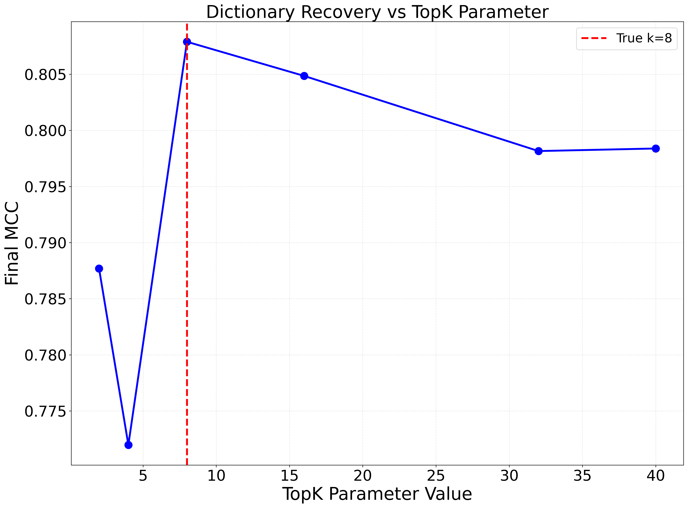
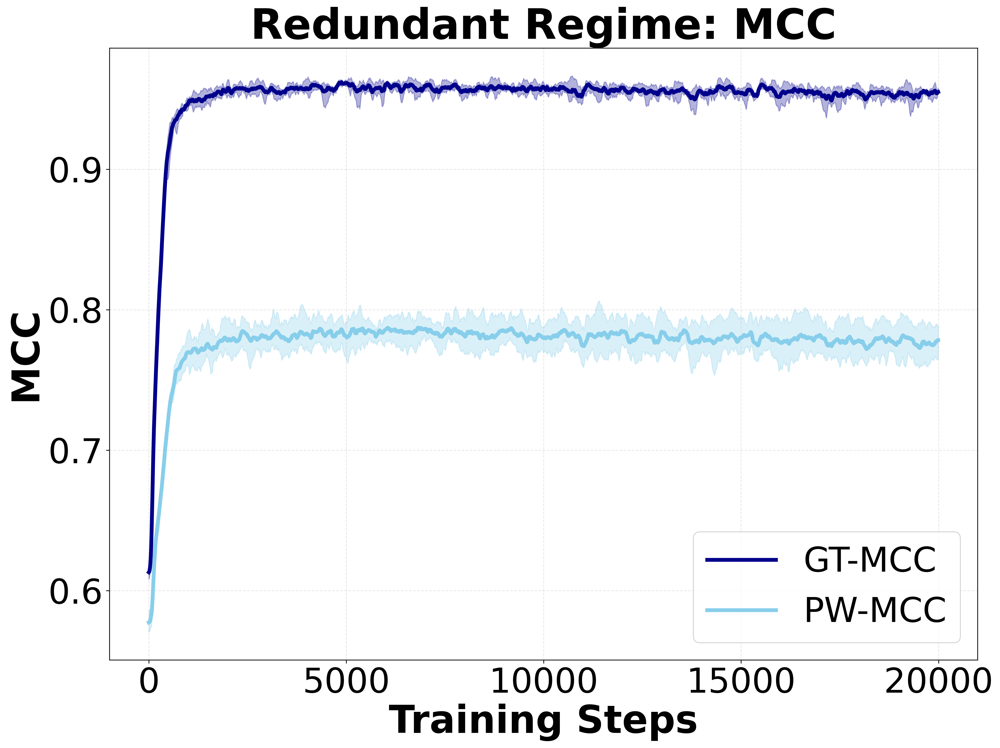
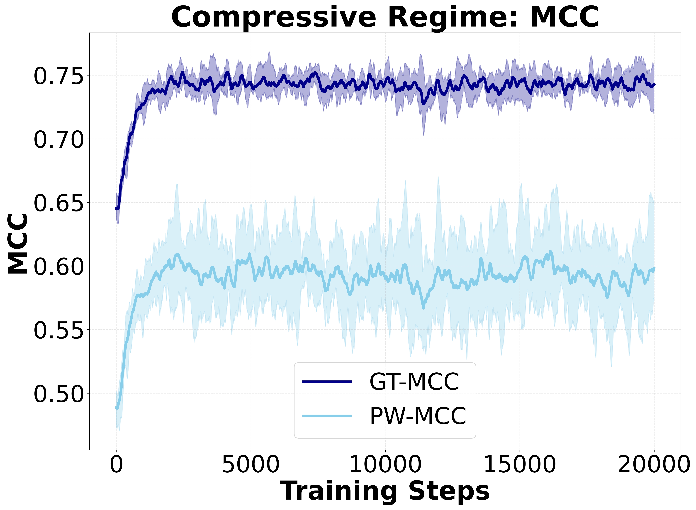
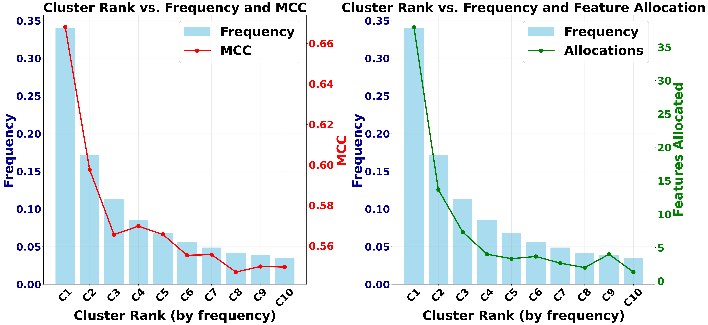
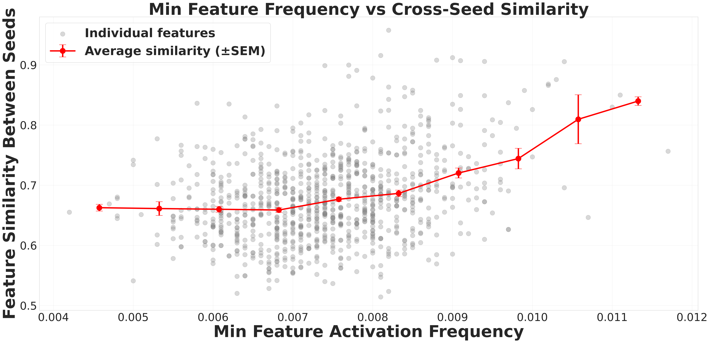
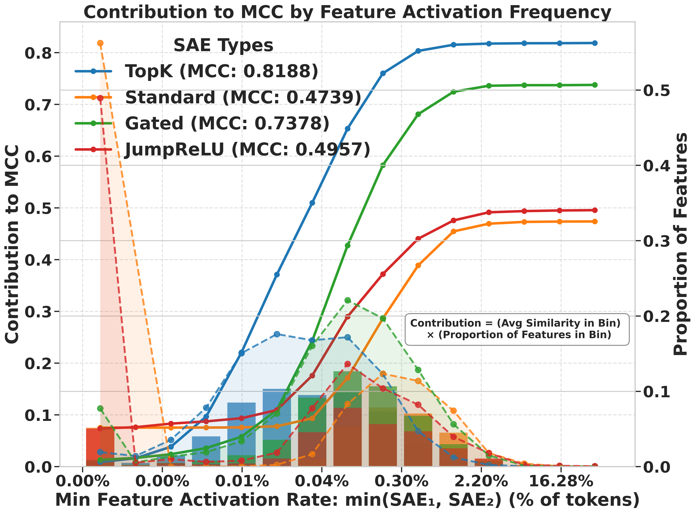
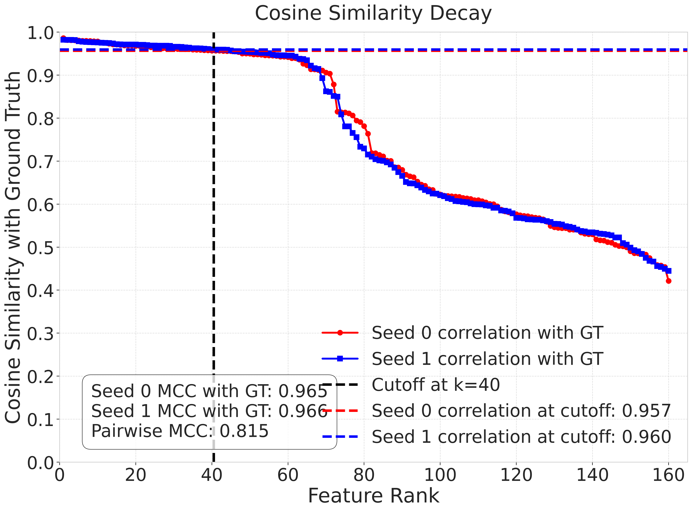

# SAE Feature Consistency — Research Note
> [English](./README.md) | **繁體中文**

## 📇 Academic Context

| Field | Value |
|-|-|
| Title | Position: Mechanistic Interpretability Should Prioritize Feature Consistency in SAEs |
| Venue | arXiv preprint (2505.20254) |
| Year | 2025 |
| Authors | Xiangchen Song, Aashiq Muhamed, Yujia Zheng, Lingjing Kong, Zeyu Tang, Mona T. Diab, Virginia Smith, Kun Zhang (Carnegie Mellon University；Kun Zhang 另屬 MBZUAI) |
| Official Code | https://github.com/xiangchensong/sae-feature-consistency |
| Venue Kind | paper |

> 本筆記依據 arXiv 版全文（`2505.20254`）撰寫。原稿採 NeurIPS 2025 preprint 樣式，但未見同儕審查（peer-review）接收證據，故正式發表場域列為 `unknown`，此處以「arXiv 預印本」記錄；正式版若被接收，內容可能與此稿有出入。

## First Principles

這是一篇 **position paper**（立場論文）。閱讀時務必把它拆成兩層：一層是可檢驗的**經驗主張**（PW-MCC 的數值、TopK 的 0.80、合成 model organism 的 ground-truth 還原、以及一致性與語意相似度的相關性），另一層是**規範性立場**（整個領域「應該」把一致性當成第一級目標）。本節先把方法從第一性原理講清楚，批判留待下一節。

### 問題：SAE 特徵為何「跑一次就換一批」

Sparse Autoencoders（SAEs）被用來把神經網路的 activation 拆解成較可解釋、較 monosemantic 的特徵，社群長期的抱負是找出一組 **canonical**（唯一、完整、原子）的特徵字典。問題在於：即使用相同資料與架構、只改隨機初始化，不同訓練 run 學到的字典常常明顯不同，對 Standard SAE 而言重疊度有時低至 **30%**。這種 run-to-run 的不穩定（伴隨 feature splitting、feature absorption 等現象）直接侵蝕了「用 SAE 得到的解釋可被重現」這個科學前提。

### SAE 與一致性的形式化

一個 SAE 由 encoder 與 decoder 組成：encoder 把輸入 $\mathbf{x} \in \mathbb{R}^{m}$ 映到稀疏潛在碼 $\mathbf{f} \in \mathbb{R}^{d_{\text{sae}}}$，其中 $d_{\text{sae}} > m$ 使字典成為 **overcomplete**（過完備）；decoder 以字典 $\mathbf{A}=\mathbf{W}_{\text{dec}}$ 重建輸入。訓練同時逼近重建與稀疏，最小化如下損失：

$$
L(\mathbf{x}) = \|\mathbf{x} - \hat{\mathbf{x}}\|_2^2 + \lambda S(\mathbf{f}(\mathbf{x}))
$$

論文把「一致」形式化為 **Strong Feature Consistency**：兩個獨立 run 學到的字典 $\mathbf{A}$、$\mathbf{A}'$ 若能在**排列（permutation）加上每個特徵各自的非零縮放（scaling）**下對齊，即視為等價——亦即對每個 $\mathbf{a}_i$ 存在 $\mathbf{a}_{\sigma(i)}'$ 使 $\mathbf{a}_i = \lambda_i \mathbf{a}_{\sigma(i)}'$。這正是 ICA 文獻裡用 Mean Correlation Coefficient（MCC）衡量的等價關係。

### MCC、PW-MCC 與 GT-MCC

對兩個字典 $\mathbf{A}$、$\mathbf{B}$（欄為特徵向量），令 $n=\min(d_A,d_B)$，MCC 定義為在所有一對一配對 $M$ 上取最大平均後的絕對餘弦相似度：

$$
\text{MCC}(\mathbf{A}, \mathbf{B}) = \frac{1}{n} \max_{M} \sum_{(i,j) \in M} \frac{|\langle \mathbf{a}_{i}, \mathbf{b}_{j} \rangle|}{\|\mathbf{a}_{i}\|_2 \|\mathbf{b}_{j}\|_2}
$$

其中最佳配對 $M^*$ 用 **Hungarian algorithm**（匈牙利演算法）求解。由此衍生兩個指標：**PW-MCC**（Pairwise Dictionary MCC）比較兩個各含 $d_{\text{sae}}$ 個特徵的學得字典，量測 run-to-run 一致性；**GT-MCC**（Ground-Truth MCC）在有已知真值字典 $\mathbf{A}_{\text{gt}}$ 的合成環境下量測還原品質。核心經驗論點是：GT-MCC 需要真值、實務上拿不到，而 PW-MCC 不需要真值卻能當它的可靠 proxy。

### 一個可手算的 PW-MCC 例子

取兩個 $m=2$、各 2 個特徵的小字典，看配對如何主導結果：

```text
A  的特徵：a1 = (1, 0),      a2 = (0, 1)
A' 的特徵：b1 = (0.1, 1.0),  b2 = (1.0, 0.2)

四個絕對餘弦相似度（|cos|）：
  |cos(a1,b1)| = |1*0.1 + 0*1.0| / (1 * sqrt(0.01+1.0)) = 0.1 / 1.005 = 0.0995
  |cos(a1,b2)| = |1*1.0 + 0*0.2| / (1 * sqrt(1.0+0.04)) = 1.0 / 1.020 = 0.9806
  |cos(a2,b1)| = |0*0.1 + 1*1.0| / (1 * 1.005)          = 1.0 / 1.005 = 0.9950
  |cos(a2,b2)| = |0*1.0 + 1*0.2| / (1 * 1.020)          = 0.2 / 1.020 = 0.1961

兩種一對一配對：
  身分配對 (a1-b1, a2-b2)：0.0995 + 0.1961 = 0.2956  → 平均 0.148
  交換配對 (a1-b2, a2-b1)：0.9806 + 0.9950 = 1.9756  → 平均 0.988

Hungarian 取「總和最大」= 交換配對。
PW-MCC = 1.9756 / 2 = 0.988
```

關鍵在最後一步：若不做配對、直接按索引比對，這對字典看起來只有 0.148、幾乎不一致；Hungarian 找到 $\sigma$ 把 b2↔a1、b1↔a2 對上後，才顯示它們其實是同一組特徵、只是排列不同，PW-MCC 高達 **0.988**。這說明「一致性」量的是「排列/縮放之下」的等價，而非逐欄相等。

### 為什麼 TopK 能達到高一致性：從 spark condition 到 identifiability

論文的理論骨幹是稀疏字典學習的 **spark condition**：若字典 $\mathbf{A}$ 對 $k$-sparse 向量是單射，則稀疏表示唯一。援引 Hillar & Sommer 的結果，任兩個都滿足 spark condition、且在足夠涵蓋的資料上達到零重建誤差的字典，必然在排列與縮放下一致（$\mathbf{A}'=\mathbf{A}\mathbf{P}\mathbf{D}$）。TopK SAE 因為以 $\operatorname{TopK}_k$ 強制**恰好 $k$-sparse**、逼近零重建、並透過 round-trip 性質誘導 spark condition，三者同時成立時，任兩個 TopK SAE 學到的字典必**identical up to permutation and scaling**。這就是「TopK 比 ReLU/Standard 更一致」在理論上的來源。

這也解釋了為何選對 $k$ 很關鍵：在 matched regime（$d_{\text{gt}}=d_{\text{sae}}=40$、真值稀疏度 $s=8$）掃描 $k$ 時，字典還原品質恰在 $k=s=8$ 達峰，且對誤設呈**非對稱**——低估 $k$ 比高估更傷。



### 合成驗證：從理想到現實的階梯

在**匹配**（matched，$d_{\text{sae}}=d_{\text{gt}}$）的理想合成設定（$m=8,\ d_{\text{gt}}=16,\ k=3,\ n=5\text{e}4$）下，**TopK 的 GT-MCC 達 0.97 vs 0.63**（Standard），且 PW-MCC 曲線緊貼 GT-MCC——這是「PW-MCC 可當 GT-MCC 代理」最乾淨的證據。一旦放寬到容量不匹配，落差就出現：在**冗餘**（redundant，$d_{\text{sae}}=160>d_{\text{gt}}=80$）下 GT-MCC 仍高（0.95）但 **PW-MCC 掉到 0.77**，因為多餘容量造成 selection ambiguity（同一真值特徵有多個同樣好的學得向量可選）；在**壓縮**（compressive，$d_{\text{sae}}=80<d_{\text{gt}}=800$）下 GT-MCC 與 PW-MCC 一起下滑（0.75 / 0.60）。





真實語言資料的特徵頻率呈 Zipfian 長尾，論文用 model organism 把它模進來，發現 TopK SAE **不會**把字典容量平均分配給各頻率群，而近似一條冪律：$C_c \approx d_{\text{sae}} \cdot p_c^{\alpha} / \sum_j p_j^{\alpha}$，經驗上 $\alpha \approx 1.4$。於是高頻概念拿到較多容量、GT-MCC 較高，低頻概念被擠進 locally compressive regime、跨 run 相似度低——一致性因此是**頻率相依**的。






### 真實 LLM 上的落地結果

把 SAE 訓練在 **Pythia-160M**（residual stream，layer 8）的 activation 上，字典寬度 $2^{14}$、用 `monology/pile-uncopyrighted` 的 500M tokens，每個架構跑 3 個獨立 run（`random_seeds = [42, 43, 44]`）並選 PW-MCC 最高的超參。結論是：高一致性在真實資料上**可達**——**TopK SAE 的 PW-MCC ≈ 0.80**，是全篇規範性主張的經驗支點。頻率相依現象也重現：把匹配特徵對按 activation 頻率分箱，最稀有的一箱平均相似度只有 0.514，最高頻箱達 0.964。

| Act freq / 1M tokens | Features | 匹配對相似度 (mean ± sd) |
|-:|-:|-:|
| 0.1–2.4 | 127 | 0.514 ± 0.280 |
| 2.4–54.1 | 2,542 | 0.742 ± 0.295 |
| 54.1–1.2k | 10,013 | 0.837 ± 0.209 |
| 1.2k–26.7k | 3,548 | 0.888 ± 0.157 |
| 26.7k–592.2k | 33 | 0.964 ± 0.087 |

更進一步，作者用自動解釋 pipeline 為每個特徵生成文字說明，再用 LLM 對「同一匹配對兩邊的說明」評語意相似度（GPT Score，1–10）。字典向量餘弦相似度越高，語意相似度越高：最低相似區間 GPT Score 只有 1.71，最高相似區間（0.5795–0.9999，共 13,640 對）高達 8.28。這是把「幾何一致」連到「語意一致」的關鍵一步。

| 字典向量相似度區間 | 特徵對數 | GPT Score (1–10) |
|-:|-:|-:|
| 0.0654–0.1128 | 34 | 1.71 |
| 0.1128–0.1947 | 311 | 2.19 |
| 0.1947–0.3359 | 975 | 3.27 |
| 0.3359–0.5795 | 1,423 | 4.12 |
| 0.5795–0.9999 | 13,640 | 8.28 |



跨架構比較呼應理論：TopK 與 BatchTopK 取得最高 PW-MCC，Standard 與 JumpReLU 明顯落後。附錄的精確掃描把這個排序量化下來——在 Pythia-160M layer 8 上，TopK 以 target $k=20$ 拿到 PW-MCC 0.8181、居首，BatchTopK 0.7656、Gated 0.7370 次之，而 JumpReLU（target $L_0=40$）僅 0.4947、Standard（sparsity penalty 0.06）0.4739 墊底，最佳結果都出現在第 244,140 訓練步。作者由此主張，PW-MCC 不只是「又一個指標」，而是能在重建損失分不出高下時（例如 TopK 的重建損失隨 $k$ 單調下降、無法指出最佳稀疏度）提供決定性的模型/超參選擇訊號。

## 🧪 Critical Assessment

### 問題是真的，但「應該優先」是價值判斷而非結論

特徵不一致確實是真問題：Standard SAE 重疊度低至 30%，且下游的 circuit、steering、unlearning 都預設特徵是穩定實體，這條動機鏈成立。論文把「可重現性」這個科學常識搬到 SAE 上，訴求正當。但要分清楚：「一致性可被量測、且 TopK 能達到 0.80」是經驗事實；「領域**應該**把一致性升為第一級評估標準」是規範主張，後者不會因為前者為真而自動成立——它還要跟「重建保真度」「概念覆蓋率」「下游任務效用」等其他目標競爭有限的研究注意力。論文自己在 Alternative Views 也承認過度追求穩定可能扼殺探索，但隨即以「嚴謹科學需要可量測基線」帶過，並未真正權衡機會成本。讀者應把它讀成一份**有數據支撐的倡議**，而非已被證立的定論。

### 「0.80 算高嗎」：這是相對高、且被頻率稀釋的高

0.80 的解讀需要三重保留。其一，它是**架構相對**的高：相對於 Standard/JumpReLU（同批實驗的一致性明顯更低）它突出，但 0.80 的絕對意義是「平均匹配對還有約兩成方向對不上」，離 canonical 所需的「幾乎相等」仍有距離。其二，它是**頻率平均**後的數字：同一個 TopK SAE 裡，最稀有特徵的匹配相似度只有 0.514——而稀有特徵往往正是可解釋性最想抓的「特定概念」，一致性最差的地方恰是最需要它的地方。其三，理想合成設定能到 0.97、真實資料只到 0.80，這 0.17 的落差正是 Zipfian 長尾與容量壓縮的代價，論文誠實呈現了，但標題級的「high consistency is achievable」容易讓人略過這層條件。

冗餘體系的合成診斷把「高還原卻低一致」的機制看得最清楚：把兩個 run 的學得特徵各自依與真值的餘弦相似度由高到低排列，相似度在越過真值維度（rank=40）之後仍衰減極慢，代表每個真值概念其實都有一整批同樣好的候選向量。於是 Hungarian 該挑哪一個在兩個 run 之間變得高度敏感，形成 selection ambiguity——GT-MCC 很高、PW-MCC 卻明顯偏低。這說明 0.80 裡那部分「不高」，有一截不是因為特徵沒學好，而是因為好特徵太多、選不穩。



### 指標定義與官方實作之間，藏著一個 sign 的落差

論文的 MCC 定義明確使用**絕對值** $|\langle \mathbf{a}_i,\mathbf{b}_j\rangle|$，理由是「特徵指向相反方向仍應視為方向一致」（sign ambiguity）。但靜態檢視官方 repo 後發現，實際計算 MCC 的兩處程式（`examples/dictionary_learning/utils.py` 與 `synthetic/utils.py`）都用 `cost = 1 - A_norm @ A_est_norm.T`、再 `mcc = 1 - cost`，等於**帶號餘弦相似度、沒有取絕對值**。若真有一對方向相反（$\lambda_i<0$）的匹配特徵，論文公式給 +1、而這段程式會給 −1 並在 Hungarian 中被當成壞配對。這是一個可查證的「紙面定義 vs 釋出實作」不一致：可能是作者在單位範數、非負字典設定下 sign 幾乎不出現而無實害，也可能讓報告的 PW-MCC 系統性偏低。無論哪種，它提醒讀者：復現這些數字前得先確認自己用的是哪個版本的 MCC。（此點來自對官方 repo 的靜態閱讀，未執行任何程式碼。）

### 循環風險：用一個自訂指標，去論證應該優先採用這個自訂指標

方法論上有一個需要點名的張力。全篇的效度鏈是「PW-MCC 在合成上追蹤 GT-MCC → 所以 PW-MCC 是好 proxy → 所以大家應該用 PW-MCC」。但 GT-MCC 只在**作者自建**的線性生成 model organism（$\mathbf{X}=\mathbf{A}_{\text{gt}}\mathbf{F}_{\text{gt}}$、Gaussian 字典、人工 Zipfian）裡才有定義；真實 LLM 特徵是否真存在一組排列/縮放意義下的「真值字典」，正是反方（Paulo & Belrose 等）質疑的核心。論文用「PW-MCC 與語意相似度強相關」補上真實側的證據，但語意相似度本身又是 LLM 評出來的（GPT Score），而且高相似區間樣本量（13,640 對）遠大於低相似區間（34 對），相關性可能被高頻、易解釋的特徵主導。換言之，這套驗證在自己定義的等價關係內自洽，但沒有——也很難——回答「canonical 特徵集是否存在」這個更根本的問題；若不存在，追求高 PW-MCC 有可能是在穩定地擬合一個 artifact。論文對這個 counter-position 的回應是「pragmatic decomposition 只要穩定就有科學價值」，這是合理的退守，卻也悄悄把目標從「找到真特徵」換成了「找到穩定特徵」，兩者並不等價。

### 基線與消融大致夠用，但真實側的架構覆蓋偏薄

正面看，合成端把 matched / redundant / compressive 三種容量狀態、以及 $k$ 誤設都掃過，local identifiability regime 的解釋自洽且被圖表支撐；PW-MCC 相對重建損失的增益也有具體場景（TopK 的 $k$ 選擇）。不足處在於真實側：主文只在 Pythia-160M 單一模型、單一層（layer 8）上完整呈現，Gemma-2-2B 被推到附錄；而「不同層、不同模型尺度下一致性如何變化」恰恰是判斷這套主張能否推廣的關鍵。此外每個架構「選 PW-MCC 最高的超參」本身帶有對自家指標有利的選擇偏差——用 PW-MCC 選超參、再宣稱 PW-MCC 高，比較的公平性需要讀者自行折扣。

## 一分鐘版

- **不一致問題**：用相同資料、相同架構訓練 SAE，只要換一個隨機初始化，學到的特徵字典就會明顯不同——Standard SAE 獨立跑兩次，特徵重疊度有時低到只有 30%。
- **PW-MCC 怎麼量**：先用 Hungarian 把兩個字典的特徵一對一配好對，再算配對後的餘弦相似度。同一對字典若按索引硬比只有 0.148、看似毫不相關，配對後才發現只是排列不同，PW-MCC 其實高達 0.988。
- **一致性看頻率**：TopK SAE 整體 PW-MCC 約 0.80，但拆開看，最稀有的特徵平均相似度只有 0.514，最高頻的則到 0.964——越稀有越不穩。
- **痛點在稀有處**：一致性最差的地方（稀有特徵），恰恰是可解釋性最想抓的「特定概念」，需求與可靠性正好相反。
- **紙面 vs 程式**：論文公式明寫要取絕對值（讓方向相反的特徵仍算一致），但官方 repo 兩處計算 MCC 的程式都用不取絕對值的帶號餘弦——復現這些數字前，得先確認自己用的是哪個版本。

## 🔗 Related notes

<!-- 尚無可安全解析的相關筆記。 -->
