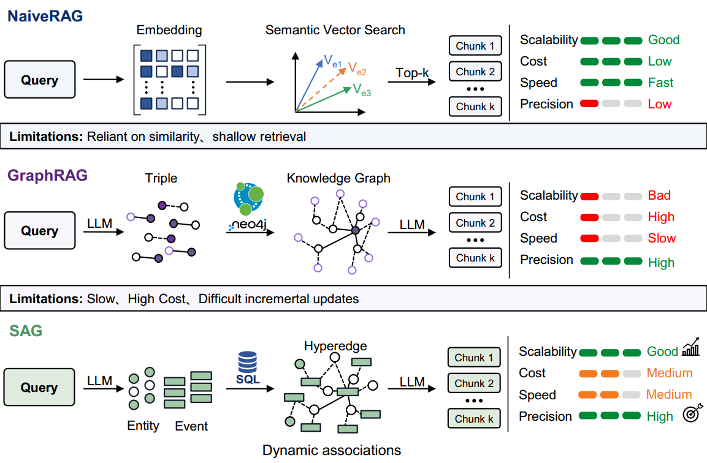

# SAG: A Retrieval Architecture that Dynamically Assembles Hyperedges at Query-Time via SQL join — Research Note
> **English** | [繁體中文](./README.zh-TW.md)

## 📇 Academic Context

| Field | Value |
|-|-|
| Title | SAG: SQL-Retrieval Augmented Generation with Query-Time Dynamic Hyperedges |
| Venue | arXiv preprint (typeset in ICLR 2026 submission format; peer-review status unknown) |
| Year | 2026 |
| Authors | Yuchao Wu, Junqin Li, XingCheng Liang, Yongjie Chen, Yinghao Liang, Linyuan Mo, Guanxian Li (Zleap AI) |
| Official Code | https://github.com/Zleap-AI/SAG-Benchmark |
| Venue Kind | paper |

> This note is based on the arXiv preprint (arXiv:2606.15971); the content of the formal conference version (if accepted) may be adjusted. The values and citations in the text are authoritative per the preprint LaTeX source files.

## Why "Add Structure" in RAG

Mainstream RAG follows the chunk → vector → top-k similarity recall path. This path is stable on single-hop open QA, but once a query needs to chain evidence across multiple documents into a reasoning chain, pure semantic similarity starts to leak. On multi-hop problems like MuSiQue, where every hop is non-skippable, the intermediate evidence itself often has no direct semantic overlap with the original query, so vector similarity fails to rank it high. Approaches like GraphRAG and HippoRAG instead use offline knowledge graphs to make entity relations explicit, but triple extraction, entity merging, and relation normalization each accumulate error, and once the graph must be maintained as the data evolves, the cost can be higher than building the graph in the first place. The authors point out a more critical contradiction: these carefully offline-designed structures, at query-time, often degrade back into node-level or summary-level flat similarity comparison, so there is a systematic disconnect between the offline structure and the online recall.

SAG's argument is: for queries with structural constraints that require multi-hop association, retrieval should neither be handed entirely to dense similarity nor bound to an offline pre-built static graph. It turns each chunk into "a semantically complete event plus a set of entities serving as index points," and this event–entity set itself defines a latent hyperedge; the real structure is not built offline, but rather at query-time using SQL join to dynamically string together events that share entities. Because the hyperedge is instantiated on the fly around the current query, the system does not depend on a static graph, needs no global recomputation, and naturally supports append-only incremental writes.



## Core Design: event-entity index and latent hyperedge

In the offline stage, each chunk is extracted into an event and a set of entities, and written "in parallel" to three places: SQL, the vector index, and the full-text index. An **Event** is a concise statement of the chunk's core content; one chunk corresponds to one event, deliberately not split further into multiple independent triples, thereby avoiding the semantic fragmentation inherent in triple extraction. An **Entity** does not carry full semantics; it only serves as the connection point for indexing and expansion, and is divided into eleven categories: time, location, person, organization, group, topic, work, product, action, metric, label. One event connecting to multiple entities constitutes a latent hyperedge.

Notably, the authors deliberately do not adopt a full entity-disambiguation system: entities only undergo string normalization and SQL deduplication, without entity merging. This is an explicit trade-off—giving up cross-document link density in exchange for chunks being independent and concurrently processable, so as to support incremental writes. This also makes SAG's index layer not a heavyweight knowledge graph, but a lightweight, appendable semantic index layer.


## Online Three Steps: seed recall → query-time expansion → dual-path output

Online retrieval is a division of labor where "SQL handles deterministic filtering and joins, vectors handle semantic expansion, and the LLM only intervenes at a few high-value decision points." The first step, **seed retrieval**, follows two parallel paths: Path A has the LLM extract seed entities from the query, does similarity recall over the entity vector index (default threshold 0.9) to expand out near-synonym entities, then uses SQL join to fetch all events hanging on these entities; Path B directly uses the query vector to recall over the event index, retaining events whose similarity exceeds the threshold τ (default 0.4). The two paths union into the initial candidate set:

$$
\mathcal{E}_R = \mathcal{E}_R^{\text{entity}} \cup \mathcal{E}_R^{\text{direct}}
$$

The second step, **query-time expansion**, is the core of the whole mechanism. Starting from $\mathcal{E}_R$, a reverse SQL join extracts entities that are connected to the seed events but not yet explored (i.e., the entity frontier), and then these frontier entities are used as bridges to fetch new events, expanding the candidate pool hop by hop. The authors particularly emphasize: this step relies only on SQL join, and multi-hop expansion is just relational joins in the database, not PageRank, nor graph reasoning. Expansion runs at most H hops (default H=1), records the newly added events as $\mathcal{E}_E$, and the candidate pool is:

$$
\mathcal{E}_{\text{cand}} = \mathcal{E}_R \cup \mathcal{E}_E
$$

In the third step, $\mathcal{E}_{\text{cand}}$ is first coarsely ranked by query vector similarity, keeping the top $K_{\text{cand}}$ (default 100) to obtain $\hat{\mathcal{E}}$, then follows a dual-path output: the structural path has the LLM rerank $\hat{\mathcal{E}}$ to select the top $K_{\text{event}}$ events and map them back to the original chunks; the semantic path directly uses the query vector to take the top $K_{\text{direct}}$ over the chunk index; the two paths are merged and deduplicated, then the top $K_{\text{out}}$ (default 10, of which the event path and direct path contribute 5 each) is returned as the final evidence. The entire chain is fully auditable, and if any link is empty the failure location can be directly pinpointed:

$$
q \rightarrow \mathcal{U}_q \rightarrow \hat{\mathcal{U}}_q \rightarrow \mathcal{E}_R \rightarrow \mathcal{E}_{\text{cand}} \rightarrow \hat{\mathcal{E}} \rightarrow \mathcal{C}_{\text{out}}
$$

## A Walkthrough of a Concrete Retrieval

Let us walk through the paper's own example "Which project did the CTO of the company that acquired Company B later join?": the LLM first extracts the entities $\{\text{Company B}, \text{CTO}\}$ from the query, expands aliases via the entity vectors, and SQL join connects to an event like "Company A acquired Company B"; then, following the shared entity (Company A), it looks back and joins forward one more hop (H=1) to fetch the event "someone joined Project C," and ranks the corresponding original chunk into the output. The key here is the magnitude comparison against MuSiQue's actual settings: a corpus of 11,656 passages, 1,000 sampled problems, a seed recall budget $K_{\text{seed}}=50$, an entity frontier pruning budget of 50, candidates sent to the LLM $K_{\text{cand}}=100$, and finally only 10 chunks returned. The ablation numbers make it very clear "what exactly the expansion adds": with expansion turned off (H=0), MuSiQue's Recall@5 drops from 80.0% to 69.4%, but Recall@1 barely moves (36.2% vs 35.7%). This shows that what the expansion adds is not "ranking candidates already in the pool better," but "bringing in intermediate evidence that vector recall simply cannot fetch"—these events entering via shared entities have no direct semantic overlap with the query, so they cannot rank top-1, yet they are exactly the key intermediaries on the multi-hop chain.

## Experimental Results and Ablation

The main results pit SAG against the main competitor HippoRAG 2 on three standard multi-hop benchmarks—HotpotQA, 2WikiMultiHop, MuSiQue—under a unified underlying configuration (BGE-Large-EN-v1.5 + Qwen3.6-Flash). SAG's average Recall@2/5 is 79.3%/88.2%, 11.1/4.9 percentage points higher than HippoRAG 2's 68.2%/83.3%, taking 8 of 9 Recall@K metrics as the best; the only one it trails is 2Wiki's Recall@5 (88.0% vs 90.4%).

| Method (unified configuration) | MuSiQue R@2/5 | 2Wiki R@2/5 | HotpotQA R@2/5 | Avg R@2/5 |
|-|-|-|-|-|
| BGE-Large-EN-v1.5 (pure vector) | 41.6 / 56.2 | 61.6 / 69.0 | 76.0 / 88.8 | 59.7 / 71.3 |
| HippoRAG 2 | 49.5 / 65.1 | 76.6 / **90.4** | 78.4 / 94.4 | 68.2 / 83.3 |
| **SAG (this paper)** | **64.1 / 80.0** | **82.3** / 88.0 | **91.6 / 96.5** | **79.3 / 88.2** |

The advantage is most pronounced on MuSiQue, which has the longest reasoning chain: SAG's Recall@5 is 80.0% vs HippoRAG 2's 65.1%, and the Recall@2 gap is even larger (64.1% vs 49.5%). The authors attribute this to a mechanistic difference—SAG uses SQL join to deterministically expand along shared entities, with each hop's path explicitly traceable; HippoRAG 2 relies on Personalized PageRank to propagate scores over a global graph, where distant nodes decay under damping and interference from noise nodes compounds and amplifies with hop count. The ablation breaks down the contributions in fine detail (all on MuSiQue):

| Ablation (MuSiQue, varying a single variable) | Recall@5 |
|-|-|
| Full SAG (baseline) | **80.0** |
| Triple representation replacing hyperedge | 77.1 |
| Turn off query-time expansion (H=0) | 69.4 |
| Replace the LLM with the lightweight Qwen3-Reranker-0.6B | 62.2 |
| Semantic path only ($K_{\text{event}}=0$, pure vector chunk selection) | 56.2 |

The way to read this table: replacing the LLM reranker with a lightweight reranker drops the most (80.0→62.2, −17.8 percentage points), because a reranker that scores items independently one by one cannot judge "which set of events together constitutes a complete reasoning chain"; whereas the hyperedge is only 2.9 percentage points ahead of triples (77.1→80.0)—the authors honestly attribute the main gain to the pipeline architecture (still 12 percentage points ahead of triples with the same representation), rather than to the hyperedge representation itself.

A marginal-benefit analysis was also done on the number of candidates $K_{\text{cand}}$ sent to the LLM for reranking: increasing candidates from 50 to 100 markedly raises MuSiQue Recall@5 from 76.1% to 80.0%, but going further to 200 and 500 only yields marginal improvements to 80.9% and 81.8%, while token cost surges from 20.0M all the way to 76.4M. The benefit flattens rapidly after 100, which is exactly the basis for the default $K_{\text{cand}}=100$—it sits at the cost-performance inflection point between recall and LLM call cost.


The sensitivity to embedding quality is highlighted with another comparison: with the stronger NV-Embed-v2, SAG's and HippoRAG 2's MuSiQue Recall@5 are 81.7% and 74.6% respectively; switching back to the weaker BGE-Large-EN-v1.5, SAG barely moves (81.7%→80.0%, −1.7), whereas HippoRAG 2 drops nearly 10 percentage points (74.6%→65.1%, −9.5). The authors use this to argue: HippoRAG 2's PageRank amplifies embedding error hop by hop along the propagation path, whereas SAG's structural gain comes from SQL join based on exact string matching, which is inherently less sensitive to embedding quality.

## Looking at the Mechanism from the Code

The implementation in the official repository `Zleap-AI/SAG-Benchmark` matches the paper's description: `event_entity` is a many-to-many relation table with a unique key (i.e., the materialization of the hyperedge), and the so-called "multi-hop expansion" is, in the code, a `select(...).join(...)` relational query, consistent with the paper's statement that it "is not PageRank"; the two defaults in the config, a direct vector recall threshold of 0.4 and an expansion hop count of 1, also match the paper.

```python
# Zleap-AI/SAG-Benchmark, pipeline/modules/search/step5_strategies.py L91-104 (static inspection)
stmt = select(EventEntity.event_id).where(
    EventEntity.entity_id.in_(entity_ids)
).distinct()
if source_config_ids:
    stmt = stmt.join(
        SourceEvent, SourceEvent.id == EventEntity.event_id
    ).where(SourceEvent.source_config_id.in_(source_config_ids))
```

## 🧪 Critical Assessment

### The problem is real, but the diagnosis of "structure degrading into similarity" is more valuable than the new mechanism
In multi-hop retrieval, the lack of direct semantic overlap between intermediate evidence and the query is a real difficulty deliberately forced out by benchmark design (MuSiQue's counterfactual filtering), not an artificial problem. The authors' diagnosis of existing graph-RAG—"carefully built offline, yet degrading online into flat similarity"—is itself an insightful observation. SAG embeds structural organization "into the retrieval execution itself (SQL join)" rather than applying it after the fact, and this angle of attack is defensible.

### With only one baseline, HippoRAG 2, the persuasiveness of the main results is diluted
Under the unified configuration, the only direct competitor is HippoRAG 2; the methods named extensively in Related Work—GraphRAG, SiReRAG, StructRAG, LightRAG, etc.—do not enter the main table for a same-configuration face-off, and the rest are only 7B embedding numbers taken from the literature for background reference (and are starred, non-same-configuration). This makes the "best on 8/9" claim actually "8/9 relative to a single graph baseline." Although the ablation is done meticulously with clear variable control (which deserves credit), the horizontal breadth of the main results is insufficient, and the reader cannot judge whether SAG beats the entire structure-augmented family or only beats the PageRank branch.

### The metric choice favors itself, and the authors acknowledge this
The main metric Recall@K uses any-hit (a success if at least one supporting evidence is hit within the top-K), which the authors themselves point out "tends to overestimate" multi-hop performance and is not a strict guarantee of complete reasoning-chain coverage. On MuSiQue, which emphasizes that "every hop is non-skippable," there is tension between using any-hit as the main metric and its narrative: what truly proves multi-hop capability should be "whether the whole chain is completely recalled," not "whether any point on the chain is touched." This is not drawing the bullseye around where the arrow landed after the fact (both the benchmark and the metric are pre-existing, not author-defined), but it is indeed picking, among the existing options, a scoring criterion that is more lenient toward structured recall.

### The novelty leans toward "reallocating responsibility" rather than a single new component, and the engineering dependency is a hidden cost
The authors self-report that SAG's design principle is to reallocate responsibility across the pipeline, rather than replacing standard RAG with a stronger module—this is an honest positioning, but it also means the novelty is closer to systems reorganization. The ablation confirms this: the hyperedge representation is only 2.9 percentage points ahead of triples, and the main gain comes from the pipeline architecture; in other words, the marginal contribution of the "hyperedge" selling point is actually small. Moreover, the claimed "billion-scale deployment, second-level latency" depends on the existing infrastructure of MySQL + Elasticsearch, whose operations and join-performance costs are not quantified in the paper and are easily underestimated.

### Real-world relevance is strong, but there remain systematic weaknesses the authors have flagged
On 2WikiMultiHop, Recall@5 trails HippoRAG 2, which the authors attribute to the fixed pruning budget (entity frontier 50) truncating low-frequency bridging entities too early, whereas PageRank's global propagation can instead reach these low-frequency nodes—this is an honestly disclosed systematic blind spot, not random fluctuation. Adding that the thresholds and budgets are all empirically set on the dev set, and that not disambiguating entities weakens cross-document link density, these all point to: SAG is very strong on "head hits" but "tail recall" and parameter portability remain uncertain, and real deployment will mostly need re-tuning.

## 🔗 Related notes

<!-- Currently there is no directly relevant note under domains/natural_language_processing/ that can be safely resolved; the heading is retained and left empty. -->
