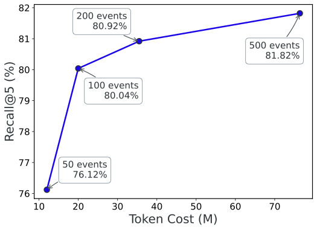

# SAG：用 SQL join 在 query-time 動態組出 hyperedge 的檢索架構 — Research Note

## 📇 Academic Context

| Field | Value |
|-|-|
| Title | SAG: SQL-Retrieval Augmented Generation with Query-Time Dynamic Hyperedges |
| Venue | arXiv preprint（以 ICLR 2026 投稿格式排版；同儕審查狀態 unknown） |
| Year | 2026 |
| Authors | Yuchao Wu, Junqin Li, XingCheng Liang, Yongjie Chen, Yinghao Liang, Linyuan Mo, Guanxian Li（Zleap AI） |
| Official Code | https://github.com/Zleap-AI/SAG-Benchmark |
| Venue Kind | paper |

> 本註記基於 arXiv 預印本（arXiv:2606.15971）撰寫；正式會議版（若被接收）內容可能有所調整。文中數值與引文以預印本 LaTeX 原始檔為準。

## 為什麼要在 RAG 裡「補結構」

主流 RAG 走的是 chunk → 向量 → top-k 相似度召回，這條路在單跳開放問答很穩，但一旦查詢需要跨多份文件把證據串成一條推理鏈，純語意相似度就開始漏。像 MuSiQue 這種每一跳都不可略過（non-skippable）的多跳題，中繼證據本身跟原始查詢往往沒有直接語意重疊，向量相似度排不上來。GraphRAG、HippoRAG 這類做法改用離線知識圖譜把實體關係顯式化，但三元組抽取、實體合併、關係正規化每一步都會累積誤差，而且圖一旦要隨資料演進維護，成本可能比建圖還高。作者點出一個更關鍵的矛盾：這些離線精心設計的結構，到了 query-time 常常又退化成節點或摘要層級的 flat 相似度比對，離線結構與線上召回之間存在系統性脫節。

SAG 的主張是：對於帶結構約束、需要多跳關聯的查詢，檢索既不該全交給 dense similarity，也不該綁在離線預建的 static graph 上。它把每個 chunk 轉成「一個語意完整的 event ＋ 一組充當索引點的 entity」，這組 event–entity 本身就定義了一條潛在的 hyperedge；真正的結構不在離線建好，而是在 query-time 用 SQL join 把共享 entity 的 events 動態串起來。因為 hyperedge 是圍繞當前查詢即時實例化的，系統不依賴 static graph、不需要全域重算，天然支援 append-only 增量寫入。


## 核心設計：event-entity 索引與 latent hyperedge

離線階段，每個 chunk 被抽成一個 event 與一組 entity，並「平行」寫入 SQL、向量索引與全文索引三處。**Event** 是 chunk 核心內容的精簡陳述，一個 chunk 對應一個 event，刻意不再拆成多個獨立三元組，藉此避開三元組抽取固有的語意碎裂問題。**Entity** 不承載完整語意，只當索引與擴展的接點，共分 time、location、person、organization、group、topic、work、product、action、metric、label 十一類。一個 event 連到多個 entity，就構成一條 latent hyperedge。

值得注意的是，作者刻意不上完整的實體消歧系統：entity 只做字串正規化與 SQL 去重，不做實體合併。這是一個明確的取捨——放棄跨文件連結密度，換來 chunk 可獨立、可並發處理，以支援增量寫入。這也讓 SAG 的索引層不是重量級知識圖譜，而是一層輕量、可追加的語意索引。


## 線上三步：seed 召回 → query-time 擴展 → 雙路輸出

線上檢索是「SQL 管確定性過濾與 join、向量管語意擴展、LLM 只在少數高價值決策點介入」的分工。第一步 **seed retrieval** 走兩條平行路徑：Path A 由 LLM 從查詢抽出種子 entity，對 entity 向量索引做相似度召回（預設門檻 0.9）擴出近義 entity，再用 SQL join 撈出所有掛在這些 entity 上的 events；Path B 直接用 query 向量在 event 索引上召回、保留相似度超過門檻 τ（預設 0.4）的 events。兩路聯集成初始候選集：

$$
\mathcal{E}_R = \mathcal{E}_R^{\text{entity}} \cup \mathcal{E}_R^{\text{direct}}
$$

第二步 **query-time expansion** 是整套機制的核心。從 $\mathcal{E}_R$ 出發，用反向 SQL join 抽出與種子 events 相連、但尚未探索的 entity（即 entity frontier），再以這些 frontier entity 當橋樑撈出新 events，一跳一跳擴大候選池。作者特別強調：這一步只靠 SQL join，多跳擴展就是資料庫裡的關聯式 join，不是 PageRank、也不是圖推理。擴展最多跑 H 跳（預設 H=1），把新增 events 記為 $\mathcal{E}_E$，候選池為：

$$
\mathcal{E}_{\text{cand}} = \mathcal{E}_R \cup \mathcal{E}_E
$$

第三步，先對 $\mathcal{E}_{\text{cand}}$ 按 query 向量相似度粗排、留下 top $K_{\text{cand}}$（預設 100）得到 $\hat{\mathcal{E}}$，再走雙路輸出：結構路由 LLM 對 $\hat{\mathcal{E}}$ 重排選出 top $K_{\text{event}}$ 個 event 並映回原 chunk；語意路直接用 query 向量在 chunk 索引取 top $K_{\text{direct}}$；兩路合併去重後回傳 top $K_{\text{out}}$（預設 10，其中 event 路與 direct 路各 5）作為最終證據。整條鏈路可完整審計，任一環節為空都能直接定位失敗位置：

$$
q \rightarrow \mathcal{U}_q \rightarrow \hat{\mathcal{U}}_q \rightarrow \mathcal{E}_R \rightarrow \mathcal{E}_{\text{cand}} \rightarrow \hat{\mathcal{E}} \rightarrow \mathcal{C}_{\text{out}}
$$

## 一次具體檢索的走查

以論文自己的例子「Which project did the CTO of the company that acquired Company B later join?」走一遍：LLM 先從查詢抽出 entity $\{\text{Company B}, \text{CTO}\}$，經 entity 向量做別名擴展後，SQL join 連到「Company A acquired Company B」這類 event；接著沿共享 entity（Company A）反查、再往前 join 一跳（H=1）撈出「某人加入 Project C」的 event，把對應原始 chunk 排進輸出。這裡的關鍵是量級對照 MuSiQue 的實際設定：語料 11,656 個 passages、抽樣 1,000 題，seed 召回預算 $K_{\text{seed}}=50$、entity frontier 剪枝預算 50、送進 LLM 的候選 $K_{\text{cand}}=100$，最後只回 10 個 chunk。消融數字把「擴展到底補了什麼」講得很清楚：關掉擴展（H=0）時 MuSiQue 的 Recall@5 從 80.0% 掉到 69.4%，但 Recall@1 幾乎不動（36.2% 對 35.7%）。這說明擴展補的不是「把已在池中的候選排得更好」，而是「把向量召回根本撈不到的中繼證據」放進來——這些沿共享 entity 進來的 event 跟 query 沒有直接語意重疊，所以排不上 top-1，卻正是多跳鏈上的關鍵中繼。

## 實驗結果與消融

主結果在 HotpotQA、2WikiMultiHop、MuSiQue 三個標準多跳 benchmark 上、統一底層配置（BGE-Large-EN-v1.5 ＋ Qwen3.6-Flash）跟主要對手 HippoRAG 2 對打。SAG 平均 Recall@2/5 為 79.3%/88.2%，比 HippoRAG 2 的 68.2%/83.3% 高 11.1/4.9 個百分點，9 項 Recall@K 指標拿下 8 項最佳；唯一落後的是 2Wiki 的 Recall@5（88.0% 對 90.4%）。

| Method（統一配置） | MuSiQue R@2/5 | 2Wiki R@2/5 | HotpotQA R@2/5 | Avg R@2/5 |
|-|-|-|-|-|
| BGE-Large-EN-v1.5（純向量） | 41.6 / 56.2 | 61.6 / 69.0 | 76.0 / 88.8 | 59.7 / 71.3 |
| HippoRAG 2 | 49.5 / 65.1 | 76.6 / **90.4** | 78.4 / 94.4 | 68.2 / 83.3 |
| **SAG（本文）** | **64.1 / 80.0** | **82.3** / 88.0 | **91.6 / 96.5** | **79.3 / 88.2** |

優勢最明顯的是推理鏈最長的 MuSiQue：SAG 的 Recall@5 為 80.0%，對 HippoRAG 2 的 65.1%，Recall@2 差距更大（64.1% 對 49.5%）。作者把這歸因於機制差異——SAG 用 SQL join 沿共享 entity 確定性擴展，每跳路徑顯式可追溯；HippoRAG 2 靠 Personalized PageRank 在全域圖上傳播分數，遠端節點在阻尼下衰減、噪聲節點的干擾隨跳數複合放大。消融把貢獻拆得很細（都在 MuSiQue 上）：

| 消融（MuSiQue，變動單一變數） | Recall@5 |
|-|-|
| 完整 SAG（baseline） | **80.0** |
| 三元組表示取代 hyperedge | 77.1 |
| 關掉 query-time 擴展（H=0） | 69.4 |
| LLM 換成輕量 Qwen3-Reranker-0.6B | 62.2 |
| 只走語意路（$K_{\text{event}}=0$，純向量選 chunk） | 56.2 |

這張表的讀法是：把 LLM 精排換成輕量 reranker 掉最多（80.0→62.2，−17.8 個百分點），因為逐一獨立打分的 reranker 無法判斷「哪一組 event 合起來才構成完整推理鏈」；而 hyperedge 相對三元組只多 2.9 個百分點（77.1→80.0）——作者誠實地把主要增益歸給 pipeline 架構（相對同表示的三元組仍領先 12 個百分點），而非 hyperedge 表示本身。

送進 LLM 精排的候選數 $K_{\text{cand}}$ 也做了邊際收益分析：候選從 50 增到 100 時 MuSiQue Recall@5 由 76.1% 明顯拉到 80.0%，但再往上到 200、500 只換來 80.9%、81.8% 的微幅提升，Token 成本卻從 20.0M 一路暴增到 76.4M。收益在 100 之後迅速走平，這正是預設取 $K_{\text{cand}}=100$ 的依據——它落在召回與 LLM 呼叫成本的性價比拐點上。



對 embedding 品質的敏感度則用另一組對照凸顯：換上更強的 NV-Embed-v2 時，SAG 與 HippoRAG 2 的 MuSiQue Recall@5 分別是 81.7% 與 74.6%；換回較弱的 BGE-Large-EN-v1.5，SAG 幾乎不動（81.7%→80.0%，−1.7），HippoRAG 2 卻掉近 10 個百分點（74.6%→65.1%，−9.5）。作者以此論證：HippoRAG 2 的 PageRank 沿傳播路徑逐跳放大 embedding 誤差，而 SAG 的結構增益來自基於精確字串比對的 SQL join，對 embedding 品質天生較不敏感。

## 從程式碼看機制

官方倉庫 `Zleap-AI/SAG-Benchmark` 的實作與論文敘述吻合：`event_entity` 是一張帶唯一鍵的多對多關聯表（即 hyperedge 的落地），而所謂「多跳擴展」在程式裡就是一段 `select(...).join(...)` 的關聯式查詢，與論文「不是 PageRank」的說法一致；config 裡直接向量召回門檻 0.4、擴展跳數 1 兩個預設也與論文相符。

```python
# Zleap-AI/SAG-Benchmark, pipeline/modules/search/step5_strategies.py L91-104（靜態檢視）
stmt = select(EventEntity.event_id).where(
    EventEntity.entity_id.in_(entity_ids)
).distinct()
if source_config_ids:
    stmt = stmt.join(
        SourceEvent, SourceEvent.id == EventEntity.event_id
    ).where(SourceEvent.source_config_id.in_(source_config_ids))
```

## 🧪 Critical Assessment

### 問題是真的，但「結構退化成相似度」的診斷比新機制更有價值
多跳檢索裡中繼證據與查詢缺乏直接語意重疊，是一個真實且被 benchmark 設計（MuSiQue 的反事實過濾）刻意逼出來的困難，並非人造問題。作者對既有 graph-RAG「離線精心建構、線上卻退化成 flat 相似度」的診斷，本身就是一個有洞察力的觀察。SAG 把結構組織「內嵌到檢索執行本身（SQL join）」而非事後套用，這個切入角度是站得住腳的。

### baseline 只有一個 HippoRAG 2，主結果的說服力被稀釋
統一配置下的直接對手只有 HippoRAG 2 一個，GraphRAG、SiReRAG、StructRAG、LightRAG 等在 Related Work 大篇幅點名的方法都沒有進主表同配置對打，其餘只有取自文獻的 7B embedding 數字作背景參考（且標星號、非同配置）。這使「8/9 最佳」的宣稱其實是「相對單一 graph baseline 的 8/9」。消融雖然做得細緻且變數控制清楚（值得肯定），但主結果的橫向廣度不足，讀者難以判斷 SAG 是勝過整個 structure-augmented 家族，還是只勝過 PageRank 這一支。

### 指標選擇對自己有利，作者也承認這一點
主指標 Recall@K 採 any-hit（top-K 內命中至少一條支持證據即算成功），作者自己就指出這「傾向高估」多跳表現、並非推理鏈完整覆蓋的嚴格保證。在強調「每跳不可略過」的 MuSiQue 上，用 any-hit 當主指標與其敘事之間存在張力：真正能證明多跳能力的應是「整條鏈是否被完整召回」，而非「鏈上任一點被碰到」。這不是事後把靶心畫在箭落點上（benchmark 與指標都是既有的、非作者自定義），但確實是在既有選項裡挑了一個對結構化召回較寬容的評分口徑。

### 新穎性偏「重新分配責任」而非單一新元件，且工程依賴是隱性成本
作者自陳 SAG 的設計原則是把責任在 pipeline 上重新分配，而非用更強的模組取代標準 RAG——這是誠實的定位，但也意味著新穎性更接近系統重組。消融也印證：hyperedge 表示相對三元組僅多 2.9 個百分點，主要增益來自 pipeline 架構，換言之「hyperedge」這個賣點的邊際貢獻其實不大。此外，宣稱的「億級部署、秒級延遲」依賴 MySQL＋Elasticsearch 這套既有基礎設施，其運維與 join 效能成本並未在論文中量化，容易被低估。

### 真實世界相關性強，但仍有作者已標記的系統性弱點
在 2WikiMultiHop 上 Recall@5 落後 HippoRAG 2，作者歸因於固定剪枝預算（entity frontier 50）會把低頻橋接 entity 過早截斷，而 PageRank 的全域傳播反而能觸及這些低頻節點——這是一個被誠實揭露的系統性盲點，而非隨機波動。加上門檻與預算皆為 dev set 上經驗設定、entity 不做消歧會削弱跨文件連結密度，這些都指向：SAG 在「頭部命中」很強，但「尾部召回」與參數可攜性仍是未定之數，真實部署時多半需要重新調參。

## 🔗 Related notes

<!-- 目前 domains/natural_language_processing/ 下無可安全解析的直接相關 note，保留標題、留空。 -->
