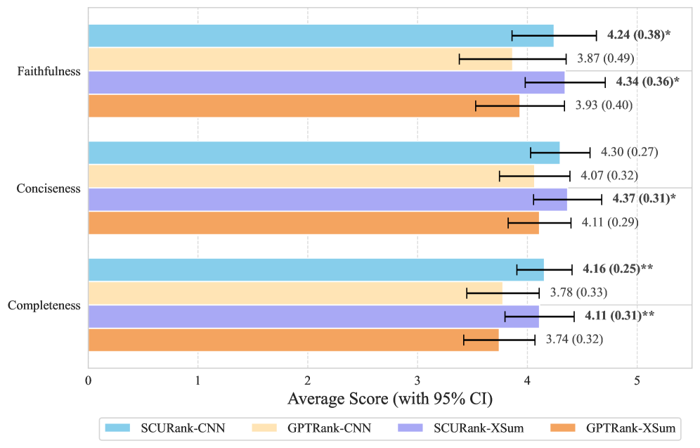
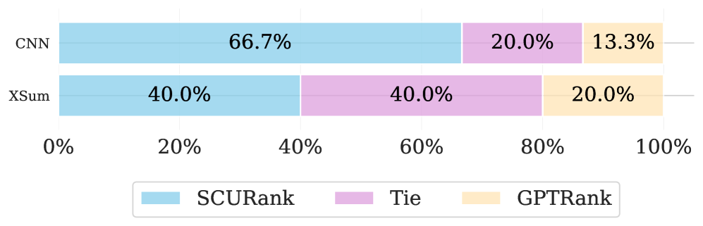
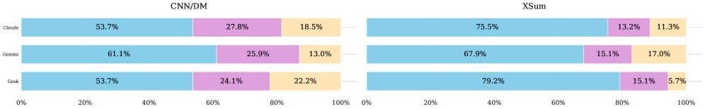

# SCURank — Research Note
> **English** | [繁體中文](./README.zh-TW.md)

## 📇 Academic Context

| Field | Value |
|-|-|
| Title | SCURank: Ranking Multiple Candidate Summaries with Summary Content Units for Enhanced Summarization |
| Venue | Findings of the Association for Computational Linguistics: ACL 2026 |
| Year | 2026 |
| Authors | Bo-Jyun Wang, Ying-Jia Lin, Hung-Yu Kao |
| Official Code | https://github.com/IKMLab/SCURank |
| Venue Kind | paper |

> Source note: The full-text analysis in this note is based on the LaTeX source extracted from the arXiv preprint `2604.19185v1` (2026-04); the official published version is ACL 2026 Findings, and the camera-ready numbers and wording may differ slightly from the preprint.

## Problem setting: why redesign ranking

This paper addresses a specific step within "summarization distillation." The overall pipeline is: first have multiple large language models (LLMs) each produce a candidate summary for the same article, then use a ranking function to order these candidate summaries, and finally feed the ordering to BRIO, a contrastive learning framework, to fine-tune a small model (here, BART). The quality of the small model depends heavily on whether the ranking step can reliably place the more "information-rich" summaries near the top.

The earlier GPTRank simply asks an LLM to read all candidate summaries and output a ranking with brief justifications. The authors point out two weaknesses in this route: first, existing research shows that LLMs are unstable at text comparison and candidate ranking and are sensitive to input order; second, relying on a single LLM to produce candidates introduces model-specific bias and limits the diversity of generation styles. The traditional ROUGE only looks at n-gram overlap and has insufficient discriminative power for the subtle differences between high-quality summaries. SCURank's core claim is to move the scoring focus away from "unstable direct comparison" and back to the essential goal of a summary: information retention.

## SCURank's three-stage mechanism

SCURank redefines "how good a summary is" as "how much of the important information jointly recognized by many candidate summaries it covers." It does not let the LLM compare or rank; it only asks the LLM to do one relatively reliable thing: break a summary into Summary Content Units (SCUs). The whole ranking process has three steps: extraction, aggregation, and scoring.

**Extraction.** The authors adopt the approach of Nawrath et al. (2024), defining SCUs as Semantic GPT Units (SGUs) extracted by an LLM: each SCU is a brief, self-contained, single-fact piece of information within a summary. In implementation, gpt-4o-mini serves as the extractor $\mathrm{SCUExt}$, using a 1-shot example from REALSumm as the prompt, to break a summary $s_i$ into a set of SCUs:

$$\mathcal{U}_i = \{u_{i,1}, u_{i,2}, \dots, u_{i,m_i}\} = \mathrm{SCUExt}(s_i)$$

where $m_i$ is the number of SCUs extracted from $s_i$, which varies with the summary's information content.

**Aggregation.** All candidate summaries' SCUs are turned into vectors using the all-mpnet-base-v2 sentence encoder, then clustered by density with HDBSCAN. Each cluster represents a "distinct piece of semantic information," and the size of a cluster (how many SCUs it contains) reflects how many candidate summaries mentioned this information, so it can be treated as its importance. In implementation, HDBSCAN's min cluster size and min samples are both set to 2, the cluster selection epsilon is set to 0.15, and each outlier judged as noise is treated as its own separate cluster, to ensure every SCU is included in the ranking.

**Scoring.** Each SCU's score is the size of the cluster it belongs to, i.e., its degree of consensus:

$$\phi(u_{i,j}) = \lVert C^k \rVert, \quad \text{where } u_{i,j} \in C^k$$

A summary's raw score is the sum of all its SCU scores, $\Phi(s_i) = \sum_{j=1}^{m_i} \phi(u_{i,j})$. To keep long summaries from gaining an advantage by cramming in more SCUs, the authors divide the total by the square root of the summary's token count, giving a final score with a length penalty (lp):

$$\Phi_\mathrm{lp}(s_i) = \frac{\Phi(s_i)}{\sqrt{\lVert s_i \rVert}}$$

Finally, argsort by $\Phi_\mathrm{lp}$ from high to low yields the ordering of candidate summaries, which is then handed to BRIO for contrastive learning. Throughout the mechanism the LLM is responsible only for extracting SCUs, not for comparison, so it naturally sidesteps the order-sensitivity problem of LLM ranking.

## A concrete scoring walk-through

Using the paper's formulas and constants, let us walk through the scoring of a single article (below, the SCU counts and cluster sizes are illustrative example values; the formula, the $\sqrt{\cdot}$ penalty, and $n=9$ candidates are the paper's settings). Some article has 9 LLMs each produce one summary, and SCURank extracts, embeds, and HDBSCAN-clusters the SCUs from all 9. Suppose candidate $s_A$ extracts 8 SCUs and is 64 tokens long ($\sqrt{64}=8$), falling into clusters of sizes $\{9,9,7,5,3,2,1,1\}$, meaning several pieces of information are highly agreed upon by the nine models; another candidate $s_B$ is more verbose, extracts 12 SCUs and is 100 tokens long ($\sqrt{100}=10$), but mostly rare fragments, falling into $\{9,7,3,1,1,1,1,1,1,1,1,1\}$.

| Candidate | Raw total $\Phi$ | tokens | $\sqrt{\lVert s\rVert}$ | $\Phi_\mathrm{lp}$ |
|-|-|-|-|-|
| $s_A$ | 37 | 64 | 8 | 4.63 |
| $s_B$ | 28 | 100 | 10 | 2.80 |

Even though $s_B$ has more SCUs, its final score is lower than $s_A$'s: because $s_A$'s information is more agreed upon across models and also more concise. This is exactly the ranking direction SCURank wants—rewarding "high consensus, high density" rather than "long and diffuse." In the appendix the authors validate this design with Kendall's $\tau$: on CNN/DM, raw SCU summation combined with the $\sqrt{\cdot}$ penalty achieves the lowest length correlation of 0.1316, better than a linear penalty (over-penalizes, turning into a negative correlation) and no normalization (strong positive correlation of 0.3666).

## Distillation and experimental setup

SCURank merely replaces BRIO's original ROUGE-based ranking; the rest of the contrastive learning pipeline is unchanged. The authors additionally train an UnRank control that uses only maximum likelihood estimation (MLE) and requires no ranking. There are two training sets: BASE follows the single-LLM version of Liu et al. (2024) (CNN/DailyMail 1,000 articles, each with nine diverse beam search candidates), while LLMs-9 has the authors use nine different LLMs to each produce one summary for the same 1,000 articles, and they also generate 1,000 articles on XSum with the same nine LLMs. The target model is facebook/bart-large-cnn, first given an MLE warm-up on 10,000 GPT-3.5 summaries, then entering contrastive learning.

The evaluation deliberately avoids the known quality problems of the original CNN/DailyMail and XSum references, instead using the human references of Zhang et al. (2024): CNN/DailyMail 54 articles, XSum 53 articles, each with 1–3 human summaries, taking the highest score. The metrics cover the three lexical metrics ROUGE-1/2/L, plus the three model-based metrics BERTScore, BLEURT, and BARTScore. CNN/DailyMail is run 5 times and XSum 10 times, averaged. The table below excerpts the distilled models' performance on CNN/DailyMail (mean, bold is the best in that column):

| Dataset / Method | ROUGE-1 | ROUGE-2 | ROUGE-L | BLEURT | BERTScore | BARTScore |
|-|-|-|-|-|-|-|
| LLMs-9 · UnRank (MLE) | 43.8 | **20.5** | 30.1 | **53.3** | 69.9 | -2.59 |
| LLMs-9 · ROUGE | 43.2 | 20.4 | 29.9 | 51.4 | 69.0 | -2.58 |
| LLMs-9 · GPTRank | 43.8 | 20.0 | 30.1 | 51.4 | 69.7 | -2.36 |
| LLMs-9 · **SCURank** | **44.8** | **20.5** | **30.6** | 51.7 | **70.0** | **-2.34** |
| BASE · GPTRank | 43.0 | 19.8 | 29.6 | 51.2 | 69.1 | -2.52 |
| BASE · **SCURank** | **44.3** | **20.8** | **30.9** | **51.7** | **69.9** | **-2.45** |

On CNN/DailyMail, the model trained with SCURank achieves the best on all metrics except LLMs-9's BLEURT; on XSum it is best on ROUGE-1, ROUGE-2, and BLEURT, and second-best on ROUGE-L and BERTScore. It should be added that in the XSum BARTScore column SCURank does not even reach the top two: the best in that column is ROUGE-based ranking (-2.47), second-best is BERTScore ranking (-2.52), and SCURank is -2.54, showing that the lead under different metrics is not consistent. Notably, MLE-only UnRank takes the best ROUGE-2 and BLEURT and second-best BERTScore on LLMs-9, showing that "the outputs of multiple LLMs" themselves can bring a positive effect even with MLE alone.

## Stability and human evaluation

Stability is SCURank's most distinctive selling point relative to GPTRank. On LLMs-9 (CNN/DailyMail), the authors run the ranking five times for each of 1,000 items and measure cross-run consistency. GPTRank's self-consistency is actually very high when the input order is fixed (Kendall's $\tau$ 76.8, Krippendorff's $\alpha$ 96.4), but once the summary order is shuffled (GPTRank*), $\tau$ collapses to 16.7 and $\alpha$ collapses to 3.0; SCURank, being order-invariant by design, has $\tau$ 66.1 and $\alpha$ 84.6 (on the same 0–100 table scale, which normalizes to 0.846, crossing the 0.8 reliability threshold).

| Method | Kendall's $\tau$ | Spearman's $\rho$ | Pearson's $r$ | Krippendorff's $\alpha$ |
|-|-|-|-|-|
| GPTRank (fixed order) | 76.8 | 78.4 | 78.4 | 96.4 |
| GPTRank* (shuffled order) | 16.7 | 22.4 | 22.4 | 3.0 |
| **SCURank** | 66.1 | 72.0 | 72.0 | **84.6** |

The human evaluation directly compares the models distilled by SCURank and GPTRank. The authors randomly draw 30 articles each from the CNN/DailyMail and XSum test sets, and for each, three MTurk annotators give 1–5 Likert scores on the three aspects Faithfulness, Conciseness, and Completeness, and provide an overall preference (Win/Tie/Loss).

As shown in the figure, SCURank scores higher than GPTRank on all three aspects across both datasets, with Completeness reaching high significance (p<0.01) on both CNN and XSum, supporting the claim that "centering on SCUs indeed drives the model to retain more key information."

Beyond per-aspect scoring, the annotators also give an overall pairwise preference. The figure below shows: on CNN/DailyMail, SCURank beats GPTRank with a 66.7% win rate versus 13.3% (tie 20.0%); on XSum, where summaries are shorter and differences harder to discern, the tie rate rises to 40.0%, but SCURank still doubles GPTRank (20.0%) with a 40.0% win rate.

The authors additionally use three LLM judges (Claude-4-sonnet, Gemini-2.5-pro, Grok-4, all judge models chosen by the paper) for automatic pairwise evaluation, running each comparison once in each direction to cancel out position bias. As shown in the figure below, both datasets and all three judges prefer the SCURank-distilled model: the preference rate on CNN/DailyMail is about 53.7–61.1%, and on XSum it is more pronounced, with Grok-4 giving 79.2% (tie 15.1%, loss 5.7%). This agrees in direction with the human evaluation, but it is still a relative preference and does not change the earlier fact that the automatic metrics did not reach significance.

## 🧪 Critical Assessment

### A narrow pipeline positioning and an unreported extraction cost
The pain point "LLM direct ranking is unstable" is backed by prior research (positional bias, comparison inconsistency), and is not a straw man of the authors' own making; swapping the ranking signal from "subjective LLM comparison" to "cross-candidate information consensus" is a conceptually reasonable and pragmatic direction. However, note that this is a fairly narrow engineering scenario: it only makes sense within the specific pipeline of "multiple LLMs produce candidates → ranking → BRIO distills a small model," and is not a general-purpose summary quality metric. SCURank needs to call an LLM to extract SCUs for every candidate of every article, then run embedding and HDBSCAN, at a cost clearly higher than ROUGE; the paper does not report this extra compute and API overhead, nor does it make an equal-cost comparison with GPTRank, making it hard for the reader to judge whether the stability gain is worth its price.

### Significance gap: the LLMs-9 lead mostly falls within the standard deviation
The comparison group (ROUGE, BERTScore, BLANC, GPTRank, UnRank) and six metrics are reasonably complete, and the length penalty and scoring function each have a set of ablations. But the most critical evidence gap is in significance: the authors' own paired bootstrap test shows that in the flagship CNN/DailyMail LLMs-9 setting, SCURank versus GPTRank barely reaches significance only on ROUGE-1 (p=0.043), while all other automatic metrics do not reach statistical significance (e.g., ROUGE-2 p=0.317, ROUGE-L p=0.311, BERTScore p=0.255, BARTScore p=0.699); in contrast, the BASE setting reaches significance on most metrics, and the XSum setting on all metrics. In other words, those bold "best" figures in the LLMs-9 row of the table are mostly small 0.2–1.0-point leads that fall within the standard deviation, and reading them as a solid win would over-interpret. The test sets are also small—CNN/DailyMail 54 articles, XSum 53 articles, human evaluation 30 each—and at this scale, a metric's sensitivity to subtle differences between high-quality summaries is inherently limited, which the authors also acknowledge.

### What genuinely belongs to this paper is the aggregate-scoring design
Almost every component of SCURank comes from others: the concept and extraction method of SCU/SGU come from Nawrath et al. (2024), the contrastive distillation framework BRIO comes from Liu et al. (2022), the compared GPTRank comes from Liu et al. (2024), and the sentence encoder and HDBSCAN are also off-the-shelf tools. What genuinely belongs to this paper is the scoring design of "aggregating SCUs across candidates, using cluster size as the consensus weight, and adding a $\sqrt{\cdot}$ length penalty," together with the experimental observation of "using multiple LLMs to produce candidates." This is a solid but incremental contribution, and calling it a brand-new framework is a slight overstatement; it is more like reshaping the Pyramid/SCU human-evaluation idea into an automatic, reproducible, order-invariant ranking signal.

### The causal gap between "more stable" and "distills better"
As for "providing a more stable ranking than GPTRank," the stability data ($\alpha$ 84.6 vs. 3.0 after shuffling, i.e., 0.846 vs. 0.030) do support this claim, and this is the paper's most defensible conclusion. But the causal link between "more stable ranking" and "better distilled model" is weaker: on LLMs-9 most automatic metrics are not significant (only ROUGE-1 is an exception), and it rests mainly on the pairwise preferences from human and LLM-as-judge evaluations. Furthermore, it should be noted that in the stability comparison, SCURank pits its own order-invariant score against a "deliberately shuffled" GPTRank*, whereas GPTRank's self-consistency at fixed order is actually higher than SCURank's; what is truly proven is "SCURank is unaffected by order," not "SCURank's ranking quality is higher than GPTRank's." In terms of real-world relevance, this method has reference value for teams that "want to distill a resource-friendly small model from a small number of articles and multiple LLMs," but its gains are on the small side and its cost is unclear, and it is still some distance from "directly replacing ROUGE as the default ranking."

## One-minute version

- Problem pain point = if summary ranking relies only on LLM direct comparison, it becomes unstable due to sensitivity to input order. Example: for the same GPTRank, Krippendorff's α is 96.4 at fixed order, but collapses to just 3.0 once the input is shuffled.
- Solution mechanism = SCURank instead breaks a summary into short sentences (SCUs) and scores by the "degree of consensus" with which these short sentences appear across many candidates. Example: a concise summary extracting 8 high-consensus short sentences will win in final score over a more verbose summary extracting 12 rare short sentences.
- Main finding = ranking by information consensus does distill a small model that retains more key information. Example: human evaluation shows the SCURank-trained model beats GPTRank on Completeness with high significance on both CNN and XSum.
- Key limitation = on the flagship test sets, the lead mostly does not reach statistical significance. Example: in the CNN/DailyMail LLMs-9 setting, SCURank versus GPTRank barely reaches significance only on ROUGE-1 (p=0.043), while all other automatic metrics such as ROUGE-2 (p=0.317) are not significant.
- Practical advice = this method has a high cost and is still some distance from becoming a general-purpose default metric. Example: every candidate requires an LLM call to extract SCUs, then embedding and clustering, at an overhead clearly larger than ROUGE, making it better suited to scenarios with only a small number of articles that aim to refine a small model.

## 🔗 Related notes

- [BERTSummary](../BERTSummary/)
- [SimCSE](../SimCSE/)
