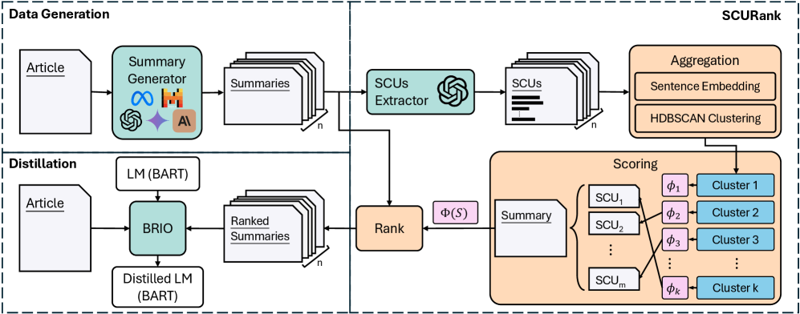

# SCURank — Research Note
> [English](./README.md) | **繁體中文**

## 📇 Academic Context

| Field | Value |
|-|-|
| Title | SCURank: Ranking Multiple Candidate Summaries with Summary Content Units for Enhanced Summarization |
| Venue | Findings of the Association for Computational Linguistics: ACL 2026 |
| Year | 2026 |
| Authors | Bo-Jyun Wang, Ying-Jia Lin, Hung-Yu Kao |
| Official Code | https://github.com/IKMLab/SCURank |
| Venue Kind | paper |

> 出處說明：本筆記的全文分析基於 arXiv 預印本 `2604.19185v1`（2026-04）擷取的 LaTeX 原始碼；正式出版版本為 ACL 2026 Findings，camera-ready 的數字與措辭可能與預印本略有差異。

## 問題設定：為什麼要重新設計 ranking

這篇論文處理的是「摘要蒸餾（summarization distillation）」中的一個具體環節。整體流程是：先用多個大型語言模型（LLMs）針對同一篇文章各自產生候選摘要，再用一個 ranking 函式把這些候選摘要排序，最後把排序結果餵給 BRIO 這個 contrastive learning 框架，去微調一個小模型（此處是 BART）。小模型的品質好壞，高度取決於 ranking 這一步能不能可靠地把「資訊量高」的摘要排在前面。

先前的 GPTRank 直接請一個 LLM 讀所有候選摘要、輸出排名與簡短理由。作者指出這條路有兩個弱點：其一，已有研究顯示 LLM 在文字比較與候選排序上並不穩定、對輸入順序敏感；其二，只依賴單一 LLM 產生候選會帶入 model-specific bias 並限制生成樣式的多樣性。傳統的 ROUGE 只看 n-gram overlap，對高品質摘要之間的細微差異區辨力不足。SCURank 的核心主張，是把評分焦點從「不穩定的直接比較」搬回摘要的本質目標：資訊保留（information retention）。

## SCURank 的三階段機制

SCURank 把「一篇摘要好不好」重新定義成「它涵蓋了多少被眾多候選摘要共同認可的重要資訊」。它不讓 LLM 去比較或排序，只讓 LLM 做一件相對可靠的事：把摘要拆成 Summary Content Units（SCUs）。整個排序過程分成三步：抽取（extraction）、聚合（aggregation）、評分（scoring）。

**抽取。** 作者採用 Nawrath 等人（2024）的作法，把 SCUs 定義成由 LLM 抽出的 Semantic GPT Units（SGUs）：每個 SCU 是摘要中一條簡短、獨立、單一事實的資訊。實作上以 gpt-4o-mini 作為抽取器 $\mathrm{SCUExt}$，用 REALSumm 的一個 1-shot 範例當提示，把摘要 $s_i$ 拆成一組 SCUs：

$$\mathcal{U}_i = \{u_{i,1}, u_{i,2}, \dots, u_{i,m_i}\} = \mathrm{SCUExt}(s_i)$$

其中 $m_i$ 是 $s_i$ 抽出的 SCU 數量，會因摘要資訊量不同而變動。

**聚合。** 把所有候選摘要的 SCUs 都用 all-mpnet-base-v2 這個 sentence encoder 轉成向量，再用 HDBSCAN 做密度式分群。每個群集代表一則「不同的語意資訊」，而群集的大小（裡面有幾個 SCU）反映有多少候選摘要都提到了這則資訊，因此可視為它的重要度。實作上 HDBSCAN 的 min cluster size 與 min samples 同設為 2，cluster selection epsilon 設為 0.15，並把被判為 noise 的 outlier 各自當成一個獨立群集，以確保每個 SCU 都被納入排序。

**評分。** 每個 SCU 的分數就是它所屬群集的大小，也就是共識程度：

$$\phi(u_{i,j}) = \lVert C^k \rVert, \quad \text{where } u_{i,j} \in C^k$$

一篇摘要的原始分數是它所有 SCU 分數的總和 $\Phi(s_i) = \sum_{j=1}^{m_i} \phi(u_{i,j})$。為了避免長摘要因為塞進更多 SCU 而占便宜，作者把總分除以摘要 token 數的平方根，得到帶 length penalty（lp）的最終分數：

$$\Phi_\mathrm{lp}(s_i) = \frac{\Phi(s_i)}{\sqrt{\lVert s_i \rVert}}$$

最後依 $\Phi_\mathrm{lp}$ 由高到低 argsort，就得到候選摘要的排序，再交給 BRIO 做 contrastive learning。整個機制裡 LLM 只負責抽取 SCU，不做比較，因此天然避開了 LLM 排序的順序敏感問題。

## 一個具體的評分走查

用論文的公式與常數，走一遍單篇文章的評分（以下 SCU 數與群集大小為說明用的示意數值，公式與 $\sqrt{\cdot}$ penalty、$n=9$ 候選為論文設定）。某篇文章有 9 個 LLM 各產一篇摘要，SCURank 把 9 篇的 SCU 全部抽出、embed、HDBSCAN 分群。假設候選 $s_A$ 抽出 8 個 SCU、長度 64 tokens（$\sqrt{64}=8$），它們落在大小為 $\{9,9,7,5,3,2,1,1\}$ 的群集，代表其中多條資訊是九個模型高度共識的內容；另一候選 $s_B$ 較冗長、抽出 12 個 SCU、長度 100 tokens（$\sqrt{100}=10$），但多半是罕見片段，落在 $\{9,7,3,1,1,1,1,1,1,1,1,1\}$。

| 候選 | 原始總分 $\Phi$ | tokens | $\sqrt{\lVert s\rVert}$ | $\Phi_\mathrm{lp}$ |
|-|-|-|-|-|
| $s_A$ | 37 | 64 | 8 | 4.63 |
| $s_B$ | 28 | 100 | 10 | 2.80 |

即使 $s_B$ 的 SCU 數量更多，它的最終分數卻低於 $s_A$：因為 $s_A$ 的資訊更被眾模型共識、也更精簡。這正是 SCURank 想要的排序方向——獎勵「高共識、高密度」而非「長而發散」。作者在附錄中以 Kendall's $\tau$ 驗證這個設計：在 CNN/DM 上，原始 SCU 加總搭配 $\sqrt{\cdot}$ penalty 得到與長度相關性最低的 0.1316，優於線性懲罰（過度懲罰、變成負相關）與不做正規化（強正相關 0.3666）。

## 蒸餾與實驗設定

SCURank 只是替換掉 BRIO 原本以 ROUGE 為基礎的排序，其餘 contrastive learning 流程不變；作者另外訓練一個只用 maximum likelihood estimation（MLE）、不需排序的 UnRank 當對照。訓練資料有兩組：BASE 沿用 Liu 等人（2024）的單一 LLM 版本（CNN/DailyMail 1,000 篇，每篇九個 diverse beam search 候選），LLMs-9 則是作者用九個不同 LLM 對同樣 1,000 篇文章各產一篇摘要，另外也在 XSum 上以同樣九個 LLM 生成 1,000 篇。目標模型是 facebook/bart-large-cnn，先用 10,000 篇 GPT-3.5 摘要做 MLE warm-up，再進 contrastive learning。

評測刻意避開 CNN/DailyMail 與 XSum 原始 reference 已知的品質問題，改用 Zhang 等人（2024）的人工 reference：CNN/DailyMail 54 篇、XSum 53 篇，每篇 1–3 條人工摘要，取最高分。指標涵蓋 ROUGE-1/2/L 三個 lexical 指標，加上 BERTScore、BLEURT、BARTScore 三個 model-based 指標。CNN/DailyMail 跑 5 次、XSum 跑 10 次取平均。下表節錄 CNN/DailyMail 上蒸餾模型的表現（mean，粗體為該欄最佳）：

| Dataset / Method | ROUGE-1 | ROUGE-2 | ROUGE-L | BLEURT | BERTScore | BARTScore |
|-|-|-|-|-|-|-|
| LLMs-9 · UnRank (MLE) | 43.8 | **20.5** | 30.1 | **53.3** | 69.9 | -2.59 |
| LLMs-9 · ROUGE | 43.2 | 20.4 | 29.9 | 51.4 | 69.0 | -2.58 |
| LLMs-9 · GPTRank | 43.8 | 20.0 | 30.1 | 51.4 | 69.7 | -2.36 |
| LLMs-9 · **SCURank** | **44.8** | **20.5** | **30.6** | 51.7 | **70.0** | **-2.34** |
| BASE · GPTRank | 43.0 | 19.8 | 29.6 | 51.2 | 69.1 | -2.52 |
| BASE · **SCURank** | **44.3** | **20.8** | **30.9** | **51.7** | **69.9** | **-2.45** |

在 CNN/DailyMail 上，以 SCURank 訓練的模型在除了 LLMs-9 的 BLEURT 之外的所有指標都拿到最佳；在 XSum 上則在 ROUGE-1、ROUGE-2、BLEURT 最佳，ROUGE-L 與 BERTScore 次佳。要補充的是，XSum 的 BARTScore 這一欄 SCURank 並未進入前二：該欄最佳是 ROUGE-based ranking（-2.47）、次佳是 BERTScore ranking（-2.52），SCURank 為 -2.54，顯示不同指標下的領先並不一致。值得注意的是，MLE-only 的 UnRank 在 LLMs-9 拿下 ROUGE-2 與 BLEURT 最佳、BERTScore 次佳，顯示「多個 LLM 的輸出」本身即使只用 MLE 也能帶來正面效果。

## 穩定性與人工評估

穩定性是 SCURank 相對 GPTRank 最鮮明的賣點。作者在 LLMs-9（CNN/DailyMail）上對 1,000 筆各跑五次排序，量測跨次一致性。GPTRank 在輸入順序固定時的自我一致性其實很高（Kendall's $\tau$ 76.8、Krippendorff's $\alpha$ 96.4），但一旦把摘要順序打亂（GPTRank*），$\tau$ 崩到 16.7、$\alpha$ 崩到 3.0；SCURank 因為設計上對順序不變，$\tau$ 66.1、$\alpha$ 84.6（同一 0–100 表格刻度，正規化後即 0.846，跨過 0.8 的可靠門檻）。

| Method | Kendall's $\tau$ | Spearman's $\rho$ | Pearson's $r$ | Krippendorff's $\alpha$ |
|-|-|-|-|-|
| GPTRank (固定順序) | 76.8 | 78.4 | 78.4 | 96.4 |
| GPTRank* (打亂順序) | 16.7 | 22.4 | 22.4 | 3.0 |
| **SCURank** | 66.1 | 72.0 | 72.0 | **84.6** |

人工評估把 SCURank 與 GPTRank 蒸餾出的模型直接對比。作者從 CNN/DailyMail 與 XSum 測試集各隨機抽 30 篇，每篇由三位 MTurk annotator 就 Faithfulness、Conciseness、Completeness 三個面向以 1–5 Likert 評分，並給出整體偏好（Win/Tie/Loss）。

如圖所示，SCURank 在兩個資料集的三個面向都高於 GPTRank，其中 Completeness 在 CNN 與 XSum 都達到高度顯著（p<0.01），支持「以 SCU 為核心確實促使模型保留更多關鍵資訊」的說法。

除了逐面向評分，標註者也給出整體成對偏好。下圖顯示：在 CNN/DailyMail 上，SCURank 以 66.7% 勝率壓過 GPTRank 的 13.3%（tie 20.0%）；在摘要較短、差異較難區辨的 XSum 上，tie 比例升到 40.0%，但 SCURank 仍以 40.0% 勝率為 GPTRank（20.0%）的兩倍。

作者另外用三個 LLM 裁判（Claude-4-sonnet、Gemini-2.5-pro、Grok-4，皆為論文自選的評審模型）做自動成對評估，每對比較正反各跑一次以抵銷位置偏誤。如下圖，兩個資料集、三個裁判都偏好 SCURank 蒸餾出的模型：CNN/DailyMail 的偏好率約 53.7–61.1%，XSum 更明顯，Grok-4 給到 79.2%（tie 15.1%、loss 5.7%）。這與人工評估方向一致，但仍屬相對偏好，不改變前述自動指標未達顯著的事實。

## 🧪 Critical Assessment

### 窄 pipeline 定位與一筆未報告的抽取成本
「LLM 直接排序不穩定」這個痛點有前人研究佐證（positional bias、比較不一致），並非作者自造的假想敵；把 ranking 訊號從「LLM 主觀比較」換成「跨候選的資訊共識」在概念上是合理且務實的方向。不過要留意這是一個相當窄的工程情境：它只在「多 LLM 產候選 → 排序 → BRIO 蒸餾小模型」這條特定 pipeline 裡才有意義，並非通用的摘要品質指標。SCURank 需要對每篇文章的每個候選都呼叫 LLM 抽 SCU、再跑 embedding 與 HDBSCAN，成本明顯高於 ROUGE；論文並未報告這筆額外的計算與 API 開銷，也未和 GPTRank 做等成本比較，讀者難以判斷穩定性的收益是否值得其代價。

### 顯著性缺口：LLMs-9 的領先多落在標準差之內
對照組（ROUGE、BERTScore、BLANC、GPTRank、UnRank）與六個指標算是齊備，length penalty 與 scoring 函式也各有一組 ablation。但最關鍵的證據缺口在顯著性：作者自己的 paired bootstrap test 顯示，在主打的 CNN/DailyMail LLMs-9 設定下，SCURank 相對 GPTRank 只有 ROUGE-1 勉強達顯著（p=0.043），其餘自動指標都未達統計顯著（例如 ROUGE-2 p=0.317、ROUGE-L p=0.311、BERTScore p=0.255、BARTScore p=0.699）；相對地，BASE 設定在多數指標、XSum 設定在全部指標都達顯著。換句話說，Table 中 LLMs-9 那些粗體「最佳」多是 0.2–1.0 分的小幅領先且落在標準差內，把它讀成穩固勝出會過度詮釋。測試集也偏小——CNN/DailyMail 54 篇、XSum 53 篇、人工評估各 30 篇——在這個規模上，指標對高品質摘要間細微差異的敏感度本就有限，作者亦坦承這點。

### 真正屬於本文的，是聚合評分那一組設計
SCURank 的每個零件幾乎都來自他人：SCU/SGU 的概念與抽取法出自 Nawrath 等人（2024），contrastive 蒸餾框架 BRIO 出自 Liu 等人（2022），被比較的 GPTRank 出自 Liu 等人（2024），sentence encoder 與 HDBSCAN 也都是現成工具。真正屬於本文的創新，是「把 SCU 跨候選聚合、以群集大小當共識權重、再加 $\sqrt{\cdot}$ length penalty」這組評分設計，以及「用多個 LLM 產生候選」的實驗觀察。這是一個紮實但增量的貢獻，稱它為全新框架略嫌誇大；它更像是把 Pyramid/SCU 這套人工評估理念，改造成一個自動、可重現、對順序不變的 ranking 訊號。

### 「更穩定」與「蒸餾得更好」之間的因果落差
就「提供比 GPTRank 更穩定的排序」而言，穩定性數據（$\alpha$ 84.6 vs 打亂後的 3.0，即 0.846 vs 0.030）確實支持這個主張，這也是本文最站得住腳的結論。但「排序更穩定」與「蒸餾出的模型更好」之間的因果連結較弱：LLMs-9 上自動指標多數不顯著（僅 ROUGE-1 例外），主要靠人工與 LLM-as-judge 的成對偏好來撐。此外要提醒，穩定性對比中 SCURank 是拿自己的 order-invariant 分數去對比「被刻意打亂順序」的 GPTRank*，而 GPTRank 在順序固定時的自我一致性其實高於 SCURank；真正被證明的是「SCURank 不受順序影響」，而非「SCURank 的排序品質高於 GPTRank」。現實相關性上，這套方法對「想用少量文章、多個 LLM 蒸餾出資源友善小模型」的團隊有參考價值，但其增益偏小、成本未明，距離「可直接取代 ROUGE 成為預設排序」還有距離。

## 一分鐘版

- 問題痛點 = 摘要排序若只靠 LLM 直接比較，會因為對輸入順序敏感而不穩定。例子：同一個 GPTRank，固定順序時 Krippendorff's α 有 96.4，一旦把輸入打亂就崩到只剩 3.0。
- 解法機制 = SCURank 改把摘要拆成短句（SCUs），依這些短句在眾多候選中出現的「共識程度」評分。例子：一篇抽出 8 個高共識短句的精簡摘要，最終分數會贏過抽出 12 個罕見短句、卻更冗長的摘要。
- 主要發現 = 以資訊共識排序，確實能蒸餾出保留更多關鍵資訊的小模型。例子：人工評估顯示 SCURank 訓練的模型在 CNN 與 XSum 上的 Completeness 都高度顯著勝過 GPTRank。
- 關鍵局限 = 在主打測試集上的領先，多數並未達到統計顯著。例子：CNN/DailyMail 的 LLMs-9 設定下，SCURank 對 GPTRank 只有 ROUGE-1 勉強顯著（p=0.043），ROUGE-2（p=0.317）等其餘自動指標都不顯著。
- 實務建議 = 這套方法成本偏高，距離成為通用預設指標還有距離。例子：每個候選都要呼叫 LLM 抽 SCU、再跑 embedding 與分群，開銷明顯大於 ROUGE，較適合只有少量文章、要精煉小模型的情境。

## 🔗 Related notes

- [BERTSummary](../BERTSummary/)
- [SimCSE](../SimCSE/)
