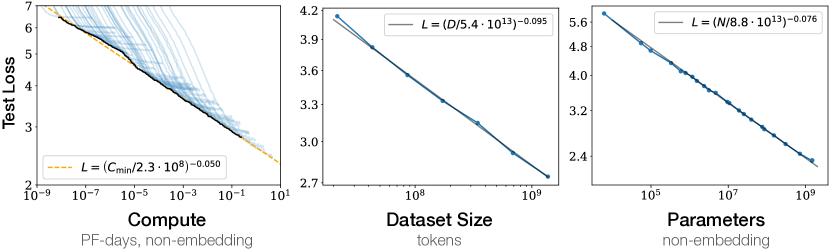

# Scaling Laws for Neural Language Models — Research Note
> **English** | [繁體中文](./README.zh-TW.md)

## 📇 Academic Context

| Field | Value |
|-|-|
| Title | Scaling Laws for Neural Language Models |
| Venue | arXiv preprint (arXiv:2001.08361) |
| Year | 2020 |
| Authors | Jared Kaplan, Sam McCandlish, Tom Henighan, Tom B. Brown, Benjamin Chess, Rewon Child, Scott Gray, Alec Radford, Jeffrey Wu, Dario Amodei |
| Official Code | unknown |
| Venue Kind | paper |

This is an empirical study jointly conducted by OpenAI and Johns Hopkins University, released only as an arXiv preprint, and it did not go through any formal peer-review process. As a result, the venue tier below can only be marked as unknown on the evidence available. This note is based on the full arXiv text (arXiv:2001.08361v1); since there is no subsequent formal conference or journal camera-ready version, this preprint is the authoritative text.

## First Principles

### Research question: decomposing "scale" into three measurable axes

The core question this paper answers is: for an autoregressive Transformer language model, what determines its performance on cross-entropy loss, and how does that performance change with those factors. The authors decompose "scale" into three mutually independent, precisely measurable axes: the number of non-embedding parameters $N$, the number of tokens in the dataset $D$, and the compute used for training $C$. All experiments optimize the autoregressive log-likelihood on WebText2 with a context of 1024 tokens, and use this loss (in nats) as the sole primary measurement metric.

The authors deliberately exclude the word-embedding and positional-embedding parameters from $N$, because they found that only after subtracting the embedding parameters do models of different depths converge onto the same trend line; if the embeddings are counted in the total parameter count, the trend is contaminated by the number of layers and becomes blurry. This choice of "describing scale by the non-embedding parameter count" is the premise for all the clean power laws that follow, not an after-the-fact beautification.

### Three basic power laws

When performance is bottlenecked by only one of the three axes, the test loss exhibits a power-law relationship with respect to that axis. This is the backbone conclusion of the whole paper, corresponding to the three expressions below (values are fits on WebText2):

$$ L(N) = \left(\frac{N_c}{N}\right)^{\alpha_N}, \quad \alpha_N \approx 0.076, \quad N_c \approx 8.8 \times 10^{13} $$

$$ L(D) = \left(\frac{D_c}{D}\right)^{\alpha_D}, \quad \alpha_D \approx 0.095, \quad D_c \approx 5.4 \times 10^{13} $$

$$ L(C_{\min}) = \left(\frac{C_c^{\min}}{C_{\min}}\right)^{\alpha_C^{\min}}, \quad \alpha_C^{\min} \approx 0.050, \quad C_c^{\min} \approx 3.1 \times 10^{8} $$

These relationships span eight orders of magnitude in $C_{\min}$, six orders of magnitude in $N$, and more than two orders of magnitude in $D$, and they are almost insensitive to model shape (depth, width, number of attention heads). The fact that the exponents are small in absolute value is itself meaningful: $\alpha_N \approx 0.076$ means that doubling the parameter count multiplies the loss by only $2^{-0.076} \approx 0.95$, i.e., each doubling buys only about a 5% reduction in loss — scale yields steady but diminishing marginal returns. The authors specifically emphasize that the absolute values of $N_c, D_c, C_c$ depend on the vocabulary size and tokenization, so they have no fundamental physical meaning; what is truly portable are the exponents.

### Counting parameters and compute from the architecture

To make the above $N$ and $C$ computable quantities, the authors provide estimates of the Transformer's parameters and compute. Under the standard setting $d_{\rm attn} = d_{\rm ff}/4 = d_{\rm model}$, the non-embedding parameter count can be approximated by a clean closed form:

$$ N \approx 12\, n_{\rm layer}\, d_{\rm model}^2 $$

And the non-embedding compute per training token is estimated as roughly $2N$ for the forward pass, plus twice that for the backward pass, totaling about $C \approx 6N$ floating-point operations. The table below breaks out the parameters and forward FLOPs of each computational unit, and is the source of the two approximations above:

| Operation | Parameters | FLOPs per Token |
|-|-|-|
| Embed | $(n_{\rm vocab}+n_{\rm ctx})d_{\rm model}$ | $4 d_{\rm model}$ |
| Attention: QKV | $n_{\rm layer} d_{\rm model} 3 d_{\rm attn}$ | $2 n_{\rm layer} d_{\rm model} 3 d_{\rm attn}$ |
| Feedforward | $n_{\rm layer} 2 d_{\rm model} d_{\rm ff}$ | $2 n_{\rm layer} 2 d_{\rm model} d_{\rm ff}$ |
| Total (Non-Embedding) | $N = 2 d_{\rm model} n_{\rm layer}(2 d_{\rm attn}+d_{\rm ff})$ | $C_{\rm forward} = 2N + 2 n_{\rm layer} n_{\rm ctx} d_{\rm attn}$ |

The reason the compute can be approximated as being determined purely by $N$ (while ignoring the term related to context length) is that the authors primarily study models with $d_{\rm model} \gg n_{\rm ctx}/12$, where the context-dependent attention computation accounts for only a small fraction of the total compute.

### One expression describing both model and data scale jointly

What truly connects the two axes is the joint expression that simultaneously characterizes the dependence on $N$ and $D$ and directly predicts the degree of overfitting:

$$ L(N, D) = \left[\left(\frac{N_c}{N}\right)^{\frac{\alpha_N}{\alpha_D}} + \frac{D_c}{D}\right]^{\alpha_D} $$

This form is not arbitrarily concocted but is constrained by three principles: changing the vocabulary should only apply an overall scaling to the loss; fixing one axis and pushing the other to infinity must recover the single-axis law $L(N)$ or $L(D)$; and the loss should admit an integer-power series expansion in $1/D$ near $D=\infty$. The third principle (the $1/D$ expansion) is the most speculative of the three, and the authors themselves admit they would not be too confident about it without empirical confirmation, but it explains why $N$ and $D$ play asymmetric roles in the expression. The fitting results for this four-parameter expression are shown in the table below:

| Parameter | $\alpha_N$ | $\alpha_D$ | $N_c$ | $D_c$ |
|-|-|-|-|-|
| Value | $0.076$ | $0.103$ | $6.4 \times 10^{13}$ | $1.8 \times 10^{13}$ |

From $\alpha_N/\alpha_D$ one can derive a practical scaling rule: to avoid falling into overfitting as the model is enlarged, the amount of data need only grow sublinearly, $D \gtrsim (5 \times 10^3)\, N^{0.74}$. This is also the origin of the statement "every time you enlarge the model by 8×, you only need to enlarge the data by about 5×" (because $8^{0.74} \approx 4.7$).

### Training dynamics and compute-optimal allocation

Once the number of training steps is also incorporated, the loss can be described in terms of model scale and the (batch-adjusted) number of steps $S_{\min}$:

$$ L(N, S_{\min}) = \left(\frac{N_c}{N}\right)^{\alpha_N} + \left(\frac{S_c}{S_{\min}}\right)^{\alpha_S}, \quad \alpha_S \approx 0.76,\ S_c \approx 2.1 \times 10^{3} $$

Combining this further with the critical batch size $B_{\rm crit}(L) = B_*/L^{1/\alpha_B}$ ($\alpha_B \approx 0.21$), the authors minimize the loss over $N$ under a fixed compute budget to obtain how the optimal allocation should grow with compute. The most crucial, and most counterintuitive, conclusion is: compute-optimal training should put almost all additional compute into "a larger model," while the number of sequential training steps hardly increases. This is quantified concretely by the exponents in the table below — $N_{\rm opt}$ grows rapidly as $C_{\min}^{0.73}$, while the number of steps $S_{\min}$ grows only as $C_{\min}^{0.03}$, slow enough to even be compatible with a zero exponent:

| Compute-Efficient Value | Power Law | Scale |
|-|-|-|
| $N_{\rm opt} = N_e \cdot C_{\min}^{p_N}$ | $p_N = 0.73$ | $N_e = 1.3 \times 10^{9}$ params |
| $B \ll B_{\rm crit} = B_e C_{\min}^{p_B}$ | $p_B = 0.24$ | $B_e = 2.0 \times 10^{6}$ tokens |
| $S_{\min} = S_e \cdot C_{\min}^{p_S}$ | $p_S = 0.03$ | $S_e = 5.4 \times 10^{3}$ steps |
| $D_{\rm opt} = D_e \cdot C_{\min}^{p_D}$ | $p_D = 0.27$ | $D_e = 2 \times 10^{10}$ tokens |

Analytically minimizing $L(N, S_{\min})$ also yields a clean training-stopping criterion: compute-optimal training should stop at a point "about $\alpha_N/\alpha_S \approx 10\%$ higher than the converged loss," rather than training to convergence. This formalizes the practical guidance in the abstract of "training very large models and stopping well short of convergence."

### A concrete numerical example

Let us walk through the GPT-2-sized model $(n_{\rm layer}, d_{\rm model}) = (48, 1600)$ cited in this paper. First, use the parameter expression to estimate the non-embedding parameter count:

$$ N \approx 12 \times 48 \times 1600^2 = 1.47 \times 10^{9} \ \text{(non-embedding params)} $$

Substitute into the single-axis law $L(N)$ to predict its converged loss under infinite data:

$$ L(N) = \left(\frac{8.8 \times 10^{13}}{1.47 \times 10^{9}}\right)^{0.076} = (5.97 \times 10^{4})^{0.076} \approx 2.3 \ \text{nats/token} $$

Next, use the overfitting rule to check whether the data is sufficient: $D \gtrsim 5 \times 10^3 \times (1.47 \times 10^9)^{0.74} \approx 3.0 \times 10^{10}$ tokens, i.e., about 30 billion tokens. This precisely explains why WebText2's 22B tokens almost never cause overfitting for models below $10^9$ parameters, but begin to exhibit slight overfitting for this paper's largest model — because the required amount of data has just crept past the dataset size. (The substitutions and arithmetic above are the derivation of this note's author, not given verbatim in the original paper.)

The figure below is this paper's signature plot: the test loss is a straight line (in log-log coordinates) spanning multiple orders of magnitude with respect to compute, dataset size, and parameter count, providing the most direct visual evidence for the core claim of "smooth power laws."

Finally, the paper's fitted values can be consolidated into the table below, serving as the parameter source for all predictions (values all depend on tokenization):

| Power Law | Scale |
|-|-|
| $\alpha_N = 0.076$ | $N_c = 8.8 \times 10^{13}$ params (non-embed) |
| $\alpha_D = 0.095$ | $D_c = 5.4 \times 10^{13}$ tokens |
| $\alpha_C = 0.057$ | $C_c = 1.6 \times 10^{7}$ PF-days |
| $\alpha_C^{\min} = 0.050$ | $C_c^{\min} = 3.1 \times 10^{8}$ PF-days |
| $\alpha_B = 0.21$ | $B_* = 2.1 \times 10^{8}$ tokens |
| $\alpha_S = 0.76$ | $S_c = 2.1 \times 10^{3}$ steps |

## 🧪 Critical Assessment

### The practical value of reducing compute allocation to an extrapolable power law

The question this paper asks is itself substantial rather than manufactured: in 2020, "to what extent should the model and data be scaled up, and how should compute be allocated" was a real-money engineering decision, and at the time the industry mostly made it by intuition and hardware limits. Reducing this decision to a few extrapolable power laws has clear practical value; the subsequent size choice of GPT-3 and Chinchilla's re-examination were both built directly on this framework, which attests to the reality of the question. On this point I see no padding.

### Two gaps: a single WebText2 corpus and a pure cross-entropy metric

As an empirical paper, its internal ablations are quite thorough: shape-invariance is obtained by fixing $N$ and separately sweeping depth/width/heads; the trade-off in embedding parameters is also directly supported by side-by-side comparison figures. But several structural limitations are worth naming. First, all conclusions are built on a single data distribution, WebText2; although the authors tested transfer to other distributions, they did not re-fit the exponents on different corpora, so the claim that "the exponents are a portable quantity independent of tokenization" is in fact only weakly verified, not a cross-dataset proof. Second, there is only one measurement metric — the context-averaged cross-entropy loss, with no downstream-task performance at all. A smooth decline in loss does not imply that any concrete capability improves smoothly; the authors themselves admit in the Discussion that "more is different," which amounts to conceding that there is an unbridged gap between the core measurement and the capabilities people actually care about.

### A sublinear data rule opposite to Hestness, and the speculative nature of the $1/D$ expansion

Power-law scaling itself was not brand new before 2020 — Hestness, Rosenfeld, and others had already reported power laws between model/data scale and performance. This paper honestly cites these works in Related Work and points out the key difference: prior work (such as Hestness) found that the amount of data needs to grow superlinearly with model scale, whereas this paper obtains sublinear growth, the two conclusions pointing in opposite directions. This reversed conclusion, together with the closed loop of "incorporating compute as a third axis and deriving the optimal allocation," constitutes a substantive incremental contribution, and I do not think this is merely a repackaging with new terms. What must be reserved, however, is that the third principle of the joint expression $L(N,D)$ (the integer-power expansion in $1/D$) carries considerable speculation, and the authors themselves concede the theoretical support is weaker, so the "inevitability" of that expression is packaged somewhat more strongly than the evidence can support.

### The extrapolation crossing point where the power law must break down, and the risk of the "language entropy" interpretation

What most warrants caution is that this framework's "success" is almost claimed using its own defined measurement (WebText2 cross-entropy) — the trend line is beautiful, but what that line measures is precisely the very objective being optimized. The real extrapolation risk is disclosed by the authors themselves in the "contradictions and conjecture" section: the two extrapolation lines $L(C_{\min})$ and $L(D)$ cross and produce a contradiction near $C^* \sim 10^4$ PF-days and $N^* \sim 10^{12}$, implying that the power law must break down somewhere. The authors romanticize this crossing point as "an estimate of the entropy of natural language," but they also admit that the location of the crossing point is extremely sensitive to the exponents and can shift up or down by an order of magnitude. This is an honest but dangerous conjecture: reinterpreting an extrapolation-breakdown point as a physical constant is, in essence, still an unverified inference. Overall, the paper's predictive framework is well-supported by evidence within the internal interval it measures, but once one steps outside the measurement range or switches to downstream capabilities, its claims slide from "verified" toward "plausible but unproven," and readers should not memorize the power laws as unconditional laws.

## 🔗 Related notes

- [Attention Is All You Need](../AttentionIsAllYouNeed/)
- [BERT](../BERTSummary/)
