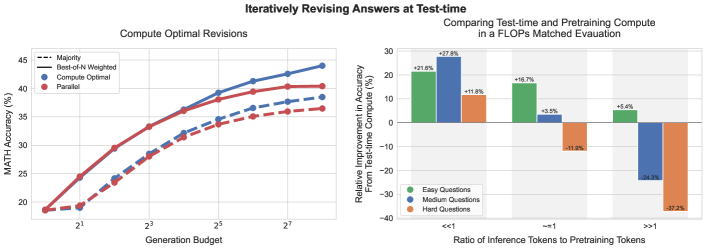
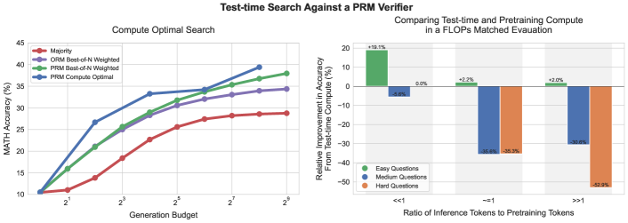
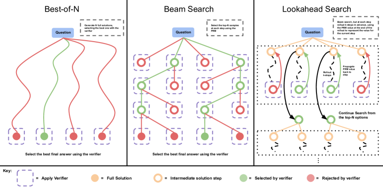
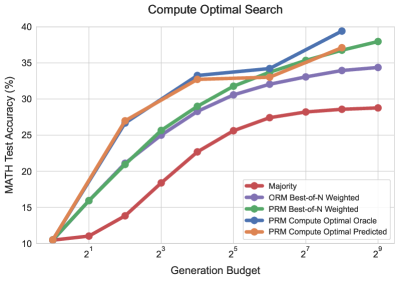
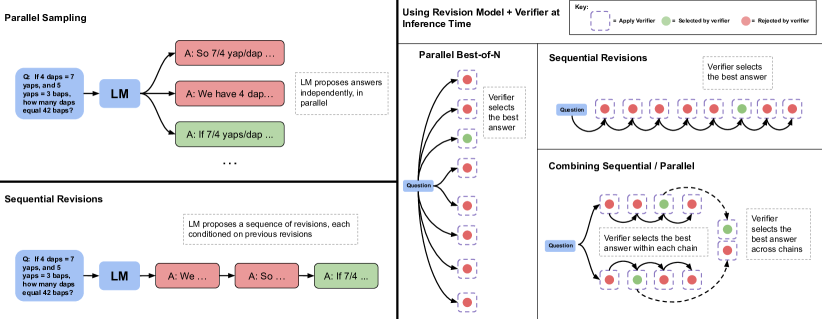
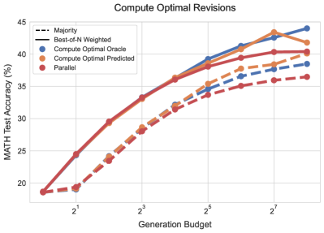
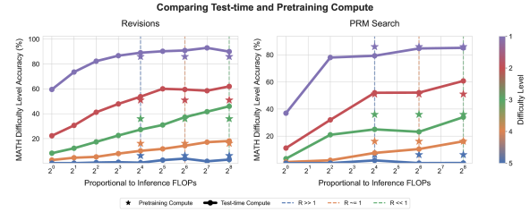

# Scaling LLM Test-Time Compute Optimally — Research Note

## 📇 Academic Context

| Field | Value |
|-|-|
| Title | Scaling LLM Test-Time Compute Optimally can be More Effective than Scaling Model Parameters |
| Venue | unknown |
| Year | 2024 |
| Authors | Charlie Snell, Jaehoon Lee, Kelvin Xu, Aviral Kumar |
| Official Code | unknown |
| Venue Kind | paper |

> 本文為 arXiv 預印本 `2408.03314`（UC Berkeley 與 Google DeepMind），camera-ready 若有版本差異以正式發表為準；venue tier 因缺乏可引用的排名來源而標記為 `unknown`。

## 核心問題與兩條擴充軸

這篇論文問的是一個很具體的問題：如果讓一個 LLM 在推論階段（test time）花費固定但不算少的額外計算，它在困難題目上的表現能提升多少？作者把「花更多推論計算」拆成兩個彼此獨立的機制來研究：其一是對著一個過程式驗證器（process-based verifier reward model）做搜尋，其二是在給定提示下，讓模型於測試時「適應性地」改寫自己對答案的分佈。兩種機制的有效性都強烈取決於題目難度，這個觀察推動了一個「compute-optimal」的擴充策略：依每一題來分配推論計算。相對於 best-of-N 基線，這個策略把推論計算的效率提升了 4 倍以上；而在 FLOPs 對齊的比較下，對於小模型已有非零成功率的題目，測試時計算甚至能勝過一個約 14 倍大的模型。





### 統一視角：提議者（proposer）與驗證器（verifier）

作者先把所有測試時計算方法統一成「在測試時、依提示，適應性地修改模型輸出分佈」這件事，並指出只有兩個旋鈕：一是在輸入層，用額外 token 擴充提示讓模型改變條件分佈（也就是修改 proposal distribution）；二是在輸出層，先取樣多個候選、再用事後的 verifier 或 scorer 對這些候選動手術。作者把這個過程類比為 MCMC 取樣：用一個簡單的 proposal distribution 搭配一個 score function，去逼近一個複雜的目標分佈。修改提議分佈與使用驗證器，構成本研究的兩條獨立座標軸。

有了這個統一視角，作者把「最有效地使用測試時計算」形式化為一個對超參數 $\theta$ 的最佳化問題。令 $\operatorname{Target}(\theta, N, q)$ 為模型在提示 $q$、測試時超參數 $\theta$、預算 $N$ 下對輸出 token 的分佈，目標是選出讓正確率最大化的 $\theta$：

$$
\theta^{*}_{q,a^*(q)}(N) = \operatorname{argmax}_{\theta} \left( \mathbb{E}_{y \sim \operatorname{Target}(\theta, N, q)} \left[ \mathbbm{1}_{y = y^*(q)} \right] \right)
$$

其中 $y^*(q)$ 是 $q$ 的正解。這個式子本身無法直接解，作者的關鍵近似是：把最佳超參數表示成題目「難度」的函數。難度被當成一個充分統計量（sufficient statistic），只要能估出一題的難度，就能查表選出該難度下驗證集上表現最好的策略，再套用到測試集。

難度的定義沿用 Lightman 等人的做法，並以基礎 LLM 為參照：對測試集每一題，用 2048 個樣本估計模型的 pass@1 率，再依此把題目分到五個難度分位。作者區分兩種難度：oracle difficulty 使用真值正確性檢查來分箱，model-predicted difficulty 則改用一個學習到的驗證器對同樣 2048 個樣本的平均最終答案分數來分箱——後者不需要知道答案，才可能在部署時使用，代價是分箱本身也要花一次推論計算。

### 驗證器軸：PRM 與三種搜尋

作者發現直接沿用 Lightman 等人釋出的 PRM800k 人工標註資料訓練 PRM，對他們的 PaLM 2 模型效果不佳（連 best-of-N 都能輕易鑽漏洞），推測是 GPT-4 生成樣本與 PaLM 2 之間的分佈偏移所致；因此改採 Math-Shepherd 的無人工標註做法，用每一步往後做 Monte Carlo rollout 得到的 per-step 正確性估計來監督 PRM，其 per-step 預測相當於基礎模型取樣策略的 reward-to-go 值估計。在聚合上，step-wise 取「最後一步」的分數當作整條解答的分數（而非取最小或連乘），inter-answer 則採用 best-of-N weighted——把相同最終答案的驗證器分數加總，選總和最大者。



作者比較三種對 PRM 的搜尋方式：best-of-N weighted 獨立取樣 N 條完整解答再選最佳；beam search 逐步搜尋 PRM 的 per-step 預測；lookahead search 則在 beam search 的每一步多往前模擬 k 步、用 rollout 末端的 PRM 分數來評分該步，因此 beam search 可視為 $k=0$ 的 lookahead 特例，也可視為去掉探索隨機性、只做利用的 MCTS。beam search 的核心迴圈可寫成：

```
給定 beam 數 N、beam 寬度 M：
  1. 取樣 N 個「第一步」候選
  2. 用 PRM 的 per-step reward-to-go 估計為每個候選步評分
  3. 保留分數最高的前 N/M 個步
  4. 從每個保留候選再各取樣 M 個「下一步」，得到 N/M × M = N 個前綴
  重複 2–4，直到解答結束或達到 40 輪 beam 擴張為止
最後對 N 個最終答案候選套 best-of-N weighted 選出答案
```

為了公平比較不同搜尋法的生成預算，作者把一次「生成」定義為從基礎 LLM 取樣一條答案；best-of-N 與 beam search 的預算就是 N，而 lookahead search 因為每步多模擬 k 步，成本被定義為 $N \times (k+1)$ 個樣本。結果顯示：在小生成預算時 beam search 明顯優於 best-of-N，但預算放大後優勢消失、甚至掉到 best-of-N 之下；lookahead search 在相同生成預算下普遍最差，因為模擬 rollout 吃掉了額外計算。作者把報酬遞減歸因於對 PRM 預測的過度利用（over-optimization），例如搜尋會誘導模型在解答末端產生低資訊的重複步、或壓出只有一兩步的過短解。依難度分箱後可看到：在簡單題（第 1、2 級）beam search 隨預算增加反而退步，顯示它在放大驗證器的假特徵；在中等難度（第 3、4 級）beam search 穩定勝過 best-of-N；最難的第 5 級則沒有任何方法有實質進展。



把「每個難度分箱挑最佳搜尋策略」串起來，就得到搜尋的 compute-optimal 曲線。在低生成預算區間，無論用 oracle 還是 predicted 難度，compute-optimal 擴充能以最多 4 倍更少的測試時計算（例如 16 對 64 次生成）幾乎追平 best-of-N；在更高預算區間，predicted 難度的部分優勢會縮小，但 oracle 分箱仍能持續改善，顯示適應性分配計算確有增益。

### 提議分佈軸：序列式改寫（revisions）



單純提示現成 LLM 去自我糾錯，在數學推理上幾乎無效，因此作者依 Qu 等人的配方微調出一個會逐步改寫自己答案的 revision model。訓練資料的產生方式是：對每題平行取樣 64 條回應，再事後拼裝成多輪軌跡——把每個正解與一串前面的錯誤答案配對放進 context，錯誤答案數目在 0 到 4 之間均勻取樣，並用字元編輯距離挑選與正解相關的錯誤答案，讓模型學會隱含地找出並修正 in-context 例子裡的錯誤。推論時有個分佈偏移問題：模型只在「context 全是錯誤答案」上訓練，但測試時 context 可能出現正解，導致約 38% 原本正確的答案在下一次改寫被改錯，因此需要用序列式多數決或驗證器選擇來挑出整條改寫序列中最好的答案。

作者主張序列式與平行式各有互補的性質：平行取樣像全域搜尋，能覆蓋多種不同的高階解法；序列式改寫像局部精修，適合已大致走對方向的答案。因此在固定生成預算下掃描「序列/平行」比例，會存在一個讓正確率最大的理想比例，而這個理想比例隨題目難度改變：簡單題最好把預算全押在序列式改寫，較難的題則要在序列與平行之間取一個平衡比例。



依難度分箱挑選最佳序列/平行比例，就得到 revisions 的 compute-optimal 策略。在較高生成預算時，純平行取樣會趨於飽和，而 compute-optimal 擴充仍持續改善；無論 oracle 或 predicted 難度，它都能以最多 4 倍更少的測試時計算（例如 64 對 256 個樣本）勝過 best-of-N 基線。

### 把測試時計算與預訓練計算對換

作者接著問一個資源配置問題：若一個模型以 $X$ FLOPs 預訓練、預期跑 $Y$ FLOPs 推論，現在要把總 FLOPs 乘上 $M$ 倍，這些額外預算該投入預訓練還是測試時計算？他們沿用常見近似，預訓練用 $X = 6ND_{\text{pretrain}}$、推論用 $Y = 2ND_{\text{inference}}$：

$$
X = 6 N D_{\text{pretrain}}, \qquad Y = 2 N D_{\text{inference}}
$$

其中 $N$ 是參數量，$D_{\text{pretrain}}$、$D_{\text{inference}}$ 分別是預訓練與推論的 token 數。把參數乘以 $M$ 會讓預訓練與推論的 FLOPs 同時乘上 $M$。若改用小模型加測試時計算來對齊這筆 FLOPs，小模型的推論計算可以放大 $M + 3 \left(\frac{D_{\text{pretrain}}}{D_{\text{inference}}}\right)(M-1)$ 倍。這個倍率取決於比值，作者定義 $R = \frac{D_{\text{inference}}}{D_{\text{pretrain}}}$：大規模生產常有 $R \gg 1$（推論 token 遠多於預訓練），而許多自我改進管線則是 $R \ll 1$。



作者用 $\sim14$ 倍的參數放大做對照，並挑三個 $R$ 值：0.16（$R \ll 1$）、0.79（$R \sim 1$）、22（$R \gg 1$）。結論是：若只會遇到很難的題（第 4/5 級）或推論負載高（$R$ 大），把預算投入預訓練較划算；若題目多屬簡單到中等（第 1/2/3、有時第 4 級）或推論需求低（如自我改進），測試時計算較划算。也就是說兩者並非 1 比 1 可對換。

### 一個帶入真實數字的走查

以 beam search 為例，取生成預算 $N=64$、beam 寬度 $M=4$：先取樣 64 個第一步候選，用 PRM 評分後保留分數最高的 $N/M = 16$ 個，再從每個保留候選各取樣 $M=4$ 個下一步，得到 $16 \times 4 = 64$ 個前綴，如此循環最多 40 輪，最後對 64 個最終答案候選套 best-of-N weighted。搜尋的 compute-optimal 效益「4 倍」正是指：適應性分配下，用 16 次生成就能追平 best-of-N 需要 64 次生成的水準。

把 FLOPs 對換倍率代入 $M=14$，可算出下表（此處數值為本文據論文公式 $M + 3(D_{\text{pretrain}}/D_{\text{inference}})(M-1)$ 推導，非論文直接給出）：

| 情境 | $R = D_{\text{inference}}/D_{\text{pretrain}}$ | 小模型推論可放大倍率 |
|-|-|-|
| 自我改進（推論少） | 0.16 | $14 + 3 \times 6.25 \times 13 \approx 258$ |
| 均衡 | 0.79 | $14 + 3 \times 1.27 \times 13 \approx 63$ |
| 大規模生產（推論多） | 22 | $14 + 3 \times 0.045 \times 13 \approx 16$ |

這張表把論文的直覺量化了：在 $R \ll 1$ 時，小模型能動用約 258 倍於原本的推論計算來對齊 14 倍大模型的 FLOPs，這麼大的測試時預算足以讓 compute-optimal 策略在多數難度上取勝；但在 $R \gg 1$ 時只剩約 16 倍推論預算，測試時計算的邊際效益不足以彌補參數放大，於是預訓練勝出。這正解釋了為何論文強調兩種計算「並非可自由對換」，且結論會隨部署情境（$R$）而反轉。

## 🧪 Critical Assessment

### FLOPs 該花在預訓練還是推論——一個誠實面對負面結果的動機

「該把 FLOPs 花在預訓練還是推論」是一個對部署有直接影響的真問題：若小模型加測試時計算能頂替大模型，就能把資料中心級 LLM 換成裝置端小模型，也給出一條減少人類監督的自我改進路徑。論文對這個動機的論證是紮實的，而且它誠實地把「測試時計算並非萬能」寫進結論——最難的第 5 級題目所有方法都沒有實質進展，這種不迴避負面結果的態度提升了可信度。

### 單一資料集、單一模型，以及被藏進難度估計的計算成本

方法面的消融相對完整：搜尋與改寫都做了難度分箱、序列/平行比例掃描、oracle 對 predicted 難度的對照，附錄還比較了 PRM 的聚合策略與 PRM 對 ORM。但評估的外部效度是明顯的軟肋——全篇只在單一資料集 MATH、單一基礎模型 PaLM 2-S*（Codey）上得到結論，作者自己也只說「相信」findings 能遷移到相近模型，這是一個未被實驗驗證的推斷，難以斷定 4 倍與 14 倍在其他家族模型或其他推理任務上是否成立。此外，難度分箱需要每題 2048 個樣本，連 model-predicted 版本也承認在生產環境成本高昂，等於把一部分「測試時計算」花在了估難度上卻未計入主要比較，這使得宣稱的效率增益在實務上可能被高估。

### 舊元件、新框架，與由方法自身難度定義所界定的基準

平心而論，論文用到的元件多半來自既有工作：PRM 來自 Lightman／Math-Shepherd，beam／lookahead search 是 BFS-V 與 MCTS 的變體，revision 配方沿用 Qu 等人，FLOPs 近似來自 Chinchilla 線。真正的新貢獻是「以題目難度為充分統計量、按題適應性分配計算」這個統一框架與其系統性的量測，而非任一單獨演算法。這裡值得警惕的一點是評測設計偏向自家方法：難度分箱正是以「這個基礎模型的 pass@1」定義的，compute-optimal 的增益也是在同一套難度定義下、對驗證集選最佳、再到測試集量得——這種「基準由方法自身特性所界定」的設定，容易讓 4 倍增益看起來比在中立、外生的難度標準下更漂亮。

### 「can be」是必要的限定詞：受限承諾與難度估計成本這道未解關卡

我認為論文兌現的是一個受限版本的承諾，而非全稱命題。它證明的是：在特定條件（易到中等難度、低推論負載 $R$）下，簡單的測試時方法就能勝過預訓練放大；但它同時證明了反面——高難度或高 $R$ 時預訓練仍較優，兩者不可 1 比 1 對換。因此標題那句「can be More Effective than Scaling Model Parameters」中的 “can be” 是必要的限定詞，若被讀成普遍結論則會誤導。就真實世界關聯而言，最關鍵的未解問題是難度估計的成本：目前的做法需要昂貴的取樣，若無法用便宜方式即時判斷難度，compute-optimal 策略在線上部署的實際效益仍是存疑的，作者也把這點列為未來工作。

## 🔗 Related notes
