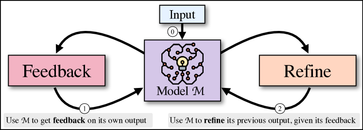

# Self-Refine — Research Note

## 📇 Academic Context

| Field | Value |
|-|-|
| Title | SELF-REFINE: Iterative Refinement with Self-Feedback |
| Venue | NeurIPS 2023 |
| Year | 2023 |
| Authors | Aman Madaan, Niket Tandon, Prakhar Gupta, Skyler Hallinan, Luyu Gao, Sarah Wiegreffe, Uri Alon, Nouha Dziri, Shrimai Prabhumoye, Yiming Yang, Shashank Gupta, Bodhisattwa Prasad Majumder, Katherine Hermann, Sean Welleck, Amir Yazdanbakhsh, Peter Clark |
| Official Code | https://selfrefine.info/ |
| Venue Kind | paper |

> 本文基於 arXiv 預印本 `2303.17651v2` 撰寫，正式版收錄於 NeurIPS 2023；相機修訂版（camera-ready）之細節可能與預印本略有差異。所有數值與引文均以預印本 LaTeX 原始碼為準。

## First Principles

Self-Refine 想解決的問題是：即使是 GPT-4 這類強語言模型（LLM），第一次生成的輸出往往不是最好的，尤其在多目標（如對話回應）或目標難以形式化（如提升程式可讀性）的任務上。過去的迭代修正多半要訓練一個額外的修正模型或依賴外部獎勵模型，需要大量標註或監督資料。Self-Refine 的核心想法是：用「同一個」LLM 同時扮演生成者、回饋者與修正者三種角色，不做任何額外訓練、不需監督資料、也不用強化學習，只靠測試階段的迭代自我回饋與修正就把輸出改好。



上圖是方法的高層示意：給定輸入後，模型先產生一版輸出並把它送回同一個模型取得回饋，回饋再送回模型去修正前一版草稿，回饋與修正兩步反覆執行直到觸發停止條件，整個過程不涉及任何人工協助。

方法只依賴三個 few-shot 提示：初始生成提示 $p_{gen}$、回饋提示 $p_{fb}$、以及修正提示 $p_{refine}$。這三個提示各自以少量 in-context 範例，讓同一個基礎模型分別具備生成、回饋與修正的能力，因此整體是「supervision-free」的——唯一的監督訊號就藏在 few-shot 範例裡。第一步是初始生成：給定輸入 $x$、提示 $p_{gen}$ 與模型 $\mathcal{M}$，模型產生初始輸出 $y_0$。

$$
y_0 = \mathcal{M}(p_{gen} \| x)
$$

第二步是回饋。同一個模型 $\mathcal{M}$ 依回饋提示 $p_{fb}$ 對自己剛才的輸出 $y_t$ 產生回饋 $fb_t$。關鍵在於回饋必須「具體且可執行」（actionable and specific）：可執行指回饋要包含一個很可能改善輸出的具體動作，具體指回饋要指出輸出中該修改的確切片段。例如在程式最佳化裡，回饋會同時點出效率、可讀性等多個面向，並直接指名 for 迴圈這種要改的地方。

$$
fb_t = \mathcal{M}(p_{fb} \| x \| y_t)
$$

第三步是修正：模型依回饋把最近一版輸出改寫成新的一版。為了讓模型記得過去幾輪的嘗試、避免重蹈覆轍，實作上並不是只餵最新的 $(y_t, fb_t)$，而是把歷來所有的輸出與回饋整串接到提示後面，讓模型從過去的錯誤中學習。因此修正步驟實際上是保留完整歷史的形式。

$$
y_{t+1} = \mathcal{M}(p_{refine} \| x \| y_0 \| fb_0 \| \cdots \| y_t \| fb_t)
$$

回饋與修正兩步交替，直到停止條件 $\mathrm{stop}(fb_t, t)$ 成立：條件可以是跑到指定的迭代步數，也可以是從回饋中抽出一個停止指標（例如一個純量分數）。論文的實驗設定裡，每個任務最多迭代 4 次，並對所有設定都用 temperature 0.7 的貪婪解碼；為了讓不同模型的比較一致，即使是 ChatGPT、GPT-4 這類擅長指令的模型，回饋與修正也一律以 few-shot 提示實作。

論文在 7 個涵蓋自然語言與原始碼生成的多樣任務上評測 Self-Refine，基礎模型用 GPT-3.5（`text-davinci-003`）、ChatGPT（`gpt-3.5-turbo`）與 GPT-4，程式任務另外測了 Codex（`code-davinci-002`）。所有任務都以「同一個基礎模型但不做回饋-修正迭代」作為對照，摘要宣稱在所有評測任務上，Self-Refine 的輸出在人類與自動指標下都優於傳統單步生成，平均任務表現絕對提升約 20%。下表是三個主力模型在 7 個任務上的主結果。

| Task | GPT-3.5 Base | GPT-3.5 +SR | ChatGPT Base | ChatGPT +SR | GPT-4 Base | GPT-4 +SR |
|-|-|-|-|-|-|-|
| Sentiment Reversal | 8.8 | 30.4 (↑21.6) | 11.4 | 43.2 (↑31.8) | 3.8 | 36.2 (↑32.4) |
| Dialogue Response | 36.4 | 63.6 (↑27.2) | 40.1 | 59.9 (↑19.8) | 25.4 | 74.6 (↑49.2) |
| Code Optimization | 14.8 | 23.0 (↑8.2) | 23.9 | 27.5 (↑3.6) | 27.3 | 36.0 (↑8.7) |
| Code Readability | 37.4 | 51.3 (↑13.9) | 27.7 | 63.1 (↑35.4) | 27.4 | 56.2 (↑28.8) |
| Math Reasoning (GSM8K) | 64.1 | 64.1 (0) | 74.8 | 75.0 (↑0.2) | 92.9 | 93.1 (↑0.2) |
| Acronym Generation | 41.6 | 56.4 (↑14.8) | 27.2 | 37.2 (↑10.0) | 30.4 | 56.0 (↑25.6) |
| Constrained Generation | 28.0 | 37.0 (↑9.0) | 44.0 | 67.0 (↑23.0) | 15.0 | 45.0 (↑30.0) |

主結果讀起來有兩個明顯的樣態。偏好類任務（對話回應、情感反轉、縮寫生成）的增益最大，例如對話回應任務裡 GPT-4 的偏好分數從 25.4 一路拉到 74.6，絕對提升 49.2。相對地，數學推理 GSM8K 幾乎沒有提升（GPT-4 是 92.9 到 93.1），論文自己解釋原因是模型難以判斷推理鏈有沒有錯——一條看起來通順的推理鏈會騙過模型讓它覺得「everything looks good」，實測 ChatGPT 對 94% 的實例都給出「一切看起來沒問題」的回饋，於是根本沒有東西可修。

### 一次具體的前向修正：把暴力解改成動態規劃

以程式最佳化任務中的一個真實例子走一遍。輸入是一支要湊出某金額的暴力解程式，`pie` 基線幾乎原封不動地照抄了慢版邏輯，用六層巢狀迴圈枚舉所有硬幣組合，只改了讀輸入的部分，完全沒有把效率改好，初始版本大致長這樣。

```python
# 慢版：六層巢狀迴圈枚舉
def solve(amount):
  best_price = (amount + 199) // 200 * 380
  for a in range(amount // 200 + 1):
    for c1 in range(amount // 1500 + 1):
      if a*200 + b*300 == amount:
        price = a*380 + b*550
        if price < best_price:
          best_price = price
  return best_price
```

Self-Refine 先產生回饋，診斷出「這段程式很慢，因為它用六層巢狀迴圈去枚舉所有付款的硬幣組合」，並建議改用更有效率的做法。模型接著依這條回饋把程式改寫成動態規劃解，把時間複雜度降到 $\mathcal{O}(amount*coins)$。這正對應主結果裡 GPT-4 在 Code Optimization 上把最佳化比例從 27.3% 提到 36.0% 的那 8.7 個百分點。改寫後的程式如下。

```python
# 快版：動態規劃
def solve(amount):
  coins = [200, 300]
  prices = [380, 550]
  dp = [float('inf')] * (amount + 1)
  dp[0] = 0
  for i in range(len(coins)):
    for j in range(coins[i], amount+1):
      dp[j] = min(dp[j], dp[j - coins[i]] + prices[i])
  return dp[amount]
```

多輪迭代到底有沒有用？論文把每一輪迭代後的分數攤開來看，平均而言輸出品質隨迭代次數增加而提升。下表是三個任務逐輪（$y_0$ 到 $y_3$，跨三個模型平均）的分數。

| Task | $y_0$ | $y_1$ | $y_2$ | $y_3$ |
|-|-|-|-|-|
| Code Optimization | 22.0 | 27.0 | 27.9 | 28.8 |
| Sentiment Reversal | 33.9 | 34.9 | 36.1 | 36.8 |
| Constrained Generation | 29.0 | 40.3 | 46.7 | 49.7 |

從表可看出增益主要集中在前一兩輪：Code Optimization 從 22.0 爬到 28.8，Constrained Generation 從 29.0 爬到 49.7，但每多一輪的邊際改善逐漸縮小，呈現明顯的報酬遞減。論文也提醒在多面向回饋的任務（如縮寫生成）品質不一定單調上升，因此改用對各品質面向打數值分數的方式，來在迭代中挑出較平衡的輸出。

## 🧪 Critical Assessment

### 增益集中在低基準的開放式任務，可驗證任務幾乎歸零

「LLM 第一次生成不是最佳、可用自我回饋改善」是個真實且有價值的問題，而且 Self-Refine 完全不需訓練、只靠測試階段提示就能套到任何強模型上，這種即插即用的特性讓它在工程上很有吸引力。不過要注意，論文最亮眼的增益幾乎都落在「偏好類、開放式」任務上，這類任務的初始基準分數本來就偏低（例如 GPT-4 在對話回應的 Base 只有 25.4），改善空間天然很大；一旦任務有明確、可驗證的正確性（如 GSM8K），增益就趨近於零。這暗示 Self-Refine 真正擅長的是「打磨風格與覆蓋度」而非「修正事實或邏輯錯誤」。

### 消融紮實，但 GPT-4 既當評審又當被評者的循環風險

消融設計是這篇的強項：作者用「Self-Refine 回饋 vs. 泛用回饋 vs. 無回饋」證明具體可執行的回饋才是關鍵（情感反轉在無回饋時直接歸零），也用 1-vs-$k$ 取樣對照排除了「只是多生幾個候選」的解釋，這些都比只報主結果紮實。

但指標本身有可疑之處。多個任務沒有自動指標，改用 GPT-4 當人類偏好的代理來評分，而被評的輸出本身又常是 GPT-4 生成與修正的——評審與被評者高度同源，存在自我偏好的循環風險；論文雖報了與人類 68–82% 的相關度，但那也代表約兩三成的分歧被 GPT-4 評分掩蓋掉了。此外偏好類任務的人類 A/B 只在輸出的一個子集上做，樣本代表性未完全交代。

### 新意在「凍結模型純提示即可跑通迴圈」，而非迭代精修本身

「產生→回饋→修正」的迭代精修在此之前已有不少工作（論文自己引用了 PEER、Self-Correction 等），Self-Refine 的真正新意不在概念，而在於證明「不需任何額外訓練、單一凍結模型、純靠 few-shot 提示」就能把這個迴圈跑起來並在強模型上見效。這是有價值的實證貢獻，但它更像是把既有想法在大模型時代重新驗證與簡化，而非全新的機制；把它當成一個強基線或提示技巧來理解，會比當成一個新模型更貼切。

### 兩個自造任務貢獻了最大增益，網站生成僅為質性示範

值得警惕的是，7 個任務裡有兩個（縮寫生成、20–30 個關鍵詞的 Constrained Generation）是作者自己新造的，而 Self-Refine 在這兩個新任務上的增益又特別大——當評測基準是圍繞著方法本身的強項來定義時，數字的說服力要打折扣。作者把 Constrained Generation 的高增益歸因於「第一次容易漏掉概念、之後可以補」，這其實也說明該任務天生對迭代補救特別友善。真實世界關聯方面，論文用網站生成的案例展示了泛化潛力，方向誘人，但那只是質性示範、沒有量化評測，屬於前景宣稱而非已被驗證的結果。綜合來看，本文並非沒有材料弱點，其結論在「開放式、低基準」任務上成立得最穩，在有客觀正確性的任務上則相當有限。

## 🔗 Related notes

<!-- 目前沒有可安全解析的相關筆記；保留標題，暫不連結。 -->
