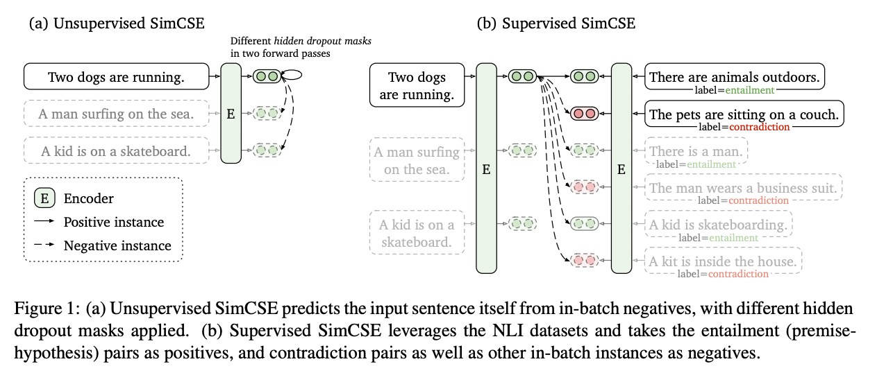

| Property  | Data |
|-|-|
| Created | 2022-12-19 |
| Updated | 2022-03-03 |
| Author | @Aiden |
| Tags | #study |

#  SimCSE: Simple Contrastive Learning of Sentence Embeddings

| Title | Venue | Year | Code |
|-|-|-|-|
| [SimCSE: Simple Contrastive Learning of Sentence Embeddings](https://arxiv.org/abs/2104.08821) | EMNLP | '21 | [✓](https://github.com/princeton-nlp/SimCSE) |

## Abstract
The paper presents `SimCSE`, a `contrastive learning` framework for improving sentence embeddings. 
It includes an unsupervised approach that predicts an input sentence in a contrastive objective, using `dropout` as noise, and a supervised approach that **uses annotated pairs from natural language inference datasets as positives and hard negatives**. 
SimCSE achieves an average of 76.3% and 81.6% Spearman's correlation for unsupervised and supervised models, respectively, which is a 4.2% and 2.2% improvement compared to the previous best results on standard semantic textual similarity tasks. 
The `contrastive learning` objective also regularizes `pre-trained embeddings'` anisotropic space to be more `uniform` and better aligns positive pairs when supervised signals are available.

### Keywords
[Contrastive Learning](../../utils/contrastive_learning/)

## Proposed Method
- CL in SimCLR

  

- CL in SimCSE

  

### Types of proposed approaches

| Type | Definition |
|-|-|
| Unsupervised SimCSE | Using `dropout masks` to sample twice and get 2 embeddings with different dropout masks. This approach can be seean as a minimal form of `data augmentation`. |
| Supervised SimCSE | directly take $(x_i , x_i^+)$ pairs from supervised datasets as positive pairs and use them to optimize infoNCE. Then using `contradiction` pairs as hard negatives. |