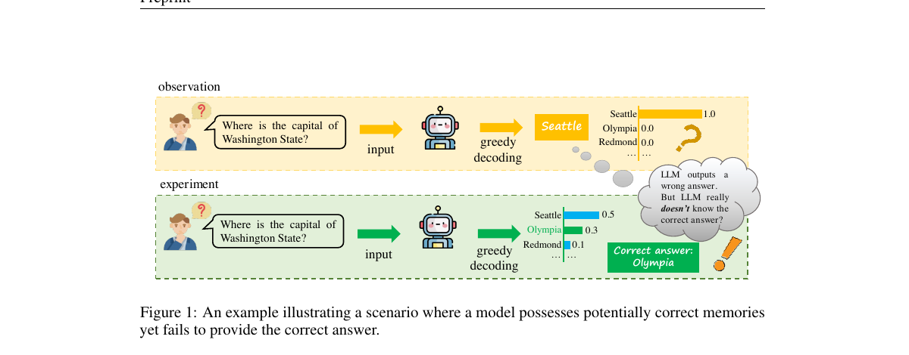
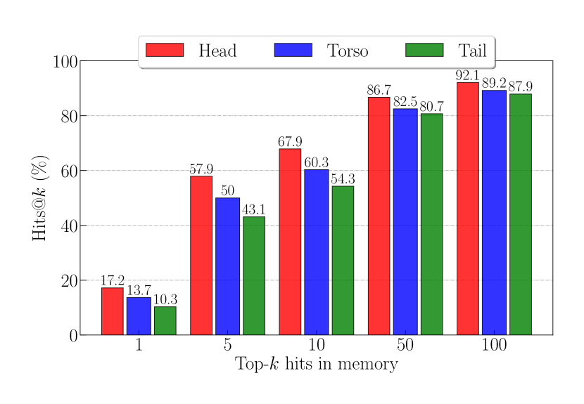
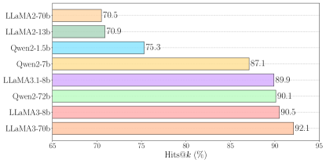
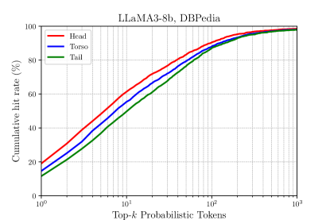
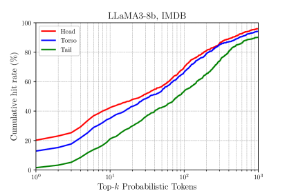
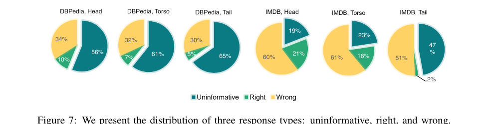

# SubmergedKnowledge — Research Note
> **English** | [繁體中文](./README.zh-TW.md)

## 📇 Academic Context

| Field | Value |
|-|-|
| Title | Are LLMs Really Not Knowledgeable? Mining the Submerged Knowledge in LLMs' Memory |
| Venue | ICLR 2026 |
| Year | 2026 |
| Authors | Xingjian Tao, Yiwei Wang, Yujun Cai, Zhicheng Yang, Jing Tang |
| Official Code | unknown |
| Venue Kind | paper |

> This note is based on the arXiv preprint `2412.20846v2` (2026-01-28); that version's title matches the ICLR 2026 OpenReview submission (forum `gvUufgeJvV`), and the official camera-ready content may differ slightly from this version.

## Introduction

Large language models (LLMs) are often used as "parametric knowledge bases": facts are compressed into the weights, then retrieved back out through generation. But on knowledge-intensive question answering (QA) tasks, models frequently give wrong answers or hallucinate, and the mainstream explanation is "the knowledge was simply never learned into the parameters," so the usual remedy is to make the model bigger and feed it more data. This paper challenges exactly that assumption: it argues that many failures are not "not knowing," but "knowing yet failing to express it."

The paper's core observation is: even when the model ultimately outputs a wrong answer, the correct answer often still appears with high probability in the probability distribution over vocabulary tokens — it just wasn't selected as top-1. The paper uses "the capital of Washington State" as its flagship example — the model outputs "Seattle," yet assigns a high probability score to the correct answer "Olympia." The authors call this kind of knowledge that is "hidden in the distribution but not expressed" submerged knowledge.



To quantify this phenomenon, the authors propose the Hits@k metric: a hit is counted as long as the correct answer falls within the top k tokens ranked by logit, decoupled from whether the final output is correct. The evaluation covers one open-domain dataset DBPedia and two specific-domain datasets IMDB (movies) and GoodReads (books), and splits them into head/torso/tail by entity popularity; the models under test are 9 open-source models from 1.5B to 72B (LLaMA2/3, Qwen2, Mistral; the upper bound is Qwen2-72b, though the paper body describes the range as "1.5B to 70B" and does not count this 72B exception), all using greedy decoding at temperature 0. The conclusion is: the "stored knowledge" measured by Hits@k far exceeds the amount reflected by standard accuracy.

The paper's second main thread examines the widely adopted few-shot QA paradigm: letting the model answer "unsure" when it lacks confidence in order to reduce hallucination. The authors argue that this kind of prompting that permits "unsure" actually suppresses low-confidence but correct answers, causing a kind of memory-masking effect, and they design a set of decoding experiments that filter out "unsure"-related tokens to quantify it.

## First Principles

### Why "answering wrong" does not equal "not knowing"

The authors treat logits as the model's "internal knowledge state" before it makes its final token choice. Their analysis points to a stable pattern: even when the top-1 choice is wrong, the token representing the correct information is still often assigned a fairly high probability, especially in specialized domains, where the model verbally says "unsure" yet places the correct term at a high rank. This means that traditional evaluation, which only looks at the final output, systematically underestimates the knowledge actually encoded in the parameters.

### Hits@k: peeling "expression" apart from "storage"

The definition of Hits@k is straightforward: among $N$ questions, the proportion where the correct answer appears within the top-k logits.

$$\text{Hits}@k = \frac{N^{k}_{correct}}{N}$$

where $N^{k}_{correct}$ is the number of questions for which the "correct answer falls within the top-k logits." The authors argue that for a model like LLaMA3 with a vocabulary of about 128,000 tokens, a relatively small k can effectively capture the stored knowledge while maintaining computational efficiency.

The evaluation protocol has two key details worth remembering. First, because the model uses subword tokenization, the authors judge a hit by "string matching": a hit is counted as long as any token in the top-k shares at least three consecutive characters with the ground-truth answer. Second, the value of k is tied to the vocabulary size, and a larger k is a looser scoring criterion. These two points determine what Hits@k is actually measuring, and we will return here later in the critical section.

### A concrete per-k forward-pass example

Put LLaMA3-8b on DBPedia, run one forward pass on a given question, take the output distribution ranked by logit, then progressively relax the hit threshold by k. Using the actual numbers from the paper's appendix tables ($k=5,50,100$), the Hits@k for the three popularity subsets of DBPedia is as follows:

| LLaMA3-8b @ DBPedia | Head | Torso | Tail |
|-|-|-|-|
| Hits@5 | 48.3 | 42.4 | 36.9 |
| Hits@50 | 83.4 | 79.6 | 76.6 |
| Hits@100 | 90.5 | 88.1 | 87.1 |

This table is a microcosm of the whole paper's argument: raising the threshold from top-5 to top-100, the "hit rate" of the same model on the same batch of questions jumps from 48.3% to 90.5%. The authors' reading is that standard accuracy is nearly at the bottom, but the correct answers actually lie densely within the top hundred tokens; (in the introduction the paper directly equates standard accuracy with Hits@1 and reports it as 17.2% for LLaMA3-8b, but this equivalence does not actually reconcile within the paper — we leave the details to the critical section and do not treat it here as an established metric definition.) This gap of "top-1 can't select it, but the candidate set contains it" is exactly the submerged knowledge they define. As a contrast, LLaMA3-70b reaches 92.1% Hits@100 on DBPedia-Head, whereas the older LLaMA2-70b reaches only 70.5%.

The paper's Figure 4 is the flagship illustration for the same configuration (LLaMA3-8b, DBPedia), directly laying out the Hits@k for $k=1,5,10,50,100$ side by side; Head rises all the way from 17.2% at Hits@1 to 57.9% at Hits@5 and 92.1% at Hits@100, with the steepest segment occurring between k=1→5, which is exactly the set of numbers cited in the abstract and Section 2. It is worth noting first: the Head values this figure gives (57.9 / 86.7 / 92.1) do not match the table values for the same model above (48.3 / 83.4 / 90.5) — this "figure-vs-table mismatch" issue is left for the critical section.



### "unsure" suppression and the two-stage decoding probe

Back to the second main thread. The authors observe that in many "model outputs unsure" cases, the correct answer still falls at top-2 or top-3 by logit ranking. To quantify this, they design a two-stage decoding procedure: first filter out the "uninformative tokens" within the top-k (those starting with "uns", empty strings, fewer than three characters, or pure stop words), take the highest-probability one remaining as the candidate answer $a^*$:

$$a^* = \arg\max_{t \in T_k \setminus U} P(t \mid q)$$

Then append $a^*$ back to the original prompt and feed the model again to trigger a new round of decoding. The algorithm body is as follows:

```text
Input: token ranking list L (by logit from high to low), original prompt Prompt_old
i <- 0
while L[i] is an uninformative token:
    remove L[i] from L
    i <- i + 1
a* <- L[i]
Prompt_new <- Prompt_old + a*
Output_new <- LLM(Prompt_new)
```

The paper's Figure 6 gives three concrete cases supporting this mechanism: facing "the common treatment for tuberculosis," LLaMA3-8b outputs "unsure" at top-1, and the top-2 in the figure is the subword "Antib" related to the correct answer Antibiotic (the original figure caption limits this slot to "the correct answer, or a subword related to it," and this case falls into the latter); asked "which country the Thor-Agena comes from," it likewise first produces "unsure," with the complete correct answer USA falling at top-2; asked "Gian Sangheera-Warren's occupation in Game of Thrones," the top-1 is an empty character, and the correct answer Actor ranks at top-3. What the figure marks is the logit rank (Rank 1/2/3), not the logit value, and the message is clear: the model verbally says "not sure," yet the correct token is actually right behind it by one or two ranks.


Using this filtered decoding, a portion of responses originally judged as "unsure" can be restored to the correct answer. Taking DBPedia as an example, LLaMA3-70b's recovery rate rises from greedy's 11.2% (Head) to 23.0% (+11.8), with Torso and Tail at +9.4 and +6.7 respectively. The authors explicitly state that this "unsure filtered decoding" is only an analytical probe for quantifying the memory-masking effect, not a directly deployable method.

### Signals from scale, domain, and popularity

The experiments also bring out several counterintuitive patterns. First, a bigger model does not necessarily mean higher Hits@k: under DBPedia-Head, $k=100$, LLaMA2-13b (70.9%) and LLaMA2-70b (70.5%) are nearly tied, and LLaMA3-8b (90.5%) and LLaMA3-70b (92.1%) differ by only 1.6 percentage points; in other words, quintupling the parameter count barely moves the amount of submerged knowledge.


Even more dramatic, ranking models by accuracy and ranking them by Hits@k flips the order entirely. Figure 3 ranks the 8 models by Accuracy (panel a) and Hits@100 (panel b) respectively: Qwen2-72b has the highest accuracy (17.3%) yet ranks only in the middle of Hits@100 (90.1%); LLaMA2-70b's accuracy ranks second (16.0%), yet its Hits@100 is at the bottom (70.5%); conversely, LLaMA3-70b, with accuracy of only 11.2%, takes first place in Hits@100 (92.1%). Looking only at the final output would read the ranking of "knowledge-retrieval potential" completely backwards.




Second, newer models have higher Hits@k (LLaMA3 clearly beats LLaMA2, regardless of size). Third, the open domain (DBPedia) has higher Hits@k than the specific domains (IMDB, GoodReads), and is less sensitive to popularity; popularity does affect memory, but its impact is smaller than its impact on accuracy. Figure 5 draws this out with cumulative hit curves: on DBPedia (panel a), the three curves Head/Torso/Tail still have a gap of about 20% vs 13% at $k=1$, and as $k$ increases the gap gradually narrows, but around $k\approx100$ the three lines are still visibly separated, and only when $k$ approaches $10^{3}$ (all three lines approaching 99%) do they nearly merge; on the specific domain IMDB (panel b), Tail (green line) clearly lags behind Head/Torso across the entire range of $k$, and even at $k\approx10^{3}$ it still stalls around 90%, below Head (about 97%) and Torso (about 93%), never catching up. By contrast, popularity's effect on the gap among DBPedia's three curves is clearly smaller than its effect on IMDB — open-domain knowledge is more tolerant of popularity, while specific-domain cold entities have an inherent memory shortfall.






A key mediating factor is the "uninformative response" (repeated strings, empty strings, and "unsure"). On DBPedia, Head/Torso/Tail have 56%, 61%, 65% of responses respectively belonging to the uninformative category; as popularity drops, the uninformative proportion rises, becoming the main source of accuracy decline. The authors argue that these uninformative responses still hide relevant knowledge, and that "identifying and filtering uninformative responses" is easier than "identifying wrong answers," so filtering them out and dredging up the submerged knowledge has a chance of improving QA performance.

## 🧪 Critical Assessment

### The flagship numbers have a source, but the same model's figure and table don't reconcile

"Knowing yet failing to express it" is a real and underestimated phenomenon, and measuring it independently of accuracy also has value. The problem is not that the flagship numbers were fabricated out of thin air, but that the paper's own figure and table contradict each other on the same model. The abstract and Section 2 write "LLaMA3-8b has only 17.2% Hits@1 on DBPedia, but reaches 57.9% Hits@5," and explicitly point to Figure 4; open Figure 4, and the Head column is indeed 17.2→57.9→…→92.1, and this set of numbers is traceable. The real flaw is: the four Hits@k tables also labeled LLaMA3-8b, DBPedia give a different set of values — 48.3 at $k=5$, 83.4 at $k=50$, 90.5 at $k=100$ — with not a single cell matching Figure 4's 57.9 / 86.7 / 92.1. What is even more intriguing is that Figure 4's set of numbers matches, almost cell for cell, the table rows of LLaMA3-70b: $k=5$ Head 57.8 (figure shows 57.9), $k=10$ Head 67.9 (exactly identical), and $k=100$'s Head 92.1 and Tail 87.9 (both exactly identical). In other words, this "LLaMA3-8b" illustration treated as the flagship actually draws something more like 70b's data. The gap phenomenon itself holds, but its most conspicuous quantitative frontage contradicts itself within the paper, causing the absolute magnitude of "how much submerged knowledge LLaMA3-8b actually stores" to lose a credible anchor; incidentally, the value 17.2 happens to also be the Torso cell of LLaMA2-13b in the $k=5$ table, and may not truly be LLaMA3-8b's Hits@1.

### Hits@k's hit criterion is too loose and may be measuring string coincidence rather than usable knowledge

The metric design is the place that most deserves questioning. The hit definition is "any token in the top-k shares at least three consecutive characters with the answer," and k can be enlarged to 100, while the vocabulary has about 128,000 tokens. Under this setup, "Olympia" could be hit by any token containing an "Oly", "lym", or "mpi" fragment, which amounts to counting the literal overlap of subwords as "possessing knowledge." Opening the candidate set to 100 tokens and then using three-character substring matching makes it hard to rule out the competing explanation that "the high hit rate is merely because a large vocabulary plus loose matching raises the collision probability." The paper's defense of Hits@k's validity (systematic across domains, model rankings that differ from accuracy) are all correlational arguments, and do not directly refute this string-coincidence confounder; a clean control (for example, running the same three-character matching with randomly shuffled answer labels to see how high the false-hit rate is) is absent.

### It lacks a head-to-head comparison with existing submerged-knowledge probing methods, and the recovery gains are small and unstable

On the method side, the observation that "the correct answer is hidden in lower-ranked logits" overlaps heavily with existing work (such as contrastive decoding, confidence-calibration-type methods), and this paper's novelty lies mainly in the framing/naming and the "unsure suppression" angle, rather than the mechanism itself; but the paper does not put Hits@k or unsure filtering head-to-head against any existing baseline. More critically, the authors themselves position the two-stage decoding as "an analytical probe, not a deployable method," and its recovery gains are inherently scattered: LLaMA3-8b on DBPedia-Head is only +3.8 (9.8→13.6), Mistral-7b barely moves (16.5→16.7, +0.2), and on IMDB several cells are even 0.0 or +0.1. This makes the evidence for "LLMs actually know much more" quite weak on the "can be dredged back" side.

### Flaws in internal consistency weaken trust in the numbers

There are several inconsistencies in the text worth being wary of. Section 4 writes "DBLP is an open-domain dataset," but the dataset throughout the paper is actually DBPedia, and the two are used interchangeably; the body claims "when $k=50$, the Hits@k of head, torso, tail all exceed 80%," but the LLaMA3-8b Torso (79.6) and Tail (76.6) listed in the corresponding table on DBPedia are both below 80% (notably, this sentence instead matches Figure 4's set of numbers suspected to be 70b, which once again exposes that the figure and table use different sources); the introduction directly equates standard accuracy in parentheses with Hits@1 and reports it as 17.2% for LLaMA3-8b on DBPedia, but the paper's own Figure 3(a) (as well as the greedy column of the unsure filtering experiment) gives the same LLaMA3-8b／DBPedia-Head accuracy as 9.8% — even the metric definition of "whether accuracy is Hits@1" doesn't reconcile within the paper, which also makes the flagship Hits@1 number "17.2%" more suspicious; the experiment section says the models under test have "parameter scales from 1.5B to 70B," yet the model list includes the 72B Qwen2-72b, so even the upper bound doesn't align; and the LaTeX still uses the `iclr2025_conference` template, yet it was published at ICLR 2026. None of these are fatal errors, but stacked on top of the "figure and table don't match on the same model" above, they cause one to discount the rest of the numbers that come without raw logits attached.

### Hits@k is an oracle metric, and is still a distance away from "really solving the problem"

Even if submerged knowledge really exists, dredging it back with Hits@k presupposes that you already know the correct answer in order to judge whether it is in the top-k — this makes Hits@k essentially an oracle (ground-truth-requiring) diagnostic quantity, rather than a decoding method that can improve accuracy at deployment time. The two-stage decoding, although it does not need an oracle, relies on "filtering out unsure and then taking the next-highest token" to guess, and its gains are, as mentioned above, small and unstable. Therefore, what this paper establishes is a "diagnostic-level" claim (knowledge is often masked), while the more practically valuable problem of "turning the diagnosis into usable knowledge recovery" has not truly been solved by the paper, and the authors' probe positioning honestly acknowledges this point too.

## One-minute version

- When an LLM answers wrong on QA, it is not necessarily because the parameters lack this knowledge; the correct answer often lies with high probability among the top few of the token distribution, it just wasn't selected as the output. The authors call this submerged knowledge.
- They use Hits@k (whether the correct answer falls within the top-k logits) to measure this: LLaMA3-8b on DBPedia-Head rises all the way from 48.3% at Hits@5 to 90.5% at Hits@100, far higher than the character-by-character-correct accuracy.
- Prompting that lets the model answer "unsure" suppresses low-confidence but correct answers; filtering out the "unsure" token and decoding once more can recover a portion of the correct answers (but the gains are scattered, e.g. LLaMA3-8b is only +3.8, Mistral is nearly 0).
- The reservation most worth keeping: the flagship numbers 17.2%→57.9% come from Figure 4, yet don't match the paper's own table (for the same LLaMA3-8b, the table is 48.3→90.5, and Figure 4's set of numbers instead looks like 70b); the hit criterion is "three-consecutive-character substring matching + top-100," loose enough to possibly count string coincidence as knowledge; and Hits@k needs to know the answer first to be computed, an oracle diagnostic metric, not equivalent to a deployable improvement.

## 🔗 Related notes

<!-- No safely resolvable related notes yet -->
