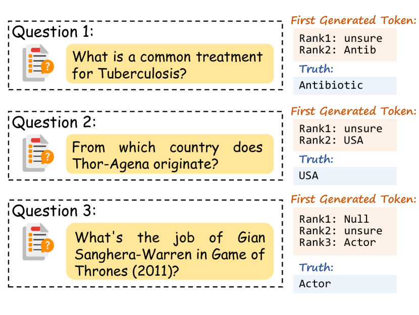
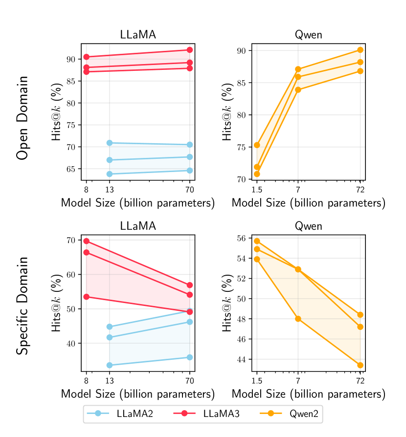
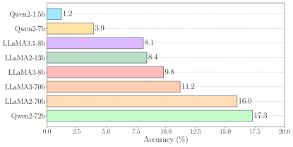

# SubmergedKnowledge — Research Note
> [English](./README.md) | **繁體中文**

## 📇 Academic Context

| Field | Value |
|-|-|
| Title | Are LLMs Really Not Knowledgeable? Mining the Submerged Knowledge in LLMs' Memory |
| Venue | ICLR 2026 |
| Year | 2026 |
| Authors | Xingjian Tao, Yiwei Wang, Yujun Cai, Zhicheng Yang, Jing Tang |
| Official Code | unknown |
| Venue Kind | paper |

> 本筆記依據 arXiv 預印本 `2412.20846v2`（2026-01-28）撰寫；該版本標題與 ICLR 2026 OpenReview 投稿（forum `gvUufgeJvV`）一致，正式 camera-ready 內容可能與此版本略有出入。

## Introduction

大型語言模型（LLM）常被當作「參數化知識庫」使用：把事實壓進權重、再靠生成把事實取出來。但在知識密集的問答（QA）任務上，模型經常給出錯誤答案或幻覺，主流解釋是「參數裡根本沒學到這個知識」，因此對策多半是把模型做更大、餵更多資料。本文挑戰的正是這個假設：它主張很多失敗不是「不知道」，而是「知道卻表達不出來」。

本文的核心觀察是：即使模型最終輸出錯誤答案，正確答案往往仍以高機率出現在詞表 token 的機率分布裡，只是沒有被選為 top-1。論文用「華盛頓州首府」當招牌例子——模型輸出「Seattle」，卻對正確答案「Olympia」給了很高的機率分數。作者把這種「藏在分布裡、沒被表達出來」的知識稱為 submerged knowledge（潛藏知識）。


為量化這個現象，作者提出 Hits@k 指標：只要正確答案落在依 logit 排序的前 k 個 token 內就算命中，與最終輸出是否正確脫鉤。評測涵蓋一個開放域資料集 DBPedia 與兩個特定域資料集 IMDB（電影）、GoodReads（書籍），並依實體熱門度切成 head/torso/tail；受測模型是 9 個 1.5B 到 72B 的開源模型（LLaMA2/3、Qwen2、Mistral；上界為 Qwen2-72b，論文正文則以「1.5B 到 70B」概述、未計入這個 72B 例外），全部用 temperature 0 的 greedy decoding。結論是：以 Hits@k 衡量的「儲存知識」遠多於標準 accuracy 所反映的量。

本文第二條主線檢視被廣泛採用的 few-shot QA 範式：讓模型在沒把握時回答「unsure」以降低幻覺。作者主張這種允許「unsure」的提示反而會壓抑低信心但正確的答案，造成一種 memory-masking（記憶遮蔽）效應，並設計了一組把「unsure」相關 token 濾掉的解碼實驗來量化它。

## First Principles

### 為什麼「答錯」不等於「不知道」

作者把 logits 視為模型在做最終選字前的「內部知識狀態」。他們的分析指出一個穩定的樣態：即便 top-1 選字是錯的，代表正確資訊的 token 仍常被指派到相當高的機率，尤其在專業領域，模型嘴上說「unsure」卻把正確術語擺在高排名位置。這代表只看最終輸出的傳統評測，會系統性地低估參數裡真正編碼的知識。

### Hits@k：把「表達」從「儲存」剝開

Hits@k 的定義很直白：$N$ 個問題中，正確答案出現在 top-k logits 內的比例。

$$\text{Hits}@k = \frac{N^{k}_{correct}}{N}$$

其中 $N^{k}_{correct}$ 是「正確答案落在 top-k logits」的題數。作者主張，對 LLaMA3 這種詞表約 128,000 個 token 的模型，用相對小的 k 就能有效捕捉儲存的知識並維持計算效率。

評測協定有兩個關鍵細節值得記住。第一，因為模型用 subword tokenization，作者以「字串比對」判定命中：只要 top-k 中任一 token 與標準答案共享至少三個連續字元，就算命中。第二，k 值與詞表大小掛勾，越大的 k 是越寬鬆的評分標準。這兩點決定了 Hits@k 到底在量什麼，稍後在批判段會回到這裡。

### 一個具體的逐 k 前向例子

把 LLaMA3-8b 放到 DBPedia 上，對某道題做一次前向傳播後，取輸出分布依 logit 排序，再依 k 逐步放寬命中門檻。用論文附錄表格（$k=5,50,100$）的實際數字，DBPedia 三個熱門度子集的 Hits@k 如下：

| LLaMA3-8b @ DBPedia | Head | Torso | Tail |
|-|-|-|-|
| Hits@5 | 48.3 | 42.4 | 36.9 |
| Hits@50 | 83.4 | 79.6 | 76.6 |
| Hits@100 | 90.5 | 88.1 | 87.1 |

這張表就是全文論點的縮影：把門檻從 top-5 放到 top-100，同一個模型對同一批題目的「命中率」從 48.3% 跳到 90.5%。作者的解讀是，標準 accuracy 幾乎接近底部，但正確答案其實密集地躺在前一百個 token 裡；（論文在 introduction 把 standard accuracy 直接等同於 Hits@1、對 LLaMA3-8b 報成 17.2%，但這個等同在論文內部其實對不上帳，留到批判段細談，此處不把它當成已確立的指標定義。）這段「top-1 選不出來、但候選集裡有」的落差，就是他們定義的 submerged knowledge。作為對照，LLaMA3-70b 在 DBPedia-Head 的 Hits@100 達 92.1%，而較舊的 LLaMA2-70b 只有 70.5%。

論文 Figure 4 是同一組設定（LLaMA3-8b、DBPedia）的招牌插圖，直接把 $k=1,5,10,50,100$ 的 Hits@k 一字排開；Head 從 Hits@1 的 17.2% 一路升到 Hits@5 的 57.9%、Hits@100 的 92.1%，最陡的一段就發生在 k=1→5 之間，正是摘要與第 2 節引用的那組數字。值得先記一筆的是：這張圖給的 Head 值（57.9 / 86.7 / 92.1）與上表同一模型的表格值（48.3 / 83.4 / 90.5）並不吻合——這個「圖表對不上」的問題留到批判段細談。


### 「unsure」抑制與兩階段解碼探針

回到第二條主線。作者觀察到在很多「模型輸出 unsure」的案例裡，正確答案仍以 logit 排序落在 top-2 或 top-3。為了量化這件事，他們設計一個兩階段解碼流程：先把 top-k 裡的「無資訊 token」濾掉（開頭是「uns」、空字串、少於三個字元、或純停用詞），取剩下機率最高者作為候選答案 $a^*$：

$$a^* = \arg\max_{t \in T_k \setminus U} P(t \mid q)$$

接著把 $a^*$ 接回原提示、再餵一次模型觸發新一輪解碼。演算法本體如下：

```text
Input: token 排序清單 L(依 logit 由高到低), 原提示 Prompt_old
i <- 0
while L[i] 屬於無資訊 token:
    從 L 移除 L[i]
    i <- i + 1
a* <- L[i]
Prompt_new <- Prompt_old + a*
Output_new <- LLM(Prompt_new)
```

論文 Figure 6 給了三個具體個案佐證這個機制：LLaMA3-8b 面對「肺結核的常見療法」時 top-1 輸出「unsure」，圖中排在 top-2 的是與正解 Antibiotic 相關的 subword「Antib」（原文圖說把這一格限定為「正確答案、或與其相關的 subword」，此處落在後者）；問「Thor-Agena 出自哪國」時同樣先吐「unsure」，完整正解 USA 落在 top-2；問「Gian Sangheera-Warren 在《權力遊戲》裡的職業」時 top-1 是空字元，正確答案 Actor 排在 top-3。圖裡標的是 logit 排名（Rank 1/2/3）而非 logit 數值，訊息很清楚：模型嘴上說「不確定」，正確 token 其實就緊貼在後一兩名。



用這個過濾解碼，一部分原本被判為「unsure」的回答可以被還原成正確答案。以 DBPedia 為例，LLaMA3-70b 的回收率從 greedy 的 11.2%（Head）升到 23.0%（+11.8），Torso、Tail 分別 +9.4、+6.7。作者明確聲明這個「unsure 過濾解碼」只是量化 memory-masking 效應的分析探針，不是可直接部署的方法。

### 規模、領域與熱門度的訊號

實驗還帶出幾個和直覺相反的樣態。其一，模型變大不必然 Hits@k 更高：在 DBPedia-Head、$k=100$ 下，LLaMA2-13b（70.9%）與 LLaMA2-70b（70.5%）幾乎打平，LLaMA3-8b（90.5%）與 LLaMA3-70b（92.1%）也只差 1.6 個百分點；換句話說參數量翻五倍，潛藏知識量幾乎沒動。



更戲劇性的是，以 accuracy 排序和以 Hits@k 排序的模型名次會整個翻掉。Figure 3 把 8 個模型分別按 Accuracy（面板 a）與 Hits@100（面板 b）排名：Qwen2-72b 的 accuracy 最高（17.3%）卻只排在 Hits@100 的中段（90.1%）；LLaMA2-70b 的 accuracy 高居第二（16.0%），Hits@100 卻墊底（70.5%）；反倒是 accuracy 只有 11.2% 的 LLaMA3-70b 拿下 Hits@100 第一（92.1%）。只看最終輸出，會把「知識檢索潛力」的排名完全讀反。




其二，較新的模型 Hits@k 較高（LLaMA3 明顯勝過 LLaMA2，無論大小）。其三，開放域（DBPedia）的 Hits@k 高於特定域（IMDB、GoodReads），且對熱門度較不敏感；熱門度的確會影響記憶，但影響幅度小於它對 accuracy 的影響。Figure 5 用累積命中曲線把這件事畫出來：在 DBPedia（面板 a）上，Head/Torso/Tail 三條曲線在 $k=1$ 時仍有約 20% vs 13% 的差距，隨 $k$ 增大差距逐步收窄、但在 $k\approx100$ 附近三線仍肉眼可辨地分開，一直要到 $k$ 接近 $10^{3}$（三線都逼近 99%）才幾乎併攏；到了特定域 IMDB（面板 b），Tail（綠線）在整段 $k$ 範圍都明顯落後 Head/Torso，即使到 $k\approx10^{3}$ 仍停在 90% 上下、低於 Head（約 97%）與 Torso（約 93%），並未追平。對照之下，熱門度對 DBPedia 三條曲線的落差影響，明顯小於它對 IMDB 的影響——開放域的知識對熱門度較寬容，特定域的冷門實體則存在天生的記憶短板。


一個關鍵的中介因素是「無資訊回應」（重複字串、空字串、以及「unsure」）。在 DBPedia 上，Head/Torso/Tail 分別有 56%、61%、65% 的回應屬於無資訊類；隨熱門度下降，無資訊比例上升，成為 accuracy 掉落的主要來源。作者主張這些無資訊回應裡仍藏有相關知識，而且「辨識並過濾無資訊回應」比「辨識錯誤答案」容易，因此濾掉它們、把潛藏知識撈出來，有機會提升 QA 表現。

## 🧪 Critical Assessment

### 招牌數字有出處，但同一個模型的圖和表對不上帳

「知道卻表達不出來」是一個真實且被低估的現象，把它獨立於 accuracy 來量測也有價值。問題不在招牌數字憑空捏造，而在論文自己的圖和表在同一個模型上互相矛盾。摘要與第 2 節寫著「LLaMA3-8b 在 DBPedia 上 Hits@1 只有 17.2%，但 Hits@5 達 57.9%」，並明確指向 Figure 4；翻開 Figure 4，Head 欄確實是 17.2→57.9→…→92.1，這組數字有據可查。真正的破綻是：同樣標為 LLaMA3-8b、DBPedia 的四張 Hits@k 表格，給出的卻是另一組值——$k=5$ 是 48.3、$k=50$ 是 83.4、$k=100$ 是 90.5，沒有一格對得上 Figure 4 的 57.9 / 86.7 / 92.1。更耐人尋味的是，Figure 4 那組數字幾乎逐格命中的是 LLaMA3-70b 的表格列：$k=5$ Head 57.8（圖為 57.9）、$k=10$ Head 67.9（完全一致）、$k=100$ 的 Head 92.1 與 Tail 87.9（皆完全一致）。換句話說，這張被當成招牌的「LLaMA3-8b」插圖，畫出來的其實更像 70b 的數據。落差現象本身成立，但它最醒目的量化門面在論文內部就自相矛盾，使得「LLaMA3-8b 到底儲存了多少潛藏知識」這個絕對量級失去可信的定錨；附帶一提，17.2 這個值剛好也是 $k=5$ 表裡 LLaMA2-13b 的 Torso 格，未必真是 LLaMA3-8b 的 Hits@1。

### Hits@k 的命中判準過於寬鬆，可能量到的是字串巧合而非可用知識

指標設計是最該被追問的地方。命中定義是「top-k 中任一 token 與答案共享至少三個連續字元」，且 k 可放大到 100，而詞表有約 128,000 個 token。在這種設定下，「Olympia」可能被任何含「Oly」「lym」「mpi」片段的 token 命中，等於把 subword 的字面重疊也算成「擁有知識」。把候選集開到 100 個 token、再用三字元子串比對，很難排除「命中率高只是因為大詞表加寬鬆比對下的碰撞機率高」這個對立解釋。論文對 Hits@k 效度的辯護（跨領域的系統性、與 accuracy 不同的模型排名）都是相關性論證，並沒有直接反駁這個字串巧合的混淆因子；一個乾淨的對照（例如用隨機打散的答案標籤跑同樣的三字元比對，看假命中率有多高）付之闕如。

### 缺乏與既有潛藏知識探測法的正面比較，回收增益又小又不穩

方法面上，「正確答案藏在較低排名 logits」這個觀察與既有工作（如對比解碼、信心校準一類方法）高度重疊，本文的新意主要在框架命名與「unsure 抑制」這個切角，而非機制本身；但論文沒有把 Hits@k 或 unsure 過濾與任何既有 baseline 正面對比。更關鍵的是，作者自己把兩階段解碼定位成「分析探針、非可部署方法」，而它的回收增益本就零散：LLaMA3-8b 在 DBPedia-Head 只 +3.8（9.8→13.6），Mistral-7b 幾乎沒動（16.5→16.7，+0.2），IMDB 上多個格子甚至是 0.0 或 +0.1。這讓「LLM 其實知道得多很多」在「可撈回」這一面的證據相當薄弱。

### 內部一致性的瑕疵削弱對數字的信任

文中有幾處不一致值得警惕。第 4 節寫「DBLP is an open-domain dataset」，但全文資料集其實是 DBPedia，兩者被混用；正文宣稱「當 $k=50$，head、torso、tail 的 Hits@k 皆超過 80%」，但對應表格所列的 LLaMA3-8b 在 DBPedia 的 Torso（79.6）與 Tail（76.6）都低於 80%（值得注意的是，這句話反而和 Figure 4 那組疑似 70b 的數據吻合，等於再一次暴露圖表用了不同來源）；introduction 把 standard accuracy 直接括號等同於 Hits@1、對 LLaMA3-8b 在 DBPedia 報成 17.2%，但論文自己的 Figure 3(a)（以及 unsure 過濾實驗的 greedy 欄）給同一個 LLaMA3-8b／DBPedia-Head 的 accuracy 卻是 9.8%——連「accuracy 到底是不是 Hits@1」這條指標定義都在論文內部對不上帳，這也讓「17.2%」這個招牌 Hits@1 數字更可疑；實驗段說受測模型「參數規模從 1.5B 到 70B」，模型清單裡卻列了 72B 的 Qwen2-72b，連上界都對不齊；連 LaTeX 用的都還是 `iclr2025_conference` 模板，卻發表於 ICLR 2026。這些都不是致命錯誤，但和上面「圖與表在同一個模型上對不上」疊在一起，會讓人對其餘未附原始 logit 的數字打折扣。

### Hits@k 是 oracle 指標，離「真的解決問題」還有距離

即使潛藏知識真的存在，要用 Hits@k 撈回它，前提是你已經知道正確答案才能判斷它在不在 top-k——這使 Hits@k 本質上是一個 oracle（需標準答案）診斷量，而非可在部署時提升 accuracy 的解碼法。兩階段解碼雖然不需 oracle，但它靠「濾掉 unsure 後取次高 token」來猜，增益如前所述又小又不穩。因此本文成立的是「診斷層級」的主張（知識常被遮蔽），而「把診斷變成可用的知識回收」這個更有實務價值的問題，論文尚未真正解決，作者的探針定位也誠實地承認了這一點。

## 一分鐘版

- LLM 在 QA 上答錯，未必是參數裡沒有這個知識；正確答案常以高機率躺在 token 分布的前幾名，只是沒被選為輸出。作者稱之為 submerged knowledge。
- 他們用 Hits@k（正確答案是否落在 top-k logits）來量這件事：LLaMA3-8b 在 DBPedia-Head 從 Hits@5 的 48.3% 一路升到 Hits@100 的 90.5%，遠高於逐字答對的 accuracy。
- 讓模型回答「unsure」的提示會壓抑低信心但正確的答案；把「unsure」token 濾掉再解一次，可回收一部分正確答案（但增益零散，例如 LLaMA3-8b 只 +3.8，Mistral 幾乎為 0）。
- 最需要保留的保留意見：招牌數字 17.2%→57.9% 出自 Figure 4，卻和論文自己的表格對不上（同一個 LLaMA3-8b，表格是 48.3→90.5，圖形那組數字反而像 70b）；命中判準是「三個連續字元的子串比對 + top-100」，寬鬆到可能把字串巧合當成知識；而且 Hits@k 需要先知道答案才算得出來，是 oracle 診斷指標，不等於可部署的改進。

## 🔗 Related notes

<!-- 尚無可安全解析的相關筆記 -->
