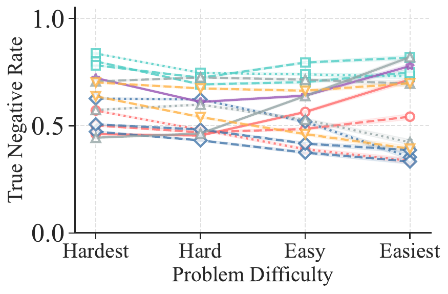
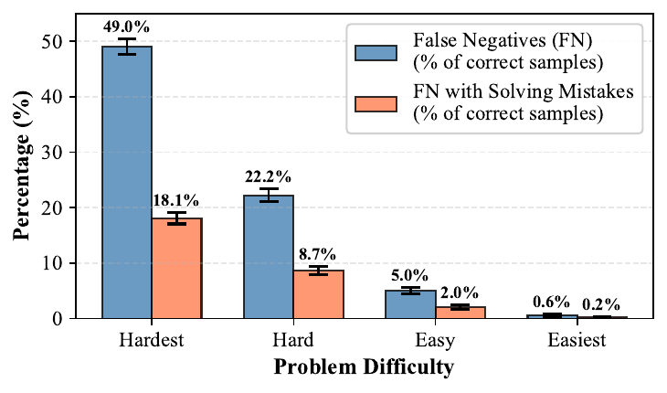
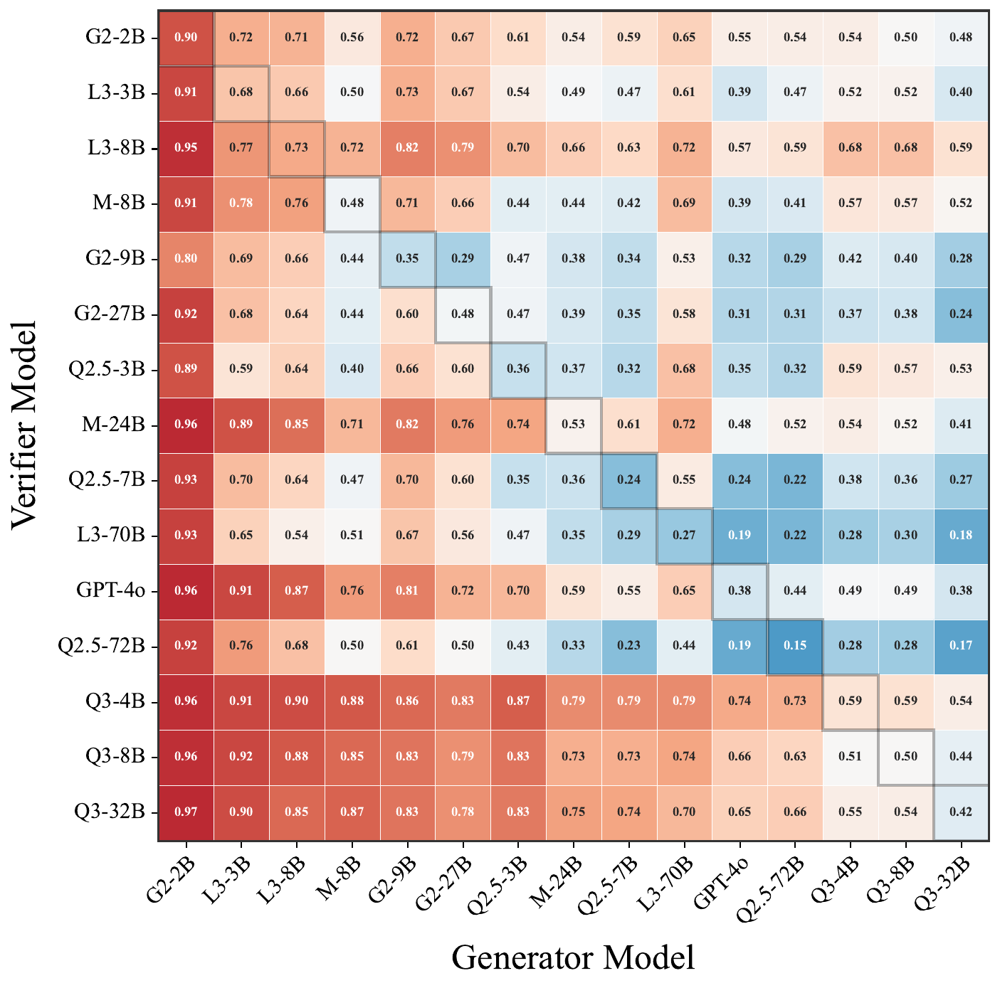
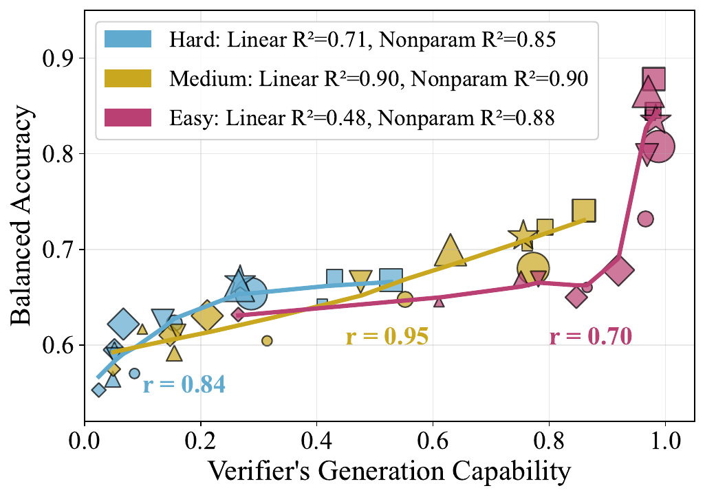
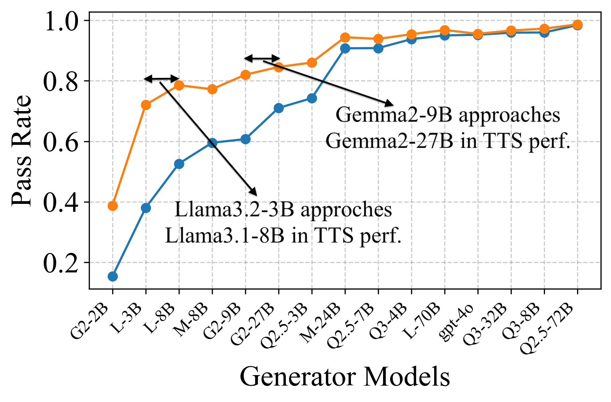

# VariationInVerification — Research Note
> **English** | [繁體中文](./README.zh-TW.md)

## 📇 Academic Context

| Field | Value |
|-|-|
| Title | Variation in Verification: Understanding Verification Dynamics in Large Language Models |
| Venue | ICLR 2026 |
| Year | 2025 |
| Authors | Yefan Zhou, Austin Xu, Yilun Zhou, Janvijay Singh, Jiang Gui, Shafiq Joty |
| Official Code | https://github.com/YefanZhou/llm-verify-dynamics |
| Venue Kind | paper |

This note is written from the arXiv full text (arXiv:2509.17995v1, cross-checked against the OpenReview ICLR 2026 version); if the final camera-ready differs from this version, defer to the official one.

## Introduction

This paper asks a very concrete deployment question: when we use an "LLM verifier" to filter candidate answers generated by another LLM, what factors decide whether verification succeeds? The paper focuses on the generative verifier — the verifier first produces a chain-of-thought (CoT) reasoning trace and then emits a binary "Correct"/"Incorrect" verdict — because this approach has been shown to outperform earlier scalar reward models. Verification is a core building block of test-time scaling (TTS): first let the generator sample multiple solutions, then use the verifier to filter out the wrong ones and keep the correct ones, thereby trading inference compute for accuracy.

Why does the problem matter? Current industry practice is to directly call the strongest closed-source frontier model as the verifier, on the assumption that "verification quality scales proportionally with the verifier's own problem-solving ability (generation capability)." But this assumption need not hold: verifying a solution is usually easier than generating one from scratch — this is the so-called verification asymmetry (just as factoring a number is hard, but checking whether a set of factors multiplies back correctly is easy). If verification really is easier than generation, then blindly stacking the largest verifier may be a waste of compute. The paper's central question is therefore: what factors influence verification success?

The paper's high-level approach is to decompose verification into three controllable dimensions and measure them systematically: problem difficulty, generator capability, and verifier generation capability. It does not claim a new method; it performs a large-scale empirical dissection and feeds the findings back into model selection for TTS.

How is success measured? Across three domains and 12 benchmarks, the authors run experiments with 14 open-source models (2B to 72B) plus GPT-4o, covering mathematical reasoning, knowledge QA, and natural language inference. The core metrics are the verifier's acceptance rate of correct solutions (true positive rate, TPR) and its rejection rate of incorrect solutions (true negative rate, TNR), together with the "verification gain" measured in the TTS setting. Below we first reconstruct the mechanism and measurement definitions, then walk through the derivation of the real numbers.

## First Principles

### Measurement skeleton: pass rate, difficulty, TPR/TNR

The whole analysis rests on four definitions. First, quantify "problem-solving ability" as pass rate: for a problem $x$ and a generator $G$, the probability of a single sample being correct is $p_G(x)$, and averaging over a dataset $\mathcal{D}$ gives the model's overall generation capability. In practice, each model–problem pair samples $K=64$ responses at temperature 0.7 to estimate it.

$$
p_G(x) = \Pr[a(r) = y^*(x) \mid r \sim G(\cdot \mid x)], \qquad p_G(\mathcal{D}) = \frac{1}{|\mathcal{D}|} \sum_{x \in \mathcal{D}} p_G(x)
$$

Second, problem difficulty $d(x)$ is defined as "the average pass rate across a group of different generators." This is deliberately made model-agnostic: if most generators can solve it, $d(x)$ is high (easy problem), and vice versa (hard problem). This is more robust than prior work that defined difficulty relative to a single generator.

$$
d(x) = \frac{1}{|\mathcal{G}|} \sum_{G \in \mathcal{G}} \hat{p}_G(x)
$$

Third, verification quality is split into two independent rates: TPR is the probability that the verifier "accepts a correct solution," TNR is the probability that it "rejects an incorrect solution," and their average gives balanced accuracy. Keeping TPR and TNR separate is the single most crucial methodological choice in the paper — later we find that the three dimensions each strike different rates, and looking only at one blended accuracy would wash out the signal. If the verifier output is invalid (e.g., the CoT is truncated for being too long), it is recorded as $V(x,r)=0.5$.

$$
\mathrm{TPR} = \mathbb{E}[V(x,r) \mid a(r) = y^*(x)], \quad \mathrm{TNR} = \mathbb{E}[1 - V(x,r) \mid a(r) \neq y^*(x)], \quad \mathrm{Acc}_{\mathrm{bal}} = \tfrac{1}{2}(\mathrm{TPR} + \mathrm{TNR})
$$

Fourth, connect verification to TTS: for each problem, sample $K=64$ candidates, keep only those judged "Correct," and measure the conditional accuracy of the retained pool $\hat{p}_{G,V}(\mathcal{D})$; the difference relative to the un-verified $\hat{p}_G(\mathcal{D})$ is the verification gain $\Delta \hat{p}_V$. If the verifier rejects all candidates ($K'=0$), it falls back to the un-verified pass rate.

$$
\hat{p}_{G,V}(\mathcal{D}) = \frac{1}{|\mathcal{D}|} \sum_{x \in \mathcal{D}} \left( \frac{1}{K'} \sum_{i=1}^{K} \mathbf{1}(a(r_i) = y^*(x)) \cdot V(x, r_i) \right), \qquad \Delta \hat{p}_V = \hat{p}_{G,V}(\mathcal{D}) - \hat{p}_G(\mathcal{D})
$$

The experimental scale is in the table below. Each model serves as both generator and verifier, forming a 15×15 pairing matrix; in verification evaluation, each problem subsamples 8 responses (balanced 4-against-4 as far as possible), and the verifier uses greedy decoding.

| Domain | # Problems | Representative benchmarks |
|-|-|-|
| Mathematical Reasoning | 2,347 | GSM8K, MATH500, OlympiadBench, AIME24/25, AMC23, Minerva-Math, BBEH |
| Knowledge | 1,196 | MMLU-Pro (10% sampled from each of 14 subjects) |
| NL Reasoning | 901 | ReClor, FOLIO, GPQA Diamond |

### RQ1: Problem difficulty mainly decides "recognizing the correct solution"

Cut the problems into quartiles by $d(x)$ (easiest→hardest) and observe the TPR and TNR of each group. The result is very clean: TPR rises steadily as the problem gets easier, but TNR shows no consistent relationship with difficulty. In other words, difficulty mainly affects the verifier's sensitivity to correct solutions, not its ability to catch errors.

What is the mechanism? Case analysis shows that during verification the verifier first computes a reference answer of its own to compare against; the harder the problem, the more likely this self-computed reference answer is wrong, so it misjudges an originally correct solution as wrong (false negative, FN), dragging down TPR. The authors use LLM-as-judge to annotate at scale whether the verification CoT contains a "solving error" to support this point.

Concrete numbers: in the hardest group, 49.0% of correct samples are misjudged as FN, of which 18.1% (of all correct samples) have a verification CoT containing a solving error; in the hard group these are 22.2% and 8.7%. The paper reports on the un-rounded raw data: in the hard group, 39.1% of the FNs stem from the verifier computing the reference answer wrong itself (the 8.7% and 22.2% bar values in the figure are rounded, so dividing them directly is only an approximation). In other words, faulty reference generation is an important driver of FN, but not the majority.

### RQ2: Generator capability mainly decides "whether errors get caught"

Look at TNR in isolation: pair the 15 verifiers (rows) with the 15 generators (columns), with columns sorted by generation capability from weak to strong. The heatmap goes from red on the left to blue on the right, meaning the stronger the generator, the harder TNR drops; the TPR half, on the other hand, is almost all red (mostly >0.7) and only rises slightly as the generator gets stronger.

Walk through a real number: with Qwen2.5-72B as the verifier, its TNR on incorrect solutions produced by Llama-3.1-8B (a weak generator) is 0.68, but facing incorrect solutions from Qwen3-32B (a strong generator), TNR drops to only 0.17. Mechanistically, a strong generator's errors are beautiful reasoning chains that are "internally self-consistent but built on a wrong premise" — an early small mistake propagates coherently throughout, reads plausibly but is wrong, and the verifier is easily fooled into a false positive; a weak generator, in contrast, often has surface-level errors like self-contradiction that are easy to catch. The authors annotate the "surface-level error rate" with LLM-as-judge as support: the stronger the generator, the fewer the surface-level errors.

### RQ3: The relationship between verifier capability and accuracy switches form with difficulty

When averaging over all problems, the verifier's generation capability and balanced accuracy exhibit a beautiful positive correlation, nearly linear — this reproduces prior conclusions. But once stratified by difficulty, a highly nonlinear phase transition emerges. The authors fit a nonparametric curve with locally weighted regression (bandwidth 0.6) and then compare the $R^2$ and Pearson $r$ of the linear versus nonparametric fits.

The fitted values for three representative intervals (math domain) are summarized below. In the medium interval, the linear and nonparametric $R^2$ are almost identical (both 0.90) with $r=0.95$ — a clean linear relationship; for hard and easy, the nonparametric $R^2$ is markedly higher than the linear one with $r<0.85$, indicating nonlinearity. In the hard interval, math accuracy rises initially and then saturates around 0.65; in the easy interval, a threshold effect appears at $x\approx0.9$ (below the threshold it is linear, above it a small capability increase buys a large verification gain). The most striking counterexample is hard NL Reasoning: the verifier is even below random accuracy, and the $R^2$ of both fits is near zero, meaning capability and accuracy have no relationship at all.

| Difficulty interval (math) | Pearson $r$ | Linear $R^2$ | Nonparametric $R^2$ | Form |
|-|-|-|-|-|
| hard $[0.1,0.3)$ | 0.84 | 0.71 | 0.85 | nonlinear, early saturation |
| medium $[0.4,0.5)$ | 0.95 | 0.90 | 0.90 | linear |
| easy $[0.8,0.9)$ | 0.70 | 0.48 | 0.88 | threshold-style nonlinear |

### RQ4/RQ5: Two operational conclusions feeding the findings back to TTS

The first application (RQ4): fix a strong verifier (GPT-4o) and vary the generator from weak to strong. The verification gain peaks in the "weak–medium" generator range, because this segment can simultaneously maintain a high TNR (effectively filtering errors) and a still-acceptable TPR (preserving correct solutions); once the generator is too strong, errors become hard to catch, TNR collapses, and the gain vanishes.

![Mechanism decomposition (math): the gray bar is the verification gain $\Delta \hat{p}_V$ (left axis), generators arranged from weak to strong, with the gain peaking around 0.33–0.34 in the weak–medium segment (e.g., L-3B) and dropping to nearly zero for strong generators. The two lines on the right axis diverge: TPR rises from about 0.55 to nearly 1.0 as the generator gets stronger, while TNR collapses from about 0.9 to about 0.24 — the gain peak falls exactly in the crossover band where TNR is still high and TPR is still acceptable.](imgs/tts_gain_math.png)

A concrete case: on a subset of 181 problems in the difficulty interval $[0.7,0.8)$, Gemma2-9B's starting pass rate is far below Gemma2-27B's, but after both are verified by the same GPT-4o, the gap shrinks from 10.3% to 2.5% — equivalent to erasing 75.7% of the original gap. This suggests that "weak generator + strong verifier" can be a cost-saving stand-in for a strong generator.

The second application (RQ5): conversely, fix the verifier and compare the gain gap between a strong (GPT-4o) and a weak (Qwen2.5-7B) verifier. The conclusion comes with a clear caveat — the gap shrinks only at "the two extremes of problem difficulty" and when "the generator is very strong," but these are precisely the regions where the overall verification gain already approaches below 0.1 and verification is nearly useless. In other words, scaling the verifier from 7B up to GPT-4o has value only in the mid-range difficulty where it is truly needed; in the places where it looks "as good as the weak verifier," it is actually that neither can help. Verifier scaling by itself cannot cross this fundamental verification bottleneck.

![The gain gap of the strong (GPT-4o) minus weak (Qwen2.5-7B) verifier (y-axis) against problem difficulty (x-axis, from hardest to easiest), with three lines corresponding to weak/medium/strong generators. The weak and medium generators form an inverted-U, peaking around 0.15–0.17 at mid-range difficulty; the line for the strong generator stays below 0.08 throughout. The gap converges to near 0 at the difficulty extremes and with strong generators — precisely the regions where the overall gain is already ≤0.1 and verification is nearly useless.](imgs/verifier_comparison_gain_gap.png)

## 🧪 Critical Assessment

### Is the problem real and important

This problem is real. Treating "using a strong frontier model as the verifier" as the default practice is indeed widespread, and the paper uses verification asymmetry to question this default and uses large-scale empirical evidence to decompose "verification success" into two separable signals, TPR and TNR; this decomposition itself has explanatory power: it surfaces the structure that "difficulty strikes TPR, the generator strikes TNR," which was originally masked by blended accuracy. For those doing model selection for TTS systems, this is a directly actionable insight, not a vague conclusion.

### Are the baselines, ablations, data, and metrics sufficient

The coverage is quite solid: 15 models across four families, three domains, 12 benchmarks, with robustness checks done using oracle and label-free difficulty estimates, the large Qwen3-235B model, different verification prompts, and reasoning models — these ablations reduce the concern that "the conclusion is just an accident of some particular setting." But two metric choices are questionable. First, balanced accuracy weights TPR and TNR equally, yet the paper itself proves the two are driven by different factors, and equal-weight averaging is not necessarily the right objective function under real deployments with different class priors. Second, the TTS gain uses the "expected pass rate of the retained pool" rather than the common majority-vote / best-of-N approach of selecting a single answer; the authors admit this differs from the mainstream TTS setting — the upside is that it is independent of the selection strategy, the downside is that this gain curve cannot map directly to the accuracy of "picking one answer to submit" in practice, so readers should be careful not to over-extrapolate.

### Is it real innovation or repackaging

To be honest, this is an "analysis" paper rather than a "method" paper; it proposes no new verifier or training method. Its core contribution is refining the prior-known "verifier capability ↔ verification quality positive correlation" into a difficulty-dependent stratified structure, and adding the two dimensions of problem difficulty and generator capability. This increment is genuine and mechanistically supported (self-computed reference answers going wrong, strong generators having fewer surface-level errors), and is not just relabeling to pad it out. But note that difficulty $d(x)$ is self-defined using "the average pass rate of this batch of generators" — difficulty, generator capability, and verifier capability are all built on the same set of pass rates and are not independent variables of one another, so the stratified conclusions carry some of this circular-definition endogeneity, a coupling the authors do not discuss enough.

### Is the problem really solved, and its connection to the real world

The paper honestly states its case in full: it does not claim to have "solved verification"; on the contrary, it points out that verifier scaling cannot break the fundamental bottleneck at the difficulty extremes and under strong-generator conditions — this "negative but useful" conclusion is more credible than falsely reporting SOTA. Nor is the cost issue skipped over: beyond a token-consumption case study in the appendix (the same GPT-4o consumes on average only 193 tokens per problem as a verifier but 483 tokens as a generator, about 2.5× less), the appendix also uses inference FLOPs ($2ND$, summing the FLOPs of the generator and the verifier, then stratified by difficulty) in RQ4.1/RQ5.1 to do a systematic compute–accuracy trade-off analysis, and directly uses verification metrics to pick compute-efficient model combinations. What really deserves scrutiny is the assumptions of this FLOPs proxy measurement: $N$ is taken directly as the parameter count stated in the model name, and GPT-4o's effective parameter count is even hard-estimated at 100B (the authors admit this is only for relative comparison), while $2ND$ ignores real serving costs such as memory bandwidth, batching, MoE sparsity, and API pricing that need not be linear in FLOPs. So "weak generator + strong verifier is cheaper" holds on the paper's own FLOPs ledger, but once converted to actual per-dollar deployment cost, the boundary of this conclusion still depends on whether the above proxy assumptions are close to reality. In addition, all experiments are limited to verifiable problem types with objective ground truth, and the authors admit that generalization to open-ended generation is a belief rather than evidence.

## One-minute version

- Verification quality cannot be judged by a single blended accuracy; you must separate "accepting correct solutions" (TPR) from "rejecting incorrect solutions" (TNR), because the two are driven by different factors. The most direct evidence: the harder the problem, the more easily correct solutions get killed off — in the hardest group, 49.0% of correct samples are misjudged as false negatives.
- The stronger the generator, the more its incorrect solutions look like beautiful reasoning that is "self-consistent all the way but built on a wrong premise," and the harder they are to catch. The same Qwen2.5-72B verifier has a TNR of 0.68 on incorrect solutions from the weak generator Llama-3.1-8B, but drops to only 0.17 facing the strong generator Qwen3-32B.
- "Weak generator + strong verifier" can be a cost-saving stand-in for a strong generator: after Gemma2-9B is paired with GPT-4o verification, its gap with Gemma2-27B shrinks from 10.3% to 2.5%, erasing 75.7%.
- The paper actually does compute this efficiency ledger: it uses inference FLOPs to sum the generator's and verifier's compute, stratified by difficulty, for a systematic trade-off analysis, and the token case also shows GPT-4o as a verifier (193 tokens) is about 2.5× cheaper than as a generator (483 tokens). The real blind spot is in the proxy assumptions — the FLOPs hard-estimate GPT-4o's effective parameters at 100B and also ignore that API pricing and serving cost need not be linear in FLOPs; so "weak generator + strong verifier is cheaper" holds on the paper's ledger, but the boundary once converted to real per-dollar cost still depends on these assumptions.

## 🔗 Related notes

- [ScalingTestTimeCompute](../ScalingTestTimeCompute/)
- [Agent-as-a-Judge](../Agent-as-a-Judge/)
- [LLMEvaluatorForGEC](../LLMEvaluatorForGEC/)
