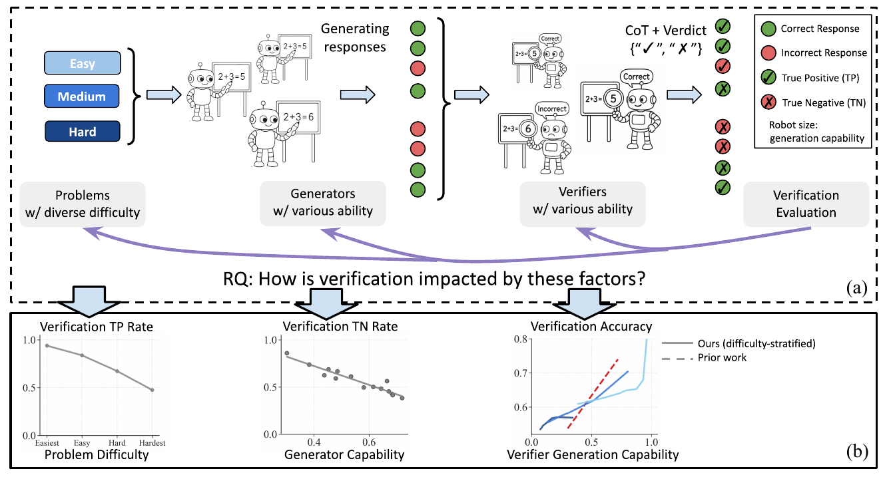
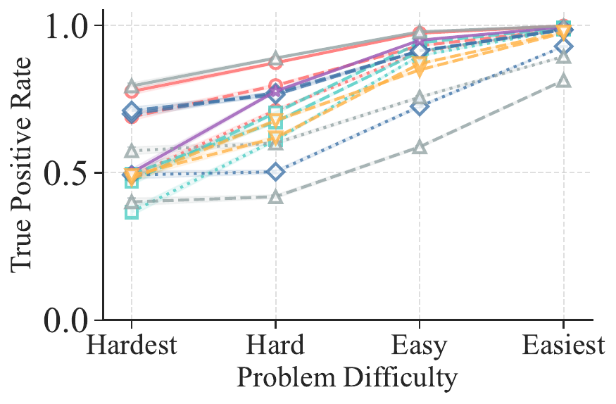
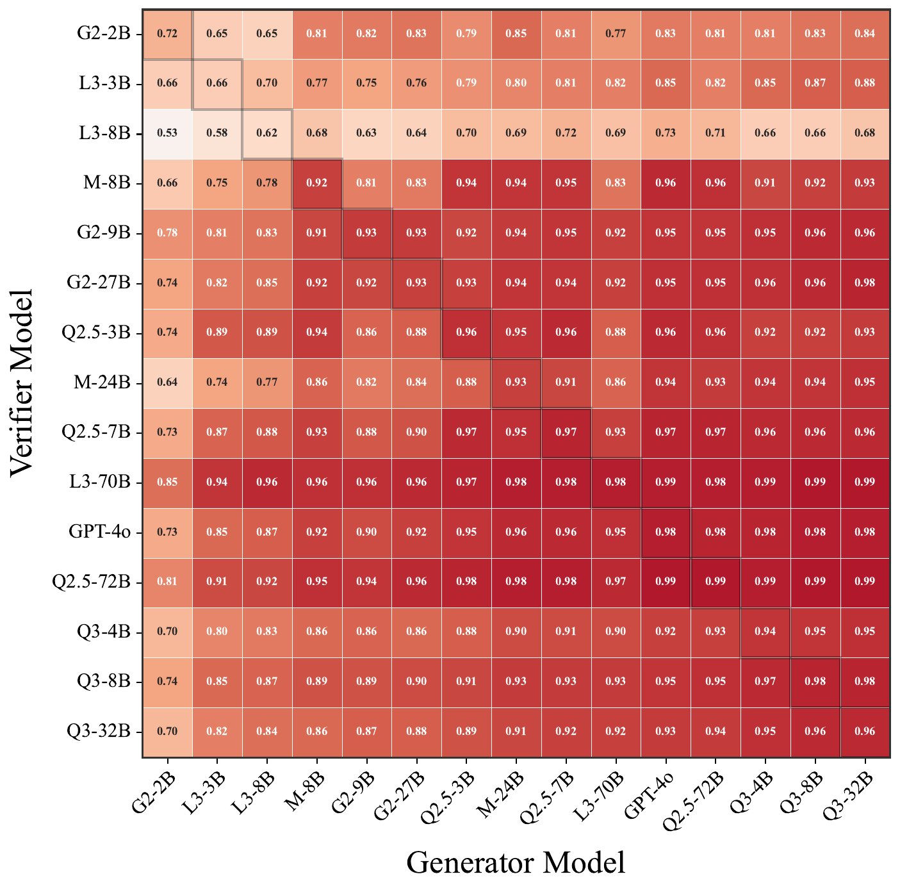
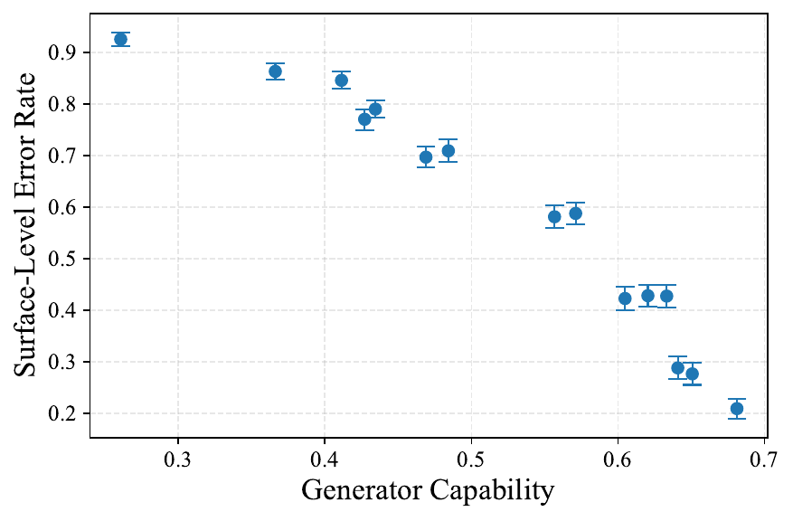
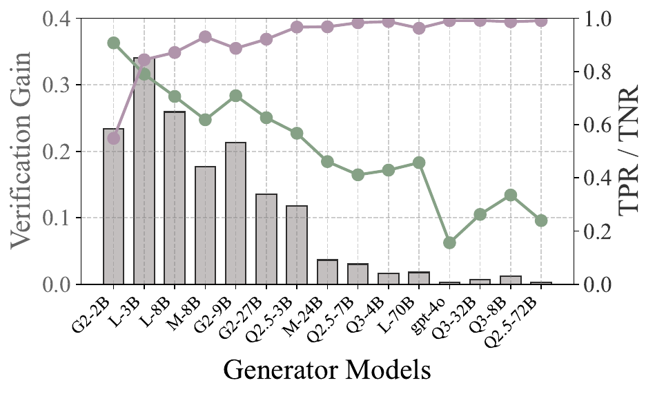
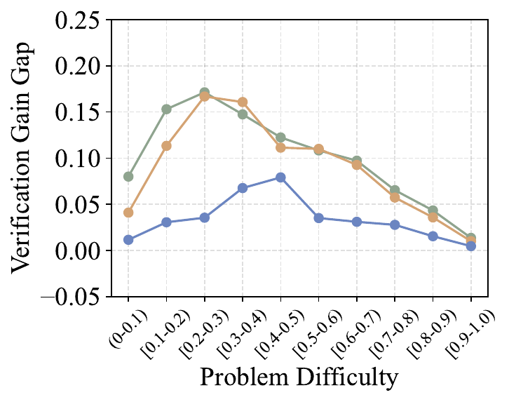

# VariationInVerification — Research Note
> [English](./README.md) | **繁體中文**

## 📇 Academic Context

| Field | Value |
|-|-|
| Title | Variation in Verification: Understanding Verification Dynamics in Large Language Models |
| Venue | ICLR 2026 |
| Year | 2025 |
| Authors | Yefan Zhou, Austin Xu, Yilun Zhou, Janvijay Singh, Jiang Gui, Shafiq Joty |
| Official Code | https://github.com/YefanZhou/llm-verify-dynamics |
| Venue Kind | paper |

本筆記依據 arXiv 全文（arXiv:2509.17995v1，並比對 OpenReview ICLR 2026 版本）撰寫；若最終 camera-ready 與此版本有出入，以正式版為準。

## Introduction

這篇論文問的是一個很具體的部署問題：當我們用「LLM 驗證器」（verifier）去篩選另一個 LLM 生成的候選答案時，什麼因素決定驗證會不會成功？論文聚焦在 generative verifier——驗證器先產生一段 chain-of-thought (CoT) 推理，再吐出 "Correct"/"Incorrect" 的二元判決——因為這種做法已被證實優於早期的 scalar reward model。驗證是 test-time scaling (TTS) 的核心零件：先讓 generator 抽樣多個解，再用 verifier 過濾錯誤、留下正確解，藉此把推論算力換成準確率。

問題為什麼重要？目前業界慣例是直接調用最強的閉源前沿模型當驗證器，背後假設是「驗證品質會隨著驗證器自己解題能力（generation capability）等比提升」。但這假設未必成立：驗證一個解通常比從零生成一個解容易，也就是所謂的 verification asymmetry（就像質因數分解很難、但驗證一組因數乘起來對不對很容易）。如果驗證真的比生成容易，那盲目堆最大的驗證器可能是算力的浪費。論文的中心問句因此是：what factors influence verification success？

論文的高階解法是把驗證拆成三個可控維度來系統性測量：problem difficulty（問題難度）、generator capability（生成器能力）、以及 verifier generation capability（驗證器自身解題能力）。它不主張新方法，而是做一份大規模的實證解剖，並把發現回饋到 TTS 的模型選型。

如何衡量成功？作者在三個領域、12 個 benchmark 上，用 14 個開源模型（2B 到 72B）加上 GPT-4o 做實驗，涵蓋數學推理、知識問答、與自然語言推理。核心指標是驗證器對正確解的接受率（true positive rate, TPR）與對錯誤解的拒絕率（true negative rate, TNR），並在 TTS 場景下量測「驗證增益」。以下先重建機制與量測定義，再走一遍真實數字的推導。

## First Principles

### 量測骨架：pass rate、難度、TPR/TNR

整套分析建立在四個定義上。第一，把「解題能力」量化成 pass rate：對問題 $x$ 與生成器 $G$，單次抽樣答對的機率為 $p_G(x)$，在資料集 $\mathcal{D}$ 上平均即為模型的整體生成能力。實作上每個 model–problem 對抽 $K=64$ 個回應、溫度 0.7 來估計。

$$
p_G(x) = \Pr[a(r) = y^*(x) \mid r \sim G(\cdot \mid x)], \qquad p_G(\mathcal{D}) = \frac{1}{|\mathcal{D}|} \sum_{x \in \mathcal{D}} p_G(x)
$$

第二，問題難度 $d(x)$ 定義成「一群不同生成器的平均 pass rate」。這是刻意做成 model-agnostic 的：如果多數生成器都解得出來，$d(x)$ 高（簡單題），反之則低（難題）。這比前人用單一 generator 相對定義難度更穩健。

$$
d(x) = \frac{1}{|\mathcal{G}|} \sum_{G \in \mathcal{G}} \hat{p}_G(x)
$$

第三，驗證品質拆成兩個獨立的率：TPR 是驗證器「接受正確解」的機率，TNR 是「拒絕錯誤解」的機率，兩者平均得到 balanced accuracy。把 TPR 和 TNR 分開看是全篇最關鍵的方法選擇——後面會發現三個維度分別打在不同的率上，若只看一個混合準確率就會把訊號洗掉。若驗證器輸出無效（例如 CoT 超長截斷），則記為 $V(x,r)=0.5$。

$$
\mathrm{TPR} = \mathbb{E}[V(x,r) \mid a(r) = y^*(x)], \quad \mathrm{TNR} = \mathbb{E}[1 - V(x,r) \mid a(r) \neq y^*(x)], \quad \mathrm{Acc}_{\mathrm{bal}} = \tfrac{1}{2}(\mathrm{TPR} + \mathrm{TNR})
$$

第四，把驗證接到 TTS：對每題抽 $K=64$ 個候選，只保留被判 "Correct" 的，量測保留池的條件正確率 $\hat{p}_{G,V}(\mathcal{D})$；相對於不驗證時的 $\hat{p}_G(\mathcal{D})$ 之差就是 verification gain $\Delta \hat{p}_V$。若驗證器把全部候選都拒絕（$K'=0$），則退回未驗證的 pass rate。

$$
\hat{p}_{G,V}(\mathcal{D}) = \frac{1}{|\mathcal{D}|} \sum_{x \in \mathcal{D}} \left( \frac{1}{K'} \sum_{i=1}^{K} \mathbf{1}(a(r_i) = y^*(x)) \cdot V(x, r_i) \right), \qquad \Delta \hat{p}_V = \hat{p}_{G,V}(\mathcal{D}) - \hat{p}_G(\mathcal{D})
$$

實驗規模如下表。每個模型同時當 generator 與 verifier，形成 15×15 的配對矩陣；驗證評估時每題子抽 8 個回應（盡量 4 對 4 平衡），驗證器用 greedy decoding。

| 領域 | 問題數 | 代表 benchmark |
|-|-|-|
| Mathematical Reasoning | 2,347 | GSM8K, MATH500, OlympiadBench, AIME24/25, AMC23, Minerva-Math, BBEH |
| Knowledge | 1,196 | MMLU-Pro（14 學科各抽 10%） |
| NL Reasoning | 901 | ReClor, FOLIO, GPQA Diamond |

### RQ1：問題難度主要決定「認得出正確解」

把問題按 $d(x)$ 切成四等分（easiest→hardest），觀察每一組的 TPR 與 TNR。結果很乾淨：TPR 隨問題變簡單而穩定上升，TNR 卻看不出與難度的一致關係。換句話說，難度主要影響驗證器對正確解的敏感度，而不影響它抓錯的能力。

機制是什麼？案例分析顯示驗證器在驗證時會自己先算一個參考答案來比對；問題越難，這個自算的參考答案越容易算錯，於是把本來正確的解誤判成錯（false negative, FN），拉低 TPR。作者用 LLM-as-judge 大規模標注驗證 CoT 是否含「解題錯誤」來佐證這點。

具體數字：在最難（hardest）組，正確樣本中有 49.0% 被誤判為 FN，其中 18.1%（佔全部正確樣本）的驗證 CoT 含解題錯誤；到 hard 組則是 22.2% 與 8.7%。論文以未四捨五入的原始資料報告：在 hard 組有 39.1% 的 FN 源自驗證器自己把參考答案算錯（圖上 8.7% 與 22.2% 為四捨五入後的柱值，直接相除只是近似）。換言之，faulty reference generation 是 FN 的一個重要驅動因素，但並非多數。

### RQ2：生成器能力主要決定「抓不抓得到錯誤」

固定看 TNR：把 15 個 verifier（列）配 15 個 generator（欄），欄依生成能力由弱到強排序。熱圖從左紅到右藍，代表 generator 越強、TNR 掉得越兇；TPR 那半邊則幾乎全紅（多數 >0.7），只隨 generator 變強而微升。

走一個真實數字：以 Qwen2.5-72B 當 verifier，它對 Llama-3.1-8B（弱生成器）產生的錯誤解 TNR 有 0.68，但面對 Qwen3-32B（強生成器）的錯誤解，TNR 掉到只剩 0.17。機制上，強生成器的錯誤是「內部自洽但前提就錯」的漂亮推理鏈，早期小失誤一路連貫傳播，讀起來合理卻是錯的，驗證器容易被騙成 false positive；弱生成器則常是自相矛盾等表層錯誤，容易被抓。作者以 LLM-as-judge 標注「表層錯誤率」佐證：生成器越強、表層錯誤越少。

### RQ3：驗證器能力與準確率的關係，隨難度切換形態

把所有題平均時，verifier 的生成能力與 balanced accuracy 呈現漂亮的正相關、近乎線性——這重現了前人結論。但一旦按難度分層，就冒出高度非線性的相位轉變。作者用 locally weighted regression（bandwidth 0.6）擬合非參數曲線，再比較線性與非參數的 $R^2$ 與 Pearson $r$。

三個代表區間（數學領域）的擬合值整理如下。medium 區間線性與非參數 $R^2$ 幾乎相同（皆 0.90）、$r=0.95$，是乾淨的線性；hard 與 easy 則非參數 $R^2$ 明顯高於線性、$r<0.85$，代表非線性。hard 區間數學準確率在初期上升後約在 0.65 附近飽和；easy 區間則在 $x\approx0.9$ 出現門檻效應（低於門檻線性、高於門檻小幅能力提升換來大幅驗證增益）。最刺眼的反例是 hard 的 NL Reasoning：驗證器甚至低於隨機準確率，兩種擬合的 $R^2$ 都近乎零，代表能力與準確率毫無關係。

| 難度區間（數學） | Pearson $r$ | 線性 $R^2$ | 非參數 $R^2$ | 形態 |
|-|-|-|-|-|
| hard $[0.1,0.3)$ | 0.84 | 0.71 | 0.85 | 非線性、早飽和 |
| medium $[0.4,0.5)$ | 0.95 | 0.90 | 0.90 | 線性 |
| easy $[0.8,0.9)$ | 0.70 | 0.48 | 0.88 | 門檻式非線性 |

### RQ4/RQ5：把發現接回 TTS 的兩個操作結論

第一個應用（RQ4）：固定用強 verifier（GPT-4o），讓 generator 由弱到強變動。verification gain 在「弱—中等」生成器達到峰值，因為這一段能同時維持高 TNR（有效濾錯）與尚可的 TPR（保住正確解）；生成器一旦太強，錯誤變難抓、TNR 崩、增益消失。

一個具體案例：在難度 $[0.7,0.8)$、共 181 題的子集上，Gemma2-9B 起點的 pass rate 遠低於 Gemma2-27B，但兩者都配同一個 GPT-4o 驗證後，差距從 10.3% 縮到 2.5%，等於抹平了 75.7% 的原始落差。這暗示「弱生成器 + 強驗證器」可以是強生成器的省成本替身。

第二個應用（RQ5）：反過來固定看 verifier，比較強（GPT-4o）與弱（Qwen2.5-7B）驗證器的增益差距。結論帶著明顯的警訊——差距只在「問題難度的兩個極端」以及「生成器很強」時縮小，但這些正是驗證整體增益本來就趨近 0.1 以下、驗證幾乎沒用的區域。換言之，把驗證器從 7B 放大到 GPT-4o，在真正需要它的中段難度才有價值；在它看似「和弱驗證器一樣好」的地方，其實是兩者都幫不上忙。verifier scaling 本身無法跨越這道根本的驗證瓶頸。

## 🧪 Critical Assessment

### 問題是不是真的、重不重要

這個問題是真實的。把「用強前沿模型當驗證器」當成預設做法確實普遍，而論文用 verification asymmetry 質疑此預設、並用大規模實證把「驗證成功」拆成 TPR/TNR 兩條可分離的訊號，這個拆法本身就有解釋力：它讓「難度打 TPR、生成器打 TNR」這種原本被混合準確率蓋掉的結構浮現出來。對做 TTS 系統選型的人，這是可直接操作的洞見，不是空泛結論。

### baseline、消融、資料與指標是否夠

覆蓋面相當紮實：15 個模型跨四個家族、三個領域、12 個 benchmark，並用 oracle 與 label-free 難度估計、Qwen3-235B 大模型、不同驗證 prompt、reasoning model 各做了 robustness 檢查，這些消融降低了「結論只是某個設定的偶然」的疑慮。但有兩個指標選擇值得存疑。其一，balanced accuracy 把 TPR 與 TNR 等權平均，然而論文自己證明這兩者受不同因素驅動，等權平均在類別先驗不同的真實部署下未必是對的目標函數。其二，TTS 的 gain 用「保留池的期望 pass rate」而非常見的 majority-vote / best-of-N 選單一答案，作者坦承這與主流 TTS 設定不同——好處是無關選擇策略，壞處是這條 gain 曲線不能直接對應到實務上「選一個答案交出去」的準確率，讀者要小心別過度外推。

### 是真創新還是重新包裝

誠實地說，這是一篇「分析型」而非「方法型」論文，沒有提出新的驗證器或訓練法；核心貢獻是把前人已知的「驗證器能力↔驗證品質正相關」細化成難度相依的分層結構，並補上 problem difficulty 與 generator capability 兩個維度。這個增量是真的、也有機制佐證（自算參考答案出錯、強生成器表層錯誤變少），不算換名詞充數。但要注意難度 $d(x)$ 是用「這批生成器的平均 pass rate」自我定義的——難度、生成器能力、驗證器能力三者都建立在同一組 pass rate 上，彼此並非獨立變數，分層結論多少帶有這種循環定義的內生性，作者未充分討論這層耦合。

### 問題真的解決了嗎、與真實世界的關聯

論文誠實地把話說完整：它不是宣稱「解決了驗證」，反而點出 verifier scaling 在難度兩極與強生成器情境下無法突破根本瓶頸，這種「負面但有用」的結論比虛報 SOTA 更可信。成本問題也並非略而不談：附錄除了一個 token 消耗案例研究（同樣的 GPT-4o，當驗證器每題平均只吃 193 tokens、當生成器卻要 483 tokens，約 2.5× 省用量）之外，還在 RQ4.1／RQ5.1 用 inference FLOPs（$2ND$，把 generator 與 verifier 的 FLOPs 相加、再依難度分層）做了系統性的算力—準確率取捨分析，並直接用驗證指標去挑 compute-efficient 的模型組合。真正該存疑的是這套 FLOPs 代理量測的假設：$N$ 直接取模型名稱標示的參數量，GPT-4o 的有效參數更是硬估為 100B（作者自承這只用於相對比較），而 $2ND$ 忽略了記憶體頻寬、批次化、MoE 稀疏度、以及 API 計價未必隨 FLOPs 線性等真實服務成本。因此「弱生成器 + 強驗證器更省」在論文自己的 FLOPs 帳上成立，但換算成實際部署的每元成本時，這個結論的邊界仍取決於上述代理假設是否貼近現實。此外全部實驗限於有客觀 ground-truth 的可驗證題型，作者自承推廣到開放式生成只是信念而非證據。

## 一分鐘版

- 驗證品質不能只看一個混合準確率，要把「接受正確解」（TPR）和「拒絕錯誤解」（TNR）拆開看，因為兩者被不同因素驅動。最直接的證據：問題越難，正確解越容易被誤殺——最難組的正確樣本裡有 49.0% 被誤判成 false negative。
- 生成器越強，它產生的錯誤解越像「一路自洽卻前提就錯」的漂亮推理，越難被抓。同一個 Qwen2.5-72B 驗證器，面對弱生成器 Llama-3.1-8B 的錯誤解 TNR 有 0.68，面對強生成器 Qwen3-32B 卻掉到只剩 0.17。
- 「弱生成器 + 強驗證器」可以是強生成器的省成本替身：Gemma2-9B 配 GPT-4o 驗證後，與 Gemma2-27B 的落差從 10.3% 縮到 2.5%，抹平了 75.7%。
- 這筆效率帳論文其實有算：它用 inference FLOPs 把 generator 與 verifier 的算力相加、依難度分層做了系統性取捨分析，token 案例也顯示 GPT-4o 當驗證器（193 tokens）比當生成器（483 tokens）省約 2.5×。真正的盲區在代理假設——FLOPs 把 GPT-4o 有效參數硬估為 100B、也忽略了 API 計價與服務成本未必隨 FLOPs 線性；因此「弱生成器 + 強驗證器更省」在論文帳上成立，換算成真實每元成本後的邊界仍取決於這些假設。

## 🔗 Related notes

- [ScalingTestTimeCompute](../ScalingTestTimeCompute/)
- [Agent-as-a-Judge](../Agent-as-a-Judge/)
- [LLMEvaluatorForGEC](../LLMEvaluatorForGEC/)
