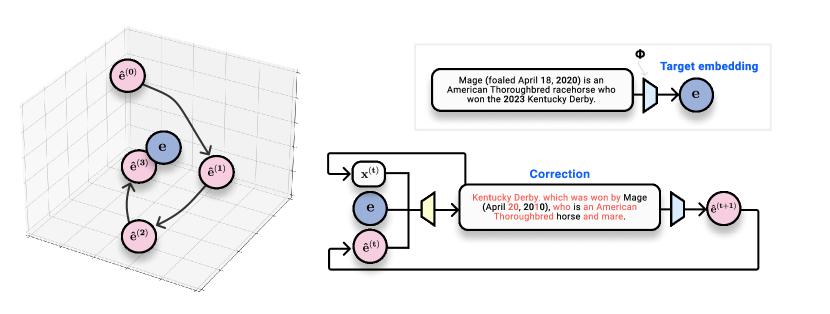
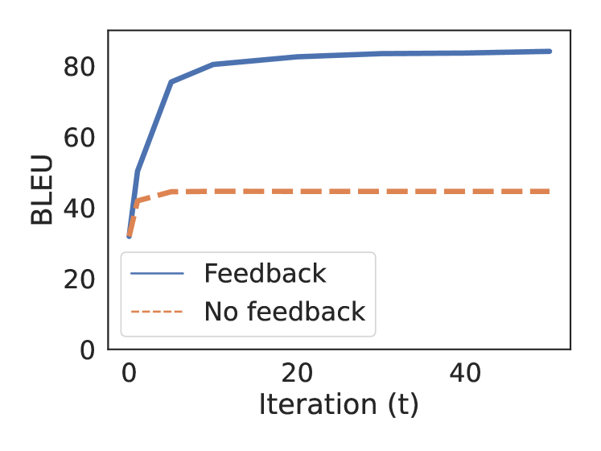

# Vec2Text — Research Note
> **English** | [繁體中文](./README.zh-TW.md)

## 📇 Academic Context

| Field | Value |
|-|-|
| Title | Text Embeddings Reveal (Almost) As Much As Text |
| Venue | EMNLP 2023 |
| Year | 2023 |
| Authors | John X. Morris, Volodymyr Kuleshov, Vitaly Shmatikov, Alexander M. Rush |
| Official Code | https://github.com/jxmorris12/vec2text |
| Venue Kind | paper |

> Citation count: this round's query to the Semantic Scholar API returned HTTP 429 (rate limited), so it is recorded as `unavailable` rather than being padded with `0`.

## First Principles

This paper asks a very practical privacy question: when you feed text into an embedding model $\phi$, store only the dense vector $e=\phi(x)$ in a vector database, and keep the original text locally, then if an attacker obtains this vector and also has black-box query access to the same model $\phi$, can they recover the original text $x$? The authors push the answer to a disturbing extreme: for state-of-the-art retrieval embeddings like GTR, a 32-token input can be recovered **verbatim** more than 90% of the time.

### Writing "inversion" as an optimization problem

An embedding model is trained so that semantically similar texts have similar vectors, so "recovering the original text" can be rewritten as "finding a piece of text whose embedding has maximum cosine similarity to the target vector." The authors formalize inversion as a search over text sequences:

$$\hat{x} = \arg\max_{x} \text{cos}(\phi(x), e)$$

The key to this formula is the threat model: the attacker only needs to be able to query $\phi$, and needs neither gradients nor weights; and when $\text{cos}(\phi(\hat{x}), e)=1$, the attacker can be almost certain that $\hat{x}$ is the original text, because in practice a collision where different texts "hit" the same vector is extremely rare. This turns a seemingly vague privacy concern into a search problem with a clear stopping condition.

### Why single-step decoding is not enough

Exhaustively enumerating all possible sequences to solve the above is computationally infeasible, so the fallback is to learn a conditional language model $p(x \mid e)$, using maximum likelihood to "amortize" the combinatorial optimization into the network's weights:

$$\theta = \arg\max_{\hat\theta}\; \mathbb{E}_{x\sim\mathcal{D}}\,[\,p(x\mid\phi(x);\hat\theta)\,]$$

The problem is that directly forcing fluent and correct text out of a vector has always been hard in the literature, and in the experiments this base model has a BLEU of only 31.9 and a verbatim hit rate of 0. Relying on a single forward decoding, the model can see the destination but cannot walk to it.

### Vec2Text: translating the vector's "error" into a text correction

The authors' core method Vec2Text switches to **iterative correction**: first the base model guesses an initial hypothesis $x^{(0)}$, re-embeds it to obtain $\hat{e}^{(0)}=\phi(x^{(0)})$, and then trains a correction model that, looking at "the gap between the target vector and the current hypothesis vector," rewrites the text, and so on repeatedly. The whole process is defined recursively via marginalization over the intermediate hypotheses:

$$p(x^{(t+1)} \mid e) = \sum_{x^{(t)}} p(x^{(t)} \mid e)\, p(x^{(t+1)} \mid e, x^{(t)}, \hat{e}^{(t)})$$

The backbone of the correction model is a standard encoder-decoder transformer (initialized from T5-base, about 235M parameters including the projection head). The difficulty is feeding a single vector of dimension $d$ into the encoder; the authors use a small MLP to project and reshape the vector into a sequence of length $s=16$:

$$\text{EmbToSeq}(e) = W_2\, \sigma(W_1\, e)$$

The actual input feeds three projected sequences into the encoder—the target vector $e$, the hypothesis vector $\hat{e}^{(t)}$, and the difference of the two $e-\hat{e}^{(t)}$—together with the word embeddings of the current hypothesis. Feeding in the "difference vector" is the cleverest step here: it lets the model read directly "which direction to change toward," rather than re-guessing from scratch each time. At inference time, because one cannot actually sum out the intermediate hypotheses, the authors do beam search at the sequence level (the paper calls it sbeam): at each step keep $b$ candidates, and only adopt a new generation when it is closer to the target in cosine similarity.

### A worked example of one full correction (original figures from the paper)

The paper gives a very concrete recovery trajectory, which can be used to walk through the forward process. The target sentence is a piece of Wikipedia text "Nabo Gass (25 August, 1954 in Ebingen, Germany) is a German painter and glass artist.", and in parentheses is the cosine similarity between that round's output and the ground-truth embedding:

| Round | Reconstructed output (excerpt) | cos | Verbatim correct |
|-|-|-|-|
| Round 1 | Nabo Gass (11 August 1974 in Erlangen …) is an artist. | 0.85 | ✗ |
| Round 2 | Nabo Gass (b. 18 August 1954 in Egeland …) is a German painter and glass artist. | 0.99 | ✗ |
| Round 3 | Nabo Gass (25 August 1954 in Ebingen …) is a German painter and glass artist. | 0.99 | ✗ |
| Round 4 | Nabo Gass (25 August, 1954 in Ebingen …) is a German painter and glass artist. | 1.00 | ✓ |

It is worth noting that the cosine similarity shoots up to 0.99 already at Round 2, but the text still has errors like "Egeland/Ebingen" and "1974/1954"; it is only in the interval from 0.99 to 1.00, where the vector difference is almost invisible, that the model fills in details like the place name and the comma one by one. This shows that the final verbatim correctness relies on sbeam choosing among multiple 0.99-level candidates, rather than on the cosine score alone.

### Main reconstruction results

Under the in-domain GTR / Natural Questions setting, the comparison of Vec2Text with the various baselines is as follows (tokens are all 32):

| Method | BLEU | Token F1 | Exact | cos |
|-|-|-|-|-|
| Bag-of-words (Song et al.) | 0.3 | 51 | 0.0 | 0.70 |
| Base [0 steps] | 31.9 | 67 | 0.0 | 0.91 |
| Vec2Text [1 step] | 50.7 | 80 | 0.0 | 0.96 |
| Vec2Text [20 steps] | 83.9 | 96 | 40.2 | 0.99 |
| Vec2Text [50 steps] | 85.4 | 97 | 40.6 | 0.99 |
| Vec2Text [50 steps + sbeam] | 97.3 | 99 | 92.0 | 0.99 |

The help of multi-round correction for BLEU is monotonic but with diminishing returns—20 steps eat up most of the gain, and 50 steps add only a little more; what really pulls the "verbatim hit rate" from the 40% level up to 92% is sequence-level beam search, and the paper notes that sbeam increases exact match by about 2 to 6 times. This also confirms the earlier example's observation: once cosine has saturated, it is the search width that is key to cracking the last details.

Feedback itself is also ablated separately: under 50-step greedy self-correction, the model that re-embeds the latest hypothesis as feedback can reach 52.0% verbatim hits, whereas the version that removes feedback and only rewrites text reaches only 4.2%. The gap shows that what the model truly leverages is the geometric information of the embedding space, not merely the language model's self-rewriting inertia.

The authors then move the attack to a truly sensitive domain—MIMIC-III clinical records (using a pseudo-reidentified version with inserted pseudonyms):

| Method | first | last | full | BLEU | Exact | cos |
|-|-|-|-|-|-|-|
| Base | 40.0 | 27.8 | 10.8 | 4.9 | 0.0 | 0.78 |
| Vec2Text | 94.2 | 95.3 | 89.2 | 55.6 | 26.0 | 0.98 |

Even though only 26.0% of the records are recovered verbatim, highly sensitive entities like names are extracted in large numbers: first name 94.2%, last name 95.3%, full name (first+last) 89.2%. In other words, even if the reconstruction is imperfect, the privacy leak is already established—this is precisely the empirical fulcrum for the authors' argument that "embeddings should be treated as just as sensitive as the original text."

### A seemingly cheap defense, and its cost

The authors test the most intuitive defense: adding Gaussian noise to each vector, trading it for privacy.

$$\phi_{\text{noisy}}(x) = \phi(x) + \lambda \cdot \epsilon$$

At $\lambda=0.01$, retrieval performance (the average NDCG@10 over 15 BEIR tasks) drops only about 2%, but the reconstruction BLEU collapses to 13% of the original. This gives a practical sweet spot, but the authors themselves also caution: a low BLEU does not mean that coarse-grained inferences like "clinical department, treatment direction" cannot be extracted, and the defense was tested under the premise that "the attack model was not retrained against the noise."

## 🧪 Critical Assessment

### The reality and importance of the problem

This threat model is quite on target: hosted vector databases (Pinecone, Weaviate, etc.) precisely sell the point of "send only the embedding, not the original text," and what the authors attack is this trust assumption. Moreover it needs neither gradients nor weights, only black-box query access and the same embedding model—and since in practice everyone uses those few models, this premise is not demanding in reality. Turning the privacy problem into a search with a clear stopping condition ($\cos=1$) via "inversion" is an elegant and deployable framework.

### The adequacy of the baselines, ablations, and evaluation

The evidence is on the whole solid: it compares against two existing inversion methods, bag-of-words and a GPT-2 decoder, ablates both feedback and initialization, and also tests cross-domain generalization on 15 BEIR datasets. It is worth commending that the initialization ablation shows that even starting from random tokens and running 20 steps still reaches about 50% verbatim hits, indicating that the method does not rely on a particularly strong initial guess. To nitpick, the most eye-catching 92% holds only at 32 tokens; in the table, the verbatim hit rate for the OpenAI/128-token setting drops to single digits (8.0%), and on the longer BEIR datasets BLEU generally falls in the teens to twenties. The title's "(Almost) As Much As Text" in fact heavily depends on the premise of "short sequences," and the narrative of the abstract and introduction can easily lead readers to take 92% as a general conclusion.

### Is this a new method or a repackaging of existing techniques?

Taking it apart, none of the components is new: conditional text generation, iterative-refinement-style self-correction, and CLIPCap-style vector projection are all existing practices. The real contribution is the combination of "treating the embedding difference vector $e-\hat{e}$ as a discrete proxy for a differentiable gradient, driving a corrector that can be applied repeatedly," and being the first to push it to the scale of paragraph-level, verbatim recovery—a substantial step forward from prior work that could only recover bag-of-words. So it is more like "assembling the right parts into an attack no one had built before" than a restatement under new names.

### Was the evaluation designed to favor the authors' own method?

There is one point worth naming: the headline numbers are built on the authors' self-chosen 32-token truncation, whereas models like GTR and OpenAI ada-002 actually support inputs of thousands of tokens, and the paper also frankly admits in the limitations section that it did not test longer sequences. The defense experiment is likewise conducted under the assumption that "the attacker does not do adaptive retraining against the noise," which is a setting favorable to the authors' own side—an attacker who retrains against the defense might invalidate the $\lambda=0.01$ sweet spot. None of this overturns the conclusion, but it leaves open the range of validity of "embedding ≈ original text" under long texts and adaptive adversaries.

### Was the problem really solved? How relevant is it to reality

Within the slice of "short text, non-adaptive defense," the paper quite persuasively proves that embeddings leak almost all of the original text, and the 89% full-name recovery on MIMIC is concrete enough to constitute a real privacy risk, so the policy claim that "embeddings should be protected at the same level as the original text" holds up. But treating it as a universal warning for all vector databases would be an overstatement: real deployments often embed documents of hundreds to thousands of tokens, and the method's efficacy at this scale is not yet verified; meanwhile every correction step requires another query to the black-box model, so the attack's cost and detectability (a large number of similar queries) are not zero in reality either. The direction of the conclusion is credible, but its strength should be read as "an empirically established lower bound" rather than a ceiling.

## 🔗 Related notes

- [SimCSE](../SimCSE/)
