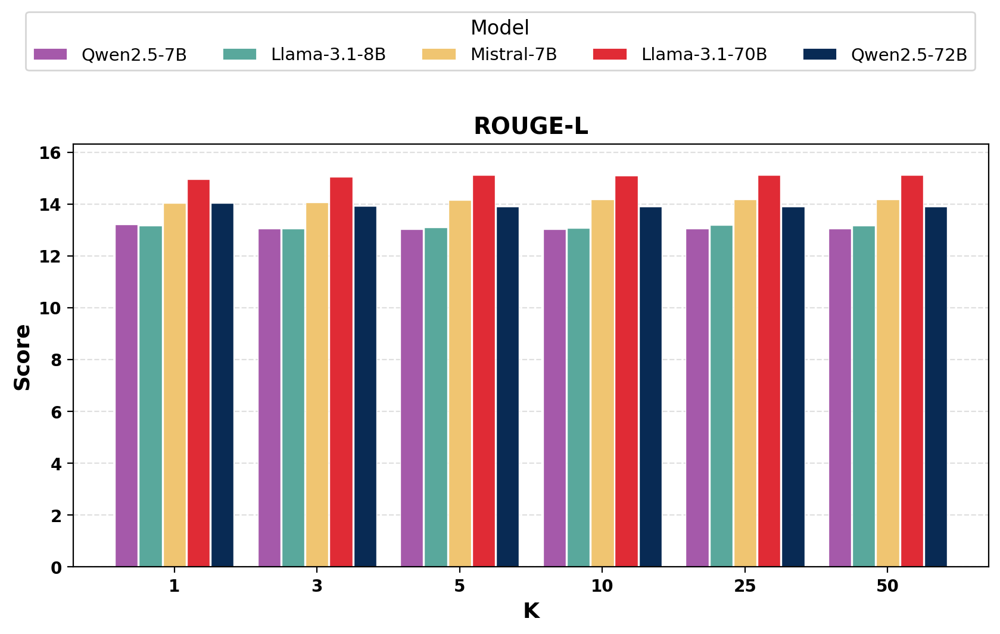
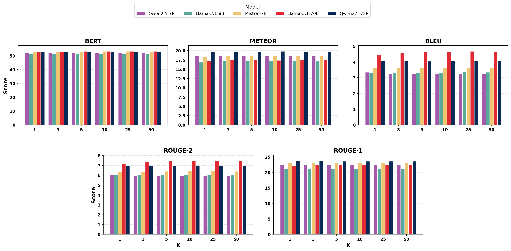
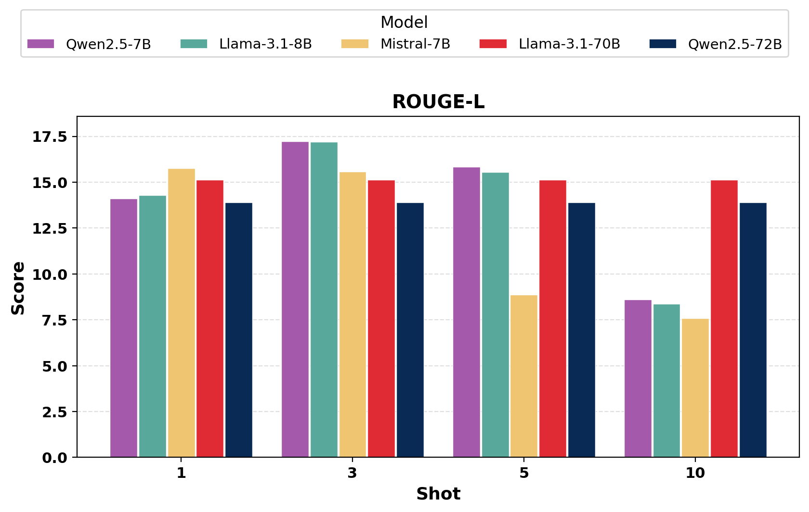

# 當檢索幫不上忙：生醫 RAG 的大規模實證 — Research Note
> [English](./README.md) | **繁體中文**

## 📇 Academic Context

| Field | Value |
|-|-|
| Title | When Retrieval Doesn't Help: A Large-Scale Study of Biomedical RAG |
| Venue | BioNLP Workshop at ACL 2026（arXiv 註明 accepted；本文依 arXiv 預印本 LaTeX 原始碼撰寫） |
| Year | 2026 |
| Authors | Erfan Nourbakhsh, Rocky Slavin, Ke Yang, Anthony Rios（The University of Texas at San Antonio） |
| Official Code | https://github.com/erfan-nourbakhsh/BioMedicalRAG |
| Venue Kind | paper |

> 本note依 arXiv 預印本（arXiv:2606.04127）的 LaTeX 原始碼撰寫；正式 camera-ready 版本若有調整，數值與敘述以最終發表版為準。表格數字與引文皆取自預印本 `source/acl_latex.tex`。

## First Principles

生醫問答（biomedical QA）是一個高風險場景：一個事實錯誤就可能導致有害的臨床決策，而大型語言模型（LLM）又天生容易產生「流暢但錯誤」的幻覺，且知識會隨訓練語料凍結而過時。Retrieval-augmented generation（RAG）之所以被視為解方，是因為它在推論時把外部證據接進提示詞，理論上能同時改善事實性、可追溯性與知識時效。這個樂觀預期並非空談：先前最具代表性的 MIRAGE／MedRAG 研究就報告，檢索能讓生醫 QA 準確率相對 chain-of-thought 提示最多提升達 18%（improves biomedical QA accuracy by as much as 18%），也因此把研究焦點推向「該選哪個 corpus、哪個 retriever」。

本文要挑戰的正是這個前提的適用範圍。作者指出，先前系統性的醫療 RAG 研究大多聚焦在大型專有或 70B 級模型（GPT-3.5、GPT-4、Mixtral-8×7B、Llama2-70B），而且幾乎只在 zero-shot 的多選題（MCQ）格式下評測；這些增益是否能延續到真正部署得起、單卡就能跑的 7B–8B 模型，是懸而未決的。同時，過往評測也偏重專家級考試題，很少碰到一般民眾（layman）的消費者健康問句，或社群產生的檢索來源。

於是本文把評測矩陣一次拉滿：5 個開源 instruction-tuned 模型（涵蓋 7B 到 72B），10 個生醫 QA 資料集（同時橫跨 layman 與 expert、open-ended 與 MCQ），4 種檢索方法（BM25、TF-IDF、MedCPT、Hybrid RRF），以及 4 個檢索語料庫（PubMed 摘要、醫學教科書、Yahoo Answers、HealthCareMagic），並且一律對照一個「不檢索」（w/o RAG）的 baseline，用以隔離檢索本身的貢獻。這個設計的關鍵在於：每一個實驗條件都是 (retriever, corpus, query dataset) 的三元組，因此可以把「換模型」「換語料」「換檢索器」三種選擇的效果分開來比。

下表把整個評測空間攤開，方便對照哪一個維度才是主導因素：

| 評測維度 | 選項 | 數量 |
|-|-|-|
| Backbone 模型 | Qwen2.5-7B, Llama-3.1-8B, Mistral-7B, Llama-3.1-70B, Qwen2.5-72B | 5（7B–72B） |
| 檢索方法 | No-retrieval（baseline）, BM25, TF-IDF, MedCPT, Hybrid(RRF) | 4 + baseline |
| 檢索語料 | PubMed/BioASQ, Medical Textbooks, Yahoo Answers, HealthCareMagic | 4（expert×2, layman×2） |
| 評測資料集 | layman: MeQSum, MedRedQA, MedicationQA, MASH-QA, iCliniq；expert: BioASQ-B, MedQuAD, MedQA-USMLE, MedMCQA, MMLU-Medical | 10 |

先走一個「檢索最該有幫助」的具體案例，才能感受落差有多大。檢索增益最集中的地方就是 open-ended 的 BioASQ 任務：LLaMA-3.1-8B 不檢索時 ROUGE-L 為 21.65，換上 BioASQ/PubMed corpus 後跳到 27.43（+5.78，LLaMA-3.1-8B improves from 21.65 to 27.43 ROUGE-L）；而 BioASQ 這一欄裡最大的單點跳升其實落在 LLaMA-3.1-70B 身上（21.93 → 28.98，+7.05）。之所以能有這麼漂亮的數字，是因為評測題目本來就取自 PubMed 文獻，檢索到的摘要幾乎就是答案來源。但把 8B 在 7 個 open-ended 資料集上平均起來，相對 baseline 的最大檢索增益只剩 1.18 分（the maximum retrieval benefit over no-retrieval is 1.18 points：13.06 → 14.24）；其餘四個模型的平均增益更小。換句話說，那些亮眼的 +5.78／+7.05 都是被單一、語料高度對齊的資料集撐起來的局部現象，一旦攤平到整體就被稀釋殆盡。

四種檢索方法本身的差別也同樣微小。以最省事的 RRF（Reciprocal Rank Fusion）為例，它不需訓練，只把 BM25 與 MedCPT 兩份排序清單按名次融合，文件 $d$ 在某清單第 $r$ 名就得到分數 $\frac{1}{k+r}$，取 $k=60$ 後把兩清單分數相加再重排：

$$
\mathrm{RRF}(d) = \sum_{i \in \{\mathrm{BM25},\,\mathrm{MedCPT}\}} \frac{1}{k + r_i(d)}, \quad k = 60
$$

所有檢索條件都固定取 top-$k=5$ 篇文件接到提示詞前面。值得注意的是，即便 MedCPT 是專門在 PubMed 搜尋日誌上對比學習出來的稠密檢索器，它在封閉題準確率上也沒有系統性地贏過純詞彙的 BM25（does not systematically outperform lexical BM25）；Hybrid 在若干設定下有些微優勢，但沒有任何一種方法能一致勝出。這個結果本身就在暗示：瓶頸不在「檢索器夠不夠聰明」。

把主結果濃縮成「不檢索 vs. 最佳語料」的 open-ended ROUGE-L 平均對照，就能看到增益的量級：

| 模型 | w/o RAG | 最佳 corpus（BioASQ） | Δ |
|-|-|-|-|
| LLaMA-3.1-8B | 13.06 | 14.24 | +1.18 |
| LLaMA-3.1-70B | 14.22 | 14.66 | +0.44 |
| Mistral-7B | 13.64 | 14.44 | +0.80 |
| Qwen2.5-7B | 12.91 | 13.56 | +0.65 |
| Qwen2.5-72B | 13.56 | 13.91 | +0.35 |

在 MCQ（封閉題準確率）上，情況甚至更不利於檢索：對較小的模型，檢索經常「反而扣分」。Mistral-7B 從不檢索的 75.7 一路掉到各語料的 68.6–72.3；LLaMA-3.1-8B、Qwen2.5-7B 的最佳檢索設定也普遍低於自己的 no-retrieval baseline。真正決定成績的是 backbone：Qwen2.5-72B 完全不檢索的 85.6，就已經比任何 7B 模型的最佳檢索設定高出超過 2 分（exceeds the best retrieval configuration of any 7B model by over 2 points）。也就是說，同一筆預算與其花在更好的檢索器或語料，不如直接換一個更大的生成模型。

那麼，如果保證「檢索到的一定是相關證據」，檢索就能兌現承諾嗎？作者設計了一個乾淨的 oracle 對照：以 BioASQ corpus 為來源、在 PubMedQA（是非/不確定型研究問題）上評測，用 LLM-as-a-judge 判斷檢索脈絡是否足以答題（we use an LLM-as-a-judge framework to determine whether the retrieved context contains enough information），再挑出 100 題「所有檢索方法都取回了被判為相關脈絡」的題目來比。

下表把 clean（保證相關）與 noisy（在相關證據裡再混入 20 篇無關文件）兩種脈絡並排：

| 模型 | w/o RAG | BM25 (clean) | BM25 (noisy) |
|-|-|-|-|
| LLaMA-3.1-8B | 0.410 | 0.580 | 0.300 |
| LLaMA-3.1-70B | 0.410 | 0.660 | 0.260 |
| Mistral-7B | 0.460 | 0.510 | 0.310 |
| Qwen2.5-7B | 0.410 | 0.380 | 0.310 |
| Qwen2.5-72B | 0.380 | 0.350 | 0.250 |

這張表是全文論證的樞紐。即使脈絡保證相關，增益依然有限且不一致：LLaMA3.1-70B 靠 BM25 大幅改善（LLaMA3.1-70B improves substantially with BM25 retrieval，0.410 → 0.660），但 Qwen2.5-72B 幾乎不動、Qwen2.5-7B 甚至略降——「取回正確證據」並不等於「用得到證據」。更關鍵的是脆弱性：只要在相關證據中再混入 20 篇無關文件（When we add 20 unrelated documents to the retrieved evidence），成績就大幅崩落，多數情況比完全不檢索還糟（70B 的 0.660 掉到 0.260）。這兩張表合起來把矛頭指向同一個結論：真正的瓶頸是模型「使用證據」的能力，而非「找到證據」的能力。

消融實驗進一步夯實這個判讀。把取回文件數 top-$k$ 從 1 掃到 50，open-ended ROUGE-L 在 $k=5$ 之後就進入平台，$k=5$ 到 $k=50$ 之間變化不到 0.2 分（ROUGE-L changes by less than 0.2 points between $k=5$ and $k=50$）——多塞文件並不會帶進更多有用訊號。封閉題則更能看出小模型的體質問題：LLaMA-3.1-8B 在 $k=5$ 達到 72.83% 後開始下滑，而 Mistral-7B 從 $k=3$ 之後就一路走低（Mistral-7B declines steadily after $k=3$），在 $k\geq25$ 只剩 51.22%。長脈絡對小模型是負擔而非資產。

這個「證據利用瓶頸不隨 k 消失」的現象不只出現在 ROUGE-L。把其餘五個 open-ended 指標（BERTScore、METEOR、BLEU、ROUGE-2、ROUGE-1）也照 top-$k$ 攤開，每個指標的長條在 $k=1$ 到 $k=50$ 之間幾乎持平，作者報告 $k=5$ 之後在任何指標、任何模型上都看不到可量測的增益（additional passages beyond $k{=}5$ provide no measurable benefit in any metric for any model）。也就是說「平台」不是某個指標的偽影，而是跨指標一致的訊號飽和。

few-shot 消融把「小模型撐不住長脈絡」講得更直白。較大的模型（LLaMA-3.1-70B、Qwen2.5-72B）在 1、3、5、10 shot 之間幾乎不變，但 7–8B 模型在 5、10 shot 出現斷崖：LLaMA-3.1-8B 的封閉題準確率從 82.89%（1-shot）崩到 10.06%（10-shot）（accuracy collapses from 82.89% (1-shot) to 10.06% (10-shot)），open-ended ROUGE-L 也從 14.29 掉到 8.38。有趣的是 3-shot 是 open-ended 的甜蜜點（3-shot prompting is the sweet spot，LLaMA-3.1-8B 到 17.19、Qwen2.5-7B 到 17.22）再往上就退化。這條曲線與 RAG 的結論同源：一旦提示變長，小模型定位目標指令的能力就先崩，證據利用自然無從談起。

## 🧪 Critical Assessment

### 度量能不能真的量到「檢索有沒有幫上忙」

全文的結論建立在 reference-based 度量（ROUGE-L、BLEU、METEOR、BERTScore、accuracy）之上，而作者自己在 Limitations 也承認，這些指標並不直接衡量事實性或證據落地（though our experiments do not directly measure evidence utilization or grounding）。這是一個實質的張力：一個模型可能靠參數化知識就答對、根本沒用檢索；也可能照抄檢索到的表面片語、卻沒提升醫療正確性。對 open-ended 生醫問答而言，n-gram 重疊本來就是弱訊號（BLEU 在 lay 資料集普遍低於 2），因此「檢索增益只有 1–2 分」這句話，有一部分可能是度量對「有用的檢索」不敏感，而不是檢索真的無效。結論的方向可信，但「小」這個量級要打一點折扣。

### BioASQ 那個 +5.78 是真增益還是評測對齊的假象

唯一檢索明顯有幫助的地方，是 open-ended 的 BioASQ，而它的檢索語料（PubMed）與評測答案（BioASQ 本就 grounded 在 PubMed 文獻）來自同一來源。當 corpus 與 reference 高度同源時，檢索到的摘要與標準答案會共享大量詞彙，ROUGE-L 這種表面重疊度量會被系統性地灌高。作者把它讀成「domain-matched retrieval 的局部效益」，但更保守的解讀是：這比較像是評測設計讓答案外洩，而非模型真的因檢索而更懂醫學。這也解釋了為何一離開 BioASQ、攤到其餘六個資料集就幾乎歸零——真正可泛化的增益可能比 1.18 分還小。

### oracle 分析足以支撐「模型不會用證據」這個因果宣稱嗎

clean/noisy 的 oracle 對照是全文最有力的機制證據，但它的外推要小心：它只在 100 題 PubMedQA、單一 BioASQ corpus、由 LLM-as-a-judge 篩相關性的設定下做。用一個 LLM 來判斷「脈絡是否足以答題」本身就會引入判準偏差，且 100 題的樣本讓 0.02–0.03 的差異難以與雜訊區分。作者的結論措辭其實是留有餘地的（承認未直接量測 evidence utilization），但 note 主體與圖表容易讓人把「相關證據沒帶來增益」直接等同於「模型不會用證據」——這是一個合理但尚未被直接量測的推論，而非已被證實的因果。

### 廣度是優點，但缺變異數與單次貪婪解碼是隱憂

5×10×4×4 的矩陣是本文最紮實的貢獻，橫跨十個資料集的一致性讓「檢索增益微小」不像是單一 benchmark 的偶然。但代價是所有數字都來自單次、FP16、greedy 解碼、每題最多 300 token 的生成（greedy decoding and a maximum of 300 newly generated tokens），全文沒有回報任何重複實驗的變異數或顯著性檢定。當關鍵結論本身就是「差異只有 1–2 分」時，缺乏誤差棒是雙面刃：它固然支持「增益小」，卻也讓「Hybrid 略勝」「BioASQ 語料平均最佳」這類細部排序無法排除是取樣雜訊。

### 對實務者：先換 backbone，還是先修檢索

作為部署指南，本文的核心訊息是穩健且有用的——在 7B–72B 開源模型上，把資源投在更大的 backbone，通常比投在更好的 retriever 或 corpus 更划算。但這個處方有明確邊界：實驗不含 GPT-4 級的專有前沿模型（do not include proprietary frontier systems），也刻意不碰 adaptive retrieval、重排序、迭代檢索或任務特化 chunking（does not explore more complex retrieval strategies such as adaptive retrieval, document re-ranking）。因此正確的結論不是「生醫 RAG 沒用」，而是「一個固定 top-k、無重排的標準 RAG 管線，配上中小型開源模型，兌現不了先前大模型研究承諾的增益」。把它讀成前者，就會過度外推本文其實沒有測到的設定。

## 一分鐘版

- 問題從哪來：過去對生醫 RAG 的高預期，多半建立在大型專有模型上；先前研究稱檢索最多能提升 18% 準確率，但這在單卡就能跑的 7B–8B 模型上能否兌現，一直沒有答案。
- 怎麼做：把 5 個開源模型、10 個資料集、4 種檢索方法、4 個語料庫交叉成一張大矩陣，而且每個設定都對照一個「完全不檢索」的基準線，好把檢索本身的功勞單獨拆出來看。
- 主要發現：檢索帶來的進步既小又脆——只要在正確證據裡再混進 20 篇無關文件，70B 模型的成績就從 0.660 崩到 0.260，多數情況比完全不檢索還糟。
- 別過度解讀：因為沒有測 GPT-4 級的前沿模型，也刻意沒碰重排序、自適應檢索等進階技巧，這篇的結論不能被讀成「生醫 RAG 沒用」，只能說「固定 top-k、無重排的標準管線配上中小型開源模型，兌現不了大模型研究承諾的增益」。
- 給實務者：在中小型開源模型上，把預算花在換更大的 backbone，通常比升級檢索器或語料更值——Qwen2.5-72B 完全不檢索就有 85.6，比任何 7B 模型的最佳檢索設定還高出 2 分以上。

## 🔗 Related notes

- [GNN-RAG](../GNN-RAG/)
- [SAG: 查詢期動態超邊的 SQL-RAG](../SAG-SQL-RAG/)
- [Fine-tuning vs In-context Learning vs RAG](../FineTuning-vs-ICL-vs-RAG/)
