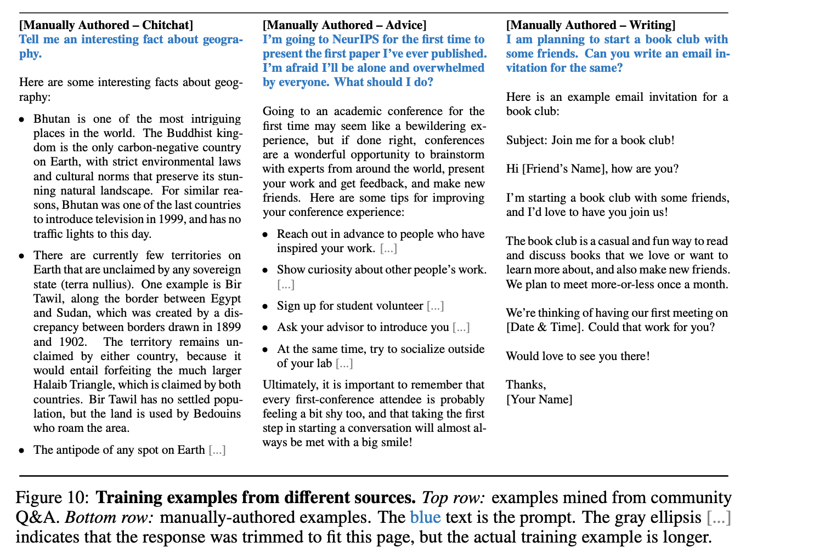
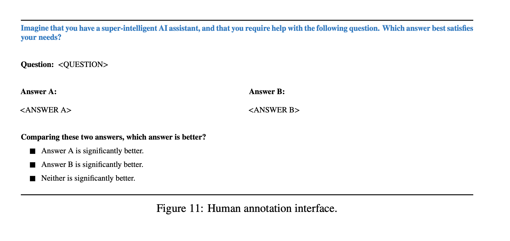

# Do we really need BigData to effectivetly fine-tune LLMs?
- The importance between data size and data quality. 
    - Increasingly research like LIMA and Phi-1 is showing quality over quantity in training data is what matters.
- 🦙 Authors fine tuned LIMA from LLaMA 65b + **1000 highly curated training examples**
- 💁‍♂️ Human preference eval showed LIMA was preferred or equal to Alpaca 74% of the time, despite having far less training
🏋️ Results suggest LLMs learn most important knowledge during pre-training

## LiMA
- Training Example
    
- Annotation Interface
    