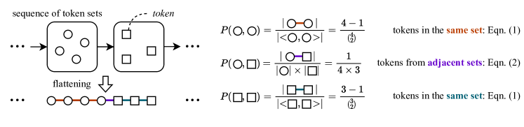
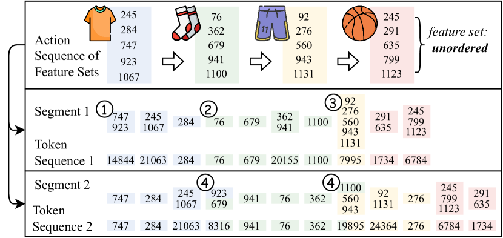
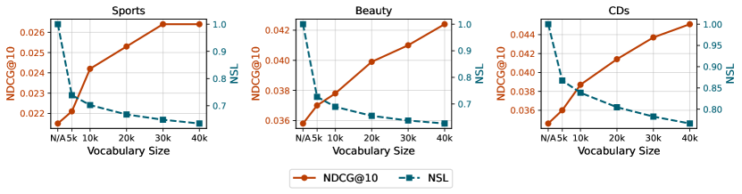

# ActionPiece — Research Note

> **English** | [繁體中文](./README.zh-TW.md)

## 📇 Academic Context

| Field | Value |
|-|-|
| Title | ActionPiece: Contextually Tokenizing Action Sequences for Generative Recommendation |
| Venue | ICML |
| Year | 2025 |
| Authors | Yupeng Hou, Jianmo Ni, Zhankui He, Noveen Sachdeva, Wang-Cheng Kang, Ed H. Chi, Julian McAuley, Derek Zhiyuan Cheng |
| Official Code | https://github.com/google-deepmind/action_piece |
| Venue Kind | paper |

The authors are affiliated with University of California, San Diego and Google DeepMind (the first author, Yupeng Hou, completed this work while a student researcher at Google DeepMind). The paper's LaTeX source is marked as an accepted ICML 2025 paper via `\usepackage[accepted]{icml2025}`. All figures and quotations below follow the LaTeX source of arXiv `2502.13581` (the camera-ready version may differ slightly).

## First Principles

### Problem: why the "same action" should not always map to the same set of tokens

Generative recommendation (GR) slices a user's interaction sequence into discrete tokens, then lets an autoregressive model (such as a T5 encoder-decoder) generate tokens one by one, and finally parses the generated tokens back into recommended items. Its advantage is that the tokens share a compact vocabulary that "does not grow with the size of the item pool", which makes it superior to the traditional approach of maintaining one embedding row per item in terms of memory and scalability.

The paper points out a common flaw of existing GR methods: **every action is tokenized independently**. The same action (e.g. buying the same product) is assigned to the same fixed token in any sequence, entirely ignoring context. The authors' analogy is clear: early language models' word-level tokenization was also context-independent, whereas modern LLMs almost all switched to context-aware subword segmentation such as BPE and Unigram, letting the same word root be split into different tokens depending on the surrounding context. What ActionPiece sets out to do is to bring this step to action sequences, becoming the first context-aware action-sequence tokenizer.

The real technical difficulty is this: text is inherently a one-dimensional character sequence, but the features associated with an action (category, brand, price, …) form an **unordered set**. So the entire algorithm has to run on a "sequence of sets", not on a one-dimensional sequence.

### Representing an action as a sequence of feature sets

Given a user history $S=\{i_1,\dots,i_t\}$, replace each item $i_j$ with its feature set $\mathcal{A}_j$ (each item has $m$ features, the $k$-th feature denoted $f_{j,k}\in\mathcal{F}_k$), and the whole input becomes a time-ordered sequence of sets $S'=\{\mathcal{A}_1,\dots,\mathcal{A}_t\}$. The **inside** of a set is unordered, but there is a temporal order **between** sets. The tokenizer must output a token sequence $C=\{c_1,\dots,c_l\}$, where the number of tokens $l$ is usually larger than the number of actions $t$. Using unordered sets (rather than the ordered semantic IDs produced by RQ-VAE) has two benefits: no need to assign an order to features, and it can naturally accommodate general discrete and numerical features such as category / brand / price.

### Vocabulary construction: a weighted BPE over "sequences of sets"

ActionPiece follows the bottom-up spirit of BPE: the initial vocabulary $\mathcal{V}_0$ lets each token represent "a set of a single feature", and then repeatedly runs count → update, each round merging the most frequently co-occurring pair of tokens into a new token, until the vocabulary size reaches the target $Q$.

The key difference is that **the count step must account for the set structure**. There are two kinds of co-occurrence in a sequence of sets: (1) two tokens within the same set, and (2) two tokens in two adjacent sets. Rather than counting each token pair with equal weight as text BPE does, the authors define the weight via "the expected probability that two tokens are adjacent after randomly flattening the sets into a one-dimensional sequence". For two tokens within the same set:

$$P(c_1, c_2) = \frac{|\mathcal{A}_i| - 1}{\tbinom{|\mathcal{A}_i|}{2}} = \frac{2}{|\mathcal{A}_i|}, \quad c_1, c_2 \in \mathcal{A}_i$$

For tokens across two adjacent sets:

$$P(c_1, c_3) = \frac{1}{|\mathcal{A}_i| \times |\mathcal{A}_{i+1}|}, \quad c_1 \in \mathcal{A}_i,\; c_3 \in \mathcal{A}_{i+1}$$

**The update step's data structure is the most engineering-heavy part of the whole paper.** Merging tokens within the same set is straightforward; but when merging tokens "across adjacent sets", it is not obvious which set the new token should be placed into. The authors maintain each sequence with a doubly linked list and introduce an "intermediate node" specifically to hold tokens that span multiple actions: when the tokens of two action nodes are merged, an intermediate node is inserted between them to carry the new token; when an action node is merged with an existing intermediate node, the new token directly replaces the old token in the intermediate node. This rule guarantees at most one intermediate node between any two action nodes, and at most one token per intermediate node, and when computing co-occurrence weights the intermediate node is treated as a set of size 1.

Naively rescanning the whole corpus each round has complexity $O(QNLm^2)$; the authors use an inverted index (mapping a token pair to the sequences containing it) plus a global heap with lazy-update to incrementally update only the affected parts, reducing the complexity to $O(\log Q \log H \cdot NLm^2)$, where $H=O(NLm)$ is the maximum heap length.

### Segmentation: use set permutation regularization (SPR) to avoid using only a few tokens

Once the vocabulary is available, the original sequence still has to be segmented into the corresponding tokens. If one directly reuses the greedy fixed-order merging from vocabulary construction, the authors observe that this produces a bias — only a subset of tokens ends up being frequently used. To address this they propose **set permutation regularization (SPR)**: for each set, randomly generate a permutation, treat it as a one-dimensional sequence, then concatenate all permutations and segment them with traditional BPE segmentation. Different permutations produce multiple versions that are "semantically identical but have different token sequences"; at training time the sequence is re-segmented once per epoch as data augmentation, and at inference time the same input is segmented $q$ times and the scores of the $q$ ordered results are averaged as an ensemble (inference-time ensembling).

The table below (paper Table 3) juxtaposes the differences between BPE and ActionPiece, showing that ActionPiece is essentially "moving BPE from a one-dimensional byte sequence to a feature-set sequence" plus cross-set merging and SPR:

| Aspect | BPE | ActionPiece |
|-|-|-|
| Data Type | text sequences | sequences of actions (unordered feature sets) |
| Token | a byte sequence | a feature set |
| Merging Unit | adjacent byte pair | feature pair within a set or between adjacent sets |
| Co-occurrence Weighting | raw frequency | probability weighting (the two formulas above) |
| Segmentation | greedy fixed-order merging | set permutation regularization |
| Intermediate Structures | N/A | intermediate nodes for cross-action merges |

### A concrete example with real numbers

Take the Beauty dataset as an example: each item's features are 4 codes quantized by OPQ plus 1 anti-collision identifier code, for $m=5$ features in total — exactly matching the "each item is composed of five features" setup in the paper's case study. Treating these 5 features as one set, during vocabulary construction:

- The weight contributed each time any pair of features **within** the set co-occurs is $P=\tfrac{2}{|\mathcal{A}|}=\tfrac{2}{5}=0.4$;
- If both the preceding and following items have 5 features, the weight of any **cross-set** pair of features is $P=\tfrac{1}{5\times 5}=0.04$.

That is, the weight of a feature pair within the same item is **10 times** that of a cross-item pair. This is precisely the design intent of "weighted counting": first compress "the feature combinations that recur repeatedly within the same product" into one token, then let the rarer cross-product combinations capture the truly contextual signal. After merging, one token may correspond to: part of an item's features, a single feature, all of an item's features, or features spanning multiple items — in the paper's case study, token `14844` corresponds to the T-shirt features `747` and `923`, while token `⟨19,895⟩` simultaneously contains the socks feature `1100` and the shorts features `560`, `943`, demonstrating that "the same action is split into different tokens depending on the neighboring context".

In terms of recommendation performance, taking NDCG@10 on Beauty as an example: ActionPiece scores 0.0424, and the relative improvement over the strongest baseline in that column (P5-CID, 0.0400) is $(0.0424-0.0400)/0.0400 = 6.00\%$, consistent with the paper's Improv. column. Overall, ActionPiece improves NDCG@10 relative to the best baseline by 6.00% to 12.82% across the three datasets. On the model side it follows the TIGER-style T5 encoder-decoder: 4 layers, 6 heads (each head of dimension 64), token embedding dimension 128, FFN dimension 1024, about 4.46M non-embedding parameters for Sports/Beauty; the vocabulary size is fixed at 40k, inference ensembling $q=5$, beam size 50.

## 🧪 Critical Assessment

### Is the problem real, and how important is it

The observation that "existing action tokenizers are all context-independent" is accurate and verifiable: the paper's Table 1 names VQ-Rec, TIGER, HSTU, SPM-SID, etc. one by one as marked with a cross in the Contextual column, and the historical analogy to LLMs moving from word-level to subword is quite apt. The problem itself holds. But note that "importance" and "magnitude of effect" are two different things: all three datasets come from Amazon Reviews (Sports/Beauty/CDs), with 12k–64k items and average sequence lengths of 8–15, belonging to the smaller-scale academic benchmarks; the paper's conclusion extrapolating the method to "audio modeling, sequential decision-making, time series" is at present only a future-work claim with no experimental support, and readers should not take it as an established generality.

### Are the baselines, ablations, data and metrics sufficient

The methodological rigor is overall decent: the baselines span three categories — ID-based, feature+ID, and generative — for ten methods in total, run over five random seeds with reported standard deviations, and the ablation simultaneously examines vocabulary size, context-awareness, weighted counting, and the SPR training/inference split. Particularly commendable is that, to preemptively refute "the improvement is just from a larger vocabulary", the authors deliberately tuned TIGER's vocabulary all the way from 192 to 66k, showing that a larger-vocabulary TIGER (49k, 66k) is instead worse.

But there are two fairness gaps worth pointing out. First, apart from ActionPiece, most baselines were reproduced by the authors themselves, except LMIndexer which directly cites the original paper's numbers, and it is `---` (non-converged/missing) for the entire CDs column and several R@10 columns, making it impossible to align and compare with the other methods. Second, and more critically: **ActionPiece's inference uses $q=5$ segmentations for the ensemble, equivalent to 5× the forward computation, whereas all baselines use single-pass inference**. The paper argues that latency is comparable via "permutation runs asynchronously on CPU, and the augmented versions can be parallelized across devices", but this cannot mask the fact that the FLOPs are 5×; directly juxtaposing "single-pass-inference baselines" with "5-fold-ensemble our method" means the headline improvement is not fully disentangled between how much comes from better tokenization and how much comes from pure test-time ensembling. Ablation (3.1) (SPR only at inference) drops to Sports 0.0192, and (3.3) (TIGER+SPR) shows no gain either, which indeed corroborates that "SPR is only useful together with a context-aware vocabulary", but this still does not amount to proving that ActionPiece beats the baselines under the **same inference budget**.

### From BPE to sequences of sets: real innovation or repackaging

Honestly, the core of ActionPiece is "moving BPE onto feature-set sequences", and the paper's Table 3 itself juxtaposes it this way. There are three genuinely original components: the intermediate-node data structure required for cross-set merging, the set-size-dependent probability-weighted counting, and SPR. Among these, SPR appears to be the main source of improvement — the ablation shows that removing SPR (reverting to naive segmentation) or using it on only one side clearly drops the score, and SPR raises token utilization from 56.89% to 87.01% in the first epoch (the appendix further states it reaches 95.33% by the 5th epoch). This is a solid engineering contribution, but it also means that the headline selling point "context-aware tokenization" and the true performance engine "using permutation augmentation + ensembling to make good use of tokens" are bundled together in the paper's narrative; if SPR is viewed as a data-augmentation/ensembling trick, its causal attribution relative to "context-awareness" is in fact partly entangled.

### Custom benchmarks and whether the problem is truly solved

The authors proactively introduced the larger CDs dataset (about 4× the interaction volume of Sports) to test scalability, while Sports/Beauty follow community-standard benchmarks, which reduces the concern of "picking datasets favorable to oneself" and is an honest aspect. But there is an easily overlooked setup difference: ActionPiece uses OPQ to quantize 4 codes (+1 identifier code), while TIGER/SPM-SID use RQ's 3 codes (+1 identifier code); the underlying feature representations of the different methods are not entirely consistent, and this difference in quantization method may constitute a potential confounder for the results — although the paper states "unified to 4 codes for a fair comparison", the essential difference between RQ and OPQ remains. In addition, the "strongest baseline" compared in the "Improv." column is not consistent cell by cell — for example in the Sports R@5 column, P5-CID (0.0287) is actually higher than SPM-SID (0.0280) which is marked as second-best (underlined), and the +12.86% improvement in that column is computed relative to 0.0280; this does not affect the conclusion that ActionPiece is best in that column, but it shows that the narrative of "the relative strongest baseline" is not precise on individual cells, and readers should cross-check against the table when citing improvement magnitudes. Overall, on its own offline Amazon benchmarks the hypothesis "context-independent tokenization is suboptimal" is supported; but "whether it holds in real, large-scale, online scenarios" is not touched at all — there are no industrial-scale data, no online A/B tests, and the impact of the 5× inference cost on online deployment is not quantified either.

## 🔗 Related notes

- [SASRec](../SASRec/) — one of this paper's ID-based baselines, a representative of self-attention sequential recommendation.
- [S3Rec](../S3Rec/) — this paper's feature-enhanced baseline, using self-supervised pre-training to associate item features with IDs.
- [BERT4Rec](../Bert4Rec/) — this paper's ID-based baseline, bidirectional Transformer sequential recommendation.
