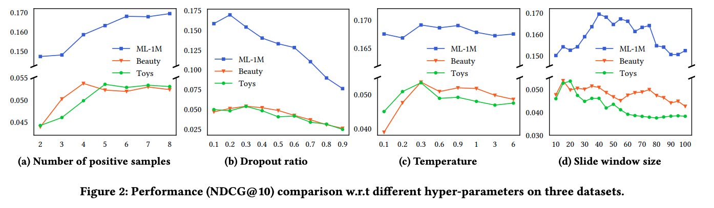
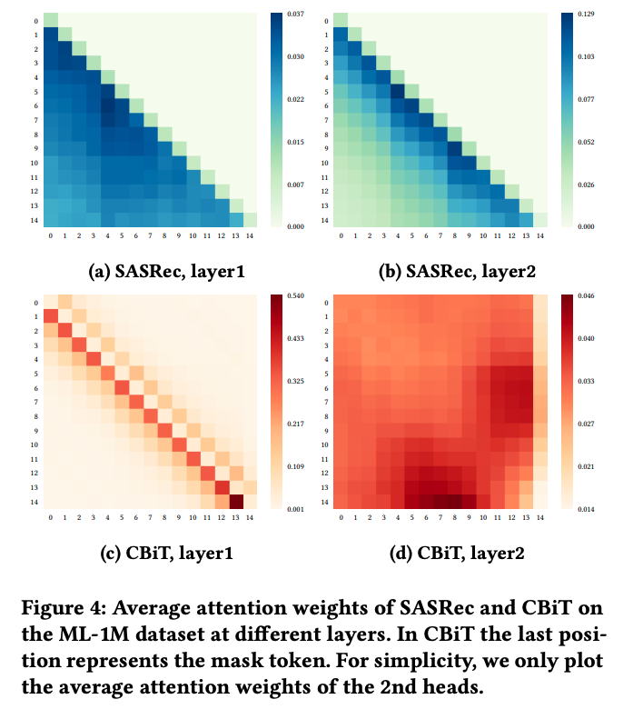
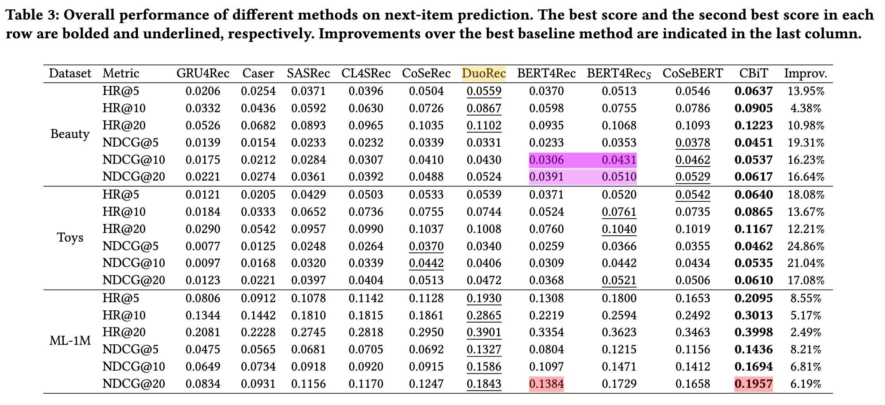

| Property  | Data |
|-|-|
| Created | 2023-02-21 |
| Updated | 2023-02-21 |
| Author | [@Aiden](https://github.com/Aidenzich) |
| Tags | #study |

# Contrastive Learning with Bidirectional Transformers for Sequential Recommendation
| Title | Venue | Year | Code |
|-|-|-|-|
| [Contrastive Learning with Bidirectional Transformers for Sequential Recommendation](https://arxiv.org/pdf/2208.03895.pdf) | CIKM | ['22](https://www.cikm2022.org/papers-posters) | [code](https://github.com/hw-du/CBiT/tree/master.) |
## Abstract
- Contrastive learning with Transformer-based sequence encoder maximizes the agreements between paired sequence augmentations that share similar semantics. 
- **Cause:** Existing contrastive learning approaches in sequential recommendation mainly center upon left to-right unidirectional Transformers as base encoders, which are suboptimal for sequential recommendation **because user behaviors may not be a rigid left-to-right sequence**.
- **Effect:** This paper apply: 
    - The slide window technique for long user sequences in bidirectional Transformers, which allows for a **more fine-grained division of user sequences**. 
    - Combine the `cloze task mask` and the `dropout mask` to generate high-quality positive samples and perform multi-pair contrastive learning, which demonstrates better performance and adaptability compared with the normal one-pair contrastive learning. 
    - Introduce a novel `dynamic loss reweighting strategy` to balance between the cloze task loss and the contrastive loss. 

## Model Sturcture

### Multi-Pair Contrastive Learning
- **1. The Simple One-Pair Instance**
Normally, given a batch of sequences $\{S_u\}^N_{u=1}$ with batch size $N$, a pair of hidden representations $H^x_u$, $H^y_u$ stemming(詞幹) from the same original sequence $S_u$ are brought together as a pair of positive samples while the other $2(N -1 )$ hidden representations from the same batch are considered negative samples.
- **2. Extrapolation.**
    - Simply using one pair of positive samples for contrastive learning does not suffice to fully exploit the great potential of bidirectional Transformers:
        - the difference between one pair of positive samples might be diminutive, so the model could hardly learn anything useful with these easy positive samples
        - there might **exist false negative samples within one batch**, which could hurt performance if not neutralized with more positive samples. 
    - Extrapolate the standard contrastive learning pair to multi-pair instances.
        - In the cloze task, generated $m$ masked sequences using different random seeds. Given the final output of the $H^1_u,..., H^m_u$ hidden representations as positive samples
            - increases the total number of positive samples is extended to $m$
            - The total number of negative samples is extended to $m(𝑁 −1)$ because each positive sample brings the other $(𝑁-1)$ samples from the same batch as negative samples.

## Experiment
### Hyper-parameter Sensitivity

### Discussion: Why Bidirectional Transformer?

|  | Unidirectional Transformers | Bidirectional Transformers |
|-|-|-|
| The difference in the attention mechanisms | Use the `attention mask` to **hide** future items, which creates a `shifted version of the same sequence` | Can see items from `both sides`, which is beneficial for capturing more `fine-grained behaviorial patterns`. |
| Average Attention Weights | | The heat-map of average attention weights is `diagonal` because of such causality(因果關係) attention masking. |
| Training Objectives | The next-item prediction because the model learns to process sequence information from left to right. | The cloze task using an additional mask token because the model learns to process sequence information from both sides. |

- As we can see in Figure 4c and 4d, attention in the 2-th head tends to attend on the mask token, which indicates that the model is sensitive to the cloze task.
- In the experiments find out that `bidirectional Transformers` can **only** outperform unidirectional Transformers by a `large margin on(大幅優於)`  condition that the `slide window technique` is adopted, which indicates the necessity of using the slide window technique in bidirectional Transformers.

### Performance Comparison

### Hyper-parameter Sensitivity
