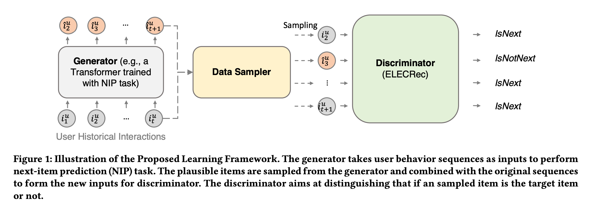
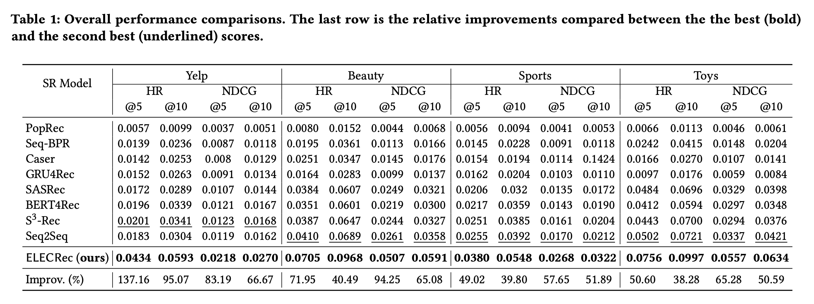

| Property  | Data |
|-|-|
| Created | 2023-02-21 |
| Updated | 2023-02-21 |
| Author | [@Aiden](https://github.com/Aidenzich) |
| Tags | #study |

# ELECRec: Training Sequential Recommenders as Discriminators

| Component |  Definition |  Example |
|-|-|-|
| Problem Definition | Sequential recommendation methods require training with more meaningful samples to be effective, which otherwise will lead to a poorly trained model. | - |
| Proposed Solution |  Train sequential recommenders as `discriminators` rather than generators by training a discriminator to distinguish if a sampled item is a **real** target item or not, and training a `generator` as an auxiliary model to sample plausible alternative next items. | - |
| Experiment Result |  Experiments conducted on four datasets demonstrate the effectiveness and efficiency of the proposed approach. |  `Yelp`, `Beauty`, `Sports`, `Toys` |

## Proposed Solution

## Experiment Result
