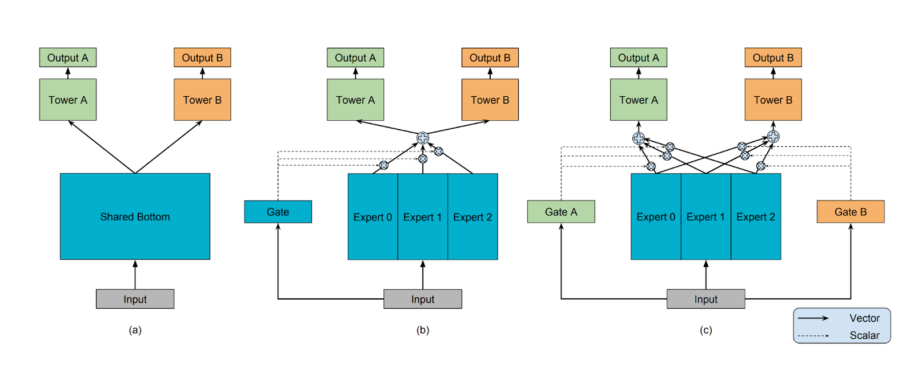

# MMoE and Multi-Objective Recommender Systems (Multi-Task Learning)

> **English** | [繁體中文](./README.zh-TW.md)

> An analysis of how, in video recommender systems, to optimize multiple objectives simultaneously (such as CTR, completion rate, likes, shares), and of the core architecture of MMoE (Multi-gate Mixture-of-Experts).

---

## 1. Why does video recommendation need multi-task learning (MTL)?

In the video recommendation scenario, using a single objective (for example only predicting click-through rate, CTR) easily leads to the "clickbait" problem, harming users' long-term experience. To evaluate recommendation quality comprehensively, the system usually needs to predict multiple objectives simultaneously:
- **CTR (Click-Through Rate)**: whether the user clicks the video.
- **CVR (Conversion Rate) / Watch Time**: whether, after clicking, the user watches it completely, or how long the watch time is.
- **Engagement (interaction)**: whether the user likes, favorites, shares, or comments.

There may be **conflict** between these tasks (for example: clickbait videos have very short watch time; niche trivia videos have long watch time but low click-through rate), and this is the **seesaw phenomenon** common in multi-task learning: optimizing task A instead causes task B's performance to drop.

---

## 2. Problems of the traditional Shared-Bottom architecture

Before MMoE appeared, the industry often used the **Shared-Bottom** architecture:
- The lower layers use the same few layers of neural network (Shared Bottom) to extract shared features.
- The upper layers branch out into an independent Task Tower per task for prediction.
- **Drawback**: if the correlation between multiple tasks is low (or even mutually exclusive), Shared-Bottom, because of the conflicting gradient directions passed down from the different tasks (Gradient Conflict), causes the bottom feature extractor to be unable to learn good features, thereby triggering the seesaw phenomenon.

---

## 3. The core breakthrough of MMoE (Multi-gate Mixture-of-Experts)

> [!IMPORTANT] 【The essence of MMoE】
> By introducing "expert networks (Experts)" and "gating networks (Gates)", MMoE replaces the traditional Shared-Bottom, allowing different tasks to combine bottom features "dynamically and selectively".

To deeply understand MMoE, one must clarify the true role of the following three core components:

### 1. Task Tower —— the place that really has a loss function
- **Role**: **This is where the whole model truly produces the loss (loss function) and initiates gradient backpropagation.**
- Each task has its own independent Task Tower (for example, one computes CTR Loss, one computes Watch Time Loss).
- The learning of the whole MMoE architecture is driven by the Loss of each Task Tower flowing downward via Backpropagation.

### 2. Experts (expert networks) —— merely "feature providers"
- **Role**: An Expert itself does **not** have a dedicated loss function! They are absolutely not making the final decision.
- Their only function is to transform the raw input (Input) into multiple high-level dense feature spaces.
- Why are they called Experts? Because under the joint pull (optimization) of the gradients of multiple Task Towers, different Experts automatically differentiate and implicitly learn to capture patterns of different aspects (for example, Expert A might be sensitive to visual features, Expert B to time-series features).

### 3. Gate (gating network) —— "feature-weight allocator"
- **Role**: Configure a dedicated Gate for "each task".
- The input of a Gate is likewise the raw data vector, and its output is a Softmax weight vector.
- **Function**: For the current input piece of data (User-Video Pair), the Gate decides "how large a proportion of features" the task should take from which Experts.
- For example: the Gate predicting "likes" finds that this piece of data needs to focus on Expert C's representation, so it gives Expert C a higher weight, takes a weighted sum of the outputs of all the Experts, and feeds it into the "likes" Task Tower for prediction.

---

## 4. How does MMoE solve the seesaw phenomenon?

> [!TIP] 【Follow-up question and highlight】
> **Q: Why is MMoE not afraid of task conflict?**
> **A**: In Shared-Bottom, the gradients of all tasks are forced to compromise within the same network; but in MMoE, if the CTR task and the Watch Time task require conflicting features, the Gates of these two tasks automatically allocate the weights to **different Experts**.
> 
> That is to say, MMoE achieves **"soft isolation at the feature level (Soft Routing)"**. Highly correlated tasks can share the same Experts; mutually exclusive tasks each pick different Experts through their Gates, without interfering with one another. This way it can both leverage the big-data generalization advantage brought by MTL and avoid the performance drop caused by gradient conflict.

---

## 5. Multi-task result fusion (Score Fusion) —— how to turn the results of different Task Towers into a final ranking score?

Although MMoE helps us train an excellent dedicated neural-network structure (Task Tower) for each task (for example CTR, CVR, completion rate, interaction rate), when finally recommending to the user, the system can only present based on "a single ranked list". Therefore, entering the final ranking stage, one needs to fuse the predicted values output by the different Task Towers into a single ranking score (Final Ranking Score).

Common fusion methods in the industry include the following:

### 1. Multiplicative / Log-Linear Fusion: the most mainstream in industry
Using exponentially weighted multiplication, the importance of different tasks is regulated through exponential hyperparameters:
$$ \text{Final Score} = (\text{pCTR})^{\alpha} \times (\text{pCVR})^{\beta} \times (\text{pWatchTime})^{\gamma} \times (\text{pLike})^{\delta} $$

- **Advantages**:
  - Has a "one-vote veto" property (as long as one of the key metrics is close to 0, the total score becomes very low).
  - Can quickly and directly regulate online business objectives (for example, if there is a recent need to boost the number of likes, just increase $\delta$).

### 2. Additive Fusion (Linear Combination)
Directly add up the different prediction targets given their corresponding weights:
$$ \text{Final Score} = w_1 \times \text{pCTR} + w_2 \times \text{pCVR} + w_3 \times \text{pWatchTime} + \dots $$

- **Drawbacks and caveats**:
   The absolute magnitudes of the predicted probabilities of the various tasks usually differ enormously (for example, click-through rate might be 5%, but like rate is only 0.1%), and adding them directly causes the large-probability target to overwhelmingly mask the small-probability target. Therefore, if one wants to use addition, one usually needs to first normalize (Normalization / Calibration) each score before adding them up.

### 3. Multiplying directly by expected value (Expected Value)
In e-commerce or certain scenarios where revenue is strictly defined, directly use probabilities to compute expected value:
- E-commerce scenario: $\text{eCPM} = \text{pCTR} \times \text{pCVR} \times \text{Price} \times 1000$
- Video scenario: use the predicted watch time as a value factor, for example $\text{pCTR} \times \text{E(WatchTime)}$

### 4. Automatic model fusion (L2 Ranker)
Rather than relying on manually crafted rules, simply take the outputs (probabilities or logits) of these Task Towers as "features", and feed them to a lightweight model (for example a small neural network or a tree-based model such as XGBoost) for a second-stage ranking.

> [!TIP] 【Advanced follow-up】
> **Q: In the multiplicative formula for multi-objective Score Fusion, how are the weights $\alpha, \beta, \gamma$ determined?**
> **A**: 
> 1. **Early stage**: mainly rely on business experience (increase whatever you care about), or scan parameters via Grid Search.
> 2. **Launch stage**: heavily rely on online **A/B Testing** to observe the impact of different weight combinations on the North Star metric.
> 3. **Advanced stage**: introduce automated parameter-search mechanisms, for example using Bayesian Optimization or evolutionary algorithms to automatically and continuously search for the best fusion weights, reducing the cost of manual tuning.
