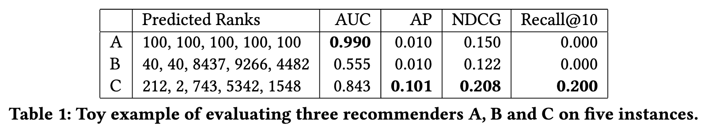
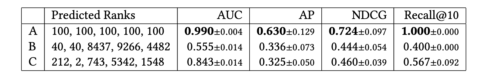
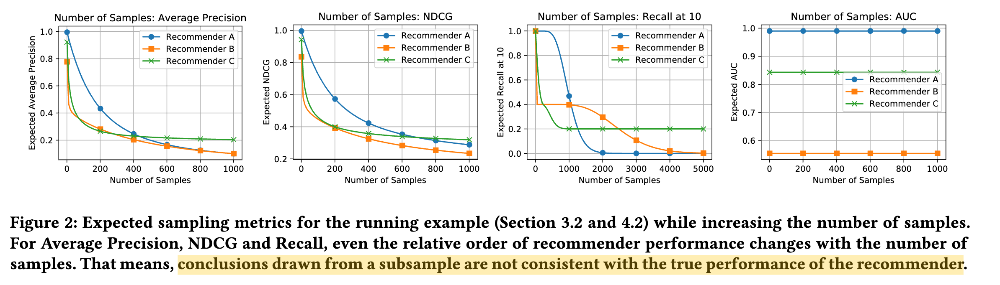

# On Sampled Metrics for Item Recommendation
| Title | Venue | Year | Code |
|-|-|-|-|
| [On Sampled Metrics for Item Recommendation](https://dl.acm.org/doi/abs/10.1145/3394486.3403226) | KDD | '20 | - |ampledMetrics.md) |
### On exact metrics vs On Sampled metrics

The relative ordering of A, B, C is not preserved, except for AUC.

Conclusions drawn from a subsample are ${\color{red}\text{not consistent}}$ with the true performance of the recommender