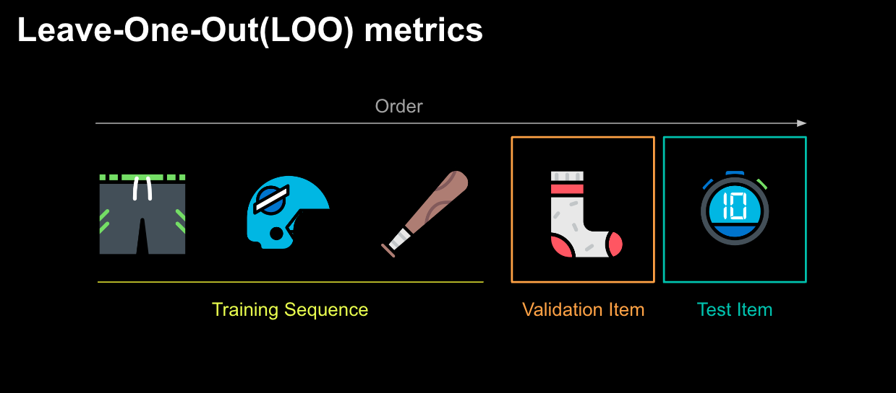
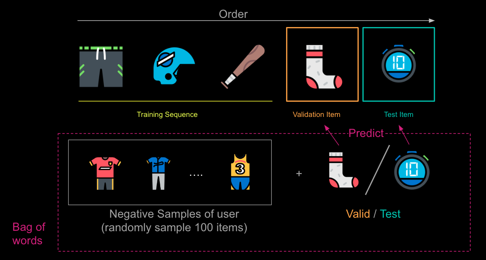
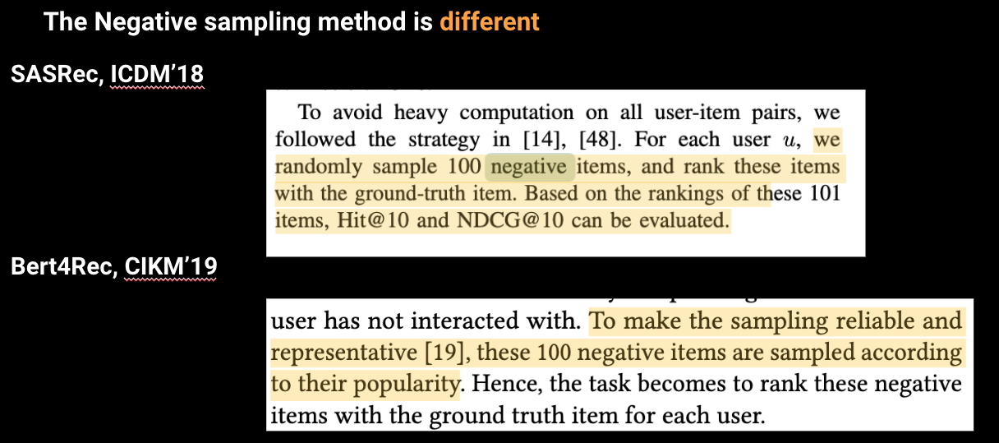
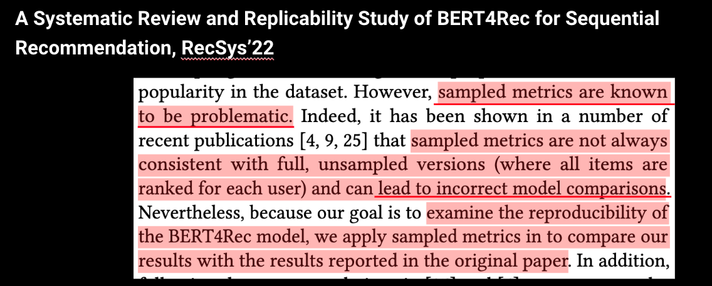

# Metrics
## Leave one out evaluation
In [Neural Collaborative Filtering (NCF)](https://dl.acm.org/doi/abs/10.1145/3038912.3052569) and Self-Attentive Sequential Recommendation (SASRec) are commonly evaluated using the leave-one-out (LOO) evaluation protocol.

In LOO evaluation, for each user in the test set, one of their interactions (i.e., an item they interacted with) is held out and used as the test instance, while the rest of their interactions are used as the training data. This process is repeated for all interactions in the test set.

### Negative Sample Method
Since it is too time-consuming to rank all items for every user during evaluation, Reaserchrs usually sample a subset of items for each user. randomly samples 100 items that are not interacted by the user, ranking the test item among the 100 items. 

### Issues cause by Negative Sample Method
#### 1. Papers use different negative sample methods

#### 2. Leading to incorrect model comparison

#### 3. The hyperparameters tuning on negative sample metrics may affect the performance of the model on real-world scenarios
The choice of hyperparameter settings for the negative sample metrics method can indeed affect the performance of the recommender model on real-world metrics. Some common hyperparameters that can impact the evaluation process are:
1. Number of negative samples: The number of negative samples per positive sample can influence the difficulty of the evaluation task. Choosing a higher number can make the task more challenging and possibly more representative of real-world scenarios.
2. Sampling strategy: Different strategies, such as uniform sampling or popularity-based sampling, can be used to select negative samples. The choice of strategy can impact the evaluation results and their alignment with real-world performance.
3. Seed value: To maintain consistency across different evaluations, it is essential to set a seed value for the random number generator used in the negative sampling process. This ensures that the same negative samples are generated for each evaluation run, allowing for more accurate comparison of model performance.

### Overall
Using all items as metrics appears to offer a more comprehensive view of the recommender system's performance.