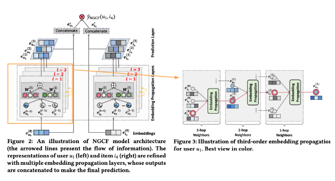
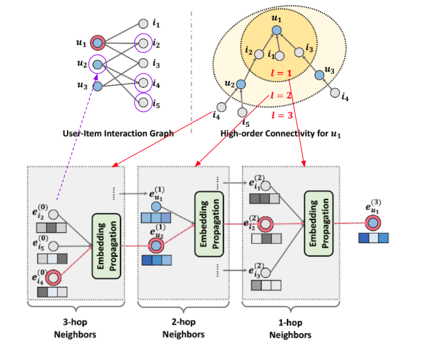

| Property  | Data |
|-|-|
| Created | 2023-02-21 |
| Updated | 2023-02-21 |
| Author | [@Aiden](https://github.com/Aidenzich) |
| Tags | #study |

# NGCF: Neural Graph Collaborative Filtering

| Title | Venue | Year | Code |
|-|-|-|-|
| [NGCF: Neural Graph Collaborative Filtering](https://dl.acm.org/doi/abs/10.1145/3331184.3331267?casa_token=i5O57qzxUGcAAAAA:qcQAVluxs0TUon5n-n9jTOnSciNDXKO73YCVJ_2rJw6jYbutJlrVhvS2Uba8vZTK0_bz1LmrKRxbgg) | SIGIR | ['19](https://sigir.org/sigir2019/program/accepted/) | [✓](https://github.com/Aidenzich/HelloRecsys/blob/main/W9-TA/W9-TA-RecSys.ipynb) | [🔧](./NGCF/) |

## Abstract
| Component | Definition | Example |
|-|-|-|
| Problem Definition | Existing methods for obtaining user and item embeddings in recommender systems map from pre-existing features, but don't encode the `collaborative signal latent` in user-item interactions, which may not be sufficient to capture the collaborative filtering effect. | The collaborative signal latent in user-item interactions is not encoded in existing methods for obtaining user and item embeddings, which may not capture the collaborative filtering effect. |
| Proposed Solution | `NGCF`, a recommendation framework that integrates the user-item interactions, specifically the `bipartite graph structure`, into the embedding process by propagating embeddings on it. This effectively injects the collaborative signal into the embedding process in an explicit manner and models high-order connectivity in the user-item graph. | NGCF integrates the user-item interactions into the embedding process by propagating embeddings on the bipartite graph structure to capture the collaborative signal and model high-order connectivity. |
| Experiment Result | Extensive experiments on three public benchmarks demonstrate significant improvements over several state-of-the-art models, such as HOP-Rec and Collaborative Memory Network. Further analysis verifies the importance of embedding propagation for learning better user and item representations, justifying the rationality and effectiveness of NGCF. | NGCF achieves better results than existing models in experiments on three public benchmarks. Embedding propagation is important for learning better user and item representations.|

## Proposed Solution
### Overall

### First-order Propagation
#### Message Construction
Message construction is used to define the message from user-item pair $(u, i)$:
$$
m_{u \leftarrow i} = f(e_i, e_u, p_{ui})
$$

| Property | Definition |
|-|-|
| $m_{u \leftarrow i}$ | The message embedding, i.e., the information to be propagated |
| $f(\cdot)$ | The message encoding function, which takes embeddings as input |
| $e_i$ | The item embedding |
| $e_u$ | The user embedding |
| $p_{ui}$ | The coefficient to control the decay factor on each propagation on edge $(u,i)$ |

Let $f(\cdot)$ be defined as:

$$
m_{u \leftarrow i} = {\color{gray} \frac{1}{\sqrt{|N_u| |N_i|}}} \big( W_1 e_i +  {\color{green} W_2 (e_i \odot e_u)}  \big)
$$

| Property | Definition |
|-|-|
| $W_1, W_2 \in \mathbb{R}^{d' \times d}$ | The trainable weight matrices to distill useful information for propagtion. |
| $d$ | The embedding size |
| $d'$ | The transformation size |
| ${\color{gray} \text{discount factor}}$ | The the `graph Laplacian norm` |
| $N_u$ and $N_i$ | The first-hop neighbors of user $u$ and item $i$ |
| ${\color{green} W_2 (e_i \odot e_u) }$ | The message dependent on the affinity distinct from `GCN`, `GraphSage`, etc. Passing more information to similar nodes |

#### Message Aggregation
Using `Message aggregation mechanism` to aggregate the messages propagated from $u$'s neighborhood to refine $u$'s representation. The aggregation function is:

$$
e_u^{(1)} = \text{LeakyReLU} ( {\color{cyan} m_{u \leftarrow u}} + {\color{magenta}  \sum_{i \in N_u} m_{u \leftarrow i}} )
$$

| Property | Definition |
|-|-|
| $e_u^{(1)}$ | The representation of $u$ after the first embedding propagation layer |
| $\text{LeakyReLU}$ | Allow messages to encode both positive and small negative signals |
| ${\color{cyan} m_{u \leftarrow u}}$ | Self-connection of u with consideration of edge($u$, $u$) |
| ${\color{magenta}  \sum_{i \in N_u} m_{u \leftarrow i}}$ | Connection with all neighbors of $u$ |

### High-order Propagation
Using `High-order propagation mechanism` to stack more embedding propagation layers to explore  the high‐order connectivity info.

The representation of $u$ at the $l$-th layer is:

$$
\begin{aligned}
e_u^{(l)} &= \text{LeakyReLU} ( {\color{cyan} m_{u \leftarrow u}^{(l)}} + {\color{magenta}  \sum_{i \in N_u} m_{u \leftarrow i}^{(l)}} ) \\
&\left\{ 
    \begin{array}{rcl} 
    m_{u \leftarrow i} =& p_{ui}\bigg(W_1^{(l)} e_i^{(l-1)} + W_2^{(l)} (e_i \odot e_u) \bigg), \\  
    m_{u \leftarrow u} =& W_1^{(l)} e_u^{(l-1)}, \\
    p_{ui} =& \frac{1}{\sqrt{|N_u||N_i|}}
    \end{array}\right.
\end{aligned}
$$