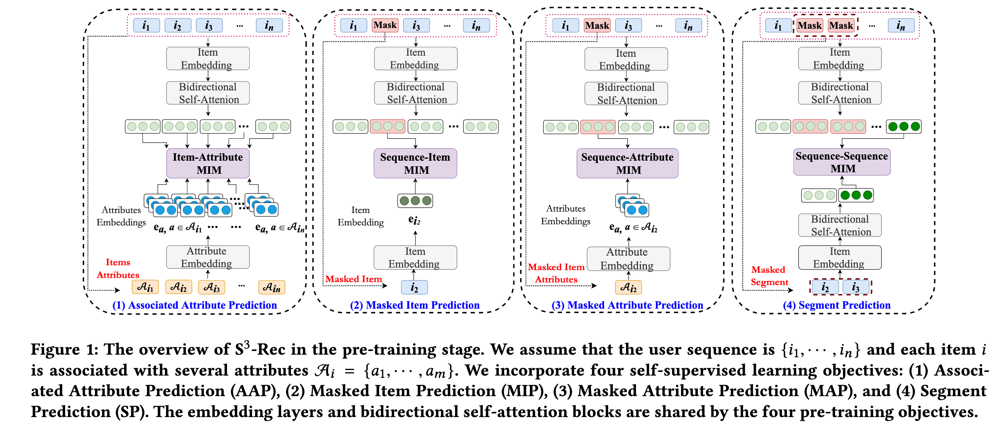
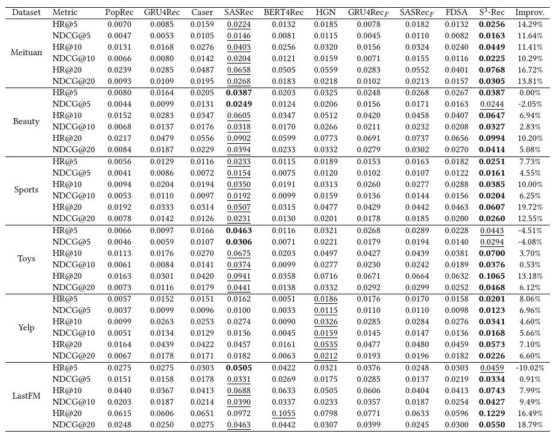

| Property  | Data |
|-|-|
| Created | 2023-02-21 |
| Updated | 2023-04-23 |
| Author | [@Aiden](https://github.com/Aidenzich) |
| Tags | #study |

# S3-rec: Self-supervised learning for sequential recommendation with mutual information maximization
| Title | Venue | Year | Code |
|-|-|-|-|
| [S3-rec: Self-supervised learning for sequential recommendation with mutual information maximization](https://dl.acm.org/doi/abs/10.1145/3340531.3411954) | CIKM | ['20](https://www.cikm2020.org/accepted-papers/accepted-research-papers/) | [✓](https://github.com/RUCAIBox/CIKM2020-S3Rec) |


## Proposed Method



| Method | Description |
|-|-|
| `Mutual Information Maximization (MIM)` | A principle used in machine learning and information theory that aims to maximize the mutual information between two variables, |
| `Base model` | This paper adopted the self-attentive recommender architecture as the base model |
| `4 self-supervisedLearning objectives` | `Associated Attribute Prediction`, `Masked Item Prediction`, `Masked Attrubte Prediction`, `Segment Prediction`. Based on MIM, the four objectives can learn the cor-relations among attribute, item, segment, and sequence, which enhances the data representations for sequential recommendation. |


### Mutual Information Maximization (MIM)

Mutual Information Maximization (MIM) is an optimization technique used in machine learning and information theory to find a representation of data that preserves as much information as possible about the data's underlying structure. In the context of Latex, you might be looking for the mathematical formula of mutual information (MI) between two random variables X and Y. Here's the Latex code for the formula:

$$
\begin{equation}
  I(X; Y) = \sum_{x \in X} \sum_{y \in Y} p(x, y) \log \frac{p(x, y)}{p(x) p(y)}
\end{equation}
$$

The main contribution of this paper is to maximize the mutual information between the encoded representations of these view.
However in implement, they just calculate the loss from different tasks and sum them up.
- In the [model code](https://github.com/RUCAIBox/CIKM2020-S3Rec/blob/master/models.py):
    ```python
    # MIP
    pos_item_embs = self.item_embeddings(pos_items)
    neg_item_embs = self.item_embeddings(neg_items)
    pos_score = self.masked_item_prediction(sequence_output, pos_item_embs)
    neg_score = self.masked_item_prediction(sequence_output, neg_item_embs)
    mip_distance = torch.sigmoid(pos_score - neg_score)
    mip_loss = self.criterion(mip_distance, torch.ones_like(mip_distance, dtype=torch.float32))
    mip_mask = (masked_item_sequence == self.args.mask_id).float()
    mip_loss = torch.sum(mip_loss * mip_mask.flatten())

    # MAP
    map_score = self.masked_attribute_prediction(sequence_output, attribute_embeddings)
    map_loss = self.criterion(map_score, attributes.view(-1, self.args.attribute_size).float())
    map_mask = (masked_item_sequence == self.args.mask_id).float()
    map_loss = torch.sum(map_loss * map_mask.flatten().unsqueeze(-1))

    # SP
    # segment context
    segment_context = self.add_position_embedding(masked_segment_sequence)
    segment_mask = (masked_segment_sequence == 0).float() * -1e8
    segment_mask = torch.unsqueeze(torch.unsqueeze(segment_mask, 1), 1)
    segment_encoded_layers = self.item_encoder(segment_context,
                                            segment_mask,
                                            output_all_encoded_layers=True)

    # take the last position hidden as the context
    segment_context = segment_encoded_layers[-1][:, -1, :]# [B H]
    # pos_segment
    pos_segment_emb = self.add_position_embedding(pos_segment)
    pos_segment_mask = (pos_segment == 0).float() * -1e8
    pos_segment_mask = torch.unsqueeze(torch.unsqueeze(pos_segment_mask, 1), 1)
    pos_segment_encoded_layers = self.item_encoder(pos_segment_emb,
                                                pos_segment_mask,
                                                output_all_encoded_layers=True)
    pos_segment_emb = pos_segment_encoded_layers[-1][:, -1, :]

    # neg_segment
    neg_segment_emb = self.add_position_embedding(neg_segment)
    neg_segment_mask = (neg_segment == 0).float() * -1e8
    neg_segment_mask = torch.unsqueeze(torch.unsqueeze(neg_segment_mask, 1), 1)
    neg_segment_encoded_layers = self.item_encoder(neg_segment_emb,
                                                    neg_segment_mask,
                                                    output_all_encoded_layers=True)
    neg_segment_emb = neg_segment_encoded_layers[-1][:, -1, :] # [B H]

    pos_segment_score = self.segment_prediction(segment_context, pos_segment_emb)
    neg_segment_score = self.segment_prediction(segment_context, neg_segment_emb)

    sp_distance = torch.sigmoid(pos_segment_score - neg_segment_score)

    sp_loss = torch.sum(self.criterion(sp_distance, torch.ones_like(sp_distance, dtype=torch.float32)))

    ```

- In the [trainer code](https://github.com/RUCAIBox/CIKM2020-S3Rec/blob/master/trainers.py):
    ```python
    aap_loss, mip_loss, map_loss, sp_loss = self.model.pretrain(attributes,
                                masked_item_sequence, pos_items, neg_items,
                                masked_segment_sequence, pos_segment, neg_segment)

    joint_loss = self.args.aap_weight * aap_loss + \
                self.args.mip_weight * mip_loss + \
                self.args.map_weight * map_loss + \
                self.args.sp_weight * sp_loss

    self.optim.zero_grad()
    joint_loss.backward()
    self.optim.step()

    aap_loss_avg += aap_loss.item()
    mip_loss_avg += mip_loss.item()
    map_loss_avg += map_loss.item()
    sp_loss_avg += sp_loss.item()
    ```


## Experiment

