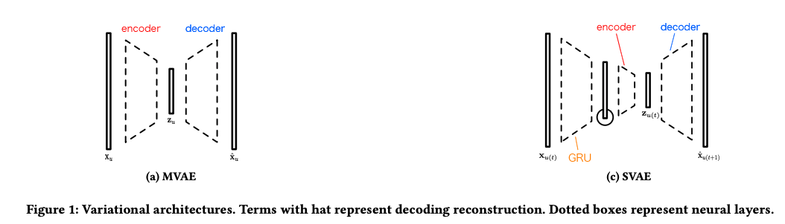

| Property  | Data |
|-|-|
| Created | 2023-02-21 |
| Updated | 2023-03-07 |
| Author | [@Aiden](https://github.com/Aidenzich) |
| Tags | #study |

# Sequential Variational Autoencoders for Collaborative Filtering

| Title | Venue | Year | Code |
|-|-|-|-|
| [SVAE: Sequential Variational Autoencoders for Collaborative Filtering](https://dl.acm.org/doi/abs/10.1145/3289600.3291007) | WSDM | ['19](https://www.wsdm-conference.org/2019/accepted-papers.php) | [✓](https://github.com/noveens/svae_cf) |

## Abstract
| Component  | Definition | Example |
|-|-|-|
| Introduction | The opening section that identifies the success of variational autoencoders in domains such as computer vision and speech processing, but highlights their unexplored potential for modeling user preferences. | "Variational autoencoders have been successful in certain domains but have yet to be fully adopted for modeling user preferences." |
Proposed Solution | The proposed solution is a recurrent version of the VAE that incorporates temporal dependencies among the user-consumption sequence. Instead of passing a subset of the entire history, a subset of the consumption sequence is fed through a series of fully-connected layers at each time-step of the RNN. The output models the probability distribution of the most likely future preferences. | "Our model extends VAE by exploiting the rich information present in the past preference history and handling temporal dependencies through a recurrent encoder." |

## Introduction
| Component | Definition | Example |
|-|-|-|
| Introduction | The opening section that introduces the growing diffusion of web-based services and the importance of understanding `user preferences` to provide a better experience through recommendation. | "Understanding user preferences is crucial for providing a better experience through recommendation in the context of web-based services." |
| Existing Approaches | The discussion of existing `collaborative filtering` and `latent variable models`, as well as new approaches based on neural architectures and deep learning, which have achieved competitive performance with respect to the current state of the art. | "Collaborative filtering and latent variable models have gained substantial attention, but new approaches based on neural architectures and deep learning are starting to gain attention for modeling user preferences." |
| Shortcomings of `Bag-of-Words` | The limitations of the `bag-of-words assumption` in capturing short-term preferences that are specific to several application scenarios, especially in the context of the web, and the need for `ad-hoc modeling` and algorithms to capture causalities and dependencies in sequential data. | `bag-of-words assumption`: when considering a user and her preferences, the order of such preferences can be `neglected` and all preferences are exchangeable. |
| Proposed Solution | The proposed solution is a variational setting that combines deep learning and latent variable modeling for the task of sequence recommendation. Where user preferences exhibit `temporal dependencies`. Recurrent neural network architectures are adopted to model latent dependencies at different abstraction levels. | - |
| Conclusion | The summary and final thoughts of the document, highlighting the proposed framework's effectiveness in capturing both `long-term` and `short-term` user preferences in the context of web-based services. | "The proposed framework demonstrates the importance of capturing both long-term and short-term user preferences in the context of web-based services through deep learning and latent variable modeling." |

## Proposed solution
