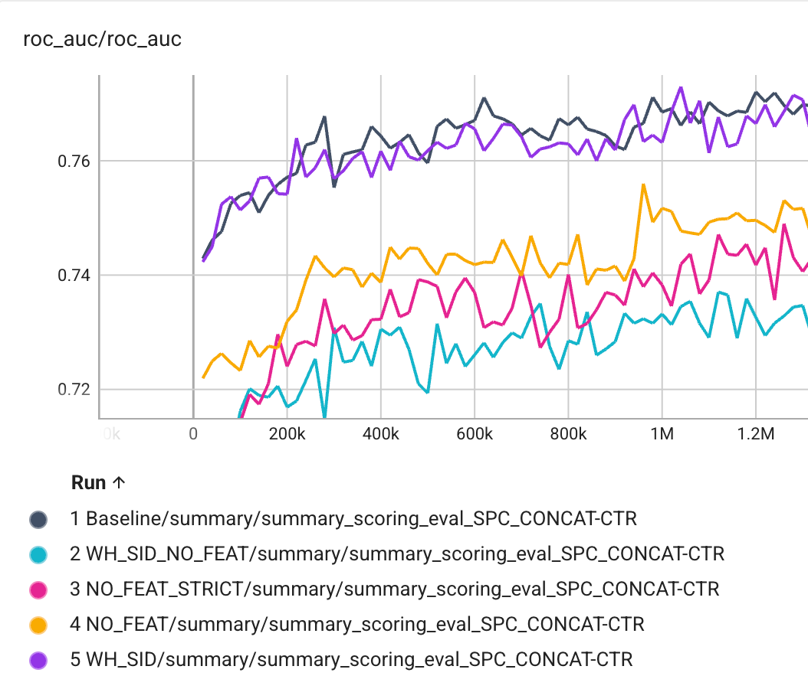

# Token Factory — Research Note
> **English** | [繁體中文](./README.zh-TW.md)

## 📇 Academic Context

| Field | Value |
|-|-|
| Title | Token Factory: Efficiently Integrating Diverse Signals into Large Recommendation Models |
| Venue | arXiv preprint (arXiv:2606.19635v2, cs.IR); the ACM conference template has not been filled with an actual venue/DOI |
| Year | 2026 |
| Authors | Xilun Chen, Shao-Chuan Wang, Baykal Cakici, Lukasz Heldt, Lichan Hong, Raghu Keshavan, Aniruddh Nath, Li Wei, Xinyang Yi (all from Google) |
| Official Code | unknown |
| Venue Kind | paper |

> This note is based on arXiv preprint v2 (the 2026-06-20 revision). The conference and DOI inside the paper PDF are both ACM template placeholder strings (`Conference'17`, `10.1145/nnnnnnn.nnnnnnn`), indicating it has not yet been published at a formal venue; the final published version may differ from this.

## Introduction

Large Recommendation Models (LRMs) built on a Transformer backbone have recently demonstrated great promise on industrial-scale recommendation tasks (the paper uses the phrase "great promise"), and this paper's experiments are built on Google's PLUM framework. The problem is: LRMs are designed for "token sequences", but the truly valuable signals in recommender systems are dense features (e.g., watch completion rate, watch time) and sparse features (e.g., channel, device category)—the paper points out that it is precisely these dense/sparse features that form the foundation of traditional Large Embedding Models (LEMs). To feed these traditional signals into an LRM, the conventional approach is to "textualize" them or convert them into discrete item IDs, but this makes the prompt explode in length and drives memory and compute costs sharply upward—the paper gives the example that, in a next-video prediction task, converting dense signals such as watch completion rate and watch time into text and then handing them to a custom tokenizer causes a significant computational bottleneck.

This paper proposes Token Factory to resolve this tension. The core idea is to convert traditional signals into **soft tokens**: a vector representation that lands directly in the multimodal model's embedding space, rather than a discrete ID looked up from a fixed vocabulary. These soft tokens are produced by a set of Token Makers; in the video recommendation setting the paper gives three: the WH Token Maker (compresses the user's watch history into soft tokens), the Query Token Maker (integrates query/user-level features), and the Candidate Token Maker (integrates candidate-video-level features). Soft tokens can be interleaved with text tokens, so they can inject high-dimensional, continuous, non-textual signals into the model as a new modality without blowing up the prompt length.

The paper measures effectiveness with two classes of tasks, both on the PLUM framework and using YouTube production data. The first is ranking (predicting video CTR), with ROC AUC as the metric and the baseline being the same PLUM model with "textualized SID + custom tokenization". The second is generative retrieval (generating the Semantic ID of the next video), with offline metric Recall@10 and online metrics Unique Impressions, Satisfied Watchers, Satisfied Watch Time. The paper additionally runs a set of ablations that decompose the contribution of soft tokens (WH_SID, NO_FEAT, etc.), as well as analyses of extended watch history and attention visualization. Below we first reconstruct the mechanism, then return to examine how much these pieces of evidence actually support.

## First Principles

### From raw features to soft tokens: the Token Maker

The definition of a soft token is key: it is "a vector generated directly in the model's embedding space", not a discrete ID obtained by looking up a vocabulary. A standard "hard" token requires a tokenizer to map text to a vocabulary index, whereas a soft token is computed directly from raw feature values through a learnable embedding table and transformation, and can therefore preserve the precise numerical information that is easily lost during textualization.

A Token Maker comprises a set of input features and a specification of the "target output tokens". Given input features $F_{input} = [f_1; f_2; ...; f_n]$, each feature is first normalized or embedding-looked-up according to its type to obtain a transformed concatenated representation, which a differentiable function $G$ then maps into $N$ soft tokens:

$$E_{input} = \mathrm{Concat}(t_1(f_1), t_2(f_2), ..., t_n(f_n))$$

$$T_{output} = G(E_{input})$$

where $t_i$ is the transformation function of the $i$-th feature, and $T_{output}$ is $N$ soft tokens each of dimension $d_{model}$ (shape $N \times d_{model}$, then reshaped into $N$ tokens). The function $G$ can be as simple as an MLP or as complex as a Transformer, and it is trained end-to-end jointly with the LRM, ensuring the produced soft tokens are aligned with the LLM's semantic space and the task objective.

The choice of $N$ trades off feature capacity against compute latency: a larger $N$ retains more high-dimensional information but lengthens the downstream Transformer's sequence length and attention cost. The paper's practical rule is to decide by feature type—simple features are mapped to a single token ($N=1$), while long interaction sequences are compressed into a fixed small budget (e.g., $N=10$) to optimize serving efficiency.

Walking through the mechanism with Figure 3's actual config makes it clearest. The heterogeneous features of a single watch item—video Semantic ID, uploader, client name, etc.—each look up an embedding table (e.g., `wh_video_sid` is 24-dim, `wh_client_name` is 4-dim); these embeddings are concatenated and fed into an MLP, outputting a 768-dim (`dim: 768`), length-1 (`length: 1`) soft token. This config's `feature_sequence_length: 500`, `compression_ratio: 1.0` means: a watch history of up to 500 items, at compression ratio 1.0, is projected item-by-item into 500 soft tokens (one token per item), because watch history is inherently a sequence, and applying the same projection to each item across the whole sequence yields the corresponding soft-token sequence.

### How the prompt is shortened

Putting the mechanism back into the prompt shows the compression effect. In the ranking baseline, each watch-history item takes 12 tokens (8 for the SID, 1 for the channel name, 3 for the textualized dense features). The paper uses 200 watch items, user attributes, and candidate video titles as input, with a 1536-token input cap; but 200 items alone require 12×200 = 2400 tokens, already exceeding the cap, so the paper truncates the excess from the left (dropping the oldest watch records), and the original text does not state how many of the 200 items are actually retained. Switching to Token Factory, under the same comparison setting each watch item becomes 1 soft token, and the prompt length drops directly to 480 tokens. The generative retrieval baseline takes 5 tokens per item (1 random hash of the SID sequence, 1 channel-name hash, 3 dense features), with a prompt cap of 768; the treatment likewise compresses each item into 1 soft token, and the prompt containing 200 watch items drops to 256 tokens. The design trade-off here is: the paper keeps a small number of text tokens such as the video title to borrow the LLM's natural-language understanding, and only replaces the repetitive, verbose numerical/ID features with soft tokens.

### Secondary compression for longer sequences

When the watch history reaches thousands of items or even a user's lifetime of viewing, one-token-per-item is still not economical enough, and the paper offers two further ways to compress the soft-token sequence. The first is MLP compression: taking the JAX array of shape $[batch\_size, N, token\_dim]$ that has already been converted to soft tokens, apply an $[N, ..., M]$ MLP along the sequence dimension to reduce the sequence length from $N$ to $M$, obtaining an $M/N$ compression ratio. The second borrows from LONGER, using a lightweight Transformer to do attention pooling over every $K$ items, i.e., summarizing $K$ items with one soft token, for a compression ratio of $1/K$.

### Full architecture and prefix caching

![Figure 2: The overall Token Factory architecture. Traditional signals such as dense, sparse, and embedding are turned into soft tokens by the three Token Makers, and arranged into the prompt together with text tokens such as the task instruction and video titles to feed the LRM; the dotted KV Cache box in the figure encloses only the cross-candidate-invariant prefix that can be precomputed and cached (task instruction, watch-history and query/user-side soft tokens, video titles and other text), while the soft tokens produced by the Candidate Token Maker fall outside the box because they change with the candidate and are not cached.](imgs/fig2-architecture.png)

Stringing the three Token Makers together, Token Factory is a framework that uniformly converts dense/sparse/embedding signals into a soft-token modality and then interleaves them with text tokens in the prompt (Figure 2). There is a practically important efficiency point here: when scoring multiple candidate videos within the same recommendation request, the query- and user-level features are fixed and unchanging, so their corresponding soft tokens can be precomputed and cached (prefix caching / KV cache), greatly reducing inference latency—this is also one of the motivations for splitting the "static query signals" and the "candidate signals that vary with the candidate" into different Token Makers.

### Experimental evidence

![Figure 4: Under the same batch size, the ROC AUC of the baseline (black line) and Token Factory (red line) on the CTR task. The red line is slightly lower initially and catches up at about 1.5M steps, then runs roughly neck-and-neck with the baseline afterward. The vertical AUC axis roughly falls in the range of about 0.74–0.77, but this is a range read off the chart's vertical axis by eye; the paper's main text and caption do not list step-by-step AUC values, and the only thing clearly supported by the text is "catches up at about 1.5M steps, comparable performance afterward".](imgs/fig4-roc-same-batch.png)

The ranking experiments run on a PLUM model derived from a 110M MoE version of the Gemini encoder. In the fair comparison at the same batch size (Figure 4), the treatment using soft tokens has lower AUC initially, catches up with the baseline at about 1.5M steps, and performs comparably afterward; the paper explains the initial lag is because Token Factory introduces randomly initialized token-maker parameters and new sparse-feature embedding tables, which must learn from scratch to project raw signals into the LLM's semantic space. The real efficiency dividend comes from compression: because the treatment's prompt length is only about 30% of the baseline's, at the same batch size (Figure 4) training is about 200% faster—this is a pure speed advantage, coexisting with the observation that the initial AUC catches up. The paper then trades this saved compute for a larger batch: separately increasing the treatment's global batch size by 200% (Figure 5), and only then does Token Factory beat the baseline very early on. In other words, "trains 200% faster" and "beats the baseline" are results under two different settings, not the same causal chain.

The generative retrieval task runs on a PLUM model derived from a 210M MoE version of the Gemini decoder, with results that are both offline and online. Offline Recall@10 improves by +2.0% relative to the baseline; on the online side, Unique Impressions improves +16.8%, of which the Unique Impressions of "fresh videos within one day" surges +67.1%, showing that compression allows longer interaction sequences to be packed in, favoring retrieval of new content; meanwhile Satisfied Watchers +0.04% and Satisfied Watch Time +0.05% are positive. These online experiments come from the retrieval stage of YouTube's homepage recommendation.

| Metric (retrieval, YouTube homepage) | Relative to baseline |
|-|-|
| Recall@10 (offline) | +2.0% |
| Unique Impressions (online) | +16.8% |
| Unique Impressions, one-day fresh videos (online) | +67.1% |
| Satisfied Watchers (online) | +0.04% |
| Satisfied Watch Time (online) | +0.05% |

The scaling / ablation study fixes all treatments and the baseline at 480 tokens and batch size 32k to isolate variables (Figure 6). Three observations are worth noting: first, when all dense/sparse features are present, using soft tokens or textual SIDs for watch history makes no notable difference (Baseline and WH_SID nearly overlap); second, comparing NO_FEAT_STRICT and WH_SID_NO_FEAT, the soft-token version of watch history beats the textual-SID version, but the paper honestly points out this is "mainly because of the 480 context budget"—soft tokens can fit all 200 watch items into the prompt, while textual SIDs get truncated by the budget; third, comparing NO_FEAT and NO_FEAT_STRICT shows that stuffing more features into each soft token does help CTR prediction. The paper also runs an extended-sequence study: extending watch history from 200 to 500, using a 10% compression ratio to compress the added 300 items into 30 soft tokens, and AUC improves by +0.08%. Note the paper itself points out: in this comparison the treatment's prompt has 30 more tokens than the baseline to hold this batch of compressed soft tokens, so it is not a strictly fixed-token-budget comparison, and the +0.08% simultaneously mixes in the two variables of "30 more tokens" and "300 more history items".

Appendix A uses attention heatmaps to contrast the two representations. In the textual-SID model (Figure 9), high-frequency tokens like `A1909`—often the first sub-token of a SID sequence—are barely attended to, and nearly half of the textual-SID tokens show unused blank regions; conversely, the soft-token model (Figure 7) has non-zero attention on all soft tokens. The paper argues from this that, after compressing heterogeneous features into soft tokens, each token is used by at least some attention head, reducing the redundancy in the textual-SID representation.

## 🧪 Critical Assessment

### Is the problem real

This problem is real and concrete in the industrial recommendation context: when the baseline spends 12 tokens on each watch item while the input cap is only 1536 (when targeting 200 watch-history items, 12×200 = 2400 already exceeds the cap, and the paper can only truncate the oldest records from the left), prompt length does directly bottleneck "how long a user history can be considered" and "serving cost". The paper's concrete conversions from 1536→480 and 768→256 make this pain point quantifiable, not a vague motivation. Injecting dense/sparse signals into the Transformer as an embedding modality is also a defensible engineering need in the LRM era.

### Are the baseline, ablation, and metrics sufficient

There are several places on the evidence side that need discounting. The most critical confound is: ranking's "beats the baseline" only appears after increasing the treatment's batch size by 200% (Figure 5), while the truly fair comparison at the same batch size (Figure 4) yields only "catches up", not a "win". Note that the "trains about 200% faster" the paper reports is a separate matter—it is a pure speed advantage at the same batch size, arising because the prompt length is only about 30% (the Figure 4 setting), not "faster only after enlarging the batch", and it cannot be read as the soft-token representation itself being higher in quality. Taken together, the quality advantage mainly comes from the compute saved by compression being traded for a larger batch, rather than the soft-token representation itself being stronger—the paper's own narrative actually supports this more conservative reading. Second, the magnitude of the online gains is tiny: Satisfied Watchers +0.04% and Satisfied Watch Time +0.05% are almost at the noise level, and the whole paper has no confidence interval, variance, or significance test, so readers have no way to judge whether these numbers are stable. Even the flagship figure +67.1% warrants caution: "Unique Impressions" is a self-defined metric skewed toward the exposure side, and a surge in exposure need not equal user value, while the two metrics that truly measure satisfaction are nearly flat.

Moreover, the conclusion in ablation Figure 6 that "soft tokens beat textual SID" is attributed by the paper itself to the 480 token budget causing textual SIDs to be truncated—which is actually saying the advantage comes from compression (being able to fit in 200 items without truncation), not from the representation itself being superior. In fact, under the same fixed 480 setting with dense/sparse features present, soft tokens and textual SIDs have "no notable difference" to begin with (the paper's own words, corresponding to Baseline and WH_SID nearly overlapping); as for the "relax the budget so that neither gets truncated" comparison, the paper never does it, so one cannot claim from this that the soft-token representation itself is stronger. The attention visualization (Figure 7 vs 9) is "denser attention", but denser does not equal more effective; the paper does not use any downstream metric to link "less sparse attention" to "better quality", and this argument stops at the observational level.

### Is this a new method or a repackaging of existing components

Mechanistically, a soft token is essentially a continuous-prompt representation that sends raw features through a learnable projection into the embedding space, conceptually close to the existing ideas of prompt tuning and feature-as-embedding, and the paper explicitly states $G$ "can be as simple as an MLP". The two sequence-compression tricks also each inherit from prior work (MLP compression is a common technique; attention pooling is explicitly borrowed from LONGER). Therefore Token Factory's contribution is less a brand-new mechanism than an engineering framework and naming that abstracts the Token Maker and uniformly injects dense/sparse/sequence signals into the LRM; its value lies in integration and extensibility, rather than a single-point algorithmic novelty, and this should be assessed honestly when evaluating its novelty.

### Whether it truly solves the problem, and deployment relevance

On the clear goal of "shortening the prompt in exchange for a larger batch and longer history", the paper does demonstrate considerable efficiency improvements, with positive (if tiny) online gains, which may still have real significance for a system at YouTube's scale. But note two deployment limitations: first, the reproducibility of the evaluation is limited: the offline metrics themselves use recognized standard measures like ROC AUC and Recall@10, not self-invented ones, but the baseline model they rely on (PLUM), the training and evaluation data (YouTube's private production data), and the online metrics (Unique Impressions, Satisfied Watchers, etc.) are all internally self-defined and unreleased, and the paper also does not release a reproducible codebase, so external parties cannot independently re-run or verify, and the numbers can only be treated as a single team's report on a single system; second, the efficiency gains the paper claims are mostly presented as relative percentages (prompt is 30%, training 200% faster), lacking absolute latency, memory, or serving-cost figures, and it does not give the actual AUC gap for the ranking task. Overall, the conclusion should be read as "in this production environment, soft tokens can substantially compress the prompt with almost no loss of quality", rather than "the soft-token representation is generally superior in quality to textualization".

## 🔗 Related notes

- [ActionPiece](../ActionPiece/) — also addresses "how to tokenize item/behavior sequences for generative recommendation models", offering a contrast between the trade-offs of the soft-token and discrete-action-token routes.
