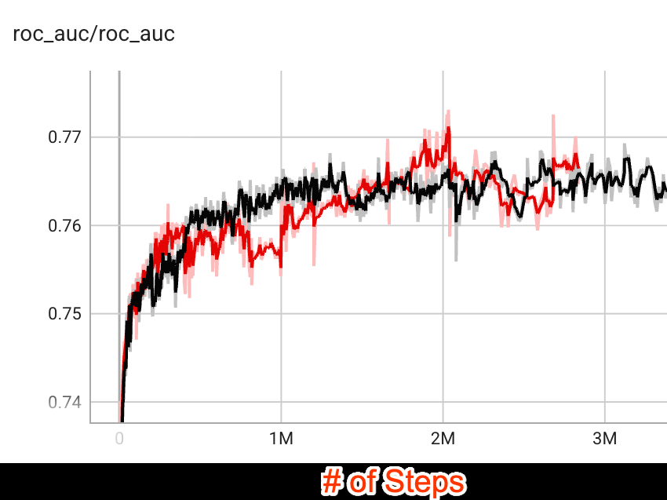

# Token Factory — Research Note
> [English](./README.md) | **繁體中文**

## 📇 Academic Context

| Field | Value |
|-|-|
| Title | Token Factory: Efficiently Integrating Diverse Signals into Large Recommendation Models |
| Venue | arXiv preprint (arXiv:2606.19635v2, cs.IR); ACM 會議模板尚未填入實際 venue／DOI |
| Year | 2026 |
| Authors | Xilun Chen, Shao-Chuan Wang, Baykal Cakici, Lukasz Heldt, Lichan Hong, Raghu Keshavan, Aniruddh Nath, Li Wei, Xinyang Yi（均為 Google） |
| Official Code | unknown |
| Venue Kind | paper |

> 本筆記依據 arXiv 預印本 v2（2026-06-20 修訂版）撰寫。論文 PDF 內的會議與 DOI 皆為 ACM 模板佔位字串（`Conference'17`、`10.1145/nnnnnnn.nnnnnnn`），代表它尚未在正式 venue 發表，正式版內容可能與此不同。

## Introduction

以 Transformer 為骨幹的 Large Recommendation Model（LRM）近年在工業級推薦任務上展現了很大的潛力（論文用 great promise 形容），本文實驗即建立在 Google 的 PLUM 框架上。問題在於：LRM 是為「token 序列」設計的，而推薦系統真正有價值的訊號是 dense 特徵（如觀看完成率、觀看時長）與 sparse 特徵（如頻道、裝置類別）——論文指出，正是這類 dense／sparse 特徵構成了傳統 Large Embedding Model（LEM）的基礎。要把這些傳統訊號餵進 LRM，慣常做法是把它們「文字化（textualize）」或轉成離散 item ID，但這會讓 prompt 爆長、記憶體與計算成本飆高——論文舉例，在 next-video 預測任務中，把觀看完成率、觀看時長等 dense 訊號轉成文字再交給 custom tokenizer，會造成顯著的計算瓶頸。

本文提出 Token Factory 來解這個矛盾。核心概念是把傳統訊號轉成 **soft token**：一種直接落在多模態模型 embedding 空間裡的向量表示，而不是從固定字彙表查出的離散 ID。這些 soft token 由一組 Token Maker 產生，論文在影片推薦情境下給出三種：WH Token Maker（把使用者觀看歷史壓成 soft token）、Query Token Maker（整合 query／使用者層級特徵）、Candidate Token Maker（整合候選影片層級特徵）。soft token 可以和文字 token 交錯排列，因此能在不撐爆 prompt 長度的前提下，把高維、連續、非文字的訊號當成一個新 modality 注入模型。

論文用兩類任務衡量成效，都在 PLUM 框架上、以 YouTube 生產環境資料進行。第一類是 ranking（預測影片 CTR），指標為 ROC AUC，baseline 是「文字化 SID + custom tokenization」的同一顆 PLUM 模型。第二類是 generative retrieval（生成下一支影片的 Semantic ID），離線指標為 Recall@10，線上指標為 Unique Impressions、Satisfied Watchers、Satisfied Watch Time。論文另做了一組拆解 soft token 貢獻的 ablation（WH_SID、NO_FEAT 等），以及延長觀看歷史與 attention 視覺化的分析。以下先重建機制，再回頭審視這些證據到底支撐了多少。

## First Principles

### 從原始特徵到 soft token:Token Maker

soft token 的定義是關鍵：它是「直接生成於模型 embedding 空間的向量」，而非查字彙表得到的離散 ID。標準的「hard」token 需要 tokenizer 把文字對映到字彙索引，soft token 則是透過可學習的 embedding table 與轉換，直接從原始特徵值算出來，因此能保留在文字化過程中容易流失的精確數值資訊。

一個 Token Maker 包含一組輸入特徵與一份「目標輸出 token」的規格。給定輸入特徵 $F_{input} = [f_1; f_2; ...; f_n]$，每個特徵先依其型別做正規化或 embedding lookup，得到轉換後的串接表示，再由一個可微分函數 $G$ 映射成 $N$ 個 soft token:

$$E_{input} = \mathrm{Concat}(t_1(f_1), t_2(f_2), ..., t_n(f_n))$$

$$T_{output} = G(E_{input})$$

其中 $t_i$ 是第 $i$ 個特徵的轉換函數,$T_{output}$ 是 $N$ 個維度為 $d_{model}$ 的 soft token（形狀 $N \times d_{model}$,再 reshape 成 $N$ 個 token）。函數 $G$ 可以簡單如一個 MLP,也可以複雜到是一個 Transformer,而且它與 LRM 端到端共同訓練,確保產生的 soft token 對齊 LLM 的語意空間與任務目標。

$N$ 的選擇是在特徵容量與計算延遲之間權衡:$N$ 越大保留越多高維資訊,但會拉長下游 Transformer 的序列長度與 attention 開銷。論文的實務準則是依特徵型別決定——簡單特徵映成單一 token（$N=1$）,而長互動序列則壓進一個固定的小預算（例如 $N=10$）以優化 serving 效率。

用 Figure 3 的實際 config 走一遍最能看清機制。單一觀看項目的異質特徵——影片 Semantic ID、上傳者、client 名稱等——各自查 embedding table（例如 `wh_video_sid` 是 24 維、`wh_client_name` 是 4 維),把這些 embedding 串接後送進 MLP,輸出一個 768 維（`dim: 768`)、長度為 1（`length: 1`)的 soft token。這份 config 的 `feature_sequence_length: 500`、`compression_ratio: 1.0` 代表:一段最長 500 項的觀看歷史,在壓縮比 1.0 下會被逐項投影成 500 個 soft token(一項一個 token),因為觀看歷史本質上是序列,對整段序列逐項套用同一個投影即可得到對應的 soft token 序列。

### Prompt 如何縮短

把機制放回 prompt 就看得到壓縮效果。在 ranking 的 baseline 裡,每個觀看歷史項目佔 12 個 token(8 個給 SID、1 個給頻道名稱、3 個給文字化的 dense 特徵)。論文以 200 個觀看項目、使用者屬性與候選影片標題為輸入,設定 1536 token 的輸入上限;但單是 200 項就要 12×200 = 2400 個 token,已超過上限,論文因此把超出的部分從左側截斷(丟掉最舊的觀看紀錄),原文並未說明 200 項中實際保留了幾項。改用 Token Factory 後,在同一比較設定下每個觀看項目變成 1 個 soft token,prompt 長度直接降到 480 token。generative retrieval 的 baseline 每項佔 5 個 token(1 個 SID 序列的隨機 hash、1 個頻道名稱 hash、3 個 dense 特徵),prompt 上限 768;treatment 同樣把每項壓成 1 個 soft token,包含 200 個觀看項目的 prompt 長度降到 256。這裡的設計取捨是:論文保留了影片標題等少量文字 token 來借用 LLM 的自然語言理解能力,只把重複、冗長的數值/ID 特徵換成 soft token。

### 更長序列的二次壓縮

當觀看歷史來到數千項甚至使用者終身觀看時,一項一個 token 仍不夠省,論文再提兩種把 soft token 序列進一步壓縮的做法。第一種是 MLP 壓縮:把已轉成 soft token、形狀為 $[batch\_size, N, token\_dim]$ 的 JAX 陣列,在序列維度上套一層 $[N, ..., M]$ 的 MLP,把序列長度從 $N$ 降到 $M$,得到 $M/N$ 的壓縮比。第二種借鑑 LONGER,用一個輕量 Transformer 對每 $K$ 個 item 做 attention pooling,等於用一個 soft token 概括 $K$ 個項目,壓縮比為 $1/K$。

### 架構全貌與 prefix caching

把三個 Token Maker 串起來看,Token Factory 就是一個把 dense/sparse/embedding 訊號統一轉成 soft token modality、再與文字 token 交錯排進 prompt 的框架(Figure 2)。這裡有個實務上重要的效率點:在同一次推薦請求中對多個候選影片評分時,query 與使用者層級特徵是固定不變的,因此它們對應的 soft token 可以預先算好並快取(prefix caching / KV cache),大幅降低推論延遲——這也是把「靜態的 query 訊號」與「隨候選變動的 candidate 訊號」拆成不同 Token Maker 的動機之一。

### 實驗證據

ranking 任務的實驗跑在一個由 110M MoE 版 Gemini encoder 衍生的 PLUM 模型上。在相同 batch size 的公平比較(Figure 4)下,用 soft token 的 treatment 初期 AUC 較低,約在 1.5M steps 追上 baseline,之後表現相當;論文解釋初期落後是因為 Token Factory 引入了隨機初始化的 token maker 參數與新的 sparse 特徵 embedding table,得從零學會把原始訊號投影進 LLM 的語意空間。真正的效率紅利來自壓縮:因為 treatment 的 prompt 長度只有 baseline 的約 30%,在同一 batch size 下(Figure 4)訓練速度就快約 200%——這是一個純速度優勢,與初期 AUC 追平的觀察並存。論文接著把這份省下的算力換成更大 batch:另外把 treatment 的 global batch size 調大 200%(Figure 5),此時 Token Factory 才在很早期就贏過 baseline。換言之,「訓練快 200%」與「贏過 baseline」是兩個不同設定下的結果,不是同一條因果鏈。

generative retrieval 任務跑在一個 210M MoE 版 Gemini decoder 衍生的 PLUM 模型上,結果同時有離線與線上數字。離線 Recall@10 相對 baseline 提升 +2.0%;線上部分,Unique Impressions 提升 +16.8%,其中「一日內新鮮影片」的 Unique Impressions 更暴增 +67.1%,顯示壓縮後能塞進更長互動序列、有利於檢索新內容;同時 Satisfied Watchers +0.04%、Satisfied Watch Time +0.05% 為正向。這些線上實驗來自 YouTube 首頁推薦的 retrieval 階段。

| 指標(retrieval,YouTube 首頁) | 相對 baseline |
|-|-|
| Recall@10(離線) | +2.0% |
| Unique Impressions(線上) | +16.8% |
| Unique Impressions,一日新鮮影片(線上) | +67.1% |
| Satisfied Watchers(線上) | +0.04% |
| Satisfied Watch Time(線上) | +0.05% |

scaling / ablation 研究把所有 treatment 與 baseline 固定在 480 token、batch size 32k 來隔離變因(Figure 6)。三個觀察值得記:其一,當所有 dense/sparse 特徵都在時,watch history 用 soft token 或用文字 SID 沒有明顯差距(Baseline 與 WH_SID 幾乎重疊);其二,比較 NO_FEAT_STRICT 與 WH_SID_NO_FEAT,soft token 版的 watch history 勝過文字 SID 版,但論文誠實指出這「主要是因為 480 的 context 預算」——soft token 能把 200 個觀看項目全放進 prompt,文字 SID 卻會因預算被截斷;其三,比較 NO_FEAT 與 NO_FEAT_STRICT,可見在每個 soft token 裡多塞特徵確實有助 CTR 預測。論文另做延長序列研究:把觀看歷史從 200 拉到 500,用 10% 壓縮比把新增的 300 項壓成 30 個 soft token,AUC 有 +0.08% 的提升。要注意論文自己點明:這個比較裡 treatment 的 prompt 比 baseline 多了 30 個 token 來裝這批壓縮後的 soft token,所以它並不是嚴格固定 token 預算下的對照,+0.08% 同時混入了「多 30 個 token」與「多 300 項歷史」兩個變因。

附錄 A 用 attention 熱圖對比兩種表示。在文字 SID 模型(Figure 9)裡,像 `A1909` 這類常作為 SID 序列首個子 token 的高頻 token 幾乎不被關注,近半數文字 SID token 呈現未被使用的留白區;相對地,soft token 模型(Figure 7)則在所有 soft token 上都有非零 attention。論文據此主張,把異質特徵壓進 soft token 後,每個 token 至少會被某個 attention head 用到,減少了文字 SID 表示裡的冗餘。

## 🧪 Critical Assessment

### 問題是不是真的

這個問題在工業推薦脈絡下是真實且具體的:當 baseline 每個觀看項目就要吃掉 12 個 token,而輸入上限只有 1536(以 200 項觀看歷史為目標時,12×200 = 2400 已超過上限,論文只能從左側截斷最舊紀錄),prompt 長度確實直接卡住了「能考慮多長的使用者歷史」與「serving 成本」,論文從 1536→480、768→256 的具體換算讓這個痛點可量化,不是空泛的動機。把 dense/sparse 訊號當成 embedding modality 注入 Transformer,也是 LRM 時代一個站得住腳的工程需求。

### baseline、ablation、metric 夠不夠

證據面有幾個需要打折的地方。最關鍵的混淆是:ranking 的「贏過 baseline」只在把 treatment 的 batch size 調大 200% 之後才出現(Figure 5),而真正同 batch size 的公平比較(Figure 4)只得到「追平」而非「勝出」。要留意論文報告的「訓練快約 200%」是另一回事——它是同 batch size 下、因 prompt 長度只有約 30% 而來的純速度優勢(Figure 4 的設定),並不是「調大 batch 後才變快」,也不能被讀成 soft token 表示本身在品質上更強。合起來看,品質上的優勢主要來自壓縮省下的算力被換成更大 batch,而非 soft token 表示本身更強——論文自己的敘述其實支持這個較保守的解讀。其次,線上收益的量級極小:Satisfied Watchers +0.04%、Satisfied Watch Time +0.05% 幾乎在雜訊等級,而全篇沒有任何信賴區間、變異數或顯著性檢定,讀者無從判斷這些數字是否穩定。連招牌數字 +67.1% 也要小心:「Unique Impressions」是偏曝光面的自定義指標,曝光量暴增未必等於使用者價值,而真正衡量滿意度的兩個指標卻近乎持平。

此外,ablation Figure 6 裡「soft token 勝過文字 SID」的結論被論文自己歸因於 480 的 token 預算造成文字 SID 被截斷——這其實是在說優勢來自壓縮(能不截斷地塞進 200 項),而非表示法本身更優。事實上在 dense/sparse 特徵齊備的同一個固定 480 設定下,soft token 與文字 SID 本來就「沒有明顯差距」(論文原話,對應 Baseline 與 WH_SID 幾乎重疊);至於「放寬預算到兩者都不會被截斷」的對照,論文從頭到尾沒有做,因此無法據此宣稱 soft token 表示法本身更強。attention 視覺化(Figure 7 vs 9)是「更密集的 attention」,但密集不等於更有效,論文並未用任何下游指標把「attention 較不稀疏」連結到「品質較好」,這段論證停在觀察層次。

### 這是新方法還是既有元件的重新包裝

從機制看,soft token 本質上是把原始特徵經可學習投影送進 embedding 空間的連續 prompt 表示,與 prompt tuning、feature-as-embedding 的既有想法在概念上相近,而論文明講 $G$「可以簡單如一個 MLP」。序列壓縮的兩招也分別承接既有工作(MLP 壓縮是常見手法、attention pooling 明白借鑑 LONGER)。因此 Token Factory 的貢獻與其說是全新機制,不如說是一個把 Token Maker 抽象化、統一 dense/sparse/sequence 訊號注入 LRM 的工程框架與命名;其價值在整合與可擴充性,而非某個單點的演算法創新,這點在評估其新穎性時應據實看待。

### 有沒有真的解決,以及落地相關性

在「縮短 prompt、換取更大 batch 與更長歷史」這個明確目標上,論文確實展示了可觀的效率改善,且線上有正向(即使微小)的收益,對 YouTube 這種規模的系統仍可能有實際意義。但要留意兩點落地限制:一是評估的可重現性有限:離線指標本身用的是 ROC AUC、Recall@10 這類公認的標準度量,並非自創,但它們所依附的 baseline 模型(PLUM)、訓練與評估資料(YouTube 私有生產資料)以及線上指標(Unique Impressions、Satisfied Watchers 等)都是內部自定義且未公開,論文也未釋出可重現的碼庫,外部因此無法獨立重跑或驗證,數字只能當作單一團隊在單一系統上的報告;二是論文宣稱的效率收益多以相對百分比呈現(prompt 為 30%、訓練快 200%),缺少絕對的延遲、記憶體或 serving 成本數字,也沒有給 ranking 任務的實際 AUC 落差。整體而言,結論宜讀作「在此生產環境下,soft token 能以幾乎不損品質的方式大幅壓縮 prompt」,而非「soft token 表示在品質上普遍優於文字化」。

## 🔗 Related notes

- [ActionPiece](../ActionPiece/) — 同樣處理「如何把 item／行為序列 tokenize 給生成式推薦模型」,可對照 soft token 與離散 action token 兩種路線的取捨。
