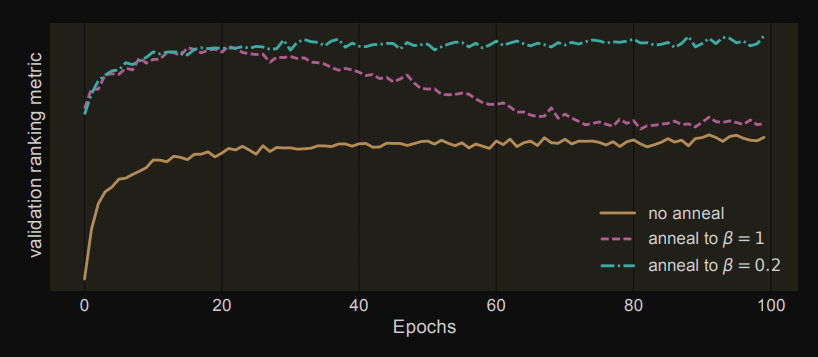
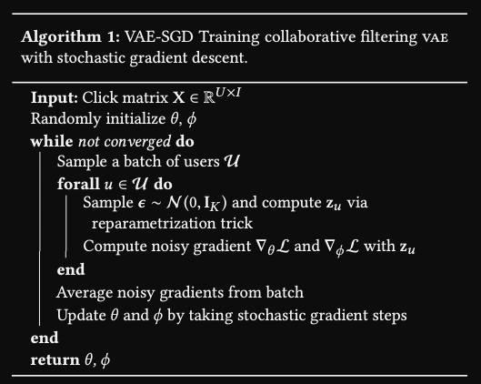
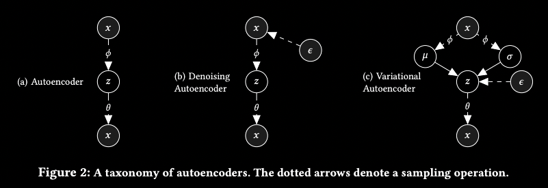

# Variational Auto-encoders for Collaborative Filtering

- [paper](https://dl.acm.org/doi/pdf/10.1145/3178876.3186150)
- WWW ‘18

## Contribution

- Extend variational auto-encoders to collaborative filtering for implicit feedback
- Use the non-linear probabilistic model
- multinomial likelihood + Bayesian inference
- Introducing a different regularization parameter
    - Tune the parameter using annealin
- Extended experiments comparing the multinomial likelihood with other commonly used likelihood functions in the latent factor collaborative filtering literature.

## Cause-effect

| Cause | Effect |
| --- | --- |
| Latent factor models are inherently linear, which limits their modeling capacity | Adding carefully crafted non-linear features into the linear latent factor models can significantly boost recommendation performance. e.g. neural networks |
|  | Vaes generalize linear latent-factor models and enable us to explore non-linear probabilistic latent-variable models, powered by neural networks. |
| Top-N ranking loss is difficult to optimize directly and previous work on direct ranking loss minimization resorts to relaxations and approximations | This paper shows that: 
the multinomial likelihoods are well-suited for modeling implicit feedback data and are a closer proxy to the ranking loss relative to more popular likelihood functions such as Gaussian and logistic. |
| A recommendation is often considered a big-data, but in  contrast, it represents a uniquely challenging “small-data” | To make use of the sparse signals from users and avoid overfitting, we build a probabilistic latent-variable model that shares statistical strength among users and items. |
| Applying VAES to recommender systems | 1. Use a multinomial likelihood for the data distribution, which outperforms the more commonly used Gaussian and logistic likelihoods.
2. Reinterpret and adjust the standard vae objective which we argue is over-regularized, propose using ⁍.  We draw connections between the learning algorithm resulting from our proposed regularization and the information-bottleneck principle and maximum-entropy discrimination. |

## Method

### 1. Model


- $u \in \{1, ..., U\}$: users index.
- $I \in \{1, ..., I\}$: items index.
- $X \in \mathbb{N}^{U \times I}$: user-by-item interaction matrix is the click matrix
    - $\mathbb{N}$: the set of natural numbers.
- $x_u = [x_{u1}, ..., x_{uI}]^{\intercal} \in \mathbb{N^I}$
    - is a bag-of-words vector with the number of clicks for each item from user $u$.
    - For simplicity, we binarize the click matrix. It is straightforward to extend it to general count data.
- The model  transform latent representation as below:
    
```math
\begin{equation}
z_u \sim \mathcal{N(0, I_k)}, \quad \\

 \pi(z_u) \propto exp{\{f_\theta(z_u)\}} 
\quad \\
 x_u \sim Mult(N_u, \theta(z_u))
\end{equation}
```
    
- Symbols
    - $z_u$: origin latent representation which distribute with Expected value 0 and Variance $I_k$
    - $f_\theta{(\cdot)}$: The non-linear function is a multilayer perception (MLP) with parameters $\theta$
    - $\pi{(z_u)} \in \mathbb{S}^{I-1}$: A probability vector (an (I-1)-simplex) which produced from $z_u$ transformed by $f_{\theta}$ and normalized via a softmax function.
    - $N_u = \sum_i x_{ui}$ from user $u$.
    - $x_u$: The observed bag-of-words vector $x_u$ is sampled from a multinomial distribution with probability $\pi(z_u)$.
- if $f_\theta$ is linear and using a Gaussian likelihood, the latent factor model is recovered to classical matrix factorization.
- The log-likelihood for user $u$ conditioned on the latent representation have:
    - Multinomial log-likelihood (mult)
```math        
\begin{equation}
log_{p_{\theta}}(x_u | z_u) =^{c} \sum_{i} x_{ui} log{\pi_i}(z_u) 
\end{equation}
```     
- Code Implement            
```python
x * torch.log(pred_x + EPS)
```                
- Gaussian log-likelihood (gaus)        
```math
\begin{equation}
log_{p_\theta}(x_u|z_u) = \sum_i x_{ui} log{\sigma(f_{ui})} + (1-x_{ui}log(1-\sigma(f_{ui})))
\end{equation}
```       
- Code Implement            
```python
-(x - pred_x) ** 2
```
            
- Logistic log-likelihood (bern)
        
```math
\begin{equation}
log_{p_0}(x_u|z_u) = \sum_{i}{x_{ui}}log{\sigma}(f_{ui})+(1-x_{ui})log(1-\sigma(f_{ui}))
\end{equation}
```        
- Code Implement            
```python
x * torch.log(pred_x + EPS) + (1 - x) * torch.log(1 - pred_x + EPS)
```
            
### 2. Variational inference

```math
q(z_u) = N(\mu_{u}, diag(\sigma^{2}_{u}))
```

- Symbols
    - $q(z_u)$: Use simpler variational distribution $q(z_u)$
- To learn the generative model in Eq.1 need estimating $\theta$,
    - which means we have to approximate the intractable posterior distribution $p(z_u | x_u)$
- Use to optimize the free variational parameters {$\mu_u$, $\sigma^{2}_{u}$} to make the [Kullback-Leiber divergence](https://en.wikipedia.org/wiki/Kullback%E2%80%93Leibler_divergence) $KL(q(z_u) || p(z_u|x_u))$ is minimized.
    
```python
std = torch.exp(0.5 * logvar)
kld = -0.5 * (1 + 2.0 * torch.log(std) - mu.pow(2) - std.pow(2))
kld = torch.sum(kld, dim=1)
```
    

### 2.1  Use the variational auto-encoder to amortized inference

- Parameters to optimize {$\mu_{u}, \sigma^2_u$} can become a bottleneck for recsys with a large number of users and items.
- Learning VAES:
    
```math
\begin{align}
log p(x_u; \theta)  &\geq \mathbb{E}_{q_{\phi}(z_u|x_u)}[log_{p_{\theta}}(x_u|z_u)-KL(q_{\phi}(z_u|x_u)||p(z_u))] \\ &\equiv \mathcal{L}(x_u;\theta, \phi)
\end{align}
```
- An alternative interpretation of $ELBO$
```math
\begin{align}
\mathbb{E}_{q_{\phi}(z_u|x_u)}[logp_{\theta}(x_u|z_u)] - \beta \cdot KL(q_{\phi}(z_u|x_u)||p(z_u))) \equiv \mathcal{L}_{\beta}(x_u; \theta, \phi)
\end{align}
```      
- Use a parameter $\beta$ to control the strength of regularization.
- Code Implement            
```python
torch.mean(beta * kld - ll)
```            
- $\beta \in [0, 1]$
- If $\beta \neq 1$: means model are no longer optimizing a lower bound on the log marginal likelihood.
- If $\beta < 1$, will weaken the influence of the prior constraint, the model is less able to generate novel user histories by ancestral sampling.
- Selecting $\beta$:            
                
    - start training with $\beta = 0$, and gradually increase $\beta$ to 1. (red-dashed, anneal to $\beta = 1$)
    - linearly anneal the KL term slowly over a large number of gradient updates to $\theta, \phi$
    - record the best $\beta$ when its performance reaches the peak. (blue-dashed, stop annealing to $\beta$)
- VAE Training procedure    
    
    
### 2.2 Computational Burden
- Previous collaborative filtering like NCF and CDAE are trained with stochastic gradient descent wherein each step a single (user, item) entry from the click matrix is randomly sampled to perform a gradient update.
- VaeCF subsample users and take their entire click history (complete rows of the click matrix) to update model parameters.
    - Eliminates the necessity of negative sampling and hyper-parameter tuning for picking the number of negative examples.
- When the number of items is huge, computing the multinomial probability $\pi(z_u)$ could be computationally expensive since it requires computing the predictions for all the items for normalization.
    - is a common challenge for language modeling.
    - In the experiments on some medium-to-large datasets with less than 50K items, VaeCF has not yet come up as a computational bottleneck.
        - If it comes to a bottleneck, can apply the method proposed by *Complementary Sum Sampling for Likelihood Approximation in Large Scale Classification* to approximate the normalization factor for *$\pi(z_u)$.*

### 2.3 A taxonomy of auto-encoders


- Maximum marginal-likelihood  estimation in a regular auto-encoder takes the following form:
    
```math
\begin{align}
\theta^{AE}, \phi^{AE} &= \text{argmax}_{\theta, \phi}\sum_{u} \mathbb{E}_{\delta}(z_u-g_{\phi}(x_u))[log{p_{\theta}(x_u|z_u)}] \\
&= \text{argmax}_{\theta, \phi} \sum_{u} log p_{\theta}(x_u|g_{\phi}(x_u))
\end{align}
```    
- (1) The Auto-encoder and the denoising auto-encoder don’t regularize $q_\phi(z_u|x_u)$ as VAE does. 
```math
q_\phi(z_u|x_u) = \delta(z_u - g_\phi(x_u))
```    
- (2) Contrast this to the VAE where the learning is done using a variational distribution.
        - $\delta(z_u - g_{\phi}(x_u))$
            - $\delta$ distribution with mass only at the output of $g_\phi(x_u)$.
            - i.e. $g_\phi(x_u)$ outputs the parameters ($\mu$ and $\sigma$) of a Gaussian distribution.
        - VAE has the ability to capture per-data-point variances in the latent state $z_u$.
- The denoising auto-encoder (DAE)
    - Cause: Learning auto-encoders is extremely prone to overfitting as the network learns to put all the probability mass to the non-zero entries in $x_u$.
    - By introducing dropout at the input layer, the DAE is less prone to overfitting and we find that it also gives competitive empirical results.

### 2.4 Prediction

- Given a user’s history x, rank all the items based on the un-normalized predicted multinomial probability $f_\theta(z)$.
- The latent representation $z$ for $x$ is constructed as follows:
    - Mult-VAE: $z = \mu_\phi(x)$
    - Mult-DAE: $z = g_\phi(x)$

### Vocabulary in this paper

- depict
- stochastic `stəˈkastik`
