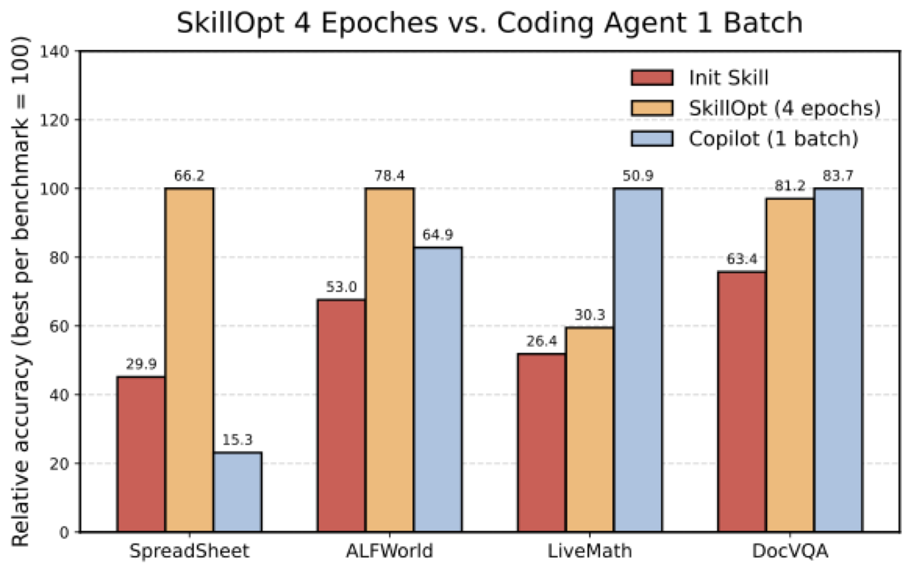

# SkillOpt-Lite — Research Note
> [English](./README.md) | **繁體中文**

## 📇 Academic Context

| Field | Value |
|-|-|
| Title | SkillOpt-Lite: Better and Faster Agent Self-evolution via One Line of Vibe |
| Venue | arXiv (preprint) |
| Year | 2026 |
| Authors | Yifei Shen, Bo Li, Xinjie Zhang |
| Official Code | https://github.com/EvolvingLMMs-Lab/SkillOpt-Lite |
| Venue Kind | tech-report |

> 本筆記依據 arXiv 預印本 `2607.03451`（July 2026 版）撰寫，正式發表版本（若有）可能與此不同。文中所有實驗數字均引自該預印本；論文以 GPT-5.4 / GPT-5.5 系列為受測模型、GitHub Copilot 為優化器，但未記錄這些模型的 snapshot／版本日期或 Copilot 的版本與設定（詳見 Critical Assessment）。本筆記的圖片皆由 e-print 隨附的向量 PDF 轉檔而來。

## Introduction

Skill optimization 想在不更動凍結底層模型的前提下改善 autonomous agent：反覆改寫引導規劃與工具使用的 Markdown 技能。既有方法在改寫外層疊上愈來愈複雜的反思池、更新排程與拒絕記憶；SkillOpt-Lite 則把問題收窄成：一條元件皆能由理論或實測必要性辯護的閉環技能優化管線，最小可以剩下什麼？

它的答案是把 rollout 軌跡當成一般檔案：coding agent 用原生檔案系統工具探索軌跡、萃取跨任務共通失敗、做最小技能修改，再以獨立驗證閘門決定是否保留候選版本。論文用 SearchQA、Spreadsheet、ALFWorld、LiveMath、OfficeQA、DocVQA 六個 benchmark 對照完整 SkillOpt，以 benchmark 分數與十個 SkillOpt-Lite batch 的「至今最佳驗證分數」曲線衡量簡化後的效果，最後再於 SpreadsheetBench 評估同一套檔案中心迴圈擴成 HarnessOpt 的結果。這些頭條數字先提供閱讀座標，其統計與比較限制則留到下方另行檢驗。

## First Principles


### 問題設定：把「技能文件」當成要優化的參數

一個 LLM agent 的實戰能力不只來自底層模型 `M`，還取決於它的執行骨架（harness `H`）與領域啟發式（skills `s`，通常是一份 Markdown 技能文件）。因為推論時 `M` 是凍結的，agent 工程實際上退化成「反覆改寫技能文件」——而技能文字的細微差異會在下游任務造成非線性的成績波動。論文把這件事形式化成一個期望獎勵的最大化問題：

$$f(s) = \mathbb{E}_{z \sim \mathcal{D}}\big[R\big(H(M, z, s)\big)\big]$$

其中 `s` 是文字型技能，`z` 是從分布 `D` 抽出的任務實例，`R` 是評分。因為 `S_text` 是離散的、`H∘M` 不可微，梯度 `∇_s f` 無法解析求得，於是整個 agent–環境互動被視為一個 **Zeroth-Order（ZO，零階）Oracle**：只能查詢 `f(s+μu)` 這種擾動後的純量分數，用它反推「該往哪個方向改文字」。

### 核心觀察：現有方法其實都是古典 ZO 工具箱的翻版

論文的第一個貢獻是一張對照表（原文 Table 1），把近年各家 skill-optimization 方法逐一映射回古典零階優化算子。以下摘錄其對應關係（此表為論文原表的重述）：

| ZO 概念 | 算子 | Agent 對應 | 文獻實作 |
|-|-|-|-|
| 1-Point Estimate | $\hat{\nabla}f(s) \propto f(s+\mu u)\,u$ | 單軌跡反思 | Reflexion、Voyager |
| Multi-Point / Mini-batch | $\frac{1}{b}\sum_{i=1}^{b}[f(s+\mu u_i)-f(s)]\,u_i$ | 批次軌跡共識萃取 | Trace2Skill、SkillOpt（batch $B_m{=}8$）、SkillForge |
| Central Difference | $\frac{f(s+\mu u)-f(s-\mu u)}{2\mu}$ | 成功/失敗對比分析 | SkillCat |
| ZO Coordinate Descent | $\frac{f(s+\mu e_i)-f(s)}{\mu}\,e_i$ | 定位錯誤步的原子修改 | SkillAdapter |
| Trust Region | $\mathcal{B}(s_k,\Delta_k)$ | 結構化編輯約束 | SkillOpt（edit budget $L_t{:}4{\to}2$）、SoftSkill |
| Control Variate | $\hat{g}_t - c_t + \mathbb{E}[c]$ | 歷史記憶拒絕緩衝 | SkillOpt（rejected-edit buffer）|

論文接著點出一個關鍵分歧：古典 ZO 面對的是黑箱，只拿得到純量分數，中間狀態不可見，所以只能「盲目」用數值擾動去逼近梯度；但 agent 每次 rollout 都會吐出**可讀的完整軌跡**——規劃理由、環境狀態、錯誤訊息。因此技能優化其實比較像「用自然語言寫的程式編譯除錯」：LLM 同時是編譯器與執行環境，軌跡就是中間執行紀錄，可以拿來做針對性的語意 debug，而不是盲目擾動。

### 兩條 PAC 界，推出「共識」與「獨立驗證」兩個原則

論文用演算法穩定度（Expected On-Average Stability）給出泛化誤差界：

$$\epsilon(\mathcal{S}) \le \hat{\epsilon}_D(\mathcal{S}) + \mathcal{O}\!\left(\beta_{\exp} + \sqrt{\tfrac{\ln(1/\delta)}{N}}\right)$$

其中 `β_exp` 是「拿掉一筆訓練樣本、結果會變多少」的穩定度係數。若優化過程對單一失敗軌跡過擬合（例如把某個 trial 專屬的環境變數、case-by-case 分支硬寫進技能），`β_exp` 就會膨脹、泛化崩潰。所以**原則一（Consensus Mining）**：優化器要當一個壓縮運算子，跨軌跡萃取共通失敗模式，而不是背下單筆軌跡。

另一條是模型選擇界：一旦引入與訓練集嚴格不相交的驗證集，`β_exp` 就會從上界中完全消失，只剩下 $\mathcal{O}(\sqrt{\ln(1/\delta)/m})$（`m` 為驗證樣本數）：

$$\epsilon(\mathcal{S}_{\text{val}}) \le \hat{\epsilon}_{\text{val}}(\mathcal{S}_{\text{val}}) + \mathcal{O}\!\left(\sqrt{\tfrac{\ln(1/\delta)}{m}}\right)$$

這推出**原則二（Independent Validation Gating）**：驗證閘門必須跑在獨立樣本上。論文順帶批評，Reflexion 完全沒有動態驗證，而 SkillCat、SkillAdapter、Trace2Skill 則在「訓練失敗實例的複製品或子抽樣」上做驗證，違反了這個獨立性前提。

### 原則三與 SkillOpt-Lite 管線

第三個原則來自一個 pilot 實驗（原文 Figure 2）：作者把 GPT-5.4-nano 第一批 rollout 的原始軌跡各存成一個純文字檔，直接叫 GitHub Copilot 用 `ls`/`cat` 這類原生檔案系統工具去逛目錄、找共通失敗、直接改技能檔——**不跑任何 mini-batch、樹狀合併或驗證迴圈**。結果這個「單批、未驗證」的做法在 LiveMath 與 DocVQA 上，竟然贏過跑滿 4 個 epoch 的完整 SkillOpt；但在 Spreadsheet 上反而掉到初始基準以下。前者推出**原則三（技能優化的苦澀教訓）**：模型夠強時，複雜拓撲不如「把一切當扁平檔、給模型原始 shell 工具直接讀 log」；後者則證明**閉環驗證閘門仍不可省**。



綜合三原則，SkillOpt-Lite 砍掉 mini-batch reflection pooling、文字學習率排程（slow update damping）與 rejected-edit buffer，只留四步：

```
1. Trajectory Staging   每批 rollout 後，把每條軌跡（規劃/環境狀態/分數）各存成一個獨立 log 檔
2. Trajectory Exploration 優化器用檔案系統工具在受限 token 預算下 ls/cluster/挑高槓桿檔案（不整包灌進 context）
3. Consensus Mining + Minimal Edit 讀檔找跨任務不變量，依「最小修改原則」產出精簡 diff/patch
4. Validation Gating   patch 套成候選庫 S̃ → 獨立驗證集評分；優於當前基準才接受，
                       超過歷史最佳才覆寫 best_skill.md，被拒的更新丟進歷史 log 存查
```


論文把它包成 VS Code Copilot 擴充，開發者一行 slash command 即可觸發：`/skillopt-loop rounds=10 batchsize=40 target=gpt5.4-nano`，這即是標題所謂的「one line of vibe」。

### 一個具體的頭條數字怎麼算出來的

以摘要主打的「讓小模型翻身」為例，走一遍 SpreadsheetBench（原文 Table 3，準確率為 0–1 比例）。GPT-5.4-nano 從初始技能 **0.2989** 開始，先用 SkillOpt-Lite 純技能優化到 **0.6619**；再把「一切皆檔案」的同一套三支柱擴到可改執行骨架（HarnessOpt），HarnessOpt 只改 harness（w.o. skill）就跳到 **0.7651**，技能與 harness 同時優化（w. skill）達 **0.7758**。這個 0.7758 高於「大模型」GPT-5.5 在基本 harness 上跑完整 SkillOpt 的 **0.7620**——這就是論文所稱的「capability inversion（能力反轉）」。

論文對此案例的機制解釋是：HarnessOpt 針對 nano 與 GPT-5.5 常見的「工具失敗後推理陷入重複迴圈」，自動攔截並套用 `retry reasoning=low` 的 fallback 策略讓模型脫困；對 GPT-5.4-mini/GPT-5.4 則是擴大試算表預覽可見範圍、加一個輸出自我檢查步驟，降低解析與格式錯誤。整個 harness 改寫受三條 loop 不變量保護：只能改骨架腳本（allowlist）、驗證前先過編譯與 `N=5` 冒煙測試、所有改動可 `git reset` 回滾並用環境變數 toggle 包起來。

## 🧪 Critical Assessment

### 問題是真的，但「理論」多為事後類比而非可預測工具

技能/提示詞對成績的非線性敏感是實務公認的真問題，把它形式化成零階優化也是漂亮的統一視角。但要留意：論文的 ZO 對照表與兩條 PAC 界都是**既有標準結果的套用**，沒有針對本方法證出任何新定理或可預測的界；`β_exp`、`μ`、`u` 這些量在文中沒有被實際估計或量測，equation 停在敘事層次。換句話說，理論負責「解釋為什麼砍掉那些模組是合理的」，而不是「預測砍掉後會好多少」——真正的說服力全押在實驗數字上。

### 基線幾乎是「自己打自己」，且缺變異數

主要對照對象 SkillOpt 是同一作者群的前作，Table 1 明明把 Trace2Skill、SkillForge、SkillCat、SkillAdapter 等都盤點了，正式實驗卻**沒有跟其中任何一個直接比**，只有 SkillOpt 一條線。更關鍵的是：作者自己承認 LiveMath 與 OfficeQA「只有 10–20 個驗證樣本、驗證變異數很高」，卻在全表只報單點數字、沒有任何誤差棒或信賴區間。以 GitHub Copilot 這種本身不確定的商用 agent 當優化器，單次跑分之間的抖動很可能與宣稱的部分增益同量級，這讓「+0.1 到 +1.5 分」這類語意任務上的「小勝」幾乎不具統計意義。


### 改動評測切分，等同於移動了球門

為了「緩解不穩定」，作者把 LiveMath 與 OfficeQA 的 train:val:test 從 `2:1:7` 改成 `2:2:6`。要澄清的是，這個新切分是 SkillOpt 與 SkillOpt-Lite **共用**的——論文明講兩種方法用相同的 optimizer 設定、在同一張主表一起報，所以並不是「基準與對象各跑一套切分」。真正的問題在別處：論文開頭說實驗「遵循 SkillOpt 既有的評測協定」，卻又對這兩個資料集私自改了切分，等於偏離了它宣稱對齊的舊協定，也讓表內數字無法直接對接 SkillOpt 原論文或其他既有結果。而且這正好是 LiveMath 出現最誇張跳幅的地方：GPT-4o 的 LiveMath 從初始 25.9 被 SkillOpt-Lite 拉到 58.8（+32.9），一個**凍結的** GPT-4o 僅靠改技能文字就多對三成題目，這種幅度更像是切分改動放大測試集訊號、或某種任務格式修正（例如答案抽取）帶來的，而非技能本身變聰明；論文並未拆解這個增益的來源。

### 「小模型超越大模型」是條件不對等的敘事

摘要與 §5 主打 nano 的 0.7758 > GPT-5.5 的 0.7620，聽起來是能力反轉；但這是拿「nano＋完整 HarnessOpt」比「GPT-5.5＋只做 SkillOpt 的陽春 harness」。一旦條件對齊——兩者都上 HarnessOpt——GPT-5.5 是 0.8577，仍穩穩高於 nano 的 0.7758。所以真正成立的結論應是「harness 優化的邊際效益對弱模型更大」，而非「小模型能取代大模型」；後者是挑對比對象拼出來的標題。

### 可重現性與安全性缺口

論文雖然公開了程式碼，但對重現關鍵的實驗環境交代不足：全部實驗跑在 GPT-5.4-nano/mini、GPT-5.4、GPT-5.5 上，卻沒有記錄任何一個模型的 snapshot 或版本日期；優化器 GitHub Copilot 也只給了名稱，沒有版本、設定或呼叫參數。由於 Copilot 本身是持續更新、且單次輸出帶隨機性的商用 agent，即使拿到原始碼，第三方在不同時間重跑幾乎不可能複現同一組數字——這是論文自身可證的重現性缺口，而非對模型可得性的臆測。HarnessOpt 讓 agent 自主改寫自己的執行程式碼，雖有 allowlist、冒煙測試、`git reset` 回滾等護欄，但「讓模型改自己的控制流」的長期漂移與安全風險，論文僅在 future work 輕描淡寫；把這條路線外推到「自動編輯爬蟲控制器、蒐資料、訓練更好的基礎模型」的願景，則完全沒有證據支撐，屬於推測。

### 小結

這是一份工程直覺很強、寫得有說服力的 tech report，「everything is a file＋給模型原始工具」的極簡主張本身站得住腳，也確實在多個 benchmark 上勝過自家較複雜的前作。但它的說服力主要來自單點跑分而非可重現的統計證據：缺誤差棒、改了評測切分、對照組僅限自家方法、頭條「反轉」靠不對等條件拼出。對讀者而言，合理的取用方式是接受「複雜優化拓撲在強模型上邊際遞減」這個定性訊號，但對具體分數（尤其 LiveMath 的巨幅跳升與 capability inversion）保留懷疑。

## 一分鐘版

- **要優化的東西不是模型，是一份技能文件。** 因為底層模型推論時凍結，agent 工程實際上退化成反覆改寫一份 Markdown 技能檔；例子：GPT-5.4-nano 光靠改技能文字，SpreadsheetBench 就從 0.2989 拉到 0.6619。
- **方法＝把一切當扁平檔、給模型原生 shell 工具直接讀 log。** SkillOpt-Lite 砍掉 mini-batch pooling、學習率排程與 rejected-edit buffer，只留 Staging→Exploration→Consensus/Minimal Edit→Validation Gating 四步；例子：開發者一行 `/skillopt-loop rounds=10 batchsize=40 target=gpt5.4-nano` 即觸發，這就是標題的「one line of vibe」。
- **頭條是「小模型翻過大模型」（capability inversion）。** 論文主打弱模型加上 HarnessOpt 後，分數超過大模型的陽春版本；例子：nano 的 0.7758 高於 GPT-5.5 在基本 harness 上的 0.7620。
- **但這個「小勝大」是條件不對等拼出來的。** 一旦兩邊都上 HarnessOpt，大模型仍穩穩領先，所以真正成立的只是「harness 優化對弱模型邊際效益更大」；例子：條件對齊後 GPT-5.5 是 0.8577，仍高於 nano 的 0.7758。
- **數字本身也要打折：缺誤差棒又改了評測切分。** 作者承認驗證集只有 10–20 樣本、變異數很高卻只報單點，還把 LiveMath/OfficeQA 的 train:val:test 從 2:1:7 改成 2:2:6；例子：GPT-4o 的 LiveMath 從 25.9 跳到 58.8（+32.9），一個凍結模型僅靠改文字就多對三成題，幅度更像切分改動而非技能變聰明。
- **實務取用：接受定性訊號，懷疑具體分數。** 合理的用法是相信「複雜優化拓撲在強模型上邊際遞減」這個方向，但因論文未記錄模型 snapshot 與 Copilot 版本／設定、優化器又是會變動且帶隨機性的商用 agent，頭條數字難以被第三方重現，值得保留懷疑；例子：對 LiveMath 的巨幅跳升與 capability inversion 尤其存疑。

## 🔗 Related notes

<!-- 尚無可解析的相關筆記。 -->
