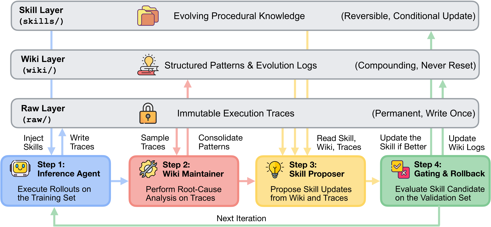
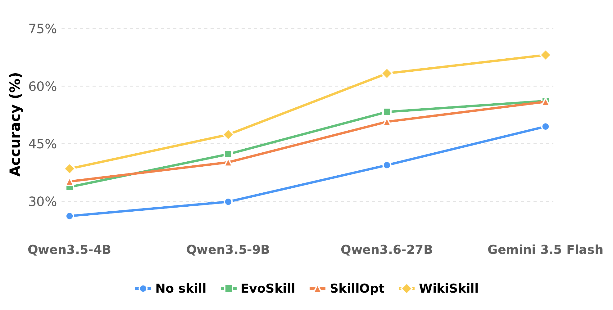

# WikiSkill — Research Note
> [English](./README.md) | **繁體中文**

## 📇 Academic Context

| Field | Value |
|-|-|
| Title | WikiSkill: Compiling Agent Experience into Persistent Knowledge for Skill Evolution |
| Venue | arXiv preprint (2608.27454v1) |
| Year | 2026 |
| Authors | Liyan Tang, Cyrus Rashtchian, Chun-Sung Ferng, Andrew Tomkins, Da-Cheng Juan, Tu Vu |
| Official Code | unknown |
| Venue Kind | paper |

> 本筆記依據 arXiv 預印本 `2608.27454v1`（2026-08-28）撰寫；此版本尚未經同行評審，正式發表版可能與此不同。作者隸屬 Google Research 與 Virginia Tech。

## Introduction

WikiSkill 想解決的具體問題是：當一個 LLM agent 透過反覆執行任務來「自我演化」出 agent skill（一份把流程知識寫成 `SKILL.md` 的檔案系統模組）時，指導技能改進的「洞見」會散落在各輪的最佳化歷史（optimization history）裡，難以跨迭代系統性地重用。舉例來說，第 2 輪發現「不要把物件放回原位」這條教訓，若只以被拒絕的 diff 或一條回饋訊息的形式存在，到第 5 輪 proposer 很可能重蹈覆轍或重新提出已被否決的方案。

為什麼這重要？因為技能演化的成效上限，取決於 proposer 每一輪能否站在「先前已整理好的知識」上，而非每次都從零重讀原始軌跡。作者受 Karpathy 的「LLM Wiki」觀點啟發，主張把經驗「編譯」成持久、可累積的知識，並提出核心問題：agent 的經驗能否被編譯成持久知識，以支持長期的技能演化？

WikiSkill 的高階解法是在「原始經驗」與「可執行技能」之間插入一個結構化的知識層（wiki）。它把 agent 工作區切成三層——儲存不可變執行軌跡的 Raw Layer、維護結構化知識且跨迭代累積的 Wiki Layer、以及承載演化中程序知識的 Skill Layer——並用一個含 Inference Agent、Wiki Maintainer、Skill Proposer、Gating and Rollback 四個元件的迴圈持續運轉。關鍵設計是：技能（skill）可被回滾，但 wiki 永不回滾，因此後續更新能建立在累積知識上。

論文如何衡量解法是否有效？作者在五個 benchmark（LiveMathematicianBench、SealQA、SpreadsheetBench、OfficeQA、ALFWorld）與五個模型（Qwen-3.5-4B/9B、Qwen-3.6-27B、Gemma-4-31B、Gemini-3.5-Flash）上，比較 no-skill 基線與三個技能演化基線（Trace2Skill、EvoSkill、SkillOpt）。所有方法都從空技能集開始、把演化出的技能全文注入 Inference Agent 的 system prompt，指標為各 benchmark 的平均準確率，並以三次獨立完整演化的平均值搭配 paired bootstrap 顯著性檢定回報。核心宣稱有三：WikiSkill 在多數設定勝過既有方法、技能演化與模型規模互補、演化技能可跨模型與跨家族遷移。

## First Principles

### 問題形式化：把技能演化寫成一個受閘門控管的搜尋

論文把任務資料集 $\mathcal{D} = \{(x_i, y_i)\}$ 切成互斥的 $\mathcal{D}_{\text{train}}$、$\mathcal{D}_{\text{val}}$、$\mathcal{D}_{\text{test}}$ 三個 split。一個 agent $\pi$ 具備工具集 $\mathcal{U}$（如 bash、web search、file reader）與一組主動技能 $S = \{s_1, \dots, s_M\}$，每個技能是一個含 `SKILL.md` 的檔案系統目錄；技能集初始為空集合 $\emptyset$，並針對每個資料集演化出來。執行任務 $x_i$ 時，agent 產生軌跡 $\tau_i \sim \pi(x_i; S)$，最後動作吐出預測 $\hat{y}_i$，由評分函數 $f(\hat{y}_i, y_i) \in [0,1]$ 打分，而一個 split 的表現 $\mathcal{R}(\mathcal{T}_{\text{split}})$ 是該 split 上所有任務分數的平均。

WikiSkill 在第 $k$ 輪的系統狀態是一個二元組 $(S_k, W_k)$，其中 $S_k$ 是主動技能集、$W_k$ 是持久知識庫（wiki）。這裡的關鍵不對稱是：候選技能更新要通過驗證閘門、可因分數退步而回滾，但 $W_k$ 會持續累積、跨迭代複利，不受回滾影響。系統從 $(S_0, W_0) = (\emptyset, \emptyset)$ 出發，目標是最大化未見測試集上的最終表現 $\mathcal{R}(\mathcal{T}_{\text{test}})$。值得注意的是，這整個過程沒有任何梯度更新——它是對「技能文件」這個離散物件做黑箱的爬山式搜尋，模型參數自始至終凍結，「reward」只是 $[0,1]$ 的評分。

### 三層知識架構：什麼不可變、什麼複利、什麼可回滾



*圖 1：WikiSkill 把工作區分成 Raw／Wiki／Skill 三層，並由 Inference Agent → Wiki Maintainer → Skill Proposer → Gating & Rollback 四步構成一輪迴圈。三層的不變式各異：Raw 寫入一次即永久（Permanent, Write Once）、Wiki 只增不重置（Compounding, Never Reset）、Skill 可條件式更新與回滾（Reversible, Conditional Update）。留意箭頭拓撲刻畫的存取不對稱：Step 1 的 Inference Agent 只有「Inject Skills／Write Traces」兩條連線、與 Wiki Layer 之間完全無箭頭；Step 3 的 Skill Proposer 是唯一同時「Read Skill, Wiki, Traces」三層的元件；Step 4 對 Skill Layer 是條件式寫回（Update the Skill if Better），對 Wiki Layer 則是無條件寫回（Update Wiki Logs）。（取自論文 Figure 2）*

Raw Layer（`raw/`）儲存每輪從訓練樣本收集的原始執行軌跡 $\tau_i$，內含 agent 的逐步推理、工具呼叫、工具輸出與最終答案；為保存歷史，這一層是不可變（immutable）的，Wiki Maintainer 與 Skill Proposer 都能讀取它來分析行為。

Wiki Layer（`wiki/`）把原始軌跡編譯成結構化、可複利的知識，且在整個演化過程中持續維護。它包含一個 `patterns/` 目錄，內有一份份 markdown，記錄特定失敗模式或成功策略及其可操作的 workaround；並透過一份演化日誌（`logs.md`，由 Wiki Maintainer 更新）與一份技能影響追蹤器（`skill-impact.md`，由外層 harness 在驗證閘門後以程式方式更新）提供跨迭代的長期歷史意識。這些紀錄讓兩個 agent 能觀察完整的技能接受歷史（避免重提已被否決的介入）、追蹤先前提案是否成功、並辨識跨迭代反覆出現的錯誤。wiki 不會在迭代間被重置，而是持續累積與編譯。

Skill Layer（`skills/`）承載主動技能集 $S$。每個技能目錄含兩個檔案：`SKILL.md` 是技能全文；`PURPOSE.md` 則把該技能回連到啟發它建立或修改的 wiki pattern，形成從「技能」回溯到「動機證據」的可稽核鏈結。

### 演化迴圈：四個元件與它們看得到什麼

一輪迭代依序跑四個元件。Inference Agent 用當前 `skills/` 執行任務並產生不可變軌跡到 `raw/`；訓練 rollout 期間它被禁止存取 Wiki Layer（消融顯示給它 wiki 反而有害）。Wiki Maintainer 接著分析原始軌跡與既有 wiki，做失敗的 root-cause 分析、抽取成功策略，更新 pattern 目錄與演化日誌。Skill Proposer 再檢視更新後的 wiki 並讀取最新一輪的軌跡，產生一個「原子性」候選提案 $P_k$（只針對單一技能，做建立或增量式 patch 編輯）。最後 Gating and Rollback 在驗證 split 上評估候選技能，接受能改善驗證表現的修改、否則回滾。

論文把完整流程寫成 Algorithm 1，其骨架如下（改寫自論文 Appendix 的演算法，符號沿用上文）：

```text
輸入: D_train, D_val, 指標 R, 迭代數 K
初始化 S_0 = ∅, W_0 = ∅
基線驗證: T_val,0 = rollout(π(·; S_0)) on D_val;  R_best = R(T_val,0)
for k = 1..K:
    if R_best == 1.0: break                      # 提前停止
    Inference: T_train,k = rollout(π(·; S_{k-1})) on D_train
    抽樣子集 T_sample,k ⊂ T_train,k                # ≤5 失敗 + ≤3 成功
    Wiki Maintenance: W'_k = M_WM(W_{k-1}, T_sample,k)
    Skill Proposal:   P_k  = M_P(W'_k, S_{k-1}, T_train,k)   # ReAct，按需讀檔
    Apply:            S'_k = Apply(S_{k-1}, P_k)
    Validate:         T_val,k = rollout(π(·; S'_k)) on D_val
    if R(T_val,k) > R_best:                       # 嚴格改善才接受
        S_k = S'_k;  R_best = R(T_val,k);  a_k = Accepted
    else:
        S_k = S_{k-1};  a_k = Rejected            # 只回滾技能，wiki 保留
    Update Wiki Log: W_k = Update(W'_k, P_k, R(T_val,k), a_k)
return S_K, W_K
```

閘門規則是嚴格改善（strict improvement）：候選只有在驗證分數高於歷史最佳 $\mathcal{R}_{\text{best}}$ 時才被接受，否則技能回滾到上一個成功組態。形式化為

$$
S_k = \begin{cases} S'_k & \text{if } \mathcal{R}(\mathcal{T}_{\text{val},k}) > \mathcal{R}_{\text{best}} \\ S_{k-1} & \text{otherwise} \end{cases}
$$

$\mathcal{R}_{\text{best}}$ 初始化為空技能集在 $\mathcal{D}_{\text{val}}$ 上的基線分數 $\mathcal{R}(\mathcal{T}_{\text{val},0})$；若驗證分數在任何時點達到上限 $\mathcal{R}_{\text{best}} = 1.0$，演化迴圈提前終止。無論接受與否，外層 harness 都會把提案 metadata、目標技能名、修改的 unified diff、驗證分數與最終結果 $a_k \in \{\text{Accepted}, \text{Rejected}\}$ 追加到 `skill-impact.md`，形成一份客觀的稽核軌跡，供之後的 proposer 查閱以避免重蹈覆轍。

### 每個 agent 看得到什麼：存取邊界才是設計的核心

四個元件的資訊存取邊界並不對稱，這正是 WikiSkill 的設計主張所在。Inference Agent 只拿到主動技能 $S_{k-1}$ 的全文（直接注入 system prompt），訓練 rollout 期間不給 wiki；作者沿用先前工作採「全文注入」而非檢索，是為了排除「技能觸發或檢索失敗」這個干擾變因。Wiki Maintainer 拿到完整 wiki 脈絡 $W_{k-1}$ 加上抽樣軌跡 $\mathcal{T}_{\text{sample},k}$，以增量、patch 式編輯（append／replace／insert_after）更新 pattern，並同步改寫 `index.md` 目錄、追加 `logs.md`；每輪建立或編輯的 pattern 數量沒有硬上限。Skill Proposer 則以多輪 ReAct 方式運作：一開始只給 wiki 索引 $I(W'_k)$、`skill-impact.md`、以及所有訓練任務結果的精簡摘要（pass/fail、預測與正解），再自主用 `read_file` 工具按需挑選並讀取特定 pattern 頁與原始軌跡，最後才合成提案；提示要求它「至少讀 4 筆執行軌跡」後才提案。

### 一次迭代的具體走查：ALFWorld 上的 Qwen-3.6-27B


*圖 2：ALFWorld（Qwen-3.6-27B）上一段真實演化，圖中四色箭頭各自標出一條因果路徑。左側持久 Wiki Layer 的 `skill-impact.md` 記錄 Iteration 0 的 `goal-directed-action` 被拒（REJECTED，val score = 0.72）、Iteration 1 與 Iteration 4 的 `break-repetition-loop` 被接受（ACCEPTED，val score = 0.78）；`logs.md` 記錄跨輪的錯誤重現與接受決策；`patterns/` 累積 `take-examine-move-loop.md`、`multi-operation-loop.md` 等證據。紅色箭頭：被拒歷史解釋技能動機（`skill-impact.md` 的 REJECTED → 右側 `PURPOSE.md`「因過於抽象而被否決」）；綠色箭頭：接受的技能更新（ACCEPTED → `SKILL.md`）；黃色箭頭：特定 pattern 催生特定規則（`take-examine-move-loop`／`multi-operation-loop` → Iter 1／Iter 4 的規則）；藍色箭頭：演化日誌按時間記錄 pattern 與決策（`logs.md` ↔ `patterns/`）。右側 Skill Layer 顯示被接受技能的 `SKILL.md`（規則「Never Return an Item to Its Origin Location」）與回連動機的 `PURPOSE.md`。（取自論文 Figure 3）*

把上面的抽象迴圈落到一個真實例子。在 Iteration 0，Wiki Maintainer 從軌跡辨識出一種基本的繞圈行為並寫成 `take-examine-move-loop.md`；Skill Proposer 提出較抽象的 `goal-directed-action`，但它在驗證集上沒能改善（`logs.md` 記為 val score = 0.72，未超過基線），因而被拒。關鍵在於 `skill-impact.md` 保留了這個被拒提案的 diff 與結果，讓後續更新知道「這條路走不通」。

受此稽核軌跡指引，Skill Proposer 在 Iteration 1 建立 `break-repetition-loop`，帶入一條具體動作規則「Never Return an Item to Its Origin Location」，這次通過（val score = 0.78 > 0.72）而被接受。隨著新的繞圈變體在 rollout 中出現（`multi-operation-loop.md`），Wiki Maintainer 持續累積新證據；再由這些累積的 pattern 與新軌跡指引，Skill Proposer 在 Iteration 4 以新規則「Each Operation Type ONCE Per Item」進一步精修技能。最終在 ALFWorld 測試集上，Qwen-3.6-27B 從 no-skill 的 52.8% 提升到 WikiSkill 的 77.6%（+24.8 分）。這個例子把「持久知識如何跨迭代餵養後續技能精修」具體化：若沒有 `skill-impact.md` 的拒絕紀錄，Iteration 1 很可能重提被否決的抽象方案。

### 實驗設定：小驗證集、全批次、三次獨立跑

五個 benchmark 的 split 規模與工具如下表（取自論文 Table 6）。注意驗證集普遍很小（10–40 題），這對「嚴格改善」閘門的雜訊很關鍵。

| Benchmark | 互動模式 | Train | Val | Test | 環境工具 |
|-|-|-|-|-|-|
| LiveMath | Single-Step | 35 | 18 | 124 | 無（直接推理） |
| SealQA | Multi-Step | 16 | 10 | 85 | `web_search`, `read_file` |
| SpreadSheet | Multi-Step | 80 | 40 | 280 | `bash` |
| OfficeQA | Multi-Step | 50 | 24 | 172 | `glob`, `grep`, `read` |
| ALFWorld | Multi-Step | 39 | 18 | 134 | Admissible Actions |

實作細節上，每輪對 Wiki Maintainer 採分層抽樣：最多 8 筆軌跡（至多 5 筆失敗做 root-cause、至多 3 筆成功防止退化），每筆執行日誌注入前截斷到 15,000 字元。Skill Proposer 的 ReAct 回合數約 $10 \le T_{\text{ReAct}} \le 20$。所有方法的 split 與工具集都與先前工作嚴格對齊，且 SealQA 統一使用 2026 年 7 月版本。顯著性檢定用 1,000 次 paired bootstrap，跨 benchmark 則以分層 macro-average 重抽樣、各 benchmark 等權。

### 主結果：平均勝出，但逐格並非全勝

下表節錄論文 Table 1 的三個模型區塊（完整五模型見原文），每格為三次獨立演化的測試平均。

| Model | Method | LiveMath | SealQA | SpreadSheet | OfficeQA | ALFWorld | Avg. |
|-|-|-|-|-|-|-|-|
| Qwen-3.5-4B | No skill | 29.1 | 32.5 | 14.6 | 30.2 | 24.4 | 26.2 |
| Qwen-3.5-4B | SkillOpt | 48.7 | 33.3 | 14.0 | 34.5 | 45.3 | 35.2 |
| Qwen-3.5-4B | WikiSkill | 49.7 | 39.4 | 21.1 | 28.5 | 53.7 | 38.5 |
| Qwen-3.6-27B | No skill | 33.9 | 27.5 | 40.8 | 42.1 | 52.8 | 39.4 |
| Qwen-3.6-27B | EvoSkill | 57.3 | 32.9 | 59.5 | 52.5 | 64.2 | 53.3 |
| Qwen-3.6-27B | WikiSkill | 61.9 | 41.6 | 81.7 | 53.7 | 77.6 | 63.3 |
| Gemini-3.5-Flash | No skill | 33.0 | 29.4 | 50.5 | 48.6 | 85.9 | 49.5 |
| Gemini-3.5-Flash | WikiSkill | 72.6 | 44.7 | 76.6 | 60.7 | 85.9 | 68.1 |

WikiSkill 在全部五個模型的「平均」欄都拿最高分；相較各模型最強的競爭方法，平均分別提升 3.3、5.1、10.0、5.8、12.0 分（對應 Qwen-3.5-4B、Qwen-3.5-9B、Qwen-3.6-27B、Gemma-4-31B、Gemini-3.5-Flash）。但「平均最高」不等於「逐格全勝」：以 Qwen-3.5-4B 為例，它在 OfficeQA 上反而從 no-skill 的 30.2% 掉到 28.5%，也低於 SkillOpt 的 34.5%；作者解釋為小模型在長脈絡多步搜尋上會退回預設閱讀行為。可自行驗算平均：Qwen-3.5-4B WikiSkill 的 (49.7+39.4+21.1+28.5+53.7)/5 = 38.48 ≈ 38.5，與表一致。值得一提的是，連兩條技能演化基線的相對排名也不是固定的：在最小的 Qwen-3.5-4B 上 SkillOpt（平均 35.2）勝過 EvoSkill（33.7），但從 Qwen-3.5-9B 起 EvoSkill（42.3 對 40.2）反超並在後續模型維持領先，顯示「哪個基線較好」本身就與模型能力交互。



*圖 3：四個模型（Qwen-3.5-4B、Qwen-3.5-9B、Qwen-3.6-27B、Gemini-3.5-Flash）上 no-skill／EvoSkill／SkillOpt／WikiSkill 的平均準確率，Y 軸完整標出 30%–75% 刻度。WikiSkill（黃線、菱形）在每個模型都在最上方，且對較強模型的領先逐步擴大——相對次佳基線分別領先 +3.3、+5.1、+10.0、+12.0 分。同時兩條基線 EvoSkill（綠）與 SkillOpt（橘）在圖中交叉：最小的 4B 上 SkillOpt（35.2）略高於 EvoSkill（33.7），但自 9B 起 EvoSkill 反超並維持在上（9B 42.3 vs 40.2、27B 53.3 vs 50.7、Flash 56.1 vs 55.9）。注意此圖只畫了四個模型（省略 Gemma-4-31B）且圖例省略 Trace2Skill——這與 Table 1 的完整五模型、五方法並不一一對應。（取自論文 Figure 1）*

論文的一個重點宣稱是「技能演化與模型規模互補」。在 Qwen 家族內，WikiSkill 相對 no-skill 的平均增益隨規模上升：4B 為 +12.3 分、9B 為 +17.5 分、27B 為 +23.9 分；在 SpreadSheet 上尤其誇張，三者分別 +6.5、+9.3、+40.9 分。同時，演化技能可補償規模差距：帶 WikiSkill 的 Qwen-3.5-9B 平均達 47.4%，勝過無技能的 Qwen-3.6-27B 的 39.4%。

### 持久知識消融：wiki 給 proposer 有用、給 inference 有害

作者用 Gemini-3.5-Flash 對「wiki 存取權」做 2×2 消融（是否給 Inference Agent、是否給 Skill Proposer；當 proposer 無 wiki 時連 Wiki Maintainer 一起移除，等同關掉跨迭代知識累積）。

| Inference Agent wiki | Skill Proposer wiki | LiveMath | SealQA | SpreadSheet | OfficeQA | Avg. |
|-|-|-|-|-|-|-|
| No skill | — | 33.0 | 29.4 | 50.5 | 48.6 | 40.4 |
| ✓ | ✗ | 43.8 | 42.0 | 44.4 | 51.0 | 45.3 |
| ✗ | ✗ | 51.3 | 38.4 | 49.9 | 55.2 | 48.7 |
| ✓ | ✓ | 64.8 | 42.8 | 80.2 | 55.6 | 60.9 |
| ✗ | ✓（預設） | 72.6 | 44.7 | 76.6 | 60.7 | 63.7 |

在 Inference Agent 不看 wiki 的前提下，給 Skill Proposer 存取持久 wiki 把平均從 48.7% 拉到 63.7%（+15.0 分），LiveMath 更從 51.3% 衝到 72.6%。反過來，在 proposer 已有 wiki 時，若也讓 Inference Agent 在訓練 rollout 看 wiki，平均反而從 63.7% 掉到 60.9%（LiveMath 72.6% → 64.8%）。作者假設：當 Inference Agent 同時握有技能與 wiki，部分解題知識可能直接來自 wiki 而非技能，使得產生的軌跡對技能開發較不具資訊量。這條消融是論文「持久知識是關鍵」宣稱的主要證據，但它只在單一模型（Gemini-3.5-Flash）、四個 benchmark（未含 ALFWorld）上做。

### 跨模型遷移：技能發現與技能執行是兩種能力

論文區分「source model」（演化出技能者）與「inference model」（執行技能者），並回報演化技能常能勝過自我演化技能。例如 Qwen-3.6-27B 演化的 SpreadSheet 技能，把 Qwen-3.5-9B 從無技能的 24.3% 拉到 50.5%，也高於其自我演化的 33.6%；Qwen-3.5-4B（較小模型）演化的技能反而把 Gemma-4-31B 在 LiveMath 推到 73.1%、ALFWorld 推到 66.9%，顯示更強的 source 未必產出更好的技能。但遷移也會是負的：Qwen-3.5-4B 的 SpreadSheet 技能把 Gemini-3.5-Flash 從 50.5% 砸到 18.1%，而 Qwen-3.6-27B 的同任務技能則把它提到 63.4%。作者的錯誤分析指出兩個成因——小模型技能編碼了低階 workaround（如單行 Python、字串轉換規則），會綁住強模型不去寫完整的端到端腳本；且零碎的診斷步驟會引入冗餘工具呼叫，在任務完成前耗盡 Gemini-3.5-Flash 的互動預算。這把自我演化通常混為一談的兩種能力拆開了：從經驗中「發現」有用程序知識，與在推論時「執行」該知識。

### 成本：對訓練集大小為 O(1) 的最佳化呼叫

作者分析每輪的最佳化器 API 呼叫複雜度 $\mathcal{C}$。WikiSkill 在所有資料集都採全批次（batch size $B = N_{\text{train}}$，即每輪一次處理整個訓練集），因此每輪只需

$$
\mathcal{C}_{\text{WikiSkill}} = (1 + T_{\text{ReAct}}) \cdot \frac{N_{\text{train}}}{B} = 1 + T_{\text{ReAct}}
$$

次最佳化呼叫（1 次 Wiki Maintainer 加上 $T_{\text{ReAct}}$ 個 ReAct 回合），與訓練集大小無關，故對 $N_{\text{train}}$ 為 $\mathcal{O}(1)$。對照之下，Trace2Skill 對每條訓練軌跡都要一次獨立 LLM 分析，下界為 $\mathcal{O}(N_{\text{train}})$；EvoSkill 與 SkillOpt 在其最佳的 minibatch 設定下則為 $\mathcal{O}(N_{\text{train}}/B)$。要注意這只計「最佳化器」呼叫，不含 rollout 本身的推論成本；論文也坦承此常數複雜度在某些資料集可能帶來較高的推論開銷。

## 🧪 Critical Assessment

### 問題是真的，但「持久 wiki 是關鍵」的證據面偏窄

「洞見散落在最佳化歷史、難以重用」這個痛點是真實且具體的：EvoSkill 的扁平回饋歷史、Trace2Skill 的軌跡蒸餾、SkillOpt 的 rejected-edit 回饋，確實都沒有把「已學到什麼」維護成一個獨立、可演化的知識表徵。WikiSkill 的三層切分與 `skill-impact.md` 稽核軌跡是合理且乾淨的工程回答。但支撐「持久知識累積是關鍵」的核心消融（Table 3）只在單一模型 Gemini-3.5-Flash、且只有四個 benchmark（沒有 ALFWorld）上做；把一條單模型消融推廣成對所有模型都成立的因果結論，證據面偏窄。更微妙的是，該消融把「移除 wiki」與「同時移除 Wiki Maintainer」綁在一起，因此 48.7% → 63.7% 的落差混合了「有無持久知識」與「有無一個額外分析 agent」兩個變因，並非乾淨地只隔離 wiki。

### 小驗證集加嚴格改善閘門，是主要的變異與過擬合風險

閘門在 10–40 題的驗證集上做「嚴格改善」決策（SealQA val 僅 10 題、LiveMath 與 ALFWorld 各 18 題）。在這種規模下，單題對錯就能翻動接受／回滾決策，等於讓技能演化去過擬合一個很小的 split。一個直接的病徵是：Gemini-3.5-Flash 在 ALFWorld 上「演化前」就在驗證集拿到 100%，於是提前停止、根本沒演化出技能——這正是小驗證集造成的假飽和。作者確實用三次獨立跑與 bootstrap 檢定來緩解，但「三次」本身仍是很小的種子數，而 Table 1 的多處粗體其實是「與最佳無顯著差異」的統計平手（例如 Qwen-3.5-9B 的 LiveMath，EvoSkill 58.1 與 WikiSkill 56.3 同時粗體），逐格看 WikiSkill 並非總是單獨最佳。此外，測試集本身也不大（85–280 題），跨月更新的 LiveMath 與版本化的 SealQA（2026 年 7 月版）也讓 benchmark 洩漏與時間漂移難以完全排除。

### 「規模互補」主要成立於 Qwen 家族內，跨家族的規模軸並不乾淨

「較強模型從技能獲益更多」這個趨勢，最乾淨的證據是 Qwen 4B→9B→27B 的 +12.3／+17.5／+23.9。但論文的 Figure 1 把 Gemini-3.5-Flash 也放在同一條「規模」橫軸的最右端，卻省略了 Gemma-4-31B，而 Gemini 是閉源模型、參數量未知，把它當成「更大規模」來支撐單調趨勢並不嚴謹。事實上 Gemma-4-31B（31B）的平均增益 +13.6 分就小於 Qwen-3.6-27B 的 +23.9，顯示跨家族時「規模越大獲益越多」並不單調——增益更可能取決於模型與資料集的交互，而非單純參數量。這是一個容易被主圖敘事帶過的 cherry-picking 風險。

### 新穎性是「知識表徵」層次，而非全新機制；且成本比較口徑偏窄

WikiSkill 的迴圈（rollout→分析→提案→驗證閘門）與三個基線同構，真正的新增量是那個「持久、可稽核、只增不回滾」的 wiki 層與 `PURPOSE.md` 回連——這是有價值的表徵設計，但不是全新的最佳化機制，宣稱時應避免被讀成方法論上的巨大跳躍。成本方面，$\mathcal{O}(1)$ 的漂亮結論只涵蓋「最佳化器呼叫數」，而其 Skill Proposer 是 10–20 回合的 ReAct、全批次注入全部訓練結果，實際 token 與 wall-clock 成本可能不低；論文未報告任何硬體、延遲或金錢／計算成本；且論文正文並未提及任何官方框架程式碼或可重現性資產的釋出，本筆記在 arXiv 頁面與 PDF 中也未能驗證到官方實作（Official Code 因此標為 unknown，而非確認「未釋出」），加上模型皆為 2026 年的版本化 API/權重，可重現性因此打折。

### 問題被解決到什麼程度，以及尚未觸及的邊界

在「有限輪數、五個 benchmark」的範圍內，WikiSkill 確實展示了穩定且常常可觀的增益，這一點是紮實的。但論文對「持久、可遷移、長期」知識演化的更大宣稱，其實超出了它的證據：Table 5 只把「接受的技能更新」分進 Early（Iter 0–1）／Mid（Iter 2–4）／Late（Iter 5–7）三個桶，最晚只報告到 Iter 5–7 的接受更新，卻從未在此表交代每次實驗的總迭代上限 $K$（演算法裡 $K$ 始終是符號），因此它的「長期」尺度其實從未被量化；作者自己也在限制一節承認 wiki 只增不減、目前沒有自動 pruning 機制，長跑下 pattern／log／diff 會無界成長，且被拒技能的知識仍可能污染後續脈絡、過時或錯誤的 pattern 也可能持續存在。因此比較公允的讀法是：這是一份在中等規模、有限迭代下站得住腳的技能演化 benchmark 結果，而非對「持久知識能長期複利」的已證明結論。

## 一分鐘版

- **經驗會被遺忘**：指導技能改進的洞見散落在各輪最佳化歷史，模型跨輪無法累積、容易重犯舊錯。例如第 2 輪學到「不要把物件放回原位」，若只留成一條回饋訊息，第 5 輪很可能再度重提已被否決的無效方案。
- **兩層記憶刻意不對稱**：驗證未達標的技能會被回滾，但歸納出的知識庫（wiki）永不回滾、跨迭代累積。ALFWorld 案例中，一個被拒的提案（驗證分 0.72）以稽核紀錄留在 wiki，指引下一輪成功提出「禁止把物件放回原位」規則（驗證分 0.78）而被接受。
- **技能演化與模型規模互補**：越強的模型搭配演化技能，收穫的提升越大；小模型也能靠演化技能超越無技能的大模型。Qwen 家族從 4B 到 27B，平均增益從 +12.3 擴大到 +23.9 分，且帶技能的 9B（47.4%）勝過無技能的 27B（39.4%）。
- **小驗證集是主要風險**：驗證集只有 10–40 題再加上「嚴格改善」門檻，容易被單題雜訊帶偏甚至假飽和。Gemini-3.5-Flash 在只有 18 題驗證集的 ALFWorld 上「演化前」剛好拿到 100%，直接觸發提前停止、完全沒演化出技能。
- **遷移可能是負的**：小模型摸索出的低階替代規則會綁住強模型、又因零碎步驟在完成前耗盡互動預算。Qwen-3.5-4B 演化的 SpreadSheet 技能，把 Gemini-3.5-Flash 從 50.5% 砸到只剩 18.1%。

## 🔗 Related notes

- [SkillOpt-Lite](../SkillOpt-Lite/) — 同屬 agent skill 自我演化的一支；SkillOpt 正是本篇的基線之一。
