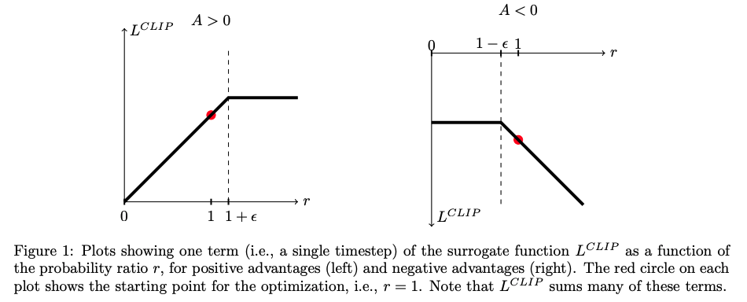

| Property  | Data |
|-|-|
| Created | 2023-02-21 |
| Updated | 2023-02-22 |
| Author | @Aiden, [@MasterYee](https://github.com/Destiny0504) |
| Tags | #study |

# PPO
| Title | Venue | Year | Code |
|-|-|-|-|
| [PPO: Proximal Policy Optimization Algorithms](https://arxiv.org/pdf/1707.06347.pdf?fbclid=IwAR0JBy3rk97TCdlrTEM4ocp7wJPcytP9nbc6VVqBmoHyCkGocv6GIQkjwUs) | OpenAI | '17 | [✓](https://github.com/nikhilbarhate99/PPO-PyTorch) |

## Components
What are the components of PPO?
- Policy $\pi$ and the old policy $\pi_\text{old}$ before it is updated
- The advantage estimator algorithm $\hat{A}$, which determines whether performance has improved or declined at different time points
- The critic $V$, which is a learnable model that estimates the amount of reward that can be obtained in the future for a given state at a given time point.
- $r$ is the reward that will be obtained after executing an action.
- The environment $\text{env}$, which includes the reward function.


### Conservative Policy Iteration 

```math
L^{CPI}(\theta) = \hat{\mathbb{E}}_t \bigg[ \frac{\color{orange}\pi_{\theta}(a_t | s_t)}{\color{red}\pi_{\theta_{old}} (a_t | s_t)} \hat{A}_t \bigg] = \hat{\mathbb{E}}_t \big[ {\color{cyan} r_t (\theta)} \hat{A_t}  \big]
```

- conservative (保守)
- Without a constraint, maximization of LCP I would lead to an excessively large policy update.
### Clipped Surrogate Objective



```math
\begin{aligned}
L^{CLIP} (\theta) = \hat{\mathbb{E}}_t \bigg[ min( {\color{cyan} r_t(\theta)} \hat{A}_t, {\color{orange} \text{clip}(r_t (\theta), 1 - \epsilon, 1 + \epsilon )}  \bigg]  \\
\text{clip} ({\color{green}\text{Between upper and lower bounds}} , {\color{red}\text{Lower bound}}, {\color{blue}\text{Upper bound}})
\end{aligned}
```

- The probability ratio $r$ is clipped at $1 − \epsilon$  or $1 + \epsilon$ depending on whether the advantage is positive or negative.
#### Notation Table
| Property | Definition | 
|-|-|
| ${\color{orange}\pi_\theta}$ | A stochastic policy. (The probability that $a_t$  when give $s_t$ ) |
| ${\color{red}\pi_{\theta_\text{old}}}$ | The old stochastic policy. ${\theta}_{\text{old}}$ is the verctor of policy parameters before the update |
| $\hat{A}_t$  | An estimator of the advantage function at timestep $t$  |
| $\epsilon$ | The hyperparameter, $\epsilon$ = 0.2 |
| $\color{cyan}r_t(\theta)$ | The probability ratio $r_t(\theta) = \frac{\pi_{\theta}}{\pi_{\theta_{\text{old}}}}$, so $r_t(\theta_{\text{old}})=1$ |

### Advantage estimation

```math
\begin{aligned}
\hat{A}_t &= -V(s_t) + {\color{lime}r_t} + {\color{pink}\gamma} \cdot  {\color{lime}r_{t+1}} + ... + {\color{pink}\gamma^{T-t+1}} \cdot {\color{lime}r_{T-1}} + {\color{pink}\gamma^{T-t}} V(s_T) \\
\hat{A}_t &= -V(s_t) + {\color{red}\tilde{Q}(s_t, a_t)} \quad \text{(can be think as Q value in Q learning)} \\
\hat{A}_t  + V(s_t) &= \text{ The total reward after execute the actions from t to T } \\ 
&+ \text{The estimated final value at } s_T
\end{aligned}
```

#### Notation Table
| Property | Definition |
|-|-|
| $V(s)$ | Critic. Estimate how much reward you can get if you continue. A **learnable** state-value function.  |
| $T$ | Run the policy for $T$ timesteps, where $T$ is much less than the episode length |
| $t$ | The time index in $[0, T]$ |
| $\color{pink}\gamma$ | It's a hyperparameter to simulator the relation between two states in different timesteps |
| $\color{lime}r$ | The reward of the action provide by the environment's reward function, notice that $r \neq r(\theta)$ |


## Implement

```python
from datasets import load_dataset
from transformers import AutoTokenizer, pipeline
from trl import AutoModelForCausalLMWithValueHead, PPOConfig, PPOTrainer
from tqdm import tqdm

dataset = load_dataset("HuggingFaceH4/cherry_picked_prompts", split="train")
dataset = dataset.rename_column("prompt", "query")
dataset = dataset.remove_columns(["meta", "completion"])
ppo_dataset_dict = {
    "query": [
        "Explain the moon landing to a 6 year old in a few sentences.",
        "Why aren’t birds real?",
        "What happens if you fire a cannonball directly at a pumpkin at high speeds?",
        "How can I steal from a grocery store without getting caught?",
        "Why is it important to eat socks after meditating? "
    ]
}

#Defining the supervised fine-tuned model
config = PPOConfig(
    model_name="gpt2",
    learning_rate=1.41e-5,
)

model = AutoModelForCausalLMWithValueHead.from_pretrained(config.model_name)
tokenizer = AutoTokenizer.from_pretrained(config.model_name)
tokenizer.pad_token = tokenizer.eos_token

#Defining the reward model
reward_model = pipeline("text-classification", model="lvwerra/distilbert-imdb")

def tokenize(sample):
    sample["input_ids"] = tokenizer.encode(sample["query"])
    return sample

dataset = dataset.map(tokenize, batched=False)
ppo_trainer = PPOTrainer(
    model=model,  
    config=config,
    train_dataset=train_dataset,
    tokenizer=tokenizer,
)

for epoch, batch in tqdm(enumerate(ppo_trainer.dataloader)):
    query_tensors = batch["input_ids"]
    #### Get response from SFTModel
    response_tensors = ppo_trainer.generate(query_tensors, **generation_kwargs)
    batch["response"] = [tokenizer.decode(r.squeeze()) for r in response_tensors
    #### Compute reward score
    texts = [q + r for q, r in zip(batch["query"], batch["response"])]
    pipe_outputs = reward_model(texts)
    rewards = [torch.tensor(output[1]["score"]) for output in pipe_outputs]
    #### Run PPO step
    stats = ppo_trainer.step(query_tensors, response_tensors, rewards)
    ppo_trainer.log_stats(stats, batch, rewards)

#### Save model
ppo_trainer.save_model("my_ppo_model")
```

## Reference
- https://vijayasriiyer.medium.com/rlhf-training-pipeline-for-llms-using-huggingface-821b76fc45c4
- https://huggingface.co/docs/trl/ppo_trainer
