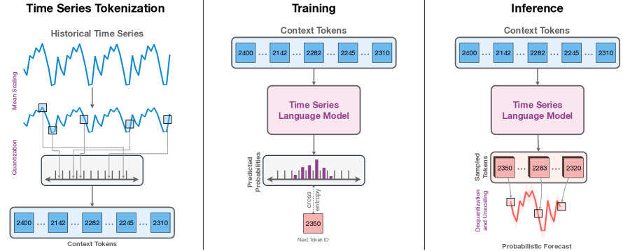
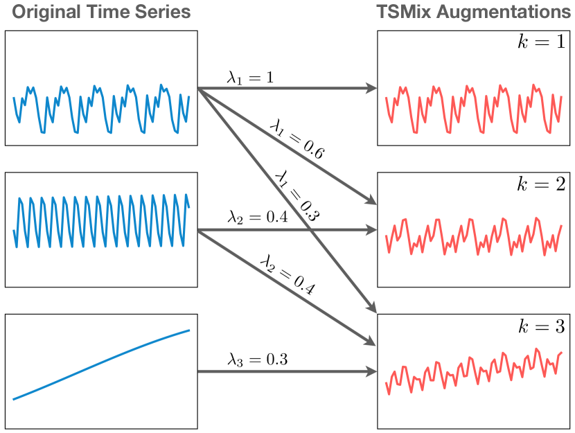
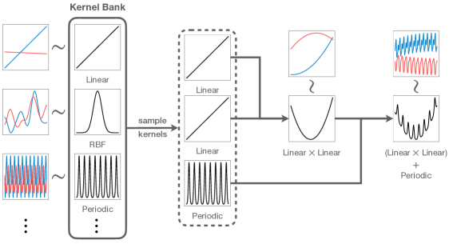

# Chronos — Research Note

## 📇 Academic Context

| Field | Value |
|-|-|
| Title | Chronos: Learning the Language of Time Series |
| Venue | TMLR (Transactions on Machine Learning Research) |
| Year | 2024 |
| Authors | Abdul Fatir Ansari, Lorenzo Stella, Caner Turkmen, et al. (AWS AI Labs) |
| Official Code | https://github.com/amazon-science/chronos-forecasting |
| Venue Kind | paper |

## First Principles

Chronos 想回答一個近乎天真的問題：一個預測下一個 token 的語言模型，和一個預測下一個數值的時間序列模型，本質差別到底在哪？作者的立場是，兩者都只是在建模序列結構、預測未來，差別只在「表徵」——語言是有限詞彙表裡的離散 token，時間序列則是無界的連續實數。於是他們把整套方法收斂成一句話：只要把時間序列「翻譯」成 token，就能原封不動地拿現成的語言模型架構來訓練，不做任何 time-series-specific 的修改。

下圖是 Chronos 的整體流程：輸入序列先縮放與量化成 token 序列（左），餵進一個 encoder-decoder 或 decoder-only 的語言模型、用 cross-entropy loss 訓練（中），推論時自回歸地取樣 token 再映回數值，抽多條軌跡得到預測分佈（右）。



### 分詞：mean scaling 加上均勻量化

第一步是縮放。同一個資料集裡不同序列的量級可能差好幾個數量級，會拖累優化。Chronos 採用 mean scaling，也就是取 $m=0$、$s$ 為歷史脈絡內絕對值的平均，把每個觀測除以這個尺度：

$$
\tilde{x}_i = \frac{x_i - m}{s}, \qquad m = 0, \quad s = \frac{1}{C}\sum_{i=1}^{C}\lvert x_i\rvert.
$$

作者特別點出 mean scaling 的一個好處：它保留了零值，而零在時間序列裡常常是有語意的（某商品當天零銷售、夜間太陽能零發電）。

第二步是量化。縮放後的序列仍是實數，語言模型吃不下，所以要離散化。作者在實線上選 $B$ 個 bin center $c_1<\dots<c_B$，以及 $B-1$ 個邊界 $b_i$，並定義量化函數 $q$ 與反量化函數 $d$：

$$
q(x)=\begin{cases}1 & -\infty\le x<b_1,\\ 2 & b_1\le x<b_2,\\ \ \vdots\\ B & b_{B-1}\le x<\infty,\end{cases}
\qquad d(j)=c_j.
$$

bin 的擺法可以資料相依（如 quantile binning）或均勻。因為下游未見資料集的數值分佈可能和訓練分佈差很遠，Chronos 選了 uniform binning：在 $[c_1,c_B]$ 內等距擺 bin center，邊界取相鄰中心的中點 $b_i=\tfrac{c_i+c_{i+1}}{2}$。實驗中取區間 $[c_1{=}-15,\,c_B{=}+15]$、詞彙表大小 $\lvert\mathcal V_{\mathrm{ts}}\rvert=4096$（含 `PAD` 與 `EOS` 兩個特殊 token，故實際 bin 數 $B=4094$）。值得注意的是，Chronos 刻意忽略 day-of-week、week-of-year 這類時間與頻率特徵，把序列就當成一串 token 來看待。

### 目標函數：用分類來做回歸

輸出端就是語言模型的老套路——在詞彙表上做 categorical 分佈，用 cross-entropy 去逼近量化後 ground truth 的分佈。對單一序列（含 `EOS`）的損失是：

$$
\ell(\bm\theta) = -\sum_{h=1}^{H+1}\sum_{i=1}^{\lvert\mathcal V_{\mathrm{ts}}\rvert}\mathbf 1_{(z_{C+h+1}=i)}\,\log p_{\bm\theta}\!\left(z_{C+h+1}=i \mid \bm z_{1:C+h}\right).
$$

這裡有個關鍵取捨：cross-entropy 不是 distance-aware 的，它不知道 bin $i$ 離 $i{+}1$ 比離 $i{+}2$ 近，模型得純粹從資料分佈自己學會把相鄰 bin 關聯起來。作者把這種做法稱為 regression via classification。好處是完全不動架構、可以直接套 `transformers` 這類函式庫，而且 categorical 分佈不對輸出形狀設限，能學任意（含多峰）分佈；壞處是丟掉了輸出本該有的 ordinal 結構——作者自己也承認，把 ordinal 性質加回去會是合理的延伸方向。

### 取樣與反量化

因為輸出是分佈，Chronos 天生是機率式的。推論時對 $p_\theta(z_{C+h+1}\mid \bm z_{1:C+h})$ 自回歸取樣得到 token 序列，再用 $d$ 映回實數、乘回尺度 $s$ 還原。抽多條軌跡（主結果用 20 條 sample path）就能估出任意分位數，得到預測區間。

### 資料增強：TSMixup 與 KernelSynth

作者反覆強調：對於通用預測模型，公開時間序列資料的「量與質」比建模框架更關鍵，這也是全篇最實在的貢獻之一。他們提出兩種資料增強。TSMixup 把 Mixup 推廣到多條序列：隨機抽 $k\sim\mathcal U\{1,K\}$ 條序列、各自縮放後取凸組合，權重 $[\lambda_1,\dots,\lambda_k]$ 從對稱 Dirichlet $\mathrm{Dir}(\alpha)$ 抽（實作 $K=3,\ \alpha=1.5$，長度 $l\in[128,2048]$）：

$$
\tilde{\bm x}^{\mathrm{TSMixup}}_{1:l}=\sum_{i=1}^{k}\lambda_i\,\tilde{\bm x}^{(i)}_{1:l}.
$$



KernelSynth 則反過來用 Gaussian process 憑空生序列：準備一個 kernel bank（linear 表趨勢、RBF 表平滑局部變化、periodic 表季節性），隨機抽 $j\sim\mathcal U\{1,J\}$ 個 kernel、用 $+$ 或 $\times$ 隨機組合成 $\tilde\kappa$，再從 $\mathcal{GP}(0,\tilde\kappa)$ 抽一條長度 $l_{\mathrm{syn}}=1024$ 的序列（實作 $J=5$）。這個想法借自 Automatic Statistician，但把「解釋結構」反轉成「生成結構」。



### 一次具體的前向流程

把上面的機制用論文真實設定走一遍。假設要預測一條類似論文中 $\mathcal N(100,10)$ 雜訊實驗的序列，脈絡長度 $C=512$：

```text
輸入脈絡 x_{1:512}，各值大約落在 100 附近
1) mean scaling：s = (1/512) Σ|x_i| ≈ 100  →  x̃_i = x_i / 100  （約落在 1.0 附近）
2) 量化：均勻 bin 落在 [-15, +15]，B = 4094 個 bin
   bin 間距 = 30 / (B-1) = 30 / 4093 ≈ 0.00733（縮放後空間）
   一個縮放值 1.18  →  bin index ≈ (1.18 - (-15)) / 0.00733 ≈ 2208
   → token id ≈ 2208（另加 PAD/EOS 偏移），序列變成 512 個整數 token
3) 語言模型（例如 Chronos-T5 Small, 46M）在詞彙表 4096 上輸出 categorical 分佈
4) 自回歸取樣 64 步（訓練用的 prediction length），抽 20 條軌跡
5) 反量化 d(j)=c_j 得縮放值，再乘回 s=100 還原到原始量級
   → 對每個未來步取分位數，得到預測區間
```

這個流程也直接暴露了 tokenization 的硬限制。可表示範圍是 $[-15s,\,15s]$，此例為 $[-1500,1500]$；而原始空間的精度間距是 $30s/(B-1)=3000/4093\approx0.733$，任何相距小於這個值的兩點會被映到同一個 token。當 $s$ 相對於序列振幅過小（如稀疏尖峰序列）就會 overflow，過大則損失精度——這正是論文在定性分析裡展示的失敗模式。

### 訓練配置與基準規模

Chronos 訓練 4 種 T5 尺寸（Mini 20M、Small 46M、Base 200M、Large 710M）與一個 decoder-only GPT-2（90M），語料是 28 個訓練資料集生出的 1000 萬條 TSMixup 增強序列加 100 萬條 KernelSynth 合成序列，兩者以 9:1 取樣，effective batch size 256、訓練 200K 步、context length 512、prediction length 64，在 8 張 A100 上完成。整體評測橫跨 42 個資料集，切成三塊：

| Data Subset | # Datasets | # Series | Usage |
|-|-|-|-|
| Pretraining-only | 13 | 795,936 | pretraining |
| Benchmark I | 15 | 97,272 | pretraining and in-domain evaluation |
| Benchmark II | 27 | 190,674 | zero-shot evaluation |

彙整分數的方式值得留意：因為各資料集指標量級差異大，作者不用算術平均，而是把每個模型的分數除以 Seasonal Naive 的分數得到 relative score，再用幾何平均跨資料集彙整；機率預測用 WQL、點預測用 MASE（皆越低越好）。結果上，在 Benchmark I（in-domain），較大的 Chronos-T5（Base、Large）明顯勝過古典統計模型、任務專屬深度模型以及其他預訓練模型；一個有意思的細節是最小的 Chronos-T5（Mini, 20M）竟仍勝過在更大語料上訓練的 Moirai-1.0-R（Large, 311M）。在 Benchmark II（zero-shot），Chronos 在 WQL 上拿到第 2 到第 4 名，勝過多數「在該任務上實際訓練過」的專屬模型；再對 Benchmark II 做輕量 fine-tuning 後，Chronos-T5（Small）躍居整體第一。消融方面，作者發現用 LLM 權重初始化相對隨機初始化「沒有明顯好處」，合成資料佔比約 10% 時最穩定，context length 增到約 1024 前都有幫助。

## 🧪 Critical Assessment

### 問題是否真實、又是否被真正解決

「通用預訓練時間序列預測模型」是個真需求：生產環境常有大量異質序列，為每個任務各訓一個模型在部署上確實笨重，一個 inference-only 的模型能大幅簡化 pipeline，這個動機站得住腳。Chronos 也確實展示了強的 zero-shot 表現。但要說問題被「解決」則太滿：論文全程限定在 univariate、均勻取樣、無 covariate 的設定，而真實預測任務常需要外生變數、多變量、不規則取樣——作者自己在 Discussion 也把這些全列為未來工作。因此更準確的說法是：Chronos 在「單變量點/機率預測」這個切片上把 zero-shot 做得很好，但離「通用時間序列模型」這個大旗還有明顯距離。

### 基準、消融與指標是否充分

這是本文最扎實的部分。42 個資料集、in-domain 與 zero-shot 分開、涵蓋統計/深度/預訓練三類基準，並對 model size、初始化、合成資料比例、context length、vocabulary size 都做了消融，覆蓋面遠超多數同類論文。用相對分數的幾何平均來彙整也比裸平均嚴謹。可挑剔的有幾點：主結果圖呈現的是「相對 Seasonal Naive 的幾何平均」，好讀但壓縮了絕對誤差資訊，真正逐資料集的 WQL/MASE 被放到附錄；機率評測只用 20 條 sample path 估分位數，取樣數本身可能影響 WQL，卻沒看到對取樣數的敏感度分析。

### 這是新方法，還是既有元件的重新包裝

Chronos 的「新」幾乎全在減法而非加法——它刻意不發明 time-series-specific 結構，把 scaling + 均勻量化接上原封不動的 T5/GPT-2，用 cross-entropy 訓練。量化建模、regression-via-classification、Mixup、用 GP 生成序列，這些元件單獨看都不算首創。真正的貢獻其實是兩件事：一是提供了「不需要特製架構」這個乾淨的實證反例，二是 TSMixup／KernelSynth 這套資料策略與大規模語料工程。把它當成「架構創新」會誤讀；把它當成「一個強而簡潔的 baseline 加上一套資料 recipe」才貼切。

### 基準是否被作者的方法量身打造，以及真實世界關聯

需要對 in-domain 結果保持警覺：Benchmark I 的 15 個資料集同時出現在 Chronos 的訓練語料裡，而部分對照的預訓練模型（Moirai、Lag-Llama）用的是不同語料，圖中也標註了對它們而言 in-domain 設定並不適用——這意味著 in-domain 的勝負在相當程度上是被評測切分本身所定義的，拿來宣稱普遍優越會有以己之長比人之短的味道。相對可信的是 zero-shot（Benchmark II）結果，因為那些資料集確實沒進 Chronos 訓練；但作者也誠實承認 Moirai 的部分測試集在它自己的預訓練語料中，比較並非完全對等。真實世界關聯上，最該記住的兩個保留是：較大模型的推論速度只與統計 local model 相當、比任務專屬深度模型慢；以及量化帶來的 overflow／精度損失在稀疏或強趨勢序列上是結構性弱點，只能靠換 normalization 這類啟發式緩解。整體而言證據支持「這是一個好用且好部署的強 baseline」，但不支持「時間序列特化設計沒有必要」這個更強的普遍結論。

## 🔗 Related notes

- [Informer](../informer/)
- [Autoformer](../Autoformer/)
