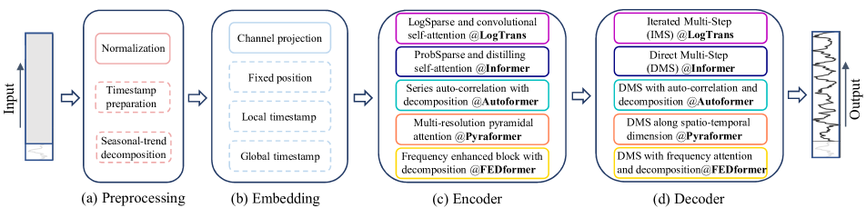
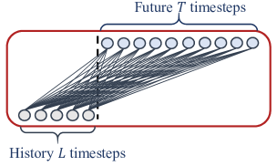
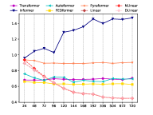

# LTSF-Linear — Research Note

## 📇 Academic Context

| Field | Value |
|-|-|
| Title | Are Transformers Effective for Time Series Forecasting? |
| Venue | AAAI 2023 |
| Year | 2023 |
| Authors | Ailing Zeng, Muxi Chen, Lei Zhang, Qiang Xu |
| Official Code | https://github.com/cure-lab/LTSF-Linear |
| Venue Kind | paper |

> 本筆記依據 arXiv 預印本 `2205.13504v3` 撰寫（OpenReview 全文以 HTTP 403 無法匿名取得，改用作者身分驗證通過的 arXiv 版本）。正式發表版本為 AAAI 2023，camera-ready 內容可能與此處引用的數字略有出入。

這篇論文的立場非常挑釁：它不提出新方法，而是質疑近年在長期時間序列預測（long-term time series forecasting, LTSF）上大量湧現的 Transformer 變體是否真的有效。作者用一個「簡單到令人尷尬」的單層線性模型 LTSF-Linear 當作對照組，在九個常用基準上把 LogTrans、Informer、Autoformer、Pyraformer、FEDformer 全部比了下去，藉此論證：這一整條研究路線的溫度計可能量錯了地方。

## First Principles

### 為什麼在時間序列上「排列不變性」是致命傷

Transformer 的核心是 multi-head self-attention，它擅長抽取一個長序列中「元素之間的語意關聯」——例如句子裡的詞、影像裡的 2D patch。但 self-attention 本質上是 permutation-invariant（排列不變）的：把輸入 token 的順序打亂，注意力算出來的兩兩關聯不變。NLP 之所以能容忍這點，是因為文字本身語意豐富，就算重排部分詞語意也大致保留。時間序列則相反——原始數值（股價、電力值）幾乎沒有 point-wise 的語意關聯，我們真正在乎的是「一組連續點之間的時間變化」，順序本身才是最關鍵的資訊。作者的論點是：即使加上 positional encoding 與把子序列 embed 成 token，套上 self-attention 之後仍不可避免地造成時間資訊流失。

論文把現有 LTSF-Transformer 的共通管線拆成四段（下圖），這也是後面消融實驗要逐一拆掉的對象：預處理（正規化、時間戳準備、季節-趨勢分解）、輸入嵌入（channel projection、固定位置編碼、局部/全域時間戳）、編碼器（各家自己的稀疏或低秩 attention 變體）、解碼器（多半改成一次輸出的 direct multi-step 解碼）。

### 一個「刻意過度簡單」的對照組：LTSF-Linear

作者提出的基礎模型只是一層沿時間軸的線性層，把歷史序列用加權和直接回歸成未來序列：

$\hat{X}_{i} = W X_i$

其中 $W \in \mathbb{R}^{T \times L}$，$L$ 是回看窗（look-back window）長度、$T$ 是預測長度，$X_i$、$\hat{X}_i$ 是第 $i$ 個變數（variate）的輸入與預測。關鍵設計選擇是：權重在所有變數之間共享，且完全不建模變數之間的空間相關性。這條式子還隱含一個常被忽略的實驗設定差異——它是 direct multi-step（DMS）預測，一次吐出全部 $T$ 步，而現有論文裡被比下去的傳統基線多半是 iterated multi-step（IMS），會逐步累積誤差。作者因此懷疑：Transformer 論文宣稱的增益，有很大一部分其實來自 DMS 這個策略，而非架構本身。

在此之上再加兩個針對資料特性的前處理變體：

- **DLinear**：先用一個 moving average kernel（kernel size 25，與 Autoformer 相同）把輸入拆成趨勢分量與剩餘（季節）分量，對兩個分量各接一層線性層，最後相加。當資料有明顯趨勢時特別有幫助。
- **NLinear**：先把整段輸入減去序列的最後一個值，過完線性層後再把這個值加回去。這等於對輸入做一次簡單正規化，用來對抗訓練/測試之間的 distribution shift。

### 一個帶真實數字的前向與成本走查

以 Electricity 資料集、回看窗 $L=96$、預測 $T=720$ 為例，看 DLinear 一次前向做了什麼：取某個變數的 96 維歷史向量 $x$，先算 moving average 得到趨勢 $x_t$、再取殘差得到季節分量 $x_s = x - x_t$；兩條分支各有一個 $720 \times 96$ 的權重矩陣 $W_t$、$W_s$，輸出 $\hat{y} = W_t x_t + W_s x_s \in \mathbb{R}^{720}$。因為權重跨 321 個變數共享，整個 Electricity 模型的參數量就只有兩個矩陣：$2 \times T \times L = 2 \times 720 \times 96 = 138{,}240$，約 138.2K（Table 8 量到的 139.7K 還額外含兩條分支的 bias 項，約多 1.4K）。對照論文 Table 8（$L=96, T=720$，Electricity）量到的實際成本：

| 模型 | MACs | 參數量 | 推論時間 | 記憶體 |
|-|-|-|-|-|
| DLinear | 0.04G | 139.7K | 0.4ms | 687MiB |
| Informer | 3.93G | 14.39M | 49.3ms | 3869MiB |
| Autoformer | 4.41G | 14.91M | 164.1ms | 7607MiB |
| FEDformer | 4.41G | 20.68M | 40.5ms | 4143MiB |

DLinear 的參數量比 Autoformer 少約兩個數量級，推論卻快數十到數百倍。準確度則要小心一個設定差異：為了各自跑出最佳表現，論文主基準表把 DLinear 的回看窗放大到 $L=336$、Transformer 維持 $L=96$（supp.tex:63 明講「report L=336 for DLinear and L=96 for Transformers by default」）。在 Electricity、$T=720$ 這一格，DLinear（$L=336$）的 MSE 為 0.203，優於最強的 Transformer（FEDformer 0.246），對應論文標註的 17.47% 相對改進。要注意上面那張成本表量的是 $L=96$ 的 DLinear（138.2K 參數、0.4ms），與這裡的 0.203 準確度並非同一組配置——不過即使把 DLinear 也放到 $L=336$，參數量也只是 $2\times720\times336\approx484$K，推論成本仍遠低於任何 Transformer。換句話說，更小、更快、還更準這個結論在兩種回看窗下都站得住。

### 逐步把 Informer 拆成線性層

作者做了一個很有說服力的「破壞性」消融：把 Informer 一步步簡化。第一步把每個 self-attention 層換成線性層（Att.-Linear，因為 attention 可視為權重動態變化的全連接層），此時 embedding 與 FFN 等輔助設計都還在；第二步丟掉 FFN 等其他輔助設計、只留 embedding 層與線性層（Embed+Linear，embedding 仍保留）；最後才把 embedding 也拿掉、化簡成單一線性層。以 Exchange-Rate、$T=96$ 為例，這條路徑並不是單調變好的：MSE 從 Informer 的 0.847 先「上升」到 Att.-Linear 的 1.003，接著在丟掉 FFN 等輔助設計後大幅降到 Embed+Linear 的 0.173，最後再拿掉 embedding 化為純 Linear 的 0.084。值得注意的是，單純把 attention 換成線性層（0.847→1.003）本身並沒有幫助，反而變差；決定性的一步是拿掉 FFN 這些複雜輔助模組（1.003→0.173，此時 embedding 還在），而移除 embedding 只是收尾的小幅改進（0.173→0.084）。整體看，被這串消融證明「非必要」的，是 attention 的動態加權加上那些複雜輔助設計，而不是把責任推給某個單一元件；至少對現有 LTSF 基準而言，self-attention 與這些複雜模組都不是關鍵。

### 兩個直指「時間建模能力被誇大」的證據

第一，**加長回看窗**。一個真正會抽取時間關係的模型，看得越多應該預測越準。作者掃過 $L \in \{24, 48, ..., 720\}$，發現現有 Transformer 的誤差隨窗變長多半持平甚至變差，而 LTSF-Linear 則穩定變好（下圖 Traffic，$T=720$）。這暗示 Transformer 在長輸入上是在過擬合時間噪音，而不是在抽取更多時間資訊。

第二，**打亂輸入順序**。若模型真的仰賴時間順序，打亂輸入應該嚴重傷害它。作者用 Shuf.（整段隨機打亂）與 Half-Ex.（前後半對調）測試：在 Exchange-Rate 上，所有 Transformer 的誤差幾乎不動（FEDformer 平均變化 −0.09%），而 LTSF-Linear 掉了 27.26%。這反過來說明 Transformer 根本沒把順序當回事，而線性模型有。有趣的是還有一個 naive 到極點的 Repeat 基線（直接重複回看窗最後一個值），在 Exchange-Rate 上竟贏過所有 Transformer 約 45%——因為它至少不會亂猜趨勢。

## 🧪 Critical Assessment

### 這個問題是真的，還是被實驗設定放大的

「Transformer 對 LTSF 是否有效」這個提問本身很有價值：領域確實在幾年內堆疊了大量複雜架構，卻很少有人回頭做這種控制變因的對照。論文最紮實的貢獻不是那個線性模型，而是它把「架構增益」與「DMS 策略增益」分離開來的一連串消融——加窗、打亂、拆 Informer、去 embedding、比實測成本。這些證據彼此獨立又指向同一結論，說服力遠高於單看一張準確度表。從第一性原理看，permutation-invariance 與數值序列缺乏語意這兩點也確實是 self-attention 用在時間序列上的結構性弱點。

不過要小心一個對稱的風險：論文的結論高度依賴 DMS/IMS 這個混淆變因是否被完全控制。它坦承現有 Transformer 論文的傳統基線多為 IMS，因此帶有誤差累積劣勢；但反過來，作者自己的線性模型是 DMS，而被比較的 Transformer 也已是 DMS，這部分是公平的。真正沒有被完全回答的是：如果把同樣的 DMS + 分解 + 正規化前處理原封不動搬到一個中等複雜度的非線性模型上，增益是否還在？論文沒有做這個中間點，因此「線性就夠了」與「這些基準太簡單」兩種解讀都成立。

### 基線、資料集與評估指標夠不夠

被比較的五個 Transformer 都是當時的代表作，且實作直接沿用原作者或 Autoformer 的程式碼與預設超參，這點值得肯定。但有兩個不對稱值得注意。其一，為了「比各自最佳」，作者對線性模型用 $L=336$、對 Transformer 用 $L=96$（附錄明講），理由是線性模型短窗會欠擬合、Transformer 長窗會過擬合——這個設定對線性模型有利，雖然有加窗實驗佐證，但頭條表格的公平性因此打了折扣。其二，指標只有 MSE/MAE，全部落在九個高度同源的基準（ETT 系列就佔了四個）。這些資料集本身是否足以代表「長期預測」這個宏大命題，是存疑的——它們大多有清楚的日/週週期，恰好是線性趨勢-季節分解的主場。

### 是重新命名，還是真的更簡單

線性回歸當然不是新東西，DLinear 的分解也直接借自 Autoformer/FEDformer；就「方法新穎性」而言這篇幾乎為零，作者自己在結論也明說貢獻不在提出線性模型。所以它不該被當成一個「新模型」來評價，而該被當成一次「基準有效性稽核」。這裡有一個值得警惕的地方：整套評估是圍繞著作者自己方法的強項（有明顯趨勢與週期、單變數為主、以 MSE 衡量）所定義的基準展開的。在 Exchange-Rate 這種低訊噪比的金融資料上，連 Repeat 都能贏 Transformer，這與其說證明線性模型強，不如說證明這些基準對「會亂外插趨勢」的模型特別不友善。結論的外推範圍應該被限制在「現有這九個 LTSF 基準」，而作者在正文也謹慎地加了這個限定詞。

### 問題真的被解決了嗎，對真實世界有多少意義

論文本身很誠實：它反覆強調 LTSF-Linear 只是一個「有競爭力的簡單基線」，模型容量有限，單層線性難以捕捉 change point 造成的動態，未來仍需要新設計。所以它並沒有宣稱「解決」長期預測，而是把門檻重新校準——後續任何複雜模型都得先贏過這個幾乎零成本的基線才算數。這個貢獻對實務其實很實在：在許多有明確週期的營運場景（電力、交通），一個 139.7K 參數、0.4ms 推論的模型可能就是更合理的預設選擇。真正未解的是這篇論文開放性的更大哉問——它挑的九個基準是否本身就太容易，以致於無法區分任何模型的真實時間建模能力。若是如此，那麼社群更該投資的是更難、更能反映真實動態的評估協定，而不是繼續在被線性模型飽和的基準上刷小數點。這也是這篇論文留給領域最有生產力的一根刺。

## 🔗 Related notes

- [Autoformer](../Autoformer/)
- [Informer](../informer/)
- [Non-stationary Transformers](../Non-stationary-Transformers/)
