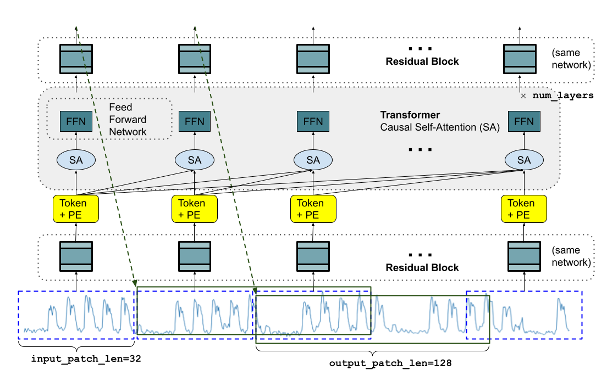
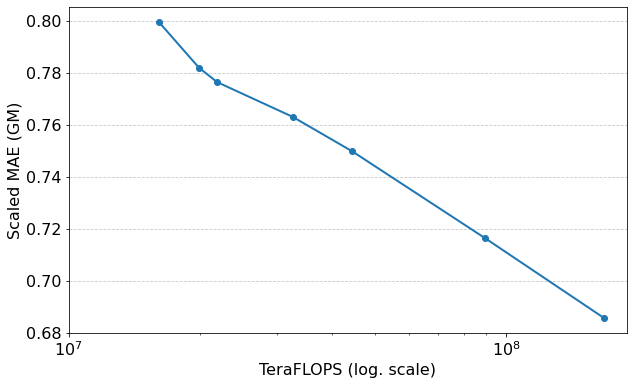
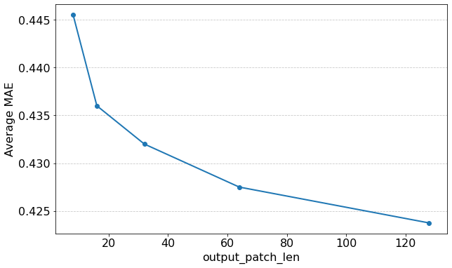

# TimesFM — Research Note

## 📇 Academic Context

| Field | Value |
|-|-|
| Title | A decoder-only foundation model for time-series forecasting |
| Venue | ICML |
| Year | 2024 |
| Authors | Abhimanyu Das, Weihao Kong, Rajat Sen, Yichen Zhou (Google Research) |
| Official Code | https://github.com/google-research/timesfm |
| Venue Kind | paper |

## First Principles

TimesFM 想回答一個很直接的問題：既然 NLP 用一個大型預訓練模型就能對沒看過的任務做 zero-shot 推論，時間序列能不能也有一個「開箱即用」的基礎模型（foundation model），面對從沒見過的資料集，不做任何微調就給出接近專門訓練模型的預測？作者的答案是可以，而且只用約 200M 參數、約 O(100B) 個時間點的預訓練資料就辦到，遠小於當代 LLM 的規模。

形式上，任務是學一個函數，把長度為 $L$ 的歷史 context $\mathbf{y}_{1:L}$ 映射到未來 $H$ 步的預測 $\hat{\mathbf{y}}_{L+1:L+H}$。因為要訓練「單一」通用模型，訓練期間不能依賴任何資料集專屬的靜態或動態 covariate，模型只能吃時間序列自己的過去值：

$$
f:\ \mathbf{y}_{1:L}\ \longrightarrow\ \hat{\mathbf{y}}_{L+1:L+H}
$$

### 為什麼是「patched decoder-only」

整個架構由四個設計原則撐起來。第一是 patching：把時間序列切成不重疊的區段（patch），每個 patch 就像語言模型裡的一個 token，這個作法沿用自長期預測工作 PatchTST。好處是送進 transformer 的 token 數量被 patch 長度整除地縮小，推論更快。第二是 decoder-only：和 PatchTST 用 encoder-decoder 不同，TimesFM 在給定一串 input patch 後，被訓練成用「過去所有 patch」去預測下一個 patch，這讓模型能在看過不同數量的 input patch 之後都能往下預測，天然支援可變 context 長度。

第三個、也是和 LLM 最不一樣的一點：output patch 可以比 input patch 長。長期預測的經驗是「一次直接吐出整個 horizon」比逐步 auto-regressive 解碼更準，但 zero-shot 場景下 horizon 未知，無法一次吐完。作者的折衷是讓一個 output token 直接預測一段比較長的未來（例如 input patch 長 32、output patch 長 128），這樣自迴歸步數就少很多。第四是 patch masking：若天真地用固定 patch，模型只會對「patch 長度整數倍」的 context 學得好，所以訓練時對每條序列隨機遮蔽最前面一段，讓模型看遍從 1 到最大長度的所有 context 長度。



### 三個 Residual Block 與因果 transformer

輸入層先把 $\mathbf{y}_{1:L}$ 依 `input_patch_len`（記為 $p$）切成 patch，第 $j$ 個 patch 是 $\tilde{\mathbf{y}}_j=\mathbf{y}_{p(j-1)+1:pj}$，同時附一個 binary padding mask $\tilde{\mathbf{m}}_j$（1 代表該點應被忽略）。每個 patch 經一個帶單層隱藏與 skip connection 的 MLP（Residual Block）投影成 `model_dim` 維向量，再加上 sinusoidal 位置編碼，得到第 $j$ 個 token：

$$
\mathbf{t}_j=\mathrm{InputResidualBlock}\big(\tilde{\mathbf{y}}_j\odot(1-\tilde{\mathbf{m}}_j)\big)+\mathrm{PE}_j
$$

這些 token 送進 `num_layers` 層標準 transformer，每層是多頭因果自注意力（causal self-attention）接 FFN，第 $j$ 個 output token 只能注意到序列中它之前（含自己）的 token。輸出層再用另一個 Residual Block 把每個 output token $\mathbf{o}_j$ 映射成緊接其後、長度為 `output_patch_len`（記為 $h$）的預測；也就是把 $\mathbf{y}_{1:pj}$ 全部編碼進 $\mathbf{o}_j$，用它預測後面 $h$ 個點：

$$
\hat{\mathbf{y}}_{pj+1:pj+h}=\mathrm{OutputResidualBlock}(\mathbf{o}_j)
$$

因為本文只做 point forecasting，訓練損失就是所有 patch 位置的 MSE 平均（下式的 $N=\lfloor L/p\rfloor$ 是 token 數）；若要做機率預測，只要換成多個分位數頭或最大概似損失即可，作者把它留給後續工作：

$$
\mathrm{TrainLoss}=\frac{1}{N}\sum_{j=1}^{N}\mathrm{MSE}\big(\hat{\mathbf{y}}_{pj+1:pj+h},\ \mathbf{y}_{pj+1:pj+h}\big)
$$

訓練時遮罩的取樣很巧妙：對每條序列抽一個 $r\in[0,p-1]$，把最前面 $r$ 個點設為 masked。用論文自己的例子，最大 context 512、$p=32$、若 $r=4$，則第一個 output token 被優化成「看過 $28=32-4$ 個點後」去預測，第二個 token 是「看過 $28+32$ 個點後」，以此類推；掃過所有可能的 $r$，模型就覆蓋了 1 到 512 的所有 context 長度。

### 走一次真實的前向：ETT zero-shot

用論文主力設定（`model_dim=1280`、20 層、16 頭、$p=32$、$h=128$）跑一次 ETT 的 zero-shot 任務，形狀變化如下：

```text
context L = 512, input_patch_len p = 32
  → 切成 N = floor(512/32) = 16 個 input patch，每個含 32 個時間點
  → 每個 patch 經 InputResidualBlock → 1280 維 token，+ 位置編碼
  → 16 個 token 送進 20 層因果 transformer（16 頭，FFN 隱藏維 = 1280）
  → 得到 16 個 output token o_1..o_16
  → o_16 經 OutputResidualBlock → 預測 y_513..y_640（output_patch_len = 128 個點）

任務要 horizon = 96：直接取 o_16 輸出的前 96 個點，一次前向、零次自迴歸。
任務要 horizon = 512：先出 513..640，再把預測接回輸入，共需 ceil(512/128)=4 次自迴歸；
  若 output_patch_len 只有 32，同一任務要 16 次自迴歸。
```

值得注意的是，正規化用的是 reversible instance normalization 的「標準化」部分：以 context 中第一個 input patch 的均值與標準差來縮放整條 context，因為 zero-shot 下無法像原始 RevIN 那樣學習仿射參數。下表是三種尺寸的超參數，注意 200M 模型的 `model_dim` 是 1280、20 層，`output_patch_len`（128）刻意比 `input_patch_len`（32）長：

| Size | num_layers | model_dims | output_patch_len | input_patch_len | num_heads | dropout |
|-|-|-|-|-|-|-|
| 200M | 20 | 1280 | 128 | 32 | 16 | 0.2 |
| 70M | 10 | 1024 | 128 | 32 | 16 | 0.2 |
| 17M | 10 | 512 | 128 | 32 | 16 | 0.2 |

### 資料引擎：真正的貢獻在這裡

模型不大，但預訓練語料是整篇工作的關鍵。作者用三大來源湊出量與多樣性：Google Trends（約 22k 個熱門查詢、2007–2022 的搜尋熱度，含時/日/週/月粒度）、Wiki Pageviews（2012–2023 的頁面瀏覽量，清理聚合後約 300B 個時間點，是語料主體），以及合成資料（ARMA 過程、正餘弦季節、含轉折點的趨勢、階梯函數的加性組合，共 3M 條、每條長 2048）。訓練時取樣比例是 80% 真實資料、20% 合成資料，真實資料再對「時/次時、日、週、月」四組給相同權重，避免高頻粒度淹沒低頻。下表節選語料組成，說明 Wiki 一項就佔了絕大多數時間點：

| Dataset | Granularity | # Time series | # Time points |
|-|-|-|-|
| Synthetic | - | 3,000,000 | 6,144,000,000 |
| Wiki hourly | Hourly | 5,608,693 | 239,110,787,496 |
| Wiki daily | Daily | 68,448,204 | 115,143,501,240 |
| Trends daily | Daily | 22,435 | 122,921,365 |
| M4 monthly | Monthly | 48,000 | 10,382,411 |

最大 context 長度依粒度而定：一般用 512，週資料因序列不夠長只用 256，月或更粗粒度用 64。整個 200M 模型在 16 核 TPUv5e 上跑 1.5M 次迭代（global batch 4096）約需 2 天。

### 效果與消融

在三組刻意排除於預訓練之外的公開基準上做 zero-shot 評估。以 ETT 長期預測（horizon 96 與 192、context 512，共 8 個任務）的平均 MAE 來看，TimesFM(ZS) 為 0.36，和監督式最強的 PatchTST（0.37）幾乎打平，其餘被專門訓練過的方法都明顯較差：

| Method | llmtime(ZS) | PatchTST | PatchTST(ZS) | FEDFormer | AutoFormer | Informer | TimesFM(ZS) |
|-|-|-|-|-|-|-|-|
| ETT Avg MAE | 0.45 | 0.37 | 0.35 | 0.53 | 0.53 | 0.99 | 0.36 |

在 Monash 檔案（18 個資料集）上，論文以「除以 naive baseline 後取幾何平均」的 scaled MAE 彙總，TimesFM(ZS) 得 0.6846，略優於 N-BEATS 的 0.7005 而成為榜首，並比 zero-shot 的 llmtime（0.9715）好超過 25%。消融方面，三個實驗支持核心設計：把模型從 17M 放大到 70M、200M 時，Monash 上的 scaled MAE 隨 FLOPS 單調下降（下左圖）；把 `output_patch_len` 從 8 加到 128（512 步 ETT 預測任務）時平均 MAE 單調下降（下右圖），印證「長 output patch 減少自迴歸步數」確有幫助；`input_patch_len` 則在 16、32 附近最好，太大太小都變差，且 $p=32$ 訓練速度約為 $p=16$ 的兩倍，故選 32。





合成資料的消融也很有說服力：拿掉合成資料後，Monash 上因為含較多被真實語料低估的粒度（季、年、10 分鐘）而變差，ETT 上則對粒度充足的小時級 ETTh 幾乎沒差，但對 15 分鐘的 ETTm 明顯退步——說明合成資料主要在補足「代表性不足的頻率」。此外作者也提到，這種從零、只用時間序列訓練的基礎模型，能以遠低於 GPT-3／LLaMA-2 的成本得到更好的 zero-shot 表現。

## 🧪 Critical Assessment

### 問題本身是真需求，但「zero-shot」的定義被放寬了

「單一預訓練模型、開箱即用地跨領域預測」確實是產業真痛點：省去每個資料集重新訓練與調參的負擔。這個動機無可挑剔，模型也確實只有 200M、可開源，落地門檻低。但要小心「zero-shot」在論文裡並非全然乾淨：在 Monash 的部分資料集上，作者承認會做「context 長度的推論期調校」（在 32、64 與最大長度間，用訓練尾段的驗證指標挑最好的一個）。這雖然被辯護為「多數 Monash 深度學習 baseline 本就用不同 context 長度」，但它已經是一種以驗證集為準的超參數選擇，把它完全算作 zero-shot 會高估開箱即用的成色。

### baseline 與彙總方式都對自己有利

評測設計有兩處值得質疑。其一是彙總指標的選擇：主圖用幾何平均（GM）宣稱 TimesFM 是 Monash 榜首，但論文附錄的算術平均（AM）版本裡，TimesFM 只是「與榜首 N-BEATS 在誤差範圍內接近」而非最佳——換一種同樣合理的彙總法，領先就消失了，這正是把基準定義在對自己有利之處的典型風險。其二是 baseline 的時效：llmtime 這條 zero-shot 對照因 OpenAI 停用 GPT-3 而改用 GPT-3.5-Turbo，模型已不同；且在 Darts 上作者自己承認 llmtime 有資料汙染的可能。這些都讓「贏過 zero-shot 對手」的力道打折。

### 架構新意有限，貢獻其實在資料與規模

若逐項拆解，patching 來自 PatchTST、decoder-only 來自 LLM、residual block 來自 TiDE，真正原創的主要是「output patch 比 input patch 長」這個折衷，以及支撐訓練的資料引擎。論文自己的 PatchTST(ZS) 消融反而透露了一個尷尬事實：在 context 固定為 512 的 ETT 上，用同一套語料預訓練的 PatchTST(ZS) 平均 MAE 是 0.35，還略勝 TimesFM 的 0.36——這暗示在 context 充足時，架構差異其實不大，TimesFM 的真正優勢是「能適應可變、較短的 context」而非注意力堆疊本身更強。把它理解為「一個為 zero-shot 預測而生的資料與訓練配方」，比理解為「一種更強的網路」更貼切。

### 「解決了嗎」：接近而非超越，且盲點明確

就宣稱的目標（zero-shot 逼近監督式 SOTA）而言，證據大致成立：ETT 上與 PatchTST 打平、Monash 上與 N-BEATS 同級。但「接近」不等於「超越」，而且在只有 8 條單序列的 Darts 上，TimesFM 的 GM(0.5767) 反而輸給 ARIMA(0.5219) 與 llmtime(0.4882)，顯示在資料稀少、季節性單純時，經典統計法仍具競爭力。更根本的盲點是模型只做單變量 point forecasting：沒有 covariate、沒有機率輸出、沒有不確定性區間，而這些恰是零售、能源等真實預測場景最需要的。作者把機率化與 covariate 都列為未來工作，因此可以說它證明了「時間序列基礎模型可行」，但距離「可直接取代生產級預測管線」仍有不小距離——這是一個扎實且誠實的可行性證明，而非終點。

## 🔗 Related notes

- [Autoformer](../Autoformer/)
- [Informer](../informer/)
- [TimesNet](../TimesNet/)
