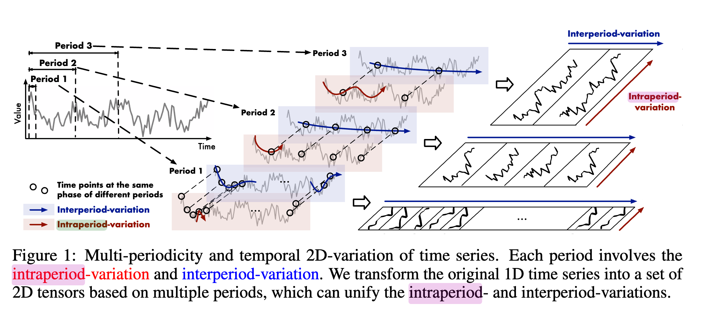
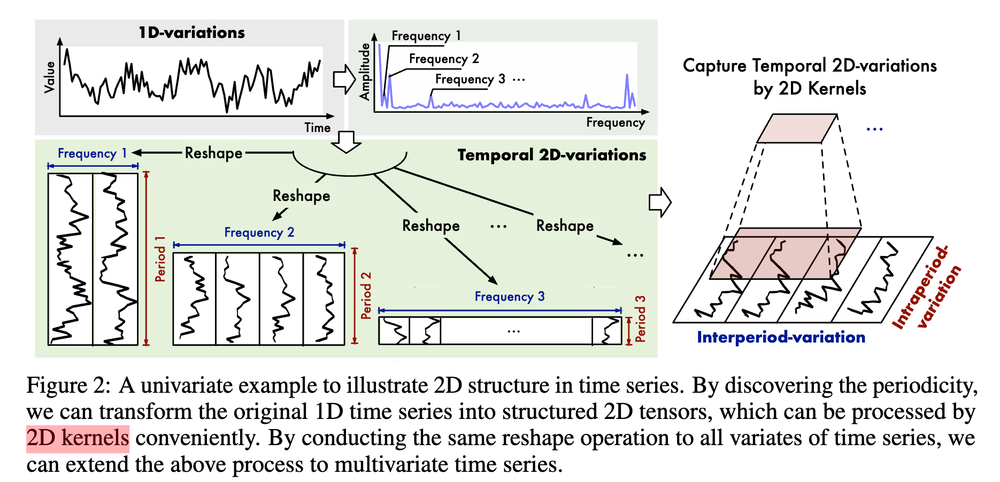

| Property  | Data |
|-|-|
| Created | 2023-09-05 |
| Updated | 2023-09-05 |
| Author | [@Aiden](https://github.com/Aidenzich) |
| Tags | #study |

# TimesNet
## Abstract
| Category | Description |
| --- | --- |
| **Summary** | This paper introduces `TimesNet`, a `temporal 2D-variation` modeling approach for general time series analysis. The paper addresses the challenge of capturing complex temporal patterns in 1D time series by transforming the analysis of temporal variations into the 2D space. TimesNet leverages `multi-periodicity` in time series to unravel the intricate temporal variations into multiple `intra-period` and `inter-period` variations. The proposed approach extends the representation capability of 1D time series by adopting 2D kernels for representation learning. |
| **Cause** | The problem this paper aims to solve is the limited representation capability of 1D time series in capturing complex temporal patterns. Previous methods have attempted to directly analyze temporal variations from 1D time series, but this has proven to be extremely challenging due to the intricate nature of temporal patterns. |
| **Effect** | The proposed solution, TimesNet, addresses the limitations of 1D time series by extending the analysis of temporal variations into the 2D space. By transforming the 1D time series into a 2D tensor, TimesNet can capture `multi-periodicities` and unravel the complex temporal variations into `intra-period` and `inter-period` variations. This approach allows for more effective representation learning and improves the performance of various time series analysis tasks, including short- and long-term forecasting. |

## Method
### What is the Temporal 2D-variation?

### How to convert 1D to 2D?

- What is the meaning of the `2D Kernels`:
    The 2D kernel mentioned is part of a parameter-efficient `inception block`, which is a well-acknowledged vision backbone [Page no. 5]. It involves multi-scale 2D kernels and is commonly used in computer vision tasks [Page no. 15]. 
- What is the `inception block`?
    See [here](../../utils/inception/README.md)

### Method Architecture

### Architecture details
| Symbol | Description |
|-|-|
| $\text{FFT}(\cdot)$     | Denotes the FFT (Fast Fourier Transform). |
| $\text{Amp}(\cdot)$     | Calculation of amplitude values. |
| $A \in \mathbb{R}^T$ | Calculated amplitude of each frequency. |
| $\text{Avg}(\cdot)$  | Averaging from C dimensions. |
| $A_j$ | The `j-th` value representing the intensity of the frequency-j periodic basis function. |
| $\frac{T}{j}$ | Corresponds to the period length of $A_j$. |
| $\{f_1, ..., f_k\}$ | The top-k amplitude values representing the most significant frequencies. |
| $\{A_{f1}, ... ,A_{f_k} \}$ | Unnormalized amplitudes of the selected frequencies. |
| $k$ | Hyper-parameter. |
| $\{ p_1, ..., p_k \}$ | Corresponds to k period lengths. |
| $\{1, ..., \|\frac{T}{2}\|\}$ | Frequencies considered within this range. |
| $X_{1D}$ | 1D time series. |
| $X^i_{2D}$     | The i-th reshaped time series based on frequency-fi. |
| $\text{Reshape}_{p_i;f_i} (\cdot)$  | Reshaping function.  |
| $\text{Padding}(\cdot)$ | Extends the time series by zeros along the temporal dimension. |
| $p_i$ and $f_i$   | Number of rows and columns of the transformed 2D tensors respectively. |
| $X^i_{2D} \in \mathbb{R}^{p_i \times f_i \times C} $ | Denotes the i-th reshaped time series based on frequency $f_i$. |
| $\{ X^1_{2D}, ..., X^k_{2D} \}$ | A set of 2D tensors indicating k different temporal 2D-variations derived by different periods. |

## Metrics
| Task | Metrics |
|------|---------|
| Long-term forecasting | MSE, MAE |
| Anomaly detection | F1-score |
| Short-term forecasting | SMAPE, MASE, OWA |
| Imputation | MSE, MAE |