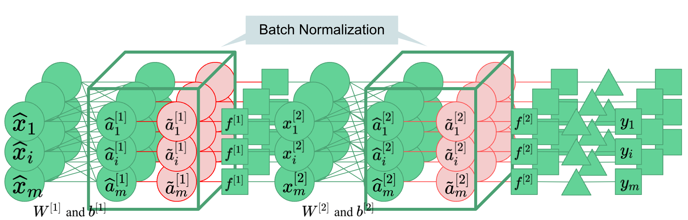

| Property  | Data |
|-|-|
| Created | 2022-12-19 |
| Updated | 2022-12-19 |
| Author | @Aiden |
| Tags | #study |

# Batch Normalization: Accelerating Deep Network Training by Reducing Internal Covariate Shift
- [slide](https://docs.google.com/presentation/d/1qYnTqCsxlI9ORjDrSonFhS9Ie2mXYdIyslvQaOAXhPo/edit#slide=id.g11c431b466c_0_247) made by [ProFatXuanAll](https://github.com/ProFatXuanAll)

## Core Illustration


## Code
```python
import torch
import torch.nn as nn

layer = nn.Sequential(
    nn.Linear(
        in_features=10,     # mini-batch has shape (batch_size, 10)
        out_features=20,    # FF layer output has shape (batch_size, 20)
        bias=False,         # Bias in FF layer are *not allowed*
    ),
    nn.BatchNorm1d(
        eps=1e-5,           # Numerically save computation
        num_features=20,    # Normalize over mini-batch activations
        momentum=0.1,       # Moving average hyperparameter
        affine=True,
        track_running_stats=True
    ),
    nn.Sigmoid(),
)

```

## Implement issue in NLP
Because the `padding` is 0, it will make the effect bad during normalization. A common practice is to replace padding with the previous sentence to avoid the situation where its value is 0