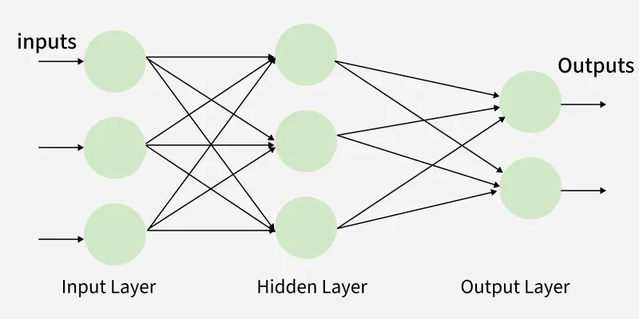

# Multilayer Perceptron (MLP)

MLP 一種基礎且經典的人工神經網路（Artificial Neural Network, ANN）模型，也是深度學習的基石之一。可以將它理解為一個**簡化的、模仿人腦神經元結構的數學模型**，用於從數據中學習並做出預測或分類。



## MLP 的核心概念
MLP 之所以被稱為「多層(Multilayer)」，是因為它具有一個明確的層次結構：
1.  **輸入層 (Input Layer):**
    * 這是網路的起點，負責接收原始數據。
    * 例如，如果要辨識一張手寫數字圖片（大小為 28x28 像素），輸入層就會有 784 個神經元（28 * 28 = 784），每個神經元對應一個像素的亮度值。
2.  **隱藏層 (Hidden Layer(s)):**
    * 這是在輸入層和輸出層之間的核心處理層。**MLP 至少要有一個隱藏層**（這也是它與「單層感知器」的區別）。
    * 這些層負責**提取特徵**和**執行複雜的計算**。數據在這裡會被轉換、組合，並透過「激勵函數」進行非線性處理。
    * "深度"學習（Deep Learning）中的 "深度" 指的就是擁有多個（通常是很多個）隱藏層。
3.  **輸出層 (Output Layer):**
    * 這是網路的終點，負責產生最終的結果。
    * 例如，在手寫數字辨識任務中，輸出層可以有 10 個神經元，每個神經元代表一個數字（0 到 9）的機率。

## MLP 如何運作（以及為何重要）
### 1. 資訊流動：前向傳播 (Feedforward)
數據會單向地從「輸入層」流經「隱藏層」，最後到達「輸出層」。在這個過程中，每一層的神經元都會對前一層傳來的訊號進行加權計算，然後再傳遞下去。

### 2. 學習機制：反向傳播 (Backpropagation)
MLP 最強大的地方在於它能夠「學習」。

* 一開始，網路的預測（例如，它把 "7" 辨識成 "1"）是隨機且錯誤的。
* 我們會計算這個「預測」與「正確答案」之間的**誤差**。
* 然後，這個誤差訊號會從「輸出層」**反向傳播**回「隱藏層」和「輸入層」。
* 在反向傳播的過程中，網路會微調每一層神經元之間的「權重」（Weights），目的是為了**讓下次的預測誤差變小**。
* 這個過程重複數千次（稱為「訓練」），MLP 就學會了如何正確地執行任務。

### 3. 關鍵突破：解決非線性問題
* **激勵函數 (Activation Function):** 這是隱藏層中至關重要的一個組件。它在神經元計算完後，加入一個「非線性」的轉換（例如 Sigmoid, ReLU 函數）。
* **為何重要?** 如果沒有這個非線性步驟，MLP 無論有多少層，其效果都等同於一個簡單的線性模型。正是這些**非線性**的激勵函數，使得 MLP 能夠學習和模擬現實世界中極其複雜的關係（例如，辨識貓和狗的複雜圖案）。

---

### 總結：MLP 的角色

* **基礎：** 它是理解更複雜神經網路（如 CNN 用於影像、RNN/Transformer 用於語言）的基礎。
* **應用：** 雖然現在對於複雜任務（如高解析度影像辨識）有更專門的模型，但 MLP 仍然非常有用。
* **當今用途：**
    * 處理表格數據（Tabular Data）的分類或迴歸問題。
    * 作為更大型、更複雜模型中的一個**組件**（例如，在許多模型的最後，都會接一個 MLP 來做最終的分類）。


### PyTorch MLP 實作

在 PyTorch 中，實作一個 MLP 通常是透過繼承 `torch.nn.Module` 來建立一個自定義類別。

這是一個標準的 MLP 範例，包含一個輸入層、兩個隱藏層和一個輸出層：

```python
import torch
import torch.nn as nn

# 定義一個 MLP 模型
class MLP(nn.Module):
    def __init__(self, input_size, hidden_size, output_size):
        # 呼叫父類別 (nn.Module) 的建構子
        super(MLP, self).__init__()
        
        # 這裡我們使用 nn.Sequential 容器來簡化
        # 你也可以在 __init__ 中一個個定義 (self.layer1 = ..., self.layer2 = ...)
        self.layers = nn.Sequential(
            nn.Linear(input_size, hidden_size),  # 1. 輸入層 -> 隱藏層1
            nn.ReLU(),                           # 2. 激勵函數
            nn.Linear(hidden_size, hidden_size), # 3. 隱藏層1 -> 隱藏層2
            nn.ReLU(),                           # 4. 激勵函數
            nn.Linear(hidden_size, output_size)  # 5. 隱藏層2 -> 輸出層
        )

    def forward(self, x):
        # forward 函數定義了數據如何流經你所定義的層
        # 因為我們用了 nn.Sequential，數據會自動依序通過所有層
        return self.layers(x)

# --- 範例：如何使用這個 MLP ---

# 1. 定義超參數
input_dim = 784    # 假設是 28x28 的圖片 (MNIST)
hidden_dim = 128   # 隱藏層的神經元數量
output_dim = 10    # 假設是 0-9 共 10 個類別的輸出

# 2. 實例化模型
model = MLP(input_dim, hidden_dim, output_dim)
print("模型架構：")
print(model)

# 3. 建立一個假的輸入數據 (Batch size 64, input_dim 784)
dummy_input = torch.randn(64, input_dim)

# 4. 執行前向傳播 (Feedforward)
output = model(dummy_input)

print("\n輸入數據維度:", dummy_input.shape)
print("輸出數據維度:", output.shape)
```

**程式碼解說：**

  * **`class MLP(nn.Module)`:** 所有的 PyTorch 模型都應該繼承 `nn.Module`。
  * **`__init__(self, ...)`:** 模型的建構子。你**必須**在這裡定義所有會用到的「層」（Layer），例如 `nn.Linear`。
  * **`nn.Linear(in, out)`:** 這就是一個**全連接層（Fully Connected Layer）**，也是 MLP 的核心。它會將一個 `in` 維的向量，透過權重矩陣相乘並加上偏置 (bias)，轉換為一個 `out` 維的向量。
  * **`nn.ReLU()`:** 這是**激勵函數**（Activation Function）。如果沒有它，多層的 `nn.Linear` 疊加在一起，效果等同於只有一層（因為線性的疊加還是線性）。`ReLU` 負責引入「非線性」，讓網路能學習更複雜的模式。
  * **`forward(self, x)`:** 這裡定義了「前向傳播」的SOP。當你呼叫 `model(input)` 時，PyTorch 內部會自動去執行 `forward` 函數。


### 深入探討：為什麼多層線性網路等同於單層？
如果我們把 `nn.ReLU()` 拿掉，單純堆疊多個 `nn.Linear` 層，會發生什麼事？這在數學上和單層線性網路有什麼區別？ 讓我們比較以下兩種寫法：

- **情況 A：多層線性網路（無激活函數）**
    ```python
    self.layers = nn.Sequential(
        nn.Linear(input_size, hidden_size),  
        nn.Linear(hidden_size, hidden_size), # 額外一層
        nn.Linear(hidden_size, output_size)  # 額外一層
    )
    ```

- **情況 B：單層線性網路**
    ```python
    self.layers = nn.Sequential(
        nn.Linear(input_size, output_size), 
    )
    ```

#### 數學上的等價性

雖然 **情況 A** 看起來結構更深，但在數學上，**這兩者是完全等價的**。

原因在於**線性變換的疊加仍然是線性變換**。
假設輸入是 $x$，每一層的權重矩陣分別是 $W_1, W_2, W_3$（忽略偏置 bias 以簡化說明）：

*   第一層輸出：$h_1 = W_1 \cdot x$
*   第二層輸出：$h_2 = W_2 \cdot h_1 = W_2 \cdot (W_1 \cdot x)$
*   第三層輸出：$y = W_3 \cdot h_2 = W_3 \cdot (W_2 \cdot W_1 \cdot x)$

根據矩陣乘法的結合律，我們可以先將權重矩陣相乘：
$$ y = (W_3 \cdot W_2 \cdot W_1) \cdot x $$

令 $W_{total} = W_3 \cdot W_2 \cdot W_1$，那麼：
$$ y = W_{total} \cdot x $$

這就變成了一個單層的線性變換，其權重為 $W_{total}$。

#### 意義與差別

1.  **表達能力 (Expressive Power)：**
    *   **多層無激活函數**：表達能力**受限於線性模型**。無論你堆疊多少層，它只能模擬線性關係（如 $y = ax + b$），無法解決非線性問題（如 XOR 問題或複雜的圖像分類）。
    *   **單層無激活函數**：同上，就是標準的線性回歸或線性分類器。
    *   **結論**：如果不加激活函數，增加層數**不會帶來任何模型表達能力的提升**，只是徒增計算量和參數冗餘。

2.  **為什麼需要激活函數 (Activation Function)？**
    *   加入 `ReLU` 或 `Sigmoid` 後，每一層的輸出變成了非線性的 $f(W \cdot x)$。
    *   這破壞了上述的線性疊加，使得 $f(W_2 \cdot f(W_1 \cdot x)) \neq W_{new} \cdot x$。
    *   正是這種**非線性**，讓神經網路能夠透過層層堆疊，去逼近任意複雜的函數（Universal Approximation Theorem）。

因此，**「深度」學習的威力，來自於「層數」與「非線性激活函數」的結合**。缺一不可。


### MLP 與 FFN 的不同

MLP 與 FFN 這兩個詞在實務上**經常被混用**，但在學術定義上**有層級關係**。
簡單來說：**MLP 是 FFN 的一種。**

| 特性 | FFN (前饋神經網路) | MLP (多層感知器) |
| :--- | :--- | :--- |
| **定義** | 一個**廣泛的類別**。 | 一種**具體的架構**。 |
| **數據流** | 資訊**單向**流動（從輸入到輸出），**沒有循環**。 | 資訊單向流動（所以它是一種 FFN）。 |
| **連接性** | **不一定**是全連接。 | **必須是全連接 (Fully Connected)** 的。 |
| **範例** | **MLP**、**CNN**（卷積神經網路）都屬於 FFN，因為數據都是單向傳播的。 | 僅指由**多個全連接層**（如 `nn.Linear`）和激勵函數堆疊而成的網路。 |

#### 為什麼大家會把 FFN 和 MLP 搞混？
關鍵在於 **Transformer** 的崛起。

在 Transformer 的架構中（例如 BERT、GPT），有一個關鍵的子組件叫做 **Position-wise Feed-Forward Network**，在論文和程式碼中，大家都**簡稱它為 FFN**。而這個所謂的 FFN，**它的具體實現就是一個小型的 MLP**:
1.  一個 `nn.Linear` 層（將維度擴展，例如 512 -\> 2048）
2.  一個 `nn.ReLU` 激勵函數
3.  一個 `nn.Linear` 層（將維度縮回，例如 2048 -\> 512）

**總結：**
  * **學術上：** FFN 是大概念（包含 MLP, CNN 等），MLP 是指全連接的 FFN。
  * **實務上 (尤其在 Transformer 領域)：** FFN 常常被當作一個**專有名詞**，用來特指那個**作為組件的、小型的 MLP**。

因此，當你看到 FFN 時，需要根據上下文來判斷它指的是「前饋網路」這個大類別，還是 Transformer 裡那個特定的 MLP 組件。

