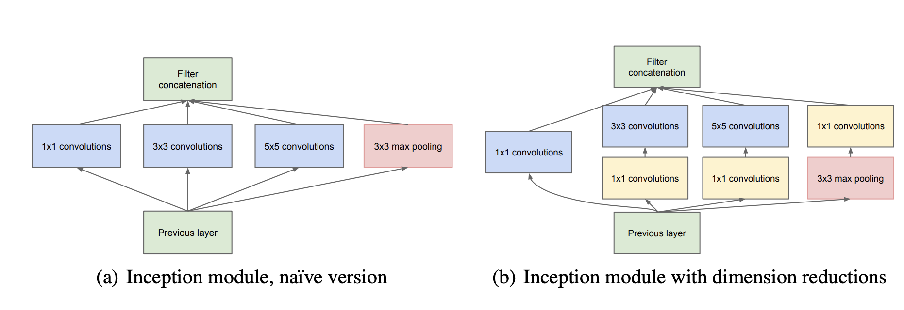

# Inception block
| Title | Venue | Year | Code |
|-|-|-|-|
| [Going deeper with convolutions](https://arxiv.org/pdf/1409.4842v1.pdf) | - | 14 | - |

The Inception block is a convolutional neural network structure used in deep learning, proposed by Google in 2014. This structure aims to address the `computational cost issues` brought by deep networks while ensuring the model can capture features at different scales.

In traditional convolutional neural networks, you might need to choose between using a `1x1`, `3x3`, or `5x5` convolution kernel. **But which scale is the best?** The idea behind the Inception structure is that you don't have to choose: You can use all these different scaled convolution kernels simultaneously.

Specifically, a typical Inception block with dimension redutions includes the following operations:

`1x1 convolution`
`1x1 convolution` followed by a `3x3 convolution`
`1x1 convolution` followed by a `5x5 convolution`
`3x3 max pooling` followed by a `1x1 convolution`

The results of these parallel operations are concatenated together, forming the output of the Inception block.

It's worth noting that the 1x1 convolution here serves to **reduce feature depth**, thereby lowering the model's computational cost. This is a strategy known as `bottleneck`, which maintains the depth of the Inception structure while reducing the number of parameters and computational workload.