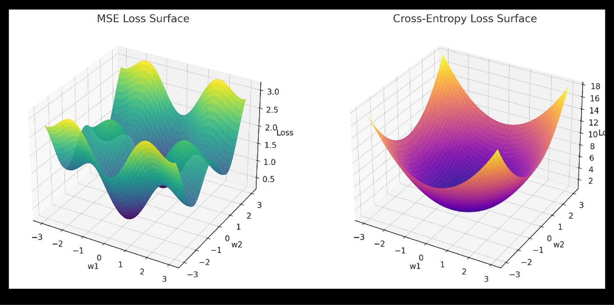
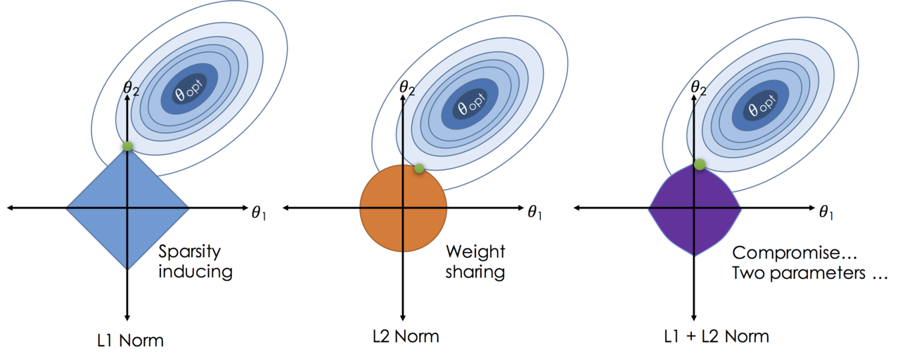

# L1 and L2 Regularization
> **English** | [繁體中文](./README.zh-TW.md)

The names L1 and L2 come from the **$L^p$ space (Lebesgue space)** in mathematics. "L" honors the French mathematician Henri Lebesgue, while the numbers "1" and "2" denote the specific values of the parameter $p$ in its general form.

Below is a more detailed explanation of the mathematical background:

In linear algebra, we use the $L^p$ Norm (also called the $p$-norm) to define the "length" or "size" of a vector. The general mathematical form of the $L^p$ Norm is defined as follows:

$$||x||_{\color{cyan}{p}} = \left( \sum_{i=1}^{n} |x_i|^{\color{cyan}{p}} \right)^{\frac{1}{\color{cyan}{p}}}$$

where:
* $x$ is a vector containing $n$ elements.
* $x_i$ denotes the $i$-th element of the vector $x$.
* $\color{cyan}{p}$ is a parameter that controls the type of Norm.

Simply by changing the value of $p$, you get different Norms:

* **When $p=1$ (L1 Norm):** substituting 1 into the general form, the formula becomes the sum of the 1st powers of the absolute values of all elements, then taking the 1st root. This is why it is called L1.
* **When $p=2$ (L2 Norm):** substituting 2 into the general form, the formula becomes the sum of the squares (2nd powers) of the absolute values of all elements, then taking the square root (2nd root). This is why it is called L2.

**Extended concept:**
Once you understand this naming logic, you realize that this family actually has other members:
* **$L^0$ Norm:** although strictly speaking it is not entirely a Norm by the mathematical definition, in machine learning it is often used to refer to the "total number of non-zero elements" in a vector.
* **$L^\infty$ Norm (L-infinity):** as $p$ approaches infinity, the result of the formula converges to "the element with the largest absolute value" in the vector.

---

The main purpose of both L1 and L2 is to **prevent the model from overfitting**. They do so by adding a "Penalty Term" to the loss function to **constrain the magnitude of the parameters W**.

## Why does constraining W prevent overfitting?

An "overfitted" model is often overly sensitive to noise in the training data. Mathematically this usually manifests as **very large values of the parameters W**.

> **Imagine a scenario:**
> Suppose $y = w_1 x_1 + w_2 x_2$.
> If the model overfits $x_1$, it may learn a very large $w_1$ (say $w_1 = 1000$).
> This means that a tiny change of 0.01 in $x_1$ causes $y$ to change drastically by 10.
> This kind of "drastic change" is the manifestation of "non-smoothness".

L1 and L2 penalize "overly large W". By constraining the values of W, the model is forced to become somewhat "dull" and cannot overreact to a single feature. This makes the model's decision boundary, or the function it represents, **"smoother" and "simpler"**, thereby achieving better generalization.


## 1. L2 Regularization (Ridge Regression): The "Smooth" Curve

L2 penalizes the **sum of the squares of the weights**.

* **Penalty term:** $\lambda ||\mathbf{w}||_2^2 = \lambda \sum w_i^2$
* **What it does:** L2 tends to make **all** parameters $w_i$ **"a bit smaller"**, but **does not tend to make them become 0**.
* **Effect:**
    * This is called "Weight Decay", because it pulls all W values toward 0.
    * It makes the parameter values W distribute more evenly.
    * This fits the "smooth" idea perfectly: **it makes the model's decision boundary smoother**, without overly "sharp" turns.

## 2. L1 Regularization (Lasso Regression): Bringing "Sparsity"

L1 penalizes the **sum of the absolute values of the weights**.

* **Penalty term:** $\lambda ||\mathbf{w}||_1 = \lambda \sum |w_i|$
* **What it does:** in the process of pushing the parameters $w_i$ toward 0, L1 **very easily turns many $w_i$ directly into 0**.
* **Effect:**
    * This produces a "Sparse Matrix", i.e. a W vector with many 0s.
    * This amounts to **automatically performing Feature Selection**. If $w_i$ becomes 0, it means the model considers the $i$-th feature ($x_i$) unimportant and can be discarded directly.
    * So the way L1 simplifies the model is not "smoothing", but **"pruning"**.


## Visualization

L2 does "smoothing" (making the model smoother and simpler), whereas L1 simplifies the model through "sparsity" (removing unimportant features).

We can understand the concrete workings of L1 and L2 through the following illustrations. A common loss function is presented in 3D space ($W_1$, $W_2$, $Loss$) as follows:


Suppose there exists an overfitting point $\theta_{opt}$ (the bottom of the valley) with the lowest Loss value. At this point, our "ripples" (elliptical contour lines) spread out from the valley bottom.
At some moment they must "touch" the boundary of the colored region in the figure.
The first contact point (the tangent point) is our optimal solution (the green dot in the figure); this is the typical situation where regularization takes effect.



The size of the colored region in the figure is not inherently fixed, but is determined by the hyperparameter.
The larger $\lambda$ is, the smaller the blue region, and the more strongly the model parameters are pulled toward `0`. Conversely, the model can "run farther" to approach the "valley bottom of the original loss" (the center of the ellipse).

## Pytorch Example
```python
import torch
import torch.optim as optim

# 1. 實例化您的模型
model = YourModel()

# 2. 建立優化器 (例如 AdamW 或 SGD)
# 這裡的 weight_decay=0.01 就是 L2 的 "lambda"
# lr (learning rate) 學習率
optimizer = optim.AdamW(model.parameters(), lr=0.001, weight_decay=0.01)
```


## Wrap Up

| Characteristic | L2 (Ridge) | L1 (Lasso) |
| :--- | :--- | :--- |
| **Penalty term** | sum of the **squares** of the weights ($\sum w_i^2$) | sum of the **absolute values** of the weights ($\sum |w_i|$) |
| **Effect on W** | drives W **toward** 0 (but usually not equal to 0) | makes **many** W **equal to** 0 |
| **Main effect** | weight decay, **smoothing** the decision boundary | **sparsity**, feature selection |
| **Analogy** | let every feature contribute "a little effort" | pick out only the few "most powerful" features |


## Reference
- https://medium.com/codex/understanding-l1-and-l2-regularization-the-guardians-against-overfitting-175fa69263dd