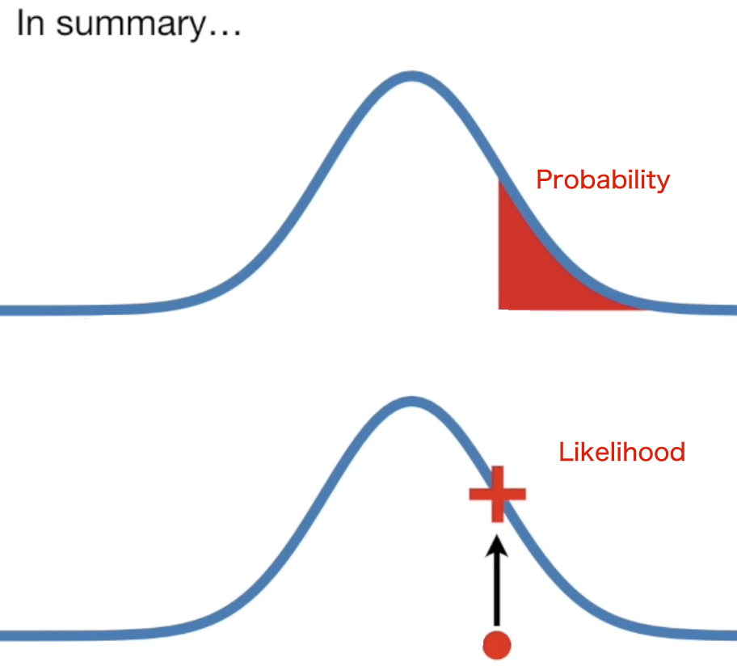

# Cross Entropy
$$
\mathcal{L}_{\text{CE}} = - \sum_{i \in K} y_i \log(p(y))
$$
| Property | Description |
|-|-|
| $y_i$ | Indicator variable |
| $p(y_i)$ | The probability of class $i$  |
| $\sum_{i \in K}$ | Sum over classes |
- [torch.nn.CrossEntropyLoss](https://pytorch.org/docs/stable/generated/torch.nn.CrossEntropyLoss.html)
- input is `logit`, which is an unnormalized scores

## Binary Cross Entropy
Binary cross entropy is a type of cross entropy loss used in binary classification problems.
- It measures the `dissimilarity` between the `predicted probability distribution` and the `actual distribution` (which is either 0 or 1) for each example in the dataset.
- The `binary cross entropy loss` is computed by taking the `negative logarithm of the predicted probability for the positive class`, if the actual class is positive, or for the negative class, if the actual class is negative. 
The resulting loss values are then `summed` over all examples and averaged to produce the final binary cross entropy loss. 
- Minimizing this loss will result in the model having higher accuracy in its predictions for binary classification problems.

$$
\frac{- 1}{N} \sum_1^N {y_i \times \log(p({y}_i)) + (1-y_i) \times \log(1- p({y}_i))}
$$

- The value of $y_i$
    | label | $y_i$ |
    |-|-|
    | Positive | 1 |
    | Negative | 0 |

#### Maximum Likelihood Estimation
- Use Model to infer Data's distribution
    - We know the x, and we calculate the Probilities of Data distribution
    - Use $ln$ 
- Probability is not Likelihood
    
    - Distribution -> Probability
    - Likelihood is probability's reverse

## Cross Entropy + Softmax 梯度推導全紀錄 (Grad-Backprop)

接下我們展示 $\log$ 與 $\exp$ 如何在數學上完美抵消，最終產生極簡的 $Q - P$ 梯度公式。

---

## 1. 定義與目標
設定模型輸出與真實標籤如下：
* **Logits ($z$):** 模型最後一層的原始輸出。
* **Softmax ($Q$):** 預測機率，定義為 
    $$
    \textcolor{orange}{Q_i = \frac{e^{z_i}}{\sum_k e^{z_k}}}
    $$
* **Ground Truth ($P$):** 真實標籤（可能是 One-hot 或平滑後的機率）。
* **Loss ($L$):** 交叉熵損失 
    $$
    \textcolor{cyan}{L = -\sum_k P_k \ln(Q_k)}
    $$

**目標：** 計算 $\frac{\partial L}{\partial z_i}$。

---

## 2. 核心化簡
將 Q 帶入 $\ln$ 中

$$L = -\sum_k P_k \ln \left( \textcolor{orange}{\frac{e^{z_k}}{\sum_j e^{z_j}}} \right)$$

利用對數性質 $\ln(\frac{a}{b}) = \ln a - \ln b$：
$$L = -\sum_k P_k [ \underbrace{\ln(e^{z_k})}_{z_k} - \underbrace{\ln(\sum_j e^{z_j})}_{\text{LSE}} ]$$

展開括號後：
$$L = -\sum_{\textcolor{orange}{k}} P_k z_k + \sum_{\textcolor{orange}{k}} P_k \ln(\sum_j e^{z_j})$$

由於 $\sum_k P_k = 1$（機率總和為 1），後半部分的 $\ln(\sum e^{z_j})$ 可以直接提取出來(因為與 $\textcolor{orange}{k}$ 無關)：

$$L = \mathbf{-\sum_{\textcolor{orange}{k}} P_k z_k} + \mathbf{\ln(\sum_j e^{z_j})}$$

---

## 3. 分項偏微分過程
我們現在對單一分量 $z_i$ 進行求導：

### A. 前半部（線性項）的導數
在 $-\sum_k P_k z_k$ 中，只有 $k=i$ 的那一項包含 $z_i$：
$$\frac{\partial}{\partial z_i} [ -(P_1 z_1 + \dots + P_i z_i + \dots) ] = \mathbf{-P_i}$$

### B. 後半部（LSE項）的導數
利用連鎖律 (Chain Rule)

> 連鎖律是求複合函數導數的核心工具。當一個函數是由多個函數嵌套而成，例如 $y = f(g(x))$，其導數為外層導數與內層導數的乘積：
> $$\frac{dy}{dx} = \frac{df}{dg} \cdot \frac{dg}{dx}$$
> 以 $\ln(u)$ 為例，對應關係如下：
> * **外層函數 $f(g)$**：$\ln(g)$ $\rightarrow$ 其導數為 $\frac{1}{g}$。
> * **內層函數 $g(x)$**：$u(x)$ $\rightarrow$ 其導數為 $u'$。
> 最終我們可以得到對 $\ln(u)$ 的導數為:
> $$\frac{d}{dx} \ln(u) = \frac{1}{u} \cdot u'$$

將公式帶入 LSE:
$$
\frac{\partial}{\partial z_i} \ln(\sum_j e^{z_j}) = \frac{1}{\textcolor{cyan}{\sum_j e^{z_j}}} \cdot \textcolor{cyan}{ \frac{\partial}{\partial z_i}(\sum_j e^{z_j})}$$
由於 $\sum e^{z_j}$ 對 $z_i$ 求導只剩下 $e^{z_i}$，故：
$$\frac{\partial}{\partial z_i} \ln(\sum_j e^{z_j}) = \frac{e^{z_i}}{\sum_j e^{z_j}} = \mathbf{Q_i}$$

---

## 4. 最終結果：優雅的殘差
將 A 與 B 合併，得到最終梯度：

$$ \frac{\partial L}{\partial z_i} = \mathbf{Q_i - P_i} $$

### 💡 物理直覺記憶點
* **$Q_i$ (現在在哪):** 模型目前的預測機率。
* **$P_i$ (要去哪裡):** 真實的目標位置。
* **梯度:** 兩者之間的**差距 (Residual)**。
    * 如果預測 0.9，目標 1.0 $\to$ 梯度為 -0.1（需要往正方向微調）。
    * 如果預測 0.1，目標 0.0 $\to$ 梯度為 0.1（需要往負方向微調）。

---
**面試備註：** L5 面試中若被問及此處，可額外提到 $Q - P$ 的簡潔性保證了反向傳播時不會出現梯度爆炸或消失（在初步更新時），這也是 Softmax + Cross Entropy 成為黃金搭檔的原因。

## References
- [Explanation of Infromation Entropy](https://www.ycc.idv.tw/deep-dl_2.html)
- [Explanation of Maximum Likelihood Estimation](https://www.ycc.idv.tw/deep-dl_3.html)