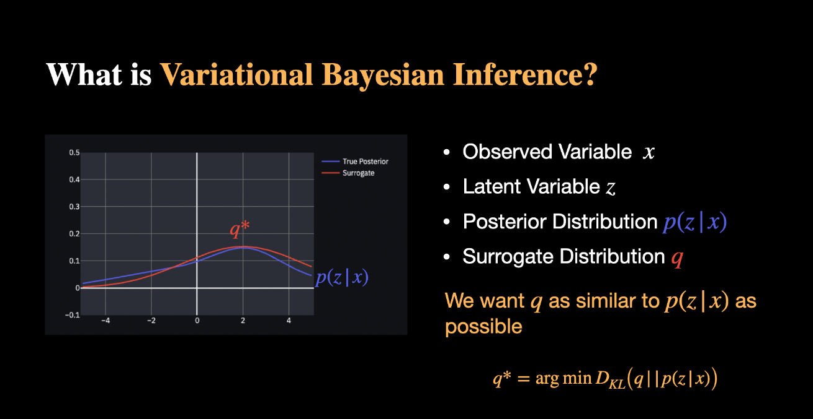
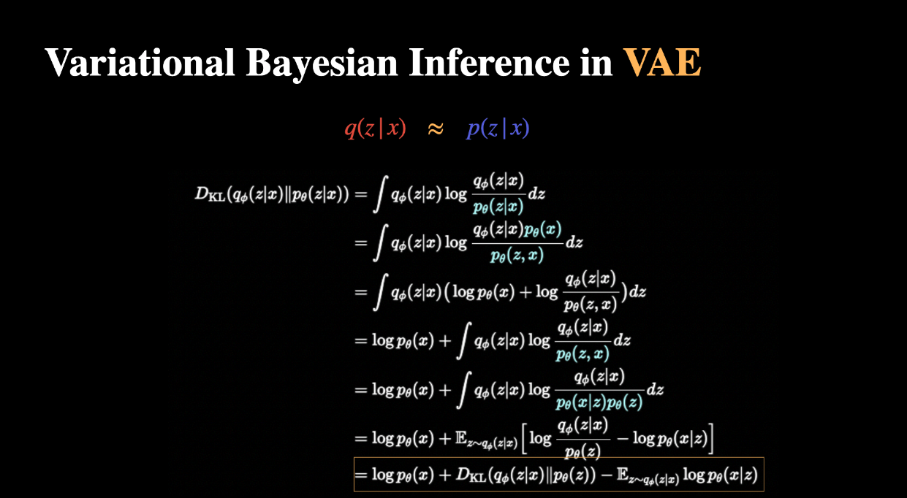
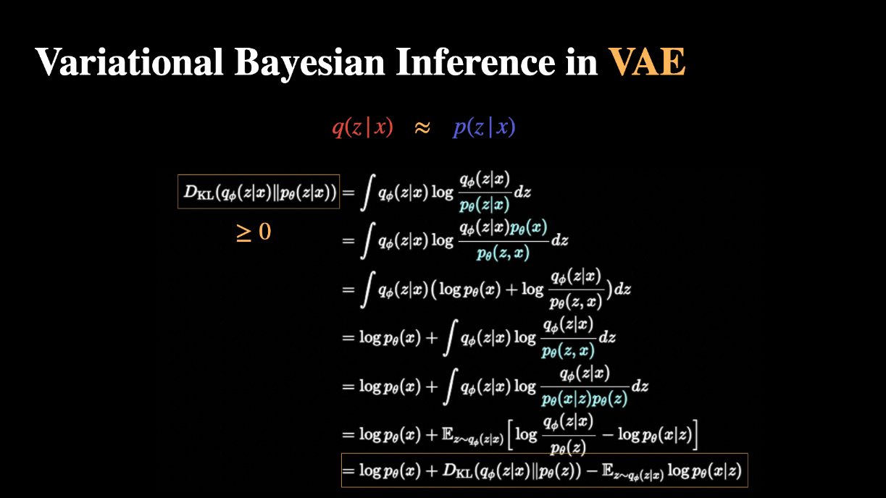
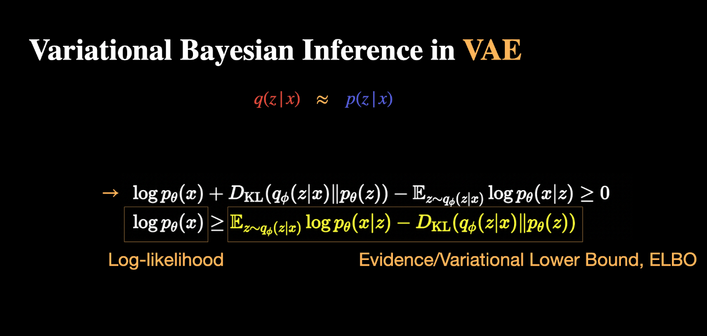
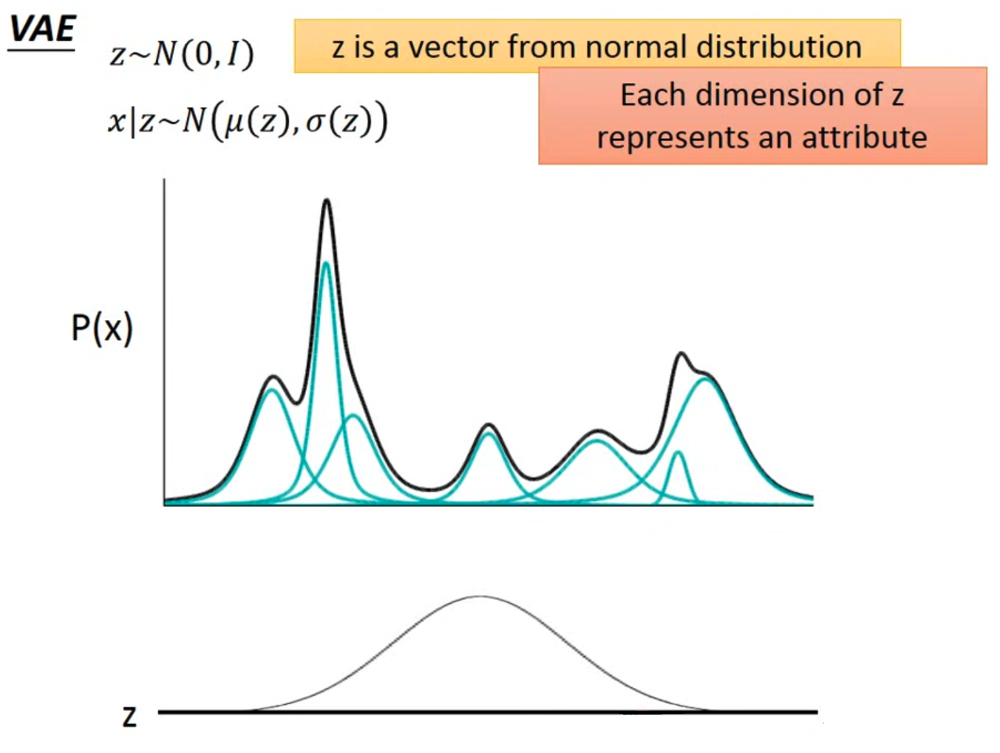
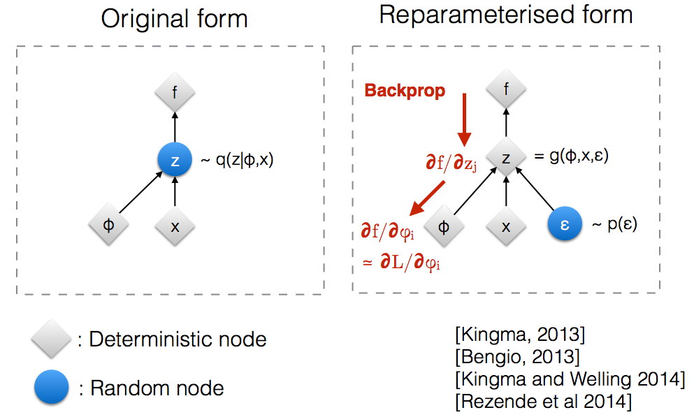

# ELBO
Please take a look at my [DDPM proof]((../../cv/diffusion/prove.md)) fully ELBO derivation.

## Variational Inference

## The relationship between VAE and GMM

## ELBO in VAE
$$ 
\begin{aligned}  
D_\text{KL}( q_\phi({z}|{x}) \| p_\theta({z}|{x}) )  &=\int q_\phi({z}|{x}) \log\frac{q_\phi({z} | {x})}{\color{teal}{p_\theta(z|x)}} d{z}  \\ 
&=\int q_\phi({z} | {x}) \log\frac{q_\phi({z} | {x})\color{teal}{p_\theta(x)}}{\color{teal}{p_\theta(z, x)}} d{z}  \\ 
&=\int q_\phi({z} | {x}) \big( \log p_\theta({x}) + \log\frac{q_\phi({z} | {x})}{p_\theta({z}, {x})} \big) d{z}  \\ 
&=\log p_\theta({x}) + \int q_\phi({z} | {x})\log\frac{q_\phi({z} | {x})}{\color{teal}{p_\theta(z, x)}} d{z} \\ 
&=\log p_\theta({x}) + \int q_\phi({z} | {x})\log\frac{q_\phi({z} | {x})}{\color{teal}{p_\theta(x|z)p_\theta(z)}} d{z} \\ 
&=\log p_\theta({x}) + \mathbb{E}_{{z}\sim q_\phi({z} | {x})}\Big[\log \frac{q_\phi({z} | {x})}{p_\theta({z})} - \log p_\theta({x} | {z})\Big] \\ 
&=\log p_\theta({x}) + D_\text{KL}(q_\phi({z}|{x}) \| p_\theta({z})) - \mathbb{E}_{{z}\sim q_\phi({z}|{x})}\log p_\theta({x}|{z})
\end{aligned} 
$$

- Because $D_{KL} \geq 0$:

$$
    \begin{aligned}
    \log p_\theta({x}) &+ D_\text{KL}(q_\phi({z}|{x}) \| p_\theta({z})) - \mathbb{E}_{{z}\sim q_\phi({z}|{x})}\log p_\theta({x}|{z}) \geq 0 \\
    \log p_\theta(x) &\geq \color{orange}{\mathbb{E}_{{z}\sim q_\phi({z}|{x})}\log p_\theta({x}|{z}) - D_\text{KL}(q_\phi({z}|{x}) \| p_\theta({z}))} \\
    &= \mathbb{E}_{q_{\phi}} \Big [\log p_{\theta}(x|z)-D_{KL} \Big( q_{\phi}(z|x) \; || \; p_\theta(z) \Big) \Big ] 
    \end{aligned}
$$

## Reparameterization trick
$$
\begin{aligned}
z \sim q_\phi(z|x) &= N(z; \mu, \sigma^2 I) \\
z &= \mu + \sigma \odot \epsilon \\
\epsilon &\sim N(0, I)
\end{aligned}
$$

- In VAE, the reparameter trick is used to sample the latent variable z through the generated $\mu$ and $\sigma$ from the encoder.

## Reference
- [What is Variational Inference?](https://www.youtube.com/watch?v=HxQ94L8n0vU&ab_channel=MachineLearning%26Simulation)
- [Online showcase of ELBO](https://share.streamlit.io/ceyron/machine-learning-and-simulation/main/english/probabilistic_machine_learning/elbo_interactive_plot.py)
- [KL Divergence](https://en.wikipedia.org/wiki/Kullback%E2%80%93Leibler_divergence)
- [Joint probability distribution](https://en.wikipedia.org/wiki/Joint_probability_distribution)
