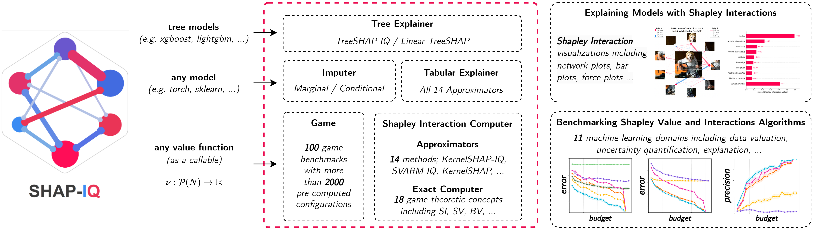

# shapiq — Research Note
> **English** | [繁體中文](./README.zh-TW.md)

## 📇 Academic Context

| Field | Value |
|-|-|
| Title | shapiq: Shapley Interactions for Machine Learning |
| Venue | NeurIPS 2024 (Datasets & Benchmarks Track) |
| Year | 2024 |
| Authors | Maximilian Muschalik, Hubert Baniecki, Fabian Fumagalli, Patrick Kolpaczki, Barbara Hammer, Eyke Hüllermeier |
| Official Code | https://github.com/mmschlk/shapiq |
| Venue Kind | paper |

## First Principles

### From the Shapley Value to Shapley Interactions

Cooperative game theory defines a "game" as a value function over the power set $\nu: \mathcal{P}(N) \rightarrow \mathbb{R}$ (with $\nu(\emptyset)=0$), describing the output of $n$ entities (players) under all possible coalitions. The Shapley value (SV) is the unique semivalue that simultaneously satisfies linearity, dummy, symmetry, and efficiency: it fairly distributes the overall output $\nu(N)$ to each individual player. In machine learning this framework is used repeatedly for feature attribution, global feature importance, and data valuation. However, the SV falls only on a single player; it does not give insights on synergies or redundancies —— for example, the two features "latitude" and "longitude" each look independent on their own, and only by considering them together does the synergy of "precise location" reveal itself. The core of the shapiq paper is to extend the SV to Shapley interactions (SI) that can describe the joint contribution of "a group of entities", and to provide an open-source Python package that unifies the relevant algorithms.



Both the SV and the Banzhaf value (BV) can be written as a weighted average of the marginal contribution $\Delta_i(T) := \nu(T \cup \{i\}) - \nu(T)$, differing only in the weights:

$$
\phi^{\text{SV}}(i) := \sum_{T \subseteq N \setminus \{i\}} \frac{1}{n \binom{n-1}{\vert T \vert}} \Delta_i(T)
\quad\text{and}\quad
\phi^{\text{BV}}(i) := \sum_{T \subseteq N \setminus \{i\}} \frac{1}{2^{n-1}} \Delta_i(T)
$$

To generalize "value" to a group of entities $S$, the paper takes the interaction index (II) route: it is based on the discrete derivative, and subtracts the lower-order effects contributed by all subsets of $S$. Taking a pair of players $i,j$ as an example, $\Delta_{\{i,j\}}(T)$ equals the joint marginal contribution $\nu(T\cup\{i,j\})-\nu(T)$ minus each individual $\Delta_i(T)$ and $\Delta_j(T)$. After generalization, A positive value indicates synergy, whereas a negative value indicates redundancy of $S$; zero denotes additive independence. Its definition is:

$$
\Delta_S(T) := \sum_{L \subseteq S} (-1)^{\vert S \vert-\vert L \vert} \nu(T \cup L)
$$

### Interaction Order and the Efficiency Axiom

The key design of SI is to introduce an explanation order $k$, allocating the joint contribution $\Phi_k(S)$ only to coalitions of size $\vert S\vert \le k$, and requiring them to satisfy a generalized efficiency, i.e. the sum of contributions across all orders still returns the overall output:

$$
\nu(N) = \sum_{S\subseteq N, \vert S \vert \leq k}\Phi_k(S)
$$

Within this framework there are several concrete indices. The $k$-SII are the unique SI that coincide with SII for the highest order (i.e. $k$-Shapley Values agree with SII at the highest order); STII places the emphasis on the highest-order interactions; FSII directly optimizes Shapley-weighted faithfulness. At $k=1$ all SI degenerate to the SV, and at $k=n$ they become the Möbius interactions (MI), fully faithful to the value of all coalitions (faithfulness loss of 0). In other words, SI provides a complexity–accuracy spectrum from "the simplest SV" to "the most complete MI".

### Composition of the shapiq Package

shapiq realizes the above theory as three kinds of composable components. On the approximator side, We implement 7 algorithms for approximating SI across 4 different interaction indices, and another 7 algorithms for approximating SV, and use a shared `shapiq.CoalitionSampler` interface to unify sampling accelerations such as the border-trick and pairing-trick. On the exact-computation side, `shapiq.ExactComputer` provides the ability of computing 18 interaction indices and game-theoretic concepts (including MI), which can serve as ground truth for evaluating approximators. On the game side, `shapiq.Game` defines 11 benchmark games, comprising 100 independent game instances (applications × dataset–model pairs), and pre-computes and shares the exact SI values of $2\,042$ game configurations.

The table below summarizes the three main components of the package and their scale (numbers taken from the paper's main text and Table 1–3):

| Component Category | Representative Implementation | Scale |
|-|-|-|
| Approximator | KernelSHAP-IQ, SVARM-IQ, Permutation Sampling… | 7 SI approximators + 7 SV approximators (4 interaction indices) |
| ExactComputer | Möbius Converter, Exact Computer | exact computation of 18 interaction indices and game-theoretic concepts |
| Game (benchmark) | Local/Global/Tree Explanation, Data Valuation… | 11 benchmark games, 100 game instances, 2,042 pre-computed configurations |

### Explaining a Single Prediction with shapiq (Programming Interface)

The paper demonstrates the minimal usage of `shapiq.Explainer`: when creating the explainer, specify the highest order `max_order=3`, then approximate a single sample under a fixed evaluation budget:

```python
import shapiq
# 建立一個最高到 3 階交互作用的解釋器
explainer = shapiq.Explainer(model=model, data=X, max_order=3)
x = X[0]
# 在 budget=1024 次價值函數呼叫的預算下近似特徵交互作用
interaction_values = explainer.explain(x=x, budget=1024)
# 取出 3 階交互作用並以網路圖視覺化
interaction_values.get_n_order_values(3)
interaction_values.plot_network(feature_names=...)
```

### A Concrete Forward Example (Vision Transformer, 16 patches)

Take the image-classification game `vit_16_patches` from the paper's benchmark as an example: an image is cut into 16 patches, and each patch is treated as a player, so $n=16$. To exactly compute the value of all coalitions, one needs to evaluate $2^{16} = 65\,536$ coalitions —— this is precisely why the paper chooses to "pre-compute and archive" for games with $n \le 16$.

Following this example, expanding the orders (the combinatorial numbers below are derived in this note): if we take only $k=2$, we need to output $16$ singletons plus $\binom{16}{2}=120$ pairs, a total of $136$ interaction values; taking it up to the example program's `max_order=3` then adds $\binom{16}{3}=560$ triples, reaching $696$ values, and they must sum back to the model output according to the efficiency axiom. Yet the example only gives `budget=1024` evaluations, about $1.6\%$ of the full $65\,536$ —— this is why, even with as few as 16 players, one still relies in practice on shapiq's approximators rather than brute force.

### Findings from Cross-Domain Benchmarking

The paper uses these 100 games to compare the various approximators, and the most striking conclusion is that the ranking of approximators varies strongly between the different applications domains: no single algorithm reigns across the board. The authors further summarize two families —— stratification-based estimators perform superior in settings where the size of a coalition naturally impacts its worth (for example the training-set size in Dataset Valuation), whereas kernel-based estimators achieve state-of-the-art in settings where the dependency between size and worth of a coalition is less pronounced (for example the prediction jumps in Local Explanation). For practitioners, the paper suggests that $k$-SII is a good default choice for shapiq, because it agrees with SII and already gives a clear faithfulness improvement over the SV at $k=2$.

## 🧪 Critical Assessment

### Is the Problem Real and Important

The starting point that "the SV cannot express synergy" is defensible: the paper cites extensive literature pointing out that the SV is limited when explaining complex decision systems, and examples like latitude/longitude do intuitively require joint consideration. Generalizing the SV to arbitrary-order interactions, and giving practitioners access through a unified API, addresses an engineering and research gap with genuine demand —— the existing `shap` only provides 2nd-order tree-model interactions and lacks a unified implementation across indices and domains. As far as "lowering the barrier to use" goes, there is no obvious doubt about the reality of the problem.

### Adequacy of Baselines, Metrics, and Ground Truth

The benchmark design is relatively rigorous: it compares all approximators across multiple domains using two metrics, MSE and Precision@5, and tries as much as possible to provide exact ground truth. But two points deserve reservation. First, exact ground truth can only be enumerated when $n \le 16$; For $n > 16$, where pre-computing a game and ground truth values becomes computationally prohibitive, one switches to the analytical solutions of TreeSHAP-IQ or SOUM —— that is, the evaluation of the "large player count" scenario is in fact tied to specific model families, and its generality is inferior to the small games. Second, the entire evaluation is numerical approximation error, and there is no human-centric experiment proving that high-order interactions really help people understand the model; the paper itself lists this as future work.

### Consolidation of Existing Algorithms, or a New Method?

One must be honest: the core contribution of shapiq is "consolidation" rather than proposing an entirely new estimator —— the 7+7 approximators and 18 indices almost all come from existing literature, and the paper belongs to the Datasets & Benchmarks category rather than a methodological breakthrough. This is a reasonable positioning for that track, but it also means that if you expect novelty at the algorithmic level you will be disappointed. Another point to watch is that the benchmark is defined by the authors themselves: the composition of the 100 games, the domain partitioning, and the narrative of "which family wins in which domain" are all under the authors' control; although the selling point of "different rankings in different domains" has the explanatory support of the MI order structure, it remains in essence an observation under scenarios chosen by the authors, and whether the same conclusion holds under a different set of games has no external verification.

### Is the Claimed Problem Really Solved, and Its Real-World Relevance

As for the goal of "providing a reproducible, extensible tool covering arbitrary-order SI", the paper largely achieves it, and pre-computing 2,042 configurations has real benefits for reproducibility and energy consumption. But the higher goal of "letting people truly understand the model" is not yet solved: the paper admits the TreeSHAP-IQ algorithm is currently implemented in Python (performance-limited), and also acknowledges that visualizing high-order interactions is itself difficult and may even cause information overload and be misread. So my judgment is —— it successfully lowers the barrier to "computing and accessing SI", but "whether SI improves real decision-making" remains an open question, and the real-world benefit leans toward research infrastructure rather than a settled conclusion on end-user interpretability.

## 🔗 Related notes