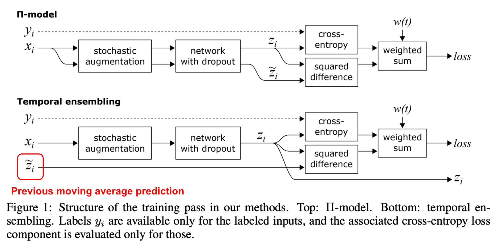

| Property  | Data |
|-|-|
| Created | 2023-03-01 |
| Updated | 2023-03-01 |
| Author | [@Aiden](https://github.com/Aidenzich) |
| Tags | #study |

# Temporal ensembling

| Title | Venue | Year | Code |
|-|-|-|-|
| [Temporal ensembling for semi-supervised learning]() | ICLR | ['17](https://arxiv.org/pdf/1610.02242.pdf) | - |

## Abstract
This paper introduce self-ensembling, where we form a consensus prediction of the unknown labels using the outputs of the network-in-training on different epochs, and most importantly, under different regularization and input augmentation conditions.

This ensemble prediction can be expected to be a better predictor **for the `unknown labels` than the output of the network at the most recent training epoch**, and can thus be used as a target for training. 

## Proposed Method

`Temporal ensembling` is a machine learning technique that is particularly useful in deep learning for improving the accuracy of predictions in time series data. 
The technique involves the model **making several predictions on the same input data point** with added `perturbations` or `noise`, instead of a single prediction. 
These `perturbations` can include `random noise`, `dropout`, or other data augmentation techniques, and the model then `takes the average of these predictions` as its final prediction.

This approach helps to prevent `overfitting` and improves the model's accuracy. `Temporal ensembling` also involves training the model on a `rolling window` of the most recent data points. This helps to keep the model up to date with the latest information and enables it to adapt to changes in the data over time.

`Temporal ensembling` has been successfully used in a variety of applications, including financial forecasting, weather prediction, and speech recognition.

