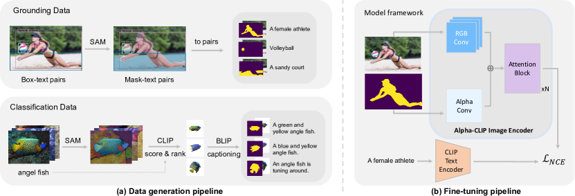

# Alpha-CLIP — Research Note

## 📇 Academic Context

| Field | Value |
|-|-|
| Title | Alpha-CLIP: A CLIP Model Focusing on Wherever You Want |
| Venue | CVPR |
| Year | 2024 |
| Authors | Zeyi Sun, Ye Fang, Tong Wu, Pan Zhang, Yuhang Zang, Shu Kong, Yuanjun Xiong, Dahua Lin, Jiaqi Wang |
| Official Code | https://aleafy.github.io/alpha-clip |
| Venue Kind | paper |

> 本筆記依據 arXiv 版本（arXiv:2312.03818，LaTeX 原始檔即 CVPR 2024 投稿模板）撰寫；正式 camera-ready 版可能與此略有差異。所有數值與引文均以論文原文為準。

## First Principles

### 從 CLIP 的盲點談起：為什麼要有 alpha 通道

原始 CLIP 以「整張圖 ↔ 整句描述」的對比學習取得對齊特徵，因此它天生把畫面裡所有物件的語意混在一起，無法只針對使用者指定的局部區域作答。過往的補救方式不外乎兩類：把感興趣區域裁切成獨立 patch，或把不相干像素／特徵遮成背景色——前者切斷了上下文，後者則直接改動了原圖內容。另一條路線（如 MaskCLIP）改用 attention mask 讓全域 `[CLS]` token 只關注局部，但它「只吐得出 `[CLS]` token」，因此無法接到需要整張 feature map 的下游模型（BLIP-2、LLaVA、Point-E）。Alpha-CLIP 的動機正是：在不破壞原圖、又能保留整張特徵圖的前提下，把「要看哪裡」這個提示塞進模型。

### 資料引擎：把 image-text 變成 RGBA region-text

要微調出能吃 alpha 通道的 CLIP，關鍵瓶頸是資料。作者設計了雙分支資料管線。第一條 grounding data pipeline 直接沿用 Kosmos-2 的 GRIT 資料集（GLIP 與 CLIP 自動標出 box 級的 region-text 配對），再用 SAM 為每個 box 產生高品質偽遮罩，升級成 mask 級配對；分類實驗即以此規模化到 GRIT-20m。這條分支保留了自然影像的完整背景，讓模型學會「在有上下文時聚焦」。

第二條 classification data pipeline 針對物件中心（object-centric）情境：先用 SAM 對 ImageNet 每張圖生出數個遮罩，裁切、置中、放大前景後，用 CLIP 對該圖類別標籤打分並取高分遮罩；文字端則把前景放到純白背景再交給 BLIP-2 產生 caption，最後把 ImageNet 細類別標籤與 BLIP-2 caption 合併。作者最終從中挑出約 460k RGBA region-text pair，用於 REC、OVD、region captioning 與 2D/3D 生成等任務的訓練。

### 模型結構：與 RGB 卷積並行的零初始化 Alpha Conv

結構改動刻意做得極小以保留 CLIP 先驗。ViT 影像編碼器第一層原本是一個大 kernel 的 RGB 卷積；作者在其旁邊「並排」加上一條 Alpha Conv，專門吃額外的 alpha 通道，輸入值域為 $[0,1]$（1 代表前景、0 代表背景）。最關鍵的技巧是把這條 Alpha Conv 的權重初始化為全零，使得訓練起點的 Alpha-CLIP 完全忽略 alpha 通道、行為等同原始 CLIP，之後再讓梯度慢慢學會利用這個新通道。訓練目標沿用 CLIP 的影像-文字對比損失（Info-NCE），其中 $\mathcal{V}$、$\mathcal{T}$ 為影像與文字編碼器、$\langle\cdot,\cdot\rangle$ 為餘弦相似度、$\tau$ 為溫度係數，標準形式如下式（符號整理為本筆記所加）：

$$
\mathcal{L}_{\text{InfoNCE}} = -\frac{1}{B}\sum_{m=1}^{B}\log\frac{\exp\!\big(\langle\mathcal{V}(x^{(m)}),\mathcal{T}(s^{(m)})\rangle/\tau\big)}{\sum_{n=1}^{B}\exp\!\big(\langle\mathcal{V}(x^{(m)}),\mathcal{T}(s^{(n)})\rangle/\tau\big)}
$$

### 訓練配方：凍結文字端、全解凍影像端

訓練時文字編碼器全程凍結，只訓練影像編碼器，且對後續 transformer blocks 用比第一層 Alpha Conv 更低的學習率。為了不讓模型忘掉「看整張圖」的能力，作者用抽樣策略：以 $r_s=0.1$ 的比例把 RGBA-text 換回原始 image-text pair，並把 alpha 設為全 1。附錄的消融顯示：解凍全部 12 個 transformer block 效果最好（LoRA 反而較差），$r_s=0.1$ 為最佳點（不抽或抽太多都變差）。具體超參包含 batch size 4096、AdamW（weight decay 2e-2）、Alpha Conv 學習率 2e-4、其餘層 2e-6、cosine scheduler；GRIT-1m 訓練 6–8 個 epoch、GRIT-20m 訓練 2 個 epoch。

### 一次具體的前向：ImageNet-S 零樣本分類

以 ViT-L/14 為例走一遍。輸入 224×224 影像，第一層卷積 kernel/stride 皆為 14，故切成 $224/14=16$，即 $16\times16=256$ 個 patch token 加上一個 `[CLS]` token。原本三通道 RGB 之外，我們把與前景遮罩對齊的 alpha map 也切成同樣 grid，經零初始化的 Alpha Conv 後加進 patch embedding。評測資料集 ImageNet-S 有 919 類且附帶語意分割標註，作者以「每類準確率的平均」為指標。當 alpha 給的是整張圖（全 1，等於沒有區域提示）時，ViT-L/14 的 top-1 為 73.37，與原始 CLIP 的 73.48 幾乎持平；換成矩形框 alpha 時升到 75.62；換成精細遮罩 alpha 時再升到 77.41。這條「無區域 → 框 → 遮罩」的遞增曲線，正是 alpha 通道確實把注意力導向前景的直接證據。

| Alpha Map（ViT-L/14） | Top-1 | Top-5 |
|-|-|-|
| 原始 CLIP（無 alpha） | 73.48 | 91.60 |
| whole image（全 1） | 73.37 | 91.75 |
| rectangular box | 75.62 | 93.34 |
| mask | 77.41 | 94.45 |

### 從辨識延伸到下游：REC、OVD 與 MLLM/生成

同一個 Alpha-CLIP 可以即插即用地換掉各任務裡的 CLIP。在零樣本 REC（RefCOCO/＋/g）上，把 ReCLIP 流程中的 CLIP 換成 Alpha-CLIP，平均分別勝過 ReCLIP 與 Red Circle 6.8% 與 3.0%。在開放詞彙偵測（OV-LVIS）上，作者把 Detic 第二階段偽標註用的 ImageNet 換成自製的 MaskImageNet：僅用 460K 張圖就把 mAP_novel 從 Detic 基線的 24.6 推到 28.6（原始 CLIP 標註為 27.9），而 Detic 原本要用 1.2M 張——同時更準也更省資料。

在生成與多模態端，把 BLIP-2 / LLaVA-1.5 的視覺骨幹換成 Alpha-CLIP，即可用一筆劃或遮罩指定要描述的物件；量化上，Alpha-CLIP+LLaVA-1.5 在 region-level captioning 的 Visual Genome CIDEr 達 160.3，超過 GPT4RoI、GLaMM 等專用模型。2D（BLIP-Diffusion）與 3D（Point-E、PureCLIPNeRF）生成則主要以定性圖例展示可控聚焦與補齊缺件的效果。

## 🧪 Critical Assessment

### 77.41 的頭條增益建立在資料集自帶的完美遮罩上

CLIP 對指定區域「看不準」是真實且被廣泛遇到的痛點，這點無庸置疑。但要留意頭條數字的成立條件：ImageNet-S 上 77.41 的成績是餵入**資料集自帶的 ground-truth 分割遮罩**當 alpha 得到的；換句話說，最亮眼的增益建立在「已經有一張近乎完美的前景遮罩」這個前提上，而真實部署時遮罩多半來自 SAM 等模型、品質不一。此外引言與摘要反覆宣稱「4.1% 的 top-1 提升」，但正文最終表格中 ViT-L/14 遮罩版是 77.41、原始 CLIP 是 73.48，實際只差 3.93 個百分點；4.1% 對應的是被更新掉的舊數字（77.58），這處內部不一致值得讀者自行核對。因此問題「在有好遮罩時被解決」較為穩妥，「在野外自動解決」則證據較弱。

### 自改的 MaskCLIP 基線與重訓 vs 免訓練的不對稱比較

消融相當紮實：抽樣比例 $r_s$、解凍層數、資料量、LoRA vs 全微調都有系統性掃描，並用「只拿原始 image-text 全微調 CLIP 幾乎無增益」這個對照，說明增益來自 alpha 通道而非多看了資料——這是一個關鍵且到位的控制實驗。但比較的公平性有兩個保留點：其一，辨識任務的主要對手 MaskCLIP 是作者「做了必要修改」後才拿來比的自改基線，改動細節會影響其強弱；其二，Alpha-CLIP 需要在 GRIT-20m 這種規模上以數十張 A100 全參數微調，而 MaskCLIP 等對手是免訓練方法，這是一場「重訓練 vs 免訓練」的不對稱較量，準確率的絕對差距須連同其算力成本一起看。

### 簡單的通道注入靠資料引擎與廣度遷移撐起貢獻

核心手法——加一條輸入通道、零初始化、在 region-text 上微調——本身相當簡單，概念上更接近 vision-prompt / MaskCLIP 這條線的延伸而非全新機制。真正撐起貢獻分量的是兩件工程：一是用 SAM＋GRIT＋BLIP-2 把普通 image-text 自動轉成數百萬 RGBA region-text 的資料引擎，二是把同一顆模型 plug-and-play 地驗證到辨識、REC、OVD、MLLM 與 2D/3D 生成等橫跨感知與生成的廣度。把它評價為「一個被完整落地、遷移面極廣的簡單想法」較為中肯，而非理論上的突破。

### 生成類宣稱多靠定性圖例、量化證據稀薄

辨識、REC、OVD、region captioning 都有硬指標支撐，可信度高；但 2D/3D 生成的優勢絕大多數靠精選圖例呈現，量化證據稀薄——3D 這塊僅附錄以 R-Precision 對 PureCLIPNeRF 做了少量比較，2D 影像變體幾乎沒有量化指標。加上方法在推論時仍依賴一張夠好的遮罩、且論文自承對過小物件會失焦，這些都限制了「隨手一劃就變好」的真實世界普適性。整體而言，把 Alpha-CLIP 當成「在能取得可靠遮罩的管線裡、可靠地提升區域聚焦」的實用元件是合理的，但對其生成類宣稱應保持審慎。

## 🔗 Related notes

- [Stable Diffusion](../stable-diffusion/)
