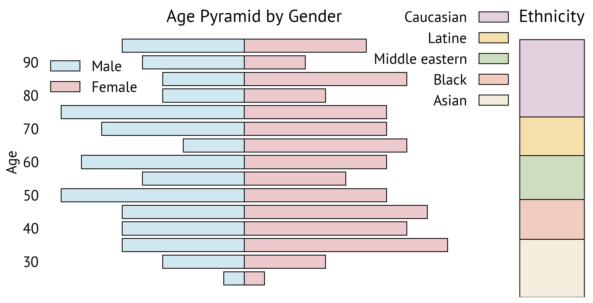

# CLEAR — Research Note

## 📇 Academic Context

| Field | Value |
|-|-|
| Title | CLEAR: Character Unlearning in Textual and Visual Modalities |
| Venue | Findings of the ACL 2025 |
| Year | 2025 |
| Authors | Alexey Dontsov, Dmitrii Korzh, Alexey Zhavoronkin, Boris Mikheev, Denis Bobkov, Aibek Alanov, Oleg Y. Rogov, Ivan Oseledets, Elena Tutubalina |
| Official Code | https://huggingface.co/datasets/therem/CLEAR |
| Venue Kind | paper |

> 本論文為經同行評審後正式發表的成果：arXiv 摘要頁的 `citation_doi` 為 `10.18653/v1/2025.findings-acl.1058`，DOI 前綴 `10.18653` 屬 ACL Anthology、`2025.findings-acl.*` 對應 Findings of the ACL 2025，故 Venue 標為 Findings of the ACL 2025。本筆記的全文出處為 arXiv preprint v4（arXiv:2410.18057v4，2024-10-23 首次公開、2025-05-31 更新），camera-ready 正式版可能與此 preprint 有出入。Venue tier 仍記為 `unknown`（未引用具體會議分級排名來源）。作者提供的是資料集連結（Hugging Face），並非訓練/實驗程式碼倉庫。

## First Principles

CLEAR 要處理的問題是「多模態機器遺忘」(multimodal unlearning, MMU)。機器遺忘 (machine unlearning) 的動機是「被遺忘權」(right to be forgotten)：當模型記住了某個特定個體的私密資訊，我們希望在不從頭重訓 (retraining from scratch) 的前提下，讓模型忘掉這個人。作者指出，現有遺忘方法幾乎只針對單一模態（純文字或純視覺），但多模態大語言模型 (MLLM) 帶來新風險——同一個實體的資訊會跨模態殘留：即使名字從文字端被抹除，臉孔仍可能從視覺端被辨識出來，反之亦然；而且在一個模態上做遺忘可能會破壞另一個模態的能力。作者主張這是一個尚未被開放基準涵蓋的缺口。

遺忘任務可以用一組資料子集精確定義。基礎模型 $f_{\theta}$ 在訓練集 $D$ 上訓練；我們要它忘掉的子集稱為遺忘集 $D_F$，其餘部分是保留集 $D_R := D \setminus D_F$，模型必須在 $D_R$ 上維持表現；另外還有一個與訓練集不相交的保留外集 (holdout set) $D_H$，用來當作「模型從未見過這些資料時應有的行為」的參照。若直接在這些子集（尤其是 $D_F$）上評估遺忘後的模型 $f_{\hat\theta}$，稱為「非精確」(inexact) 評估；若拿它和一個「只在 $D_R$ 上訓練」的黃金模型 (gold model) $g_{\omega}$ 直接比較，則稱為「精確」(exact) 評估。這組 forget / retain / holdout / gold 的骨架，是後續所有指標的地基。

多數遺忘方法可寫成一個「梯度差」(gradient difference) 形式的目標：對遺忘集加大損失、對保留集維持損失，兩者以權衡係數 $\lambda$ 相加：

$$\tilde L = -\sum_{x_i \in D_f} L(x_i, y_i, \theta) + \lambda \sum_{x_j \in D_R}L(x_j, y_j, \theta)$$

其中 $\alpha$ 是學習率、$L$ 通常取負對數概似 (negative log-likelihood)，而輸入 $x$ 在 VLLM 情境下可以是文字、影像、或兩者。這個式子點出了遺忘的核心張力：第一項想「推開」正確答案（易破壞模型），第二項想「錨住」保留知識；$\lambda$ 過小會連帶抹掉保留能力，過大則忘不乾淨。CLEAR 評估的 11 種方法（DPO、GD、GA、IDK、KL、LLMU、NPO、Retain FT、RMU、SCRUB、SKU）大多是這條式子的變體，差別在於用什麼形式表達「忘」與「記」（例如把標籤換成「我不知道」、用師生 KL 散度、或用偏好最佳化）。

CLEAR 的資料引擎是本文最實在的工程貢獻。它以純文字的 TOFU 資料集為骨架——TOFU 內含 200 位虛構作者、每人 20 題共 4,000 組問答。作者為這 200 位作者「配臉」：先用 StyleGAN2 生成 2,000 張人臉的候選池，用預訓練模型為每張臉標註年齡、性別、族裔，再依作者屬性篩選最接近者；由於文字側作者年齡明顯偏老，作者用一套影像編輯框架把臉「調老」以對齊分布；最後用 PhotoMaker 擴散模型，以選定的臉與 GPT-4 生成的提示詞合成影像，並用 GPT-4o 生成 caption。因為 GPT 內容守則的攔截以及 TOFU 本身的瑕疵（例如有一位無名作者），最終影像數少於文字組數（3,770 對影像-caption vs 4,000 組文字問答）。

為了驗證合成臉的真實度，作者做了一個「現實檢查」(reality check)：用 CLIP ViT-L/14 抽取三組影像（自己合成的臉、CelebA、WebFace）的嵌入，再在嵌入上計算兩兩 FID。結果是——合成臉對 CelebA 的 FID 為 74.4、對 WebFace 為 69.2，而 CelebA 對 WebFace 為 62.1。作者據此論證：合成臉與真實臉之間的距離，和兩個真實人臉資料集之間的距離「同一量級」，因此合成臉夠真。下圖顯示資料集在年齡、性別、族裔上的分布，作者宣稱其在這些屬性上是平衡且具代表性的。

基準用四個切分 (split) 來評估：**Forget** 依 TOFU 慣例取 2、10、20 位（各占 200 人的 1%、5%、10%）作為要被遺忘的子集；**Retain** 是 $D$ 扣掉 $D_F$ 的其餘部分，模型應盡量維持表現；**Real Faces** 用 MillionCelebs 與 Forbes 名人榜交集出的 150 對「臉-名」配對，檢查模型是否還認得訓練集外的真實臉孔（避免遺忘傷及一般人臉能力）；**Real World** 用一組視覺問答 (VQA) 樣本，檢查模型整體視覺能力是否被破壞。這個「兩個要動的集合（忘/留）＋兩個當護欄的集合（真實臉/真實世界）」設計，是把「遺忘副作用」納入量測的關鍵。

評估用四個指標，前三個都落在 0 到 1 之間：**ROUGE-L** 量測模型輸出與標準答案的字面重疊（模型是否還「一字不差」記得）；**Probability Score** 把每題當多選題，計算正確答案的正規化機率占所有候選機率的比例；**Truth Ratio** 比較「改寫後正確答案」與「數個同構錯誤答案」的機率，判斷資訊是否仍偏好正確方向。三者取調和平均 (harmonic mean) 分別在對應切分上聚合成 Real / Retain / Forget 三個總指標。第四個 **Forget Quality** 衡量遺忘後模型與黃金模型的「距離」，作為精確遺忘的代理指標：作者沿用 TOFU 取兩個模型的 Truth Ratio 分布，但把 Kolmogorov-Smirnov 檢定的 p-value 換成 Jensen-Shannon 距離，再用 1 減去該距離以維持「越高越好」。Probability Score 的定義如下（$y_1$ 為正確答案）：

$$\text{Prob} = \frac{p(y_1 \mid x)}{\sum_{i=1}^{n} p(y_i \mid x)}$$

一個具體的走查有助於理解這些數字。實驗以 LLaVA（ViT 視覺編碼器 + LLaMA2-7B）為來源模型，先在完整 CLEAR 上微調成「Base」，再對含 20 人（10%）的遺忘集施加各方法。把主結果表的關鍵列並排（值取自論文 Table 1）：

| 方法 | Real↑ | Retain↑ | Forget↓ | Forget Quality↑ |
|-|-|-|-|-|
| Gold | 0.50 | 0.51 | 0.19 | 1.00 |
| Base | 0.48 | 0.51 | 0.35 | 0.85 |
| DPO | 0.46 | 0.48 | 0.22 | 0.84 |
| LLMU | 0.47 | 0.51 | 0.25 | 0.84 |
| IDK | 0.48 | 0.51 | 0.33 | 0.84 |
| SCRUB | 0.49 | 0.52 | 0.36 | 0.85 |
| GA | 0.27 | 0.00 | 0.00 | 0.67 |
| RMU | 0.24 | 0.00 | 0.00 | 0.75 |

讀這張表要同時看「忘得夠不夠」與「留得住不住」。黃金模型是「從未學過這 20 人」的理想上界，其 Forget 為 0.19、Retain 為 0.51。像 GA、RMU 這類方法把 Forget 壓到 0.00（比黃金模型還「乾淨」），但 Retain 也崩到 0.00——它們不是選擇性遺忘，而是把模型整體打壞了。另一端的 SCRUB、IDK、Retain FT 保住了 Retain（約 0.51），但 Forget 仍高達 0.33–0.37，等於沒真的忘掉。只有 DPO（Forget 0.22 / Retain 0.48）與 LLMU（0.25 / 0.51）在兩者間取得較好平衡——最接近黃金模型，但仍有明顯差距。作者據此把方法分成三類：徹底破壞型、留而不忘型、以及少數兼顧型。

最後，論文用三個研究問題把結論收束成三個重點。其一，單模態表現無法預測多模態表現：作者以遺忘指標排名計算 Spearman 相關，文字對多模態的 $\rho=0.7$、視覺對多模態的 $\rho=0.2$，且出現「單域表現好、多模態卻整組崩掉」的斷裂（例如 RMU 在純文字下有不錯的忘/留平衡，多模態下 Retain 直接歸零）。其二，多模態聯合遺忘通常優於只動單一模態，但最佳模態的選擇高度依賴方法本身。其三，在同時遺忘兩個模態時，只有 LLMU 與 DPO 展現出兼顧遺忘與保留的潛力，但表現仍低於黃金模型（forget = 0.19, retain = 0.51）。作者以此反駁先前「純文字遺忘即足以應付多模態」的安全對齊結論。

## 🧪 Critical Assessment

### 跨模態殘留是真風險，公開基準的邊際價值

「跨模態殘留」是一個站得住腳的真實風險：把名字從文字端刪掉、臉孔卻仍能從視覺端辨識，確實符合被遺忘權的實務關切，而且作者用「臉-傳記」這種強綁定的個體資訊來具體化這個風險，比抽象的「安全對齊」更貼近隱私場景。論文最扎實的貢獻不是演算法，而是把一個先前只能用私有基準（如 MMUBench、EFUF 皆未開源）研究的問題，做成第一個公開、可控、可複現的評測管線——這對領域的邊際價值是真實的。

### 調和平均掩蓋子指標，Forget Quality 幾乎無鑑別力

指標設計有兩個值得警惕之處。其一，Real / Retain / Forget 都是 ROUGE、Probability、Truth Ratio 三者的調和平均；調和平均會被最小分量主導，這放大了「某一子指標崩掉」的訊號，卻也讓不同方法的總分難以拆解到底是哪一路出問題。其二，作為「精確遺忘」代理的 Forget Quality 在主表中幾乎擠在 0.83–0.85 一線（連 Base 都有 0.85），對絕大多數方法幾乎沒有鑑別力——真正把方法區分開的其實是 Forget 與 Retain 兩欄，Forget Quality 在此更像裝飾而非有效判準。此外，「完全破壞型」方法（GA、RMU）竟能得到看似不差的 Forget Quality（0.67、0.75），恰恰暴露這個代理指標對「模型是否還可用」不敏感。

### 合成資料帶來的效度風險

整個基準建立在合成人臉之上，作者也把這列為主要限制。FID 現實檢查（合成臉對真實臉 74.4/69.2，兩真實集之間 62.1）只能說明「分布距離同量級」，並不能保證合成臉承載了與真實個體相當的可記憶特徵；而「臉是模型自己生成、名字來自虛構 TOFU」也意味著被遺忘的並非模型在預訓練期自然記住的知識，而是實驗者刻意注入的關聯。這使得結論對「真實世界中自然習得的私密記憶」的外推力打了折扣。

### 11 種既有方法的搬移與 TOFU 評測沿用

必須誠實指出：本文沒有提出新的遺忘演算法。11 種方法全是既有工作，作者的工作是把它們「搬」到多模態設定並統一評測。基準本體也是既有元件的組裝——TOFU（文字）＋StyleGAN2/PhotoMaker（人臉）＋MillionCelebs/VQA（護欄）。更需注意的是，評測維度、切分比例與指標幾乎整套沿用 TOFU，等於基準是圍繞作者所採方法族群的既有強項而設計的；在這種「自訂靶再射箭」的結構下，「多模態比單模態好」這類結論，有一部分是由評測設計本身所保證，而非純粹的經驗發現。

### 沒有方法接近黃金模型：一把尺而非一套解法

按論文自己的數字，多模態遺忘遠未被解決：沒有任何方法接近黃金模型，最好的 DPO / LLMU 仍在忘與留之間明顯讓步，其餘方法非崩即漏。因此本文的定位應理解為「立起一把可信的尺，並證明現有方法達不到刻度」，而不是「提出可用的解法」。就現實意義而言，把方法限縮在「以精巧損失函數做微調」這一類（作者亦坦承未涵蓋解析式或機制式遺忘），加上只在 7B 級模型與合成資料上驗證、未觸及可擴展性與遺忘的公平性/偏差副作用，都讓它距離可部署的隱私保護方案尚遠。綜合而言，這是一份價值主要落在「基準與診斷」、而非「方法突破」的工作；把它當成 MMU 的起跑線、而非終點線來讀，是較恰當的態度。

## 🔗 Related notes

- [Stable Diffusion](../stable-diffusion/)：CLEAR 的資料引擎以擴散模型 (PhotoMaker) 合成人臉，與擴散式生成模型的原理相關。
