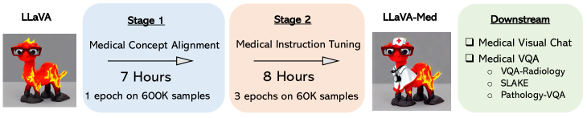

# LLaVA-Med — Research Note
> [English](./README.md) | **繁體中文**

## 📇 Academic Context

| Field | Value |
|-|-|
| Title | LLaVA-Med: Training a Large Language-and-Vision Assistant for Biomedicine in One Day |
| Venue | NeurIPS 2023 (Datasets and Benchmarks Track) |
| Year | 2023 |
| Authors | Chunyuan Li, Cliff Wong, Sheng Zhang, Naoto Usuyama, Haotian Liu, Jianwei Yang, Tristan Naumann, Hoifung Poon, Jianfeng Gao |
| Official Code | https://github.com/microsoft/LLaVA-Med |
| Venue Kind | paper |

## First Principles

通用領域的大型多模態模型（large multimodal model, LMM）如 LLaVA 依賴網路上的一般影像—文字配對訓練，面對生物醫學影像時往往表現得像門外漢（layperson），會拒答、給出錯誤回應甚至整段幻覺。LLaVA-Med 的核心命題就是：用可負擔的成本，把一個現成的通用 LMM 適配（adapt）成能對生物醫學影像做開放式問答的對話助手，而不是從頭訓練或做傳統的分類式 VQA。

整個方法的關鍵不是新網路，而是一條資料引擎。作者從 PubMed Central 萃取的大規模圖說資料集 PMC-15M（1500 萬組生物醫學影像—文字配對）取樣，再用 language-only GPT-4 只根據文字（圖說 caption 以及原文中提及該圖的句子 citances）自我生成（self-instruct）指令跟隨資料。GPT-4 全程看不到影像，只被要求用「彷彿看得到圖」的語氣產生多輪問答，因此整條流程零人工標註。

第一階段用的概念對齊資料，是把 600K 從 PMC-15M 取樣的影像—文字對，用最樸素的擴充法轉成指令：指令只要求「描述這張圖」，而目標輸出就是原始的 caption。依 caption 長度在「簡短描述」與「詳細描述」兩組問句之間切換，以 30 詞為分界（PMC-15M 中約 25% 的 caption 少於 30 詞）。這一階段只涵蓋單一任務（影像描述），目的在鋪滿生物醫學概念的覆蓋面。

第二階段用的指令微調資料，則先篩掉多子圖、只保留單一子圖的影像，再從 CXR（胸部 X 光）、CT、MRI、histopathology、gross pathology 這五種最常見模態取樣 60K 組，用 GPT-4 生成多輪問答，並把 PubMed 原文中提及該圖的句子（inline mentions, IM）當作額外脈絡。作者刻意做了三個版本——10K、60K、60K-IM——以消融資料生成策略對下游模型的影響。

每一筆對齊樣本被組織成單輪的指令跟隨格式，其中 $\Xmat_{\texttt{q}}$ 是取樣到的描述指令、$\Xmat_{\texttt{v}}$ 是影像、$\Xmat_{\texttt{c}}$ 是作為目標輸出的 caption：

```
Human : X_q  X_v  <STOP>\n
Assistant : X_c  <STOP>\n
```

模型結構直接沿用 LLaVA：一個視覺編碼器、一個線性投影層、一個語言模型。訓練採兩階段課程學習（curriculum learning）。Stage 1（生物醫學概念特徵對齊）同時凍結視覺編碼器與語言模型，只更新投影矩陣，把大量新的生物醫學視覺概念對齊到語言模型既有的詞嵌入；Stage 2（端到端指令微調）只凍結視覺編碼器，同時更新投影層與語言模型的權重，讓模型學會開放式對話語義。作者把這個過程類比成一個外行人逐步被訓練成專業助手。



這套配方主打「可負擔」：Stage 1 與 Stage 2 分別約 7 與 8 小時、合計不到 15 小時，跑在 8 張 40G A100 GPU 上，這也是標題「in One Day」的由來。作者提供了各階段、各 epoch 的實際耗時，讓使用者能自行做成本—品質取捨：

| 階段 / epoch | Stage 1 (1 ep) | Stage 1 (3 ep) | Stage 2 10K (1 ep) | Stage 2 10K (3 ep) | Stage 2 60K (1 ep) | Stage 2 60K (3 ep) |
|-|-|-|-|-|-|-|
| 時間（小時） | 6.8 | 19.4 | 0.6 | 1.8 | 2.6 | 8.0 |

評估分成兩條軸線。第一條是開放式視覺對話：作者構建 193 題全新問題（143 題 conversation 加 50 題 detailed description），用 language-only GPT-4 當裁判，對候選模型與 GPT-4 參考答案在有用性、相關性、正確性、細節程度上評分，再以 GPT-4 的參考分數正規化算出相對分數（relative score）。下表是各設定在這 193 題上的整體相對分數：

| 模型設定 | Conversation | Description | Overall |
|-|-|-|-|
| LLaVA | 39.4 | 26.2 | 36.1 |
| LLaVA-Med Stage 1 | 22.6 | 25.2 | 23.3 |
| LLaVA-Med 10K | 42.4 | 32.5 | 39.9 |
| LLaVA-Med 60K | 53.7 | 36.9 | 49.4 |
| LLaVA-Med 60K-IM | 55.1 | 36.4 | 50.2 |

走一遍實際數字更能看清課程學習的作用：通用 LLaVA 的整體相對分數是 36.1；只做 Stage 1 反而掉到 23.3，因為單一的影像描述指令讓模型喪失跟隨多樣指令的能力；補上 Stage 2 指令資料後，10K→60K→60K-IM 分別回升到 39.9、49.4、50.2，最佳的 60K-IM 版本達到 GPT-4 參考上限的 50.2%。這條曲線同時說明兩件事：Stage 1 單獨不足以當聊天機器人，而指令資料量與 inline mentions 都對品質有正貢獻。

第二條軸線是三個既有的生物醫學 VQA 基準：VQA-RAD、SLAKE、PathVQA。封閉式問題報 accuracy、開放式問題報 recall（因為 LLaVA-Med 以自由文字生成作答，而非從候選集挑選）。下表節錄下游微調後與過往 supervised SoTA 的比較（closed-set accuracy）：

| 方法 | VQA-RAD Closed | SLAKE Closed | PathVQA Closed |
|-|-|-|-|
| LLaVA | 65.07 | 63.22 | 63.20 |
| LLaVA-Med (From LLaVA) | 84.19 | 85.34 | 91.21 |
| LLaVA-Med (BioMed CLIP) | 83.09 | 86.78 | 91.09 |
| M2I2 | 83.50 | 91.10 | 88.00 |

經下游微調後，LLaVA-Med 在 VQA-RAD 與 PathVQA 的封閉式問題上刷新了 supervised SoTA（VQA-RAD closed 84.19、PathVQA closed 91.21），驗證了只要指令夠明確（例如是非題），模型就能可靠地依指令完成生物醫學任務。

但在開放式問題上，LLaVA-Med 只在 SLAKE 上取得 SoTA，在其餘資料集上的表現受限、甚至落後既有方法；作者把原因歸給開放式生物醫學問題在不限定候選答案時本就語意模糊。這個誠實的自陳，正好標示出這條路徑的邊界。

## 🧪 Critical Assessment

### 醫學影像上的幻覺是安全風險，不只是品質瑕疵
問題本身是真的：通用 LMM 在醫學影像上會像門外漢般幻覺，這在臨床脈絡下不只是品質瑕疵，而是安全風險。作者在結論也坦承 LLaVA-Med 仍受幻覺與淺層推理（weak in-depth reasoning）所限。把「領域適配」而非「更大模型」當成核心命題，對高價值但資料稀缺的垂直領域是合理且務實的切入點。

### GPT-4 既是出題者也是閱卷者：循環評估的風險
消融相當紮實：Table 3(b) 系統性地掃過 Stage 1/2 與下游微調的 epoch 數、7B vs 13B 語言模型、CLIP vs BioMedCLIP 視覺編碼器，並附上 running time 供成本—品質取捨。真正的隱憂在指標：聊天品質的主指標是 GPT-4 自評的 relative score，而訓練資料也由 GPT-4 生成——同一個模型家族既當出題者又當閱卷者，存在循環評估（circular evaluation）的偏誤風險，數字漂亮未必等於獨立的臨床效度。

### 新意在「圖說→指令」的資料配方與兩階段課程，而非架構
就元件而言，LLaVA-Med 幾乎全用既有積木：LLaVA 架構、GPT-4 self-instruct、PMC-15M 資料、可選的 Vicuna 或 BioMedCLIP 初始化。真正的新意集中在「圖說→指令」的資料生成配方與兩階段課程，較接近把一套成熟配方成功遷移到高價值垂直領域，而非架構層級的創新。持平地說，其資料集與流程的開源、以及低到「一天內」的訓練成本本身，就是有實用價值的貢獻，不宜只以「重組」一筆帶過。

### 封閉式刷新 SoTA、開放式仍落後：能力邊界與 193 題基準的自我耦合
「解決了嗎」必須分開看。封閉式 VQA 刷新 SoTA，本質是把是非/選擇題用生成式模型答對；而更貼近真實臨床提問的開放式問題，LLaVA-Med 反而多半落後既有方法，顯示開放式生物醫學理解遠未被解決。此外，193 題的視覺對話基準是作者用與訓練資料同一條 self-instruct 管線生成的，基準的定義與模型的強項高度耦合，且 GPT-4 參考答案吃到 golden caption 與 inline mentions、並非對影像的真實理解，使聊天分數更像內部一致性而非臨床效度。評估也未涉及真實部署、標註者一致性或安全稽核。因此本文更適合被理解為一個可負擔的領域適配「配方與資料資產」，而非臨床可用的成品系統。

## 🔗 Related notes

- [Stable Diffusion](../stable-diffusion/)
