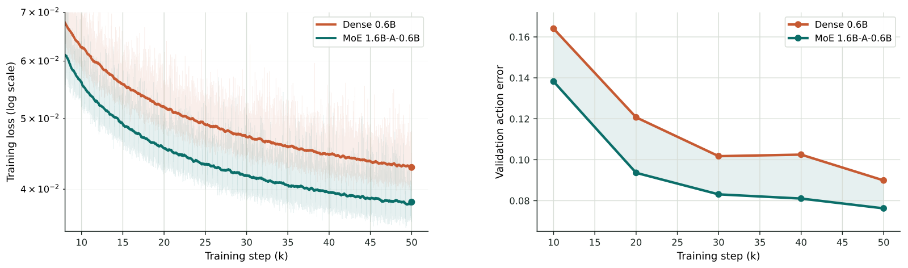
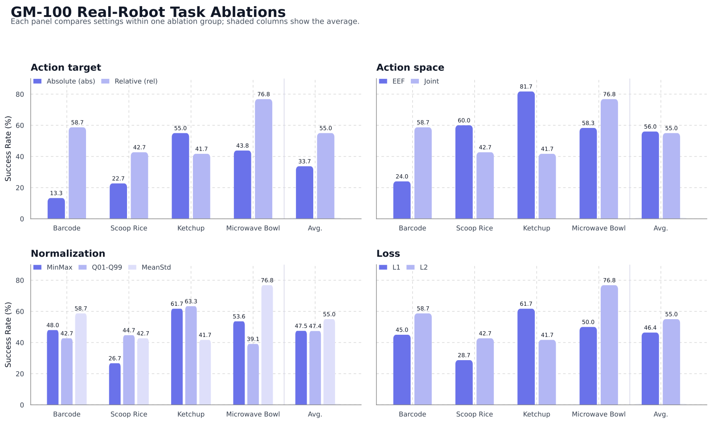
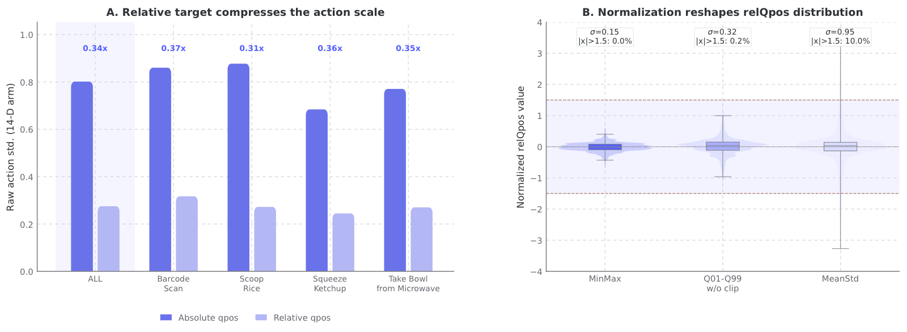

# LingBot-VLA-2.0: From Foundation Models to a Deployable VLA — Research Note
> **English** | [繁體中文](./README.zh-TW.md)

## 📇 Academic Context

| Field | Value |
|-|-|
| Title | From Foundation to Application: Improving VLA Models in Practice |
| Venue | arXiv preprint (not peer-reviewed) |
| Year | 2026 |
| Authors | Wei Wu, Fangjing Wang, Fan Lu, He Sun, Shi Liu, Yunnan Wang, Yibin Yan, Yong Wang, Shuailei Ma, Xinyang Wang, Yibin Liu, Shuai Yang, Tianxiang Zhou, Kejia Zhang, Lei Zhou, Cheng Su, Nan Xue, Bin Tan, Han Zhang, Youchao Zhang, Fei Liao, Xing Zhu, Yujun Shen, Kecheng Zheng |
| Official Code | https://github.com/robbyant/lingbot-vla-v2 |
| Venue Kind | tech-report |

## Introduction

VLA (vision-language-action) models have lately been treated as a viable path toward general-purpose robot policies: a pretrained vision-language model brings multimodal alignment and semantic priors, letting a policy understand scenes better and generalize across tasks. But the paper opens by pointing at a gap — in the authors' own words, a distance that still separates laboratory benchmarks and real-world deployment. Real robots face broader embodiment diversity (not just dual arms, but heads, waists, mobile bases, dexterous hands), a richer action space, and more dynamic environments (needing to anticipate how a scene evolves and what an action will cause, rather than only reacting to the current observation). This gap matters because scaling model and data size alone is not enough to make a VLA truly deployable; the authors argue that data, embodiment, and predictive capability must be handled together.

In response to that diagnosis, LingBot-VLA-2.0 improves on the previous LingBot-VLA along three axes: first, it rebuilds the data pipeline, curating a pretraining corpus of around 60,000 hours (50,000 hours of robot trajectories spanning 20 robot configurations, plus 10,000 hours of first-person human video) to strengthen cross-task, cross-embodiment generalization; second, it expands the action space from the standard dual arms to whole-body degrees of freedom that can control the head, waist, mobile base and dexterous hands; third, it introduces "predictive dynamics modeling" as a proxy task, using a video representation model for semantic priors and a depth estimation model for geometric cues to force the model to reason about future scenes.

How is success measured: under the generalist setting, the authors evaluate on the nine bimanual tasks of the GM-100 dual-arm manipulation benchmark plus two long-horizon mobile manipulation tasks, comparing against three baselines — GR00T N1.7, π0.5, and their own previous LingBot-VLA-1.0. GM-100 scores with two metrics — progress score (how far the task was advanced) and success rate — and the First Principles section below lays out the mechanisms, the dimension-by-dimension breakdown, and the cell-by-cell numbers.

## First Principles

### One-line positioning

This is a technical report (the self-description "In this report" comes from the paper body itself) that extends the previous `LingBot-VLA` along three engineering fronts into LingBot-VLA-2.0. The core is not a single new algorithm but a system-level integration: pretraining data scaled up to 60,000 hours, the action space expanded from dual arms to whole-body degrees of freedom, plus a "predict the future" distillation auxiliary objective. The authors' central hypothesis is that a practical VLA cannot rely only on making the model and data larger — it must also come closer to real robots in embodiment coverage, controllable action dimensions, and predictive understanding of dynamic scenes. (Note: the paper's figures are all vector PDFs; this note renders the key figures from the arXiv e-print's `figures/*.pdf` using macOS `qlmanage`, and cross-checks the figure readings primarily against the paper's tables and LaTeX source values.)

### Three functional fronts

The paper splits the improvements into three parts, matching the abstract's three points: (1) cross-task and cross-embodiment generalization, driven by rebuilding the data pipeline; (2) an expanded action space, letting the model control head, waist, mobile base and dexterous hands; (3) predictive dynamics modeling, using future prediction as a proxy task to strengthen temporal reasoning. Each of these maps to a concrete mechanism, dissected below down to the granularity where numbers can be computed.

### Data engine: 90,000 → 50,000 hours of robot data

The first improvement is really a data-cleaning pipeline. The raw collection was about 90,000 hours across 20 embodiments (single-arm, dual-arm, mobile platforms, with grippers or dexterous hands); after filtering it retains 50,000 hours of robot trajectories. The filtering rules are concrete: first compute Z-scores of the third-order finite difference (jerk) as well as the first-order (velocity) and second-order (acceleration) derivatives of the action/state signals, and drop any episode where any of these exceeds a per-embodiment threshold; also drop any episode where all signals are nearly static for more than 95% of its duration. Then the robot is projected back onto the image plane via URDF and the states are replayed, and human annotators compare the projection against the video to remove misaligned samples.

The table below excerpts representative platforms and their training Total DoF from the 20-embodiment statistics table, showing how large the action-space span is (a single model must ingest both the 8-D single-arm Franka and the 32-D humanoid Fourier GR-2 at once):

| Robot Type | Category | Total DoF | Policy Freq (Hz) |
|-|-|-|-|
| Franka | Single-Arm | 8 | 30 |
| AgileX | Dual-Arm | 14 | 30 |
| AgiBot G1 | Half-Humanoid | 20 | 30 |
| Astribot S1 | Half-Humanoid | 25 | 30 |
| Fourier GR-2 | Humanoid | 32 | 30 |
| Ego (egocentric human) | — | 14 | 30~60 |

The second source is egocentric human video: from a pool of about 20,000 hours of first-person human video, after VLM pre-filtering, reconstruction, standardization and quality control, 10,000 hours of egocentric human video are retained. For video without action labels, egocentric SLAM estimates the camera intrinsics/extrinsics, then hand pose estimation yields MANO parameters in the camera coordinate frame, and finally the camera pose is combined to lift the hand motion into the world coordinate frame.

### Unified action representation: compressing heterogeneous robots into 55 dimensions

To let all of the above heterogeneous data share one model, the authors use a 55-dimensional canonical vector to represent both state and action simultaneously: 14 dims for arm joints, 14 dims for end-effector pose, 2 dims for grippers, 12 dims for dexterous-hand joints, 4 dims for waist, 2 dims for head, 3 dims for mobile signals, with 4 dims reserved (14+14+2+12+4+2+3+4 = 55). Embodiments with fewer dimensions are zero-padded. During training, the future hand trajectory stored in the world frame is transformed back into the camera frame using the current frame's camera extrinsics, serving as the action representation at training time:

$$
\mathbf{p}_{\tau}^{C_t} = \mathbf{T}_{C_t \leftarrow W}\, \mathbf{p}_{\tau}^{W}
$$

This design treats the world frame as the unified trajectory storage space and the camera frame as the action space at training time, effectively decoupling hand motion from the camera's own motion.

### MoE action expert: sigmoid routing + auxiliary-loss-free load balancing

At the model level, the authors replace the FFN inside the action expert with a sparse MoE layer, a token-level loss-free MoE. Each MoE layer has one shared expert (preserving general priors) plus $N_r$ routed experts, of which each token activates only $K$. The MoE output is:

$$
m_{\ell}(u_{\ell,t}) = E_{\ell}^{(s)}(u_{\ell,t}) + \lambda \sum_{j \in \mathcal{R}(u_{\ell,t})} g_{\ell,j}(u_{\ell,t})\, E_{\ell,j}^{(r)}(u_{\ell,t})
$$

The routing borrows two designs from DeepSeek-V3: one is sigmoid-based routing (rather than softmax) for the token-to-expert affinity, avoiding excessive competition among experts; the other is the DeepSeek-V3-inspired auxiliary-loss-free strategy — instead of adding a load-balancing loss to the main objective, each expert maintains a correction bias $b_{\ell,j}$ that is added only when deciding "which experts to select," while the mixing weights still use the original unbiased affinity. The selection set takes the TopK of the bias-augmented affinity:

$$
\mathcal{R}(u_{\ell,t}) = \mathrm{TopK}_{j}\big(s_{\ell,j}(u_{\ell,t}) + b_{\ell,j},\, K\big)
$$

The authors claim that under a strictly active-parameter-matched, compute-equal comparison, the MoE achieves both a lower training loss on the pre-training data and a lower validation action error on GM-100 than the dense counterpart, arguing that the gain comes from the capacity allocation of sparse activation rather than merely piling on total parameters. This point is supported by only a single loss curve, with no downstream success-rate comparison. The figure below is the authors' only MoE evidence: the left and right axes are training loss and validation action error respectively, and the MoE 1.6B-A-0.6B (teal) curve stays below Dense 0.6B (orange) throughout (by 50k steps roughly 3.7×10⁻² vs 4.3×10⁻², 0.076 vs 0.090), yet both plots stop at "proxy metrics" and never extend to any real-robot success rate.

### Dual-query distillation: injecting geometric and temporal knowledge into the VLA

The third part is predictive dynamics, implemented with dual-query distillation. After the visual and text tokens the authors append two learnable queries $[\mathbf{Q}_t, \mathbf{Q}_{t+T}]$, corresponding to "the current observation" and "the observation at future horizon $T$ (i.e. the action-chunk length)," and distill from two complementary teachers. The geometric teacher is LingBot-Depth, aligning depth representations with an L1 objective:

$$
\mathcal{L}_{depth} = \mathbb{E}\big[\,\|\mathrm{Proj}_{depth}(\mathbf{Q}_t)-\mathbf{D}_t\|_1 + \|\mathrm{Proj}_{depth}(\mathbf{Q}_{t+T})-\mathbf{D}_{t+T}\|_1\,\big]
$$

The temporal teacher is DINO-Video, aligning patch-level features with the squared Frobenius norm, so the current query predicts the current-frame features and the future query predicts the future-frame features:

$$
\mathcal{L}_{video} = \mathbb{E}\big[\,\|\mathrm{Proj}_{video}(\mathbf{Q}_t)-\mathbf{Z}_t\|_F^2 + \|\mathrm{Proj}_{video}(\mathbf{Q}_{t+T})-\mathbf{Z}_{t+T}\|_F^2\,\big]
$$

### How the DINO-Video teacher itself was made

DINO-Video is initialized from the DINOv3 image backbone, adds block-wise causal temporal attention and 3D rotary positional embeddings, and is trained with a video-flavored DINO/iBOT self-distillation on 5M video clips; the key is "causal" — the feature at each timestep depends only on the current and past observations. The authors verify its qualification as a temporal teacher on LARYBench: at the same 303.13M parameters, DINO-Video is best on three of the four sub-benchmarks (Composite Robot 71.97, RoboCOIN, AgiBotWorld-Beta), losing only slightly to V-JEPA 2 on Composite Human.

| Model | Params(M) | Composite Human↑ | Composite Robot↑ | RoboCOIN↓ | AgiBotWorld-Beta↓ |
|-|-|-|-|-|-|
| V-JEPA 2 | 303.89 | **80.35** | 70.43 | 0.32 | 0.33 |
| DINOv3 | 303.13 | 76.19 | 69.06 | 0.22 | 0.24 |
| DINO-Video | 303.13 | 80.21 | **71.97** | **0.20** | **0.19** |

### Walking through an actual experiment: Retrieve keychain and the overall average

Take the Retrieve keychain cell on Agilex Cobot Magic to concretely feel the improvement magnitude: LingBot-VLA-2.0 relative to LingBot-VLA-1.0 rises from 67.5 / 60.0 to 100.0 / 100.0 (progress score / success rate, %) — meaning every single trial fully pulls open the drawer, grabs the keychain, moves it in front of the drawer, and puts it down. On the same platform, Pick out toy bone also rises from 77.5 / 70.0 to 95.0 / 90.0. This kind of task, which "needs precise object localization," is exactly what matches the authors' claimed stronger grounding backbone and future-conditioning.

| Task (Agilex) | GR00T N1.7 | $\pi_{0.5}$ | LingBot-VLA-1.0 | LingBot-VLA-2.0 |
|-|-|-|-|-|
| **Overall average** | 36.3 / 17.8 | 59.1 / 32.2 | 58.2 / 30.0 | **66.2 / 34.4** |
| Retrieve keychain | 12.5 / 10.0 | 20.0 / 20.0 | 67.5 / 60.0 | 100.0 / 100.0 |
| Block sorting | 40.0 / 10.0 | 90.4 / 60.0 | 59.2 / 10.0 | 56.8 / 0.0 |
| Pick out toy bone | 70.0 / 60.0 | 100.0 / 100.0 | 77.5 / 70.0 | 95.0 / 90.0 |

Overall, the nine-task average on Agilex is 66.2 / 34.4, 8.0 / 4.4 percentage points higher than LingBot-VLA-1.0 and also narrowly beating $\pi_{0.5}$'s 59.1 / 32.2; on the harder Galaxea R1 Pro the average is 34.6 / 15.6, 7.2 / 6.7 higher than $\pi_{0.5}$. But the same table also exposes a counterexample: on Block sorting, 2.0 gets only 56.8 / 0.0, not only losing to $\pi_{0.5}$'s 90.4 / 60.0 but with the success rate dropping to 0.0, worse even than their own 1.0's 59.2 / 10.0.

### Ablation: engineering details of the action representation

The paper's only ablation set is in a section titled Action Space, focused on the engineering choices of the action representation (run on only four GM-100 real-robot tasks). This section nominally corresponds to the second of the three contributions, "expanding the action space," but what it compares are the general design dimensions of action target / normalization / loss / EEF-vs-joint, and it does not isolate the real selling point of "scaling up the head, waist, mobile base and dexterous-hand degrees of freedom together," nor does it touch the other two (data scaling, predictive distillation). On action target, relative joint actions clearly beat absolute joint actions, raising the average success rate from 33.7 to 55.0, because relative actions turn "global joint-configuration regression" into "local motion regression," giving a more concentrated target with lower variance. On normalization, MeanStd provides the largest effective dynamic range, with the best average of 55.0, beating MinMax's 47.5; on loss function, L2's 55.0 beats L1's 46.4. Action space (EEF vs joint) has no absolute winner and depends on the task: on Barcode Scan joint's 58.7 far beats EEF's 24.0, while on Squeeze Ketchup EEF's 81.7 beats joint's 41.7 instead. The paper uses a "distribution-alignment gap" (the gap between each dimension's median and IQR relative to the pooled distribution — smaller means that task's action distribution is closer to the overall one) to explain this task dependence: on Barcode Scan joint's gap of 0.68 is far smaller than EEF's 1.73, matching joint winning; on Squeeze Ketchup conversely EEF's gap of 0.96 is smaller than joint's 1.59, matching EEF winning. But the authors themselves admit this explains only part — on Scoop Rice EEF has the larger gap yet is still better, showing that "distribution alignment is only part of the reason, not all of it." The figure below places these four ablation groups side by side, with four sub-panels each comparing one design dimension, the shaded column being the four-task average, at a glance showing relative (55.0 vs 33.7), MeanStd (55.0 vs MinMax 47.5, Q01-Q99 47.4), and L2 (55.0 vs L1 46.4) each winning, while EEF (56.0) and joint (55.0) are close on average with no global winner.

For why relative actions and MeanStd are better, the paper gives an additional distribution-level explanation: the left half of the figure below shows the raw action std of the 14-D arm, where the relative target compresses the action scale to about one-third of the absolute target (per-task ratios 0.31×–0.37×, ALL 0.34×, i.e. the pooled std drops from about 0.80 to about 0.28); the right half shows the distribution of relQpos under three normalizations, where MinMax squeezes the samples into a narrow band (σ=0.15), Q01-Q99 sits in the middle (σ=0.32), and MeanStd preserves the widest dynamic range (σ=0.95), thus able to carry larger correction actions.

### A foreshadowing: large data scale does not equal balanced distribution

Before moving into the critique, first look at one backdrop of the data itself. The paper does per-action statistics on the subtask annotations, and the result is highly skewed: the Manipulation category is almost entirely dominated by move (frequency 46.21%, 58.2% of total annotation time, average 10.4s per occurrence), while the Auxiliary category is dominated by transit at 42.48% frequency — the two "move/displacement" verbs eat up about 89% (46.21% + 42.48%) of subtask occurrences. The truly fine-grained manipulation verbs form a long tail: close 2.12%, fold 1.28%, pour 0.98%, dropping all the way to stir 0.07% and cut 0.03% that barely appear. Interestingly, these rare verbs have the longest per-occurrence duration (cut averages 35.6s, fold 32.4s, unfold 26.8s), of the "rare but long per occurrence" kind. In other words, the 60,000 hours of data is, in action composition, skewed toward moving and reaching and weak on fine manipulation, and this supports "cross-task generalization" unevenly — a backdrop to keep in mind when assessing the gains in the next section.

## 🧪 Critical Assessment

### Is the problem real and important enough to warrant this

The "gap between the lab and real deployment" is a genuinely recognized problem in the VLA field, and the three gaps the paper points at (cross-embodiment, more degrees of freedom, dynamic-scene prediction) are indeed practical pain points. I think this holds up: the mere fact that the data table has to ingest everything from the 8-D Franka to the 32-D humanoid shows that a cross-embodiment unified representation is a hard requirement. But "an important real problem" does not equal "this paper solved it" — the report does all three things together and evaluates them together, making it hard to judge how much each gap was actually closed.

### Are the baselines, ablations and sample sizes sufficient

To be clear: the main results are not without external baselines — the main table of the nine bimanual GM-100 tasks lists a four-way comparison of GR00T N1.7, $\pi_{0.5}$, LingBot-VLA-1.0 and 2.0 at once, and the long-horizon mobile experiments are also compared setting-by-setting against $\pi_{0.5}$. The real methodological weakness is elsewhere: the three contributions (data scaling, expanded action space, predictive distillation) have no per-item ablation to isolate their individual gains, and 2.0's improvement over 1.0 bundles all three changes together, so the reader cannot judge which one is doing the work. The group that did do a per-item ablation, though hung under the Action Space section and nominally corresponding to the second selling point "expanding the action space," actually compares the general VLA engineering choices of action target / normalization / loss / EEF-vs-joint, and does not isolate the genuinely claimed contribution of expanded degrees of freedom (head, waist, base, hands), and was run on only four tasks. Sample sizes are also small: the per-task success rates listed for the bimanual tasks are all spaced 10 percentage points apart (0.0, 10.0, 20.0…100.0), consistent with 10 trials per task, but the paper does not explicitly state the number of trials for the bimanual experiments; the long-horizon mobile tasks are explicitly written as 15 independent trials per "task-setting" pair, with OOD perturbing the robot's initial position by ±10 cm front/back/left/right and the fridge task additionally swapping two fruits and a water bottle for unseen object categories, at which point the success rate drops as low as 13.3, 6.7. Differences of this magnitude (such as the 6.6-percentage-point OOD improvement) fall within statistical noise, and the paper gives no confidence intervals or multiple seeds. Looking subtask-by-subtask, the volatility is also obvious: in the figure below each task's bars are not monotonically decreasing along the subtask index but fluctuate up and down (e.g. on Astribot S1 LingBot-VLA-2.0's ID score rises from 80 at subtask 2 to 87 at subtask 3, and rises again from 73 at subtask 5 to 80 at subtask 6), with some subtasks even scoring the same for ID and OOD; the truly stable signal is in the rightmost "Avg." column — on Astribot S1 the ID average is about 77 while the OOD average drops to about 37, a gap of forty percentage points, whereas on Cobot Magic-ARX X5 the ID is 84.3 and OOD about 67.5, a relatively smaller gap, showing that the cost of out-of-distribution generalization varies by platform.

### Gain magnitude and counterexamples

Even accepting the overall comparison, the gains are neither large nor uniform. On Agilex progress is only +8.0 and success +4.4; and on the Block sorting cell 2.0 gets 0.0 success, completely beaten by $\pi_{0.5}$'s 60.0, with the authors admitting in the text that "gains are not uniform" but not probing why their own new version regresses on some tasks. The predictive dynamics line has only qualitative perception visualizations (depth/DINO-Video PCA prediction figures), with no quantitative ablation of "with vs without the distillation" on manipulation success rate, so how much it actually helps downstream remains unverified. The entire evidence the authors provide for the third selling point is the figure below — the depth and DINO-Video-PCA predictions of the current and future frames against ground truth; it can show that "the model did learn geometric and temporal cues," but cannot answer "how much this contributes to the success rate."

### Is it a new method or an engineering integration of existing components

Frankly the novelty of this paper is mainly in integration rather than invention: the MoE routing explicitly follows DeepSeek-V3, the dual-query distillation self-admittedly is inspired by recent works, and DINO-Video is DINOv3 plus causal attention and 3D-RoPE. This is not necessarily a flaw — assembling these into a system that can run on 20 real-robot platforms has engineering value in itself — but the paper uses language like "validate the beneficial impact" to imply a mechanistic contribution, which sits at odds with its actual "assembly of known components" nature, and the reader should treat it as an engineering-system report rather than a methodological innovation.

### Custom scoring, benchmark attribution, and real-world relevance

The evaluation's GM-100 (The Great March 100) is a separate 2026 benchmark paper, formally a third-party benchmark. The only same-named person the two author lists share that can be directly checked from this task's cached sources is this paper's Project Lead Kecheng Zheng (also listed among GM-100's cited authors); beyond this one person the sources cannot confirm broader overlap, so it is neither appropriate to assert that GM-100 is a fully independent third-party evaluation nor to exaggerate it into an "in-house-ecosystem internal evaluation" — all that can be confirmed is the existence of this one shared author. As for the partial-credit scoring style of progress score, the paper explicitly records it as the GM-100 benchmark's own scoring standard — breaking each task into fine-grained steps and assigning a partial score to each (e.g. Push Ball into Box split into 30/70) — a design intrinsic to the benchmark rather than something the authors improvised for this report; however, who set this stepwise weighting and by what cross-team consensus is not explained by the cached sources. Moreover, the official code link (github.com/robbyant/lingbot-vla-v2) was not provided as a reproducible repo in this task, nor cloned and verified, so its contents and reproducibility currently cannot be confirmed. Overall, the report's demonstration of real-robot cross-platform deployment is valuable, but reading it as "the lab-to-real gap has been solved" would be overly optimistic — it is more like a step in that direction.

## One-minute wrap-up

- **The problem to solve**: the VLA "lab-to-real gap" — models that run in the lab often fail when moved to real robots, and the paper targets three gaps: cross-embodiment, more degrees of freedom, and dynamic-scene prediction. In the data table alone, a single model must ingest both the 8-D single-arm Franka and the 32-D humanoid Fourier GR-2.
- **Core mechanism (unified action representation)**: compress 20 heterogeneous robots into one 55-dimensional vector, zero-padding platforms that lack dimensions. The breakdown is 14 arm + 14 end-effector pose + 2 gripper + 12 dexterous hand + 4 waist + 2 head + 3 mobile + 4 reserved = 55.
- **Headline result**: 2.0 beats their own 1.0 on average across the nine Agilex tasks, but by a small margin. Overall rises from 58.2 / 30.0 to 66.2 / 34.4 (progress / success), i.e. +8.0 / +4.4 points.
- **Strongest counterexample (gains are not uniform)**: the new version does not improve on every task, and some regress outright. On Block sorting 2.0 gets only 56.8 / 0.0, with the success rate dropping to 0.0, completely beaten by $\pi_{0.5}$'s 90.4 / 60.0 and even losing to their own 1.0's 59.2 / 10.0.
- **Methodological reservation (no per-item ablation)**: the three selling points are evaluated bundled together, with no ablation isolating each one's contribution. The predictive-dynamics distillation has only qualitative depth / DINO-Video PCA prediction figures, with no quantitative "with vs without" comparison on success rate.
- **How to read it (benchmark attribution)**: the evaluation's GM-100 is nominally a third-party benchmark, but the only same-named person the two author lists share that can be checked from the sources is this paper's Project Lead Kecheng Zheng (also listed among GM-100's authors), and whether there is broader overlap cannot be confirmed by the sources; progress score is GM-100's own intrinsic partial-credit scoring standard, and the official code link was not cloned to confirm in this task.

## 🔗 Related notes

<!-- No other safely parseable related notes. -->
