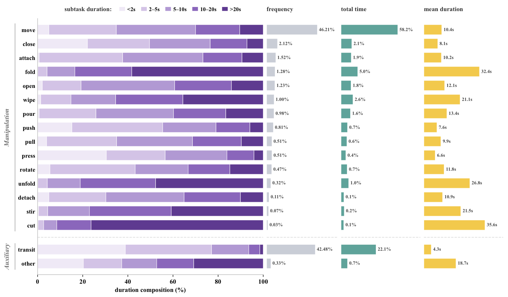
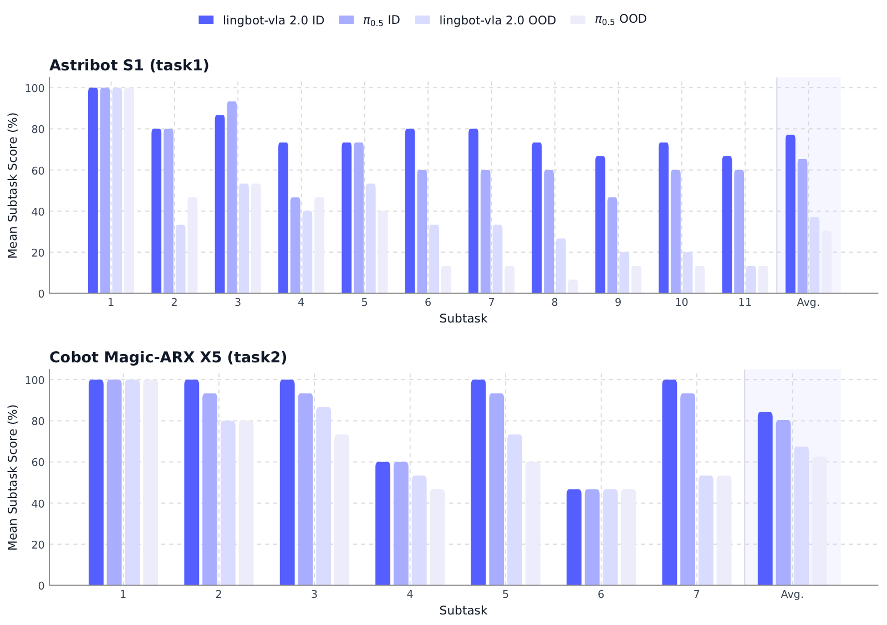
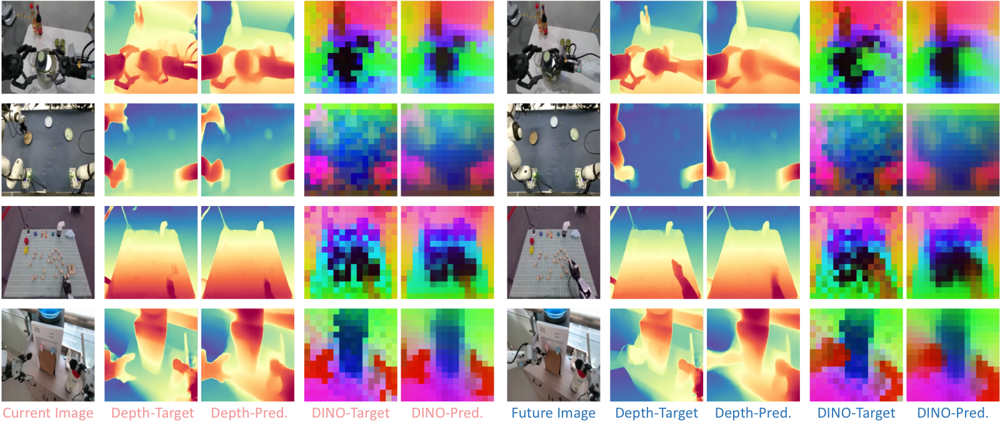

# LingBot-VLA-2.0：從基礎模型走向可部署的 VLA — Research Note
> [English](./README.md) | **繁體中文**

## 📇 Academic Context

| Field | Value |
|-|-|
| Title | From Foundation to Application: Improving VLA Models in Practice |
| Venue | arXiv preprint (not peer-reviewed) |
| Year | 2026 |
| Authors | Wei Wu, Fangjing Wang, Fan Lu, He Sun, Shi Liu, Yunnan Wang, Yibin Yan, Yong Wang, Shuailei Ma, Xinyang Wang, Yibin Liu, Shuai Yang, Tianxiang Zhou, Kejia Zhang, Lei Zhou, Cheng Su, Nan Xue, Bin Tan, Han Zhang, Youchao Zhang, Fei Liao, Xing Zhu, Yujun Shen, Kecheng Zheng |
| Official Code | https://github.com/robbyant/lingbot-vla-v2 |
| Venue Kind | tech-report |

## Introduction

VLA（vision-language-action）模型近年被視為打造通用機器人策略的可行路徑：預訓練的視覺語言模型帶來多模態對齊與語義先驗，讓策略更能理解場景、跨任務泛化。但論文開宗明義點出一道落差——用作者的話說，是 laboratory benchmarks and real-world deployment 之間仍有明顯距離。真實機器人面對的是更廣的 embodiment 多樣性（不只雙臂，還有頭、腰、移動底盤、靈巧手）、更豐富的動作空間，以及更動態的環境（需要預判場景演變與動作後果，而非只對當下觀測反應）。這道落差之所以重要，是因為只把模型與資料規模放大，並不足以讓 VLA 真正落地；作者主張要「資料、embodiment、預測能力」三者一起處理。

對應這個診斷，LingBot-VLA-2.0 沿三條軸線改進上一代 LingBot-VLA：其一是重做資料管線、整理出 around 60,000 hours 的預訓練語料（50,000 hours 機器人軌跡涵蓋 20 種 robot configurations，加上 10,000 hours 第一人稱人類影片）以強化跨任務、跨 embodiment 泛化；其二是把動作空間從標準雙臂擴展到能控制頭、腰、移動底盤與靈巧手的全身自由度；其三是引入「預測式動態建模」作為代理目標（proxy task），用一個影片表徵模型提供語義先驗、一個深度估計模型提供幾何線索，逼模型推理未來場景。

成效如何衡量：作者在 generalist 設定下，於 GM-100 dual-arm manipulation benchmark 的九個雙臂任務、外加 two long-horizon mobile manipulation tasks 上評測，並與 GR00T N1.7、π0.5、以及自家上一代 LingBot-VLA-1.0 三個基線比較。GM-100 用兩個指標打分——progress score（過程分，反映任務推進到哪一步）與 success rate（成功率），下文的 First Principles 會把機制、維度分解與逐格數字攤開來看。

## First Principles

### 一句話定位

這是一份技術報告（"In this report" 的自述用語即出自論文本文），把上一代 `LingBot-VLA` 沿三個工程面向擴充成 LingBot-VLA-2.0。核心不是單一新演算法，而是一次系統級整合：預訓練資料放大到 60,000 hours、動作空間從雙臂擴展到全身自由度、再加上一個「預測未來」的蒸餾輔助目標。作者的中心假設是——實用的 VLA 不能只靠把模型和資料變大，還要在 embodiment 覆蓋、可控動作維度、與動態場景的預測理解上更貼近真實機器人。（附註：論文圖表皆為向量 PDF，本文以 macOS `qlmanage` 從 arXiv e-print 的 `figures/*.pdf` 渲染關鍵圖，並優先以論文表格與 LaTeX 原始碼數值交叉核對圖面讀數。）

### 三個功能面向

論文把改進拆成三塊，對應摘要的三點：(1) 跨任務與跨 embodiment 的泛化，靠重做資料管線；(2) 擴展動作空間，讓模型能控制頭、腰、移動底盤與靈巧手；(3) 預測式動態建模，把未來預測當作代理任務（proxy task）來加強時序推理。這三塊各自對應一個具體機制，下面逐一拆解到能算出數字的粒度。

### 資料引擎：90,000 → 50,000 小時的機器人資料

第一塊改進其實是一條資料清洗管線。原始收集約 90,000 hours、涵蓋 20 個 embodiment（單臂、雙臂、移動平台，配夾爪或靈巧手），經過濾後保留 50,000 hours of robot trajectories。過濾規則很具體：先算動作/狀態訊號的三階有限差分（jerk）與一階（velocity）、二階（acceleration）導數的 Z-score，任一超過各 embodiment 個別設定的門檻即丟棄該 episode；若一段 episode 裡有超過 95% 的時間所有訊號幾乎不動，也丟棄。接著用 URDF 把機器人投影回影像平面、重放狀態，由人工標註員比對投影與影片是否一致來剔除錯位樣本。

下表節錄了 20 embodiments 統計表中的代表機型與其訓練用 Total DoF，顯示動作空間跨度之大（同一個模型要同時吃 8 維的單臂 Franka 與 32 維的人形 Fourier GR-2）：

| Robot Type | 類別 | Total DoF | Policy Freq (Hz) |
|-|-|-|-|
| Franka | Single-Arm | 8 | 30 |
| AgileX | Dual-Arm | 14 | 30 |
| AgiBot G1 | Half-Humanoid | 20 | 30 |
| Astribot S1 | Half-Humanoid | 25 | 30 |
| Fourier GR-2 | Humanoid | 32 | 30 |
| Ego（egocentric human） | — | 14 | 30~60 |

第二來源是 egocentric 人類影片：從約 20,000 hours 的人類第一人稱影片池，經 VLM 預過濾、重建、標準化與品質控管後留下 10,000 小時的 egocentric 人類影片。對沒有動作標籤的影片，用 egocentric SLAM 估相機內外參，再做手部姿態估計得到相機座標系下的 MANO parameters，最後結合相機位姿把手部運動抬升到世界座標系。

### 統一動作表徵：把異質機器人壓進 55 維

要讓上述異質資料共用一個模型，作者用一個 55-dimensional canonical vector 同時表示 state 與 action：14 維手臂關節、14 維末端執行器（end-effector）位姿、2 維夾爪、12 維靈巧手關節、4 維腰、2 維頭、3 維移動訊號，剩 4 維保留（14+14+2+12+4+2+3+4 = 55）。維度不足的 embodiment 就補零（padding）。訓練時，儲存在世界座標系的未來手部軌跡會用當前影格的相機外參轉回相機座標系，作為訓練時的動作表徵：

$$
\mathbf{p}_{\tau}^{C_t} = \mathbf{T}_{C_t \leftarrow W}\, \mathbf{p}_{\tau}^{W}
$$

這個設計把世界座標系當統一的軌跡儲存空間、相機座標系當訓練時的動作空間，等於把手部運動與相機自身運動解耦。

### MoE 動作專家：sigmoid 路由 + 無輔助損失負載平衡

模型層面，作者在 action expert 裡把 FFN 換成稀疏 MoE 層，這是一個 token-level loss-free MoE。每個 MoE 層有一個 shared expert（保存通用先驗）加上 $N_r$ 個 routed experts，每個 token 只啟用其中 $K$ 個。MoE 輸出為：

$$
m_{\ell}(u_{\ell,t}) = E_{\ell}^{(s)}(u_{\ell,t}) + \lambda \sum_{j \in \mathcal{R}(u_{\ell,t})} g_{\ell,j}(u_{\ell,t})\, E_{\ell,j}^{(r)}(u_{\ell,t})
$$

路由沿用 DeepSeek-V3 的兩個設計：一是用 sigmoid-based routing（而非 softmax）算 token 對專家的親和度，避免專家間過度競爭；二是受 DeepSeek-V3 啟發的 auxiliary-loss-free strategy——不往主目標塞負載平衡損失，改為每個專家維護一個修正偏置 $b_{\ell,j}$，只在「選哪些專家」時把偏置加上去，混合權重仍用原始無偏親和度。選集用帶偏置的親和度取 TopK：

$$
\mathcal{R}(u_{\ell,t}) = \mathrm{TopK}_{j}\big(s_{\ell,j}(u_{\ell,t}) + b_{\ell,j},\, K\big)
$$

作者宣稱在嚴格對齊 active parameter 數的等算力比較下，MoE 在 pre-training data 的 training loss 與 GM-100 上的 validation action error 都低於 dense 對照組，藉此主張增益來自稀疏激活的容量分配、而非單純堆總參數量。這一點只有一張 loss 曲線圖支撐，沒有下游成功率的對照數字。下圖即作者唯一的 MoE 佐證：左右兩軸分別是 training loss 與 validation action error，MoE 1.6B-A-0.6B（青綠）曲線全程壓在 Dense 0.6B（橘）之下（到 50k step 約 3.7×10⁻² vs 4.3×10⁻²、0.076 vs 0.090），但兩張圖都停在「代理指標」，沒有延伸到任何真機成功率。

### 雙查詢蒸餾：把幾何與時序知識灌進 VLA

第三塊是 predictive dynamics，用 dual-query distillation 實作。作者在視覺與文字 token 後面接兩個可學習查詢 $[\mathbf{Q}_t, \mathbf{Q}_{t+T}]$，分別對應「當前觀測」與「未來 horizon $T$（即 action chunk 長度）的觀測」，再從兩個互補教師蒸餾。幾何教師是 LingBot-Depth，用 L1 對齊深度表徵：

$$
\mathcal{L}_{depth} = \mathbb{E}\big[\,\|\mathrm{Proj}_{depth}(\mathbf{Q}_t)-\mathbf{D}_t\|_1 + \|\mathrm{Proj}_{depth}(\mathbf{Q}_{t+T})-\mathbf{D}_{t+T}\|_1\,\big]
$$

時序教師是 DINO-Video，用 Frobenius 範數的平方對齊 patch 級特徵，讓當前查詢預測當前影格特徵、未來查詢預測未來影格特徵：

$$
\mathcal{L}_{video} = \mathbb{E}\big[\,\|\mathrm{Proj}_{video}(\mathbf{Q}_t)-\mathbf{Z}_t\|_F^2 + \|\mathrm{Proj}_{video}(\mathbf{Q}_{t+T})-\mathbf{Z}_{t+T}\|_F^2\,\big]
$$

### DINO-Video 教師本身怎麼來的

DINO-Video 從 DINOv3 影像骨幹初始化，加上 block-wise causal temporal attention 與 3D rotary positional embeddings，在 5M 影片片段上用 video 版 DINO/iBOT 自蒸餾訓練，關鍵是「因果」——每一時刻特徵只依賴當前與過去觀測。作者在 LARYBench 上驗證它作為時序教師的資格：同為 303.13M 參數下，DINO-Video 在四個子基準中的三個最佳（Composite Robot 71.97、RoboCOIN、AgiBotWorld-Beta），僅 Composite Human 略輸 V-JEPA 2。

| Model | Params(M) | Composite Human↑ | Composite Robot↑ | RoboCOIN↓ | AgiBotWorld-Beta↓ |
|-|-|-|-|-|-|
| V-JEPA 2 | 303.89 | **80.35** | 70.43 | 0.32 | 0.33 |
| DINOv3 | 303.13 | 76.19 | 69.06 | 0.22 | 0.24 |
| DINO-Video | 303.13 | 80.21 | **71.97** | **0.20** | **0.19** |

### 走一遍實際實驗：Retrieve keychain 與整體平均

拿 Agilex Cobot Magic 上的 Retrieve keychain 這一格具體感受改進幅度：LingBot-VLA-2.0 相對 LingBot-VLA-1.0 從 67.5 / 60.0 提升到 100.0 / 100.0（progress score / success rate，%），也就是每一次試驗都完整拉開抽屜、抓到鑰匙圈、移到抽屜前、放下。同一平台的 Pick out toy bone 也從 77.5 / 70.0 提到 95.0 / 90.0。這類「需要精準物件定位」的任務正好對上作者宣稱的更強 grounding 骨幹與未來條件化。

| Task (Agilex) | GR00T N1.7 | $\pi_{0.5}$ | LingBot-VLA-1.0 | LingBot-VLA-2.0 |
|-|-|-|-|-|
| **Overall average** | 36.3 / 17.8 | 59.1 / 32.2 | 58.2 / 30.0 | **66.2 / 34.4** |
| Retrieve keychain | 12.5 / 10.0 | 20.0 / 20.0 | 67.5 / 60.0 | 100.0 / 100.0 |
| Block sorting | 40.0 / 10.0 | 90.4 / 60.0 | 59.2 / 10.0 | 56.8 / 0.0 |
| Pick out toy bone | 70.0 / 60.0 | 100.0 / 100.0 | 77.5 / 70.0 | 95.0 / 90.0 |

整體上，在 Agilex 上九個任務平均 66.2 / 34.4，比 LingBot-VLA-1.0 高出 8.0 / 4.4 個百分點，也小勝 $\pi_{0.5}$ 的 59.1 / 32.2；在較難的 Galaxea R1 Pro 上平均 34.6 / 15.6，比 $\pi_{0.5}$ 高 7.2 / 6.7。但同一張表也暴露反例：Block sorting 上 2.0 只有 56.8 / 0.0，不但輸給 $\pi_{0.5}$ 的 90.4 / 60.0，success rate 甚至掉到 0.0，比自家 1.0 的 59.2 / 10.0 還差。

### 消融：動作表徵的工程細節

論文唯一一組消融放在標題為 Action Space 的一節，聚焦動作表徵的工程選擇（只在四個 GM-100 真機任務上跑）。這一節名義上對應三大貢獻中的第二項「擴展動作空間」，但它比較的是動作目標／正規化／損失／EEF-vs-joint 這些通用設計維度，並未隔離「把 head、waist、mobile base、dexterous hand 的自由度一起放大」這個真正的賣點，也沒觸及另外兩項（資料放大、預測式蒸餾）。動作目標上，relative joint actions 明顯優於 absolute joint actions，平均成功率從 33.7 提升到 55.0，因為相對動作把「全域關節組態回歸」變成「局部運動回歸」，目標更集中、方差更小。正規化上，MeanStd 提供最大的有效動態範圍，平均 55.0 最佳，勝過 MinMax 的 47.5；損失函數上 L2 的 55.0 勝過 L1 的 46.4。動作空間（EEF vs joint）則沒有絕對贏家，取決於任務：Barcode Scan 上 joint 的 58.7 遠勝 EEF 的 24.0，Squeeze Ketchup 上 EEF 的 81.7 反勝 joint 的 41.7。論文用一個「分佈對齊 gap」（各維度中位數與 IQR 相對 pooled 分佈的差距，愈小代表該任務動作分佈愈接近整體）來解釋這個任務相依：Barcode Scan 上 joint 的 gap 0.68 遠小於 EEF 的 1.73，對應 joint 勝出；Squeeze Ketchup 反過來 EEF gap 0.96 小於 joint 的 1.59，對應 EEF 勝出。但作者自己也承認這只解釋了一部分——Scoop Rice 上 EEF 的 gap 較大卻仍較好，說明「分佈對齊只是部分原因，不是全部」。下圖把這四組消融並排，四個子面板各比較一個設計維度，陰影欄為四任務平均，可一眼看出 relative（55.0 vs 33.7）、MeanStd（55.0 vs MinMax 47.5、Q01-Q99 47.4）、L2（55.0 vs L1 46.4）各自勝出，而 EEF（56.0）與 joint（55.0）平均相近、沒有全域贏家。

為什麼相對動作與 MeanStd 較好，論文另給出分佈層面的解釋：下圖左半顯示 14 維手臂的原始 action std，相對目標把動作尺度壓到約絕對目標的三分之一（各任務比值 0.31×–0.37×，ALL 0.34×，即 pooled std 由約 0.80 降到約 0.28）；右半顯示三種正規化下 relQpos 的分佈，MinMax 幾乎把樣本擠成一條窄帶（σ=0.15），Q01-Q99 居中（σ=0.32），MeanStd 保留最寬的動態範圍（σ=0.95），因此能承載較大的修正動作。

### 一個伏筆：資料規模大不等於分佈均衡

在進入批判之前，先看資料本身的一個底色。論文對子任務標註做了逐動作統計，結果高度傾斜：Manipulation 類幾乎完全由 move 主導（frequency 46.21%、占總標註時間 58.2%、平均單次 10.4s），Auxiliary 類則由 transit 佔 frequency 42.48%——兩個「移動／位移」動詞就吃掉約 89%（46.21% + 42.48%）的子任務次數。真正精細的操作動詞是一條長尾：close 2.12%、fold 1.28%、pour 0.98%，一路掉到 stir 0.07%、cut 0.03% 幾乎不出現。有意思的是這些罕見動詞的單次耗時反而最長（cut 平均 35.6s、fold 32.4s、unfold 26.8s），屬「少見但單次很久」。也就是說 60,000 小時的資料在動作組成上偏向移動與抵達、而弱在精細操作，這對「跨任務泛化」的支撐並不均勻，是下一節評估增益時該記住的一個底色。

## 🧪 Critical Assessment

### 問題是不是真的、重要到值得這樣做

「實驗室與真實部署的落差」是 VLA 領域公認的真問題，論文點出的三個缺口（跨 embodiment、更多自由度、動態場景預測）也確實是實務痛點。這一點我認為站得住腳：光是資料表裡同時要吃 8 維 Franka 到 32 維人形，就說明跨 embodiment 統一表徵是硬需求。但「重要的真問題」不等於「這篇解決了它」——報告把三件事一起做、一起評，導致很難判斷每個缺口各被補上多少。

### 基線、消融與樣本數夠不夠

要說清楚：主結果並非沒有外部基線——雙臂 GM-100 九任務的主表同時列出 GR00T N1.7、$\pi_{0.5}$、LingBot-VLA-1.0 與 2.0 的四方對比，長程移動實驗也與 $\pi_{0.5}$ 逐設定對照。真正的方法學弱點在另一處：三大貢獻（資料放大、擴展動作空間、預測式蒸餾）沒有任何逐項消融去隔離各自增益，2.0 相對 1.0 的提升把三件改動綁在一起，讀者無從判斷是哪一項在起作用。真正做了逐項消融的那組雖然掛在 Action Space 一節、名義上對應第二個賣點「擴展動作空間」，比較的卻是動作目標／正規化／損失／EEF-vs-joint 這些通用 VLA 工程選擇，並未隔離真正宣稱的擴展自由度（head、waist、base、手）貢獻，也只在四個任務上跑。樣本數也偏小：雙臂各任務列出的 success rate 皆以 10 個百分點為間距（0.0、10.0、20.0…100.0），與每任務 10 次試驗相容，但論文未明載雙臂實驗的試驗次數；長程移動任務則明確寫為每個「任務-設定」對 15 independent trials，OOD 下把機器人初始位置在前後左右各 ±10 cm 擾動、冰箱任務另把兩顆水果與水瓶換成未見過的物件類別，此時 success rate 低到 13.3、6.7。這種量級的差異（如 OOD 提升 6.6 個百分點）落在統計雜訊範圍內，論文未給任何信賴區間或多次種子。逐子任務來看波動也很明顯：下圖每個任務的長條沿子任務序號並非單調遞減，而是上下起伏（例如 Astribot S1 上 LingBot-VLA-2.0 的 ID 分數從子任務 2 的 80 回升到子任務 3 的 87、又從子任務 5 的 73 回到子任務 6 的 80），部分子任務的 ID 與 OOD 甚至同分；真正穩定的訊號落在最右「Avg.」欄——Astribot S1 上 ID 平均約 77、OOD 平均掉到約 37，落差達四十個百分點，而 Cobot Magic-ARX X5 上 ID 為 84.3、OOD 約 67.5，落差相對小，顯示分佈外泛化的代價因平台而異。

### 增益幅度與反例

即使接受整體對比，增益也不算大且不均勻。Agilex 上 progress 只 +8.0、success +4.4；而 Block sorting 這格 2.0 拿 0.0 success、被 $\pi_{0.5}$ 的 60.0 完勝，作者在文中承認「gains are not uniform」但未深究為何自家新版在某些任務退步。predictive dynamics 這條線更只有定性的感知視覺化（深度/DINO-Video PCA 的預測圖），完全沒有「加了蒸餾 vs 不加」對操作成功率的量化消融，因此它到底幫了下游多少，仍是未經驗證的。作者為第三大賣點提供的全部證據就是下面這張圖——當前與未來影格的深度、DINO-Video-PCA 預測對照真值；它能說明「模型確實學到幾何與時序線索」，但無法回答「這對成功率貢獻多少」。

### 是新方法還是既有元件的工程整合

坦白說本文的新穎性主要在整合而非發明：MoE 路由明說沿用 DeepSeek-V3、雙查詢蒸餾自承 inspired by recent works、DINO-Video 是 DINOv3 加因果注意力與 3D-RoPE。這不必然是缺點——把這些拼成能在 20 個真機平台跑的系統本身有工程價值——但論文用「validate the beneficial impact」這種語氣暗示機制上的貢獻，與其實際的「已知元件組裝」性質有落差，讀者應把它當作一份工程系統報告而非方法創新。

### 自訂評分、基準歸屬與真實世界相關性

評測用的 GM-100（The Great March 100）是另一篇 2026 的基準論文，形式上是第三方基準。兩份作者名單以本任務快取來源可直接核對的唯一同名者，只有本文 Project Lead Kecheng Zheng（亦列於 GM-100 被引作者中）；除此一人之外，來源無法證實更廣泛的重疊，因此既不宜斷言 GM-100 是完全獨立的第三方評測、也不宜誇大成「自家生態系內部評測」，能確定的只有這一位共同作者的存在。至於 progress score 這種給部分分的評分方式，論文明確記為 GM-100 基準本身的評分標準——把每個任務拆成細粒度步驟、各步配一個部分分（例如 Push Ball into Box 拆成 30/70），屬基準既有設計，而非本文作者為這篇報告臨時自訂；不過這套 stepwise 配權由誰、依何跨團隊共識訂定，快取來源並未交代。此外，官方 code 連結（github.com/robbyant/lingbot-vla-v2）在本任務中未提供作為可複製的 repo、也未被克隆驗證，其內容與可複現性目前無法確認。整體而言，報告在真機跨平台部署上的展示是有價值的，但把它讀成「已解決 lab-to-real 落差」會過度樂觀——它更像是朝該方向邁出的一步。

## 一分鐘版

- **要解決的問題**：VLA 的「lab-to-real 落差」——實驗室能跑的模型搬到真實機器人常失效，論文鎖定跨 embodiment、更多自由度、動態場景預測三個缺口。光是資料表裡，同一個模型就要同時吃 8 維的單臂 Franka 與 32 維的人形 Fourier GR-2。
- **核心機制（統一動作表徵）**：把 20 種異質機器人壓進一個 55 維向量，維度不夠的機型就補零。拆解是 14 維手臂 + 14 維末端位姿 + 2 夾爪 + 12 靈巧手 + 4 腰 + 2 頭 + 3 移動 + 4 保留 = 55。
- **頭號結果**：2.0 在 Agilex 九個任務平均勝過自家 1.0，但幅度不大。overall 從 58.2 / 30.0 提到 66.2 / 34.4（progress / success），也就是 +8.0 / +4.4 分。
- **最強反例（增益不均勻）**：新版不是每個任務都變好，有的直接退步。Block sorting 上 2.0 只拿 56.8 / 0.0，success rate 掉到 0.0，被 $\pi_{0.5}$ 的 90.4 / 60.0 完勝，還輸給自家 1.0 的 59.2 / 10.0。
- **方法學保留（沒有逐項消融）**：三大賣點綁在一起評，沒有隔離各自貢獻的消融。predictive dynamics 蒸餾只有定性的深度 / DINO-Video PCA 預測圖，完全沒有「加了 vs 不加」對成功率的量化對比。
- **讀法建議（基準歸屬）**：評測用的 GM-100 名義上是第三方基準，但兩份作者名單以來源可核對到的唯一同名者，只有本文 Project Lead Kecheng Zheng（亦列於 GM-100 作者），是否更廣泛重疊無法由來源證實；progress score 則是 GM-100 基準既有的部分分評分標準，而官方 code 連結在本任務中未被克隆確認。

## 🔗 Related notes

<!-- 無其他可安全解析的相關 note。 -->
