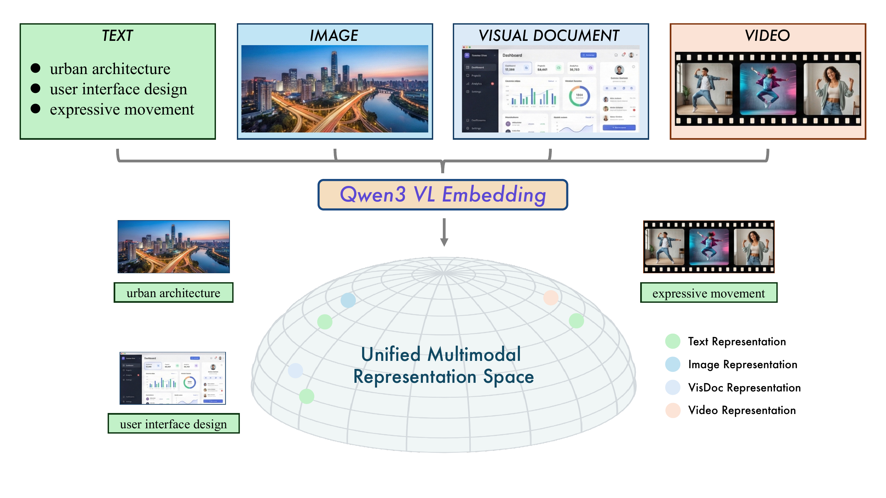
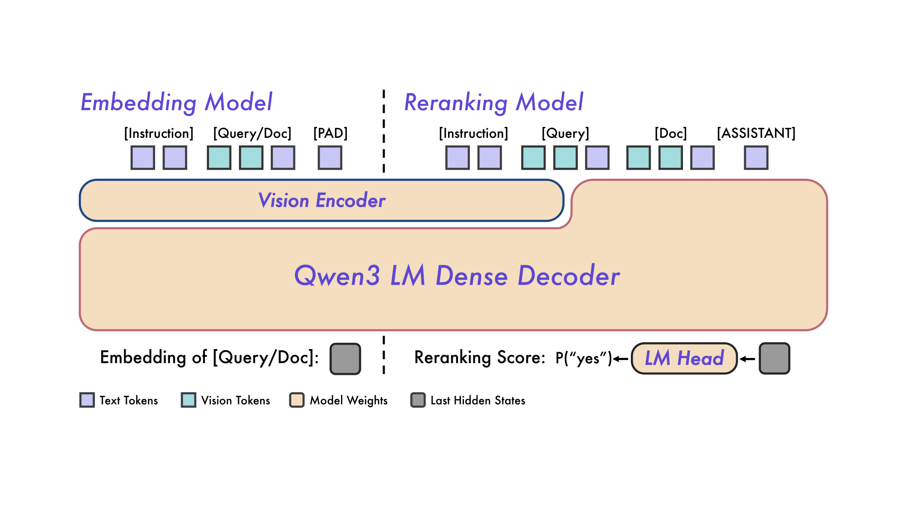
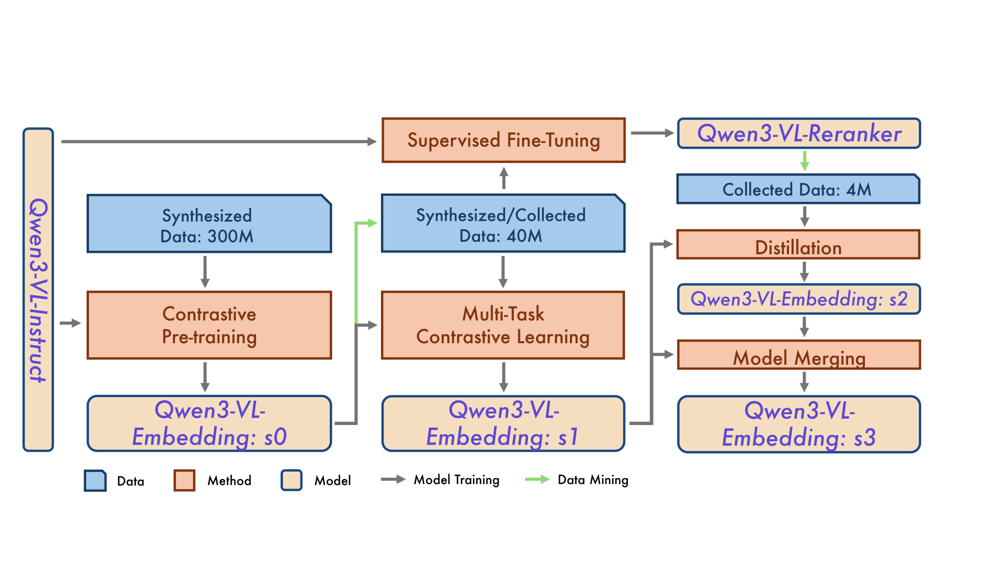
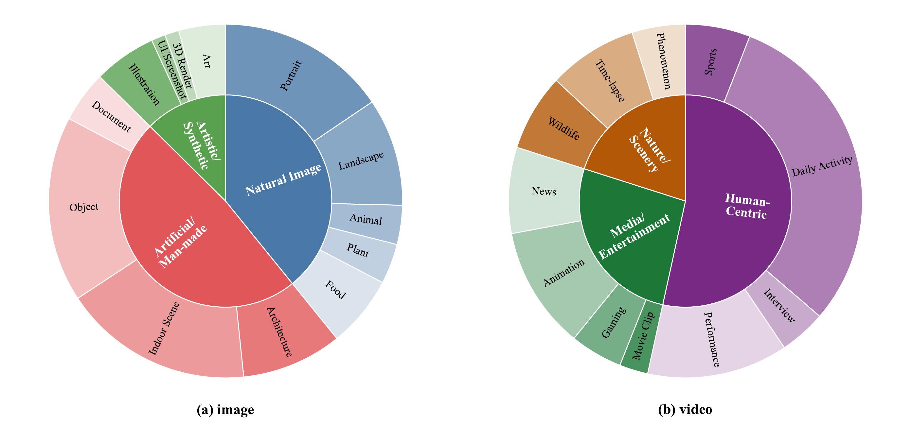
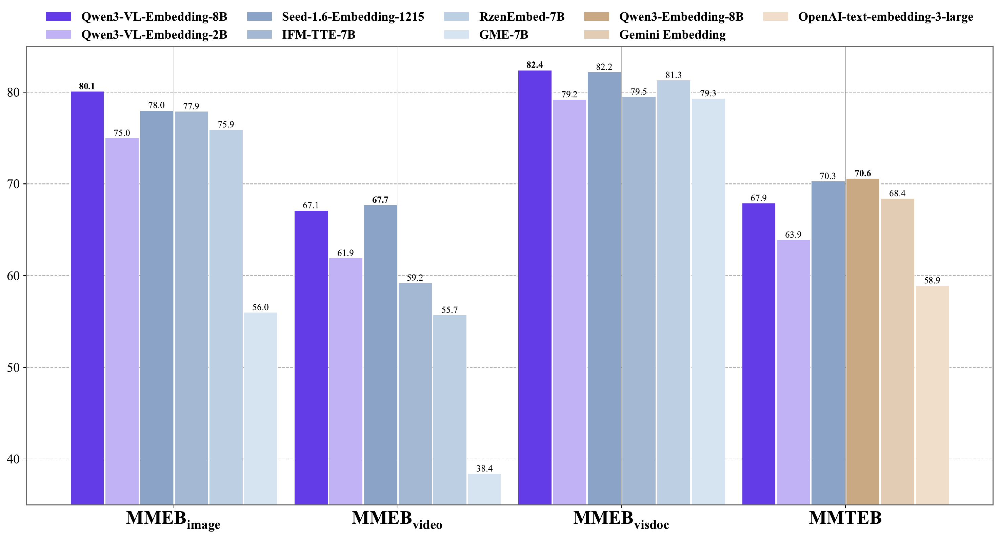
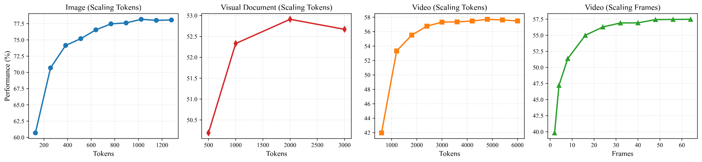

# Qwen3-VL-Embedding 與 Qwen3-VL-Reranker — 研究筆記
> [English](./README.md) | **繁體中文**

## 📇 Academic Context

| Field | Value |
|-|-|
| Title | Qwen3-VL-Embedding and Qwen3-VL-Reranker: A Unified Framework for State-of-the-Art Multimodal Retrieval and Ranking |
| Venue | arXiv (technical report) |
| Year | 2026 |
| Authors | Mingxin Li, Yanzhao Zhang, Dingkun Long, Keqin Chen, Sibo Song, Shuai Bai 等，Tongyi Lab, Alibaba Group |
| Official Code | https://github.com/QwenLM/Qwen3-VL-Embedding |
| Venue Kind | tech-report |

> 本筆記以 arXiv:2601.04720 的技術報告全文（LaTeX 原始碼）為主要證據，並以官方 repository（釘選 commit `393e297`）與 model card 補足部署細節。技術報告未經同儕審查，正式版本可能與此有出入。

## Introduction

現代網路內容同時包含自然影像、文件截圖、資訊圖表與影片，單一模態的文字搜尋已無法涵蓋這些需求；Qwen3-VL-Embedding 與 Qwen3-VL-Reranker 想解決的，是把文字、影像、文件影像與影片映射到「同一個表示空間」，讓查詢與文件不論屬於哪一種模態都能互相檢索。這是一個真實的檢索問題：例如以「urban architecture」這段文字去撈出對應的都市建築照片或一段街景影片。

論文 Figure 1 把這個目標畫成一張示意圖：文字（如「urban architecture」「user interface design」「expressive movement」等描述）、自然影像（都市天際線）、視覺文件（儀表板截圖）與影片（人物動作片段）四種模態的實例，被投影到同一個「Unified Multimodal Representation Space」半球流形上；圖例中綠、藍、淺藍、粉紅四色分別代表 Text、Image、Visual Document、Video 的表示向量。只要語意相同，例如同屬「urban architecture」的一段文字與一張都市照片，就會落在流形上相近的位置，因而能跨模態互相檢索。

論文提出的高階解法是一個「embedding 模型 + reranker 模型」的兩段式檢索管線，兩者都建構在 Qwen3-VL 基座之上。Embedding 模型採 bi-encoder，把每個實例壓成一個稠密向量、以 cosine similarity 當作相關性度量，負責大規模召回；Reranker 模型採 cross-encoder，對 query–document 配對做 cross-attention 後輸出精細的相關性分數，負責重排序。兩者都繼承 Qwen3-VL 的多語言能力（宣稱支援 30 種以上語言），並各自釋出 2B 與 8B 兩種尺寸。

論文如何衡量解法是否有效？主要在 MMEB-V2 這個涵蓋 Image、Video、Visual Document 三大領域、9 個任務類別、共 78 個資料集的多模態基準上評測，並輔以純文字的 MMTEB 與視覺文件檢索的 JinaVDR、ViDoRe v3。旗艦模型 Qwen3-VL-Embedding-8B 在 MMEB-V2 取得 77.8 的總分，論文宣稱在評測當下（2026 年 1 月）排名第一。

本筆記的重點放在「影片 embedding」這條路徑上：影片如何被取樣、tokenize、pool 成一個向量，畫質／解析度／時長／FPS／幀數如何在一個固定的 pixel/token 預算內互相競爭，以及論文所展示的影片能力到底建立在什麼證據之上。

## First Principles

### 兩個模型：一個 bi-encoder，一個 cross-encoder

兩個模型都以 Qwen3-VL 為骨幹、使用 causal attention，並從 Qwen3-VL-Instruct 初始化。Embedding 模型的輸入沿用 Qwen3-VL 的對話結構：instruction 放在 system 訊息（預設指令是 "Represent the user's input."），要被表示的多模態實例放在 user 訊息，最後附加一個 `<|endoftext|>` 的 PAD token，並取這個 token 對應的最後一層 hidden state 當作整個實例的稠密向量。Reranker 則把「定義相關性的 instruction」與「要比較的一對實例」都放進 user 訊息，最後以模型預測下一個 token 是 "yes" 或 "no" 的機率來估計相關性。

這兩種架構各有取捨，也解釋了為什麼「embedding + reranker」串接會勝過單獨任一個。Bi-encoder 把 query 與 document 分開編碼，向量可離線建索引、線上只算 cosine，適合在百萬到十億級語料上做快速召回，但 query 與 document 在編碼時彼此看不到對方；cross-encoder 把 query 與 document 拼在同一個序列裡做深層 cross-attention，能捕捉細粒度對應關係、判斷更準，但每個配對都要跑一次完整前向、無法預先建索引。論文的做法是用 Embedding-2B 先召回 top-100 候選，再用 reranker 重排這 100 筆，兼顧速度與精度。

論文釋出的四個模型規格如下：Embedding 模型 2B 為 28 層、輸出 2048 維，8B 為 36 層、輸出 4096 維；兩者序列長度都標為 32K，並支援量化與 Matryoshka Representation Learning。Reranker 的 2B／8B 同為 28／36 層、32K 序列長度，但因為輸出的是相關性分數而非向量，沒有 embedding 維度、也不支援 MRL 與量化。

| 模型 | 尺寸 | 層數 | 序列長度 | Embedding 維度 | MRL | Instruction-aware |
|-|-|-|-|-|-|-|
| Qwen3-VL-Embedding | 2B | 28 | 32K | 2048 | Yes | Yes |
| Qwen3-VL-Embedding | 8B | 36 | 32K | 4096 | Yes | Yes |
| Qwen3-VL-Reranker | 2B | 28 | 32K | - | - | Yes |
| Qwen3-VL-Reranker | 8B | 36 | 32K | - | - | Yes |

### 從影片檔到向量：完整前處理路徑

這是本筆記的核心。論文正文只用一句話帶過影片前處理（訓練時「以 1 FPS 取樣、最多 64 幀、所有幀合計 token 預算 4,500，約 9.2×10⁶ 像素」），完整的路徑要靠官方 repository 的 `src/models/qwen3_vl_embedding.py` 才能重建。以下每一步都標明它是論文明述、官方程式碼行為，還是我方推論。

**(1) 解碼與時間取樣（兩條輸入路徑並不相同）。** 官方 embedder 的預設是 `FPS = 1` 與 `MAX_FRAMES = 64`，但影片有兩種輸入型態，取樣行為不同，靜態讀碼可清楚區分。當輸入是**影片檔路徑**（字串）時，`format_model_input` 只把 `{'fps': 1, 'max_frames': 64}` 交給 Qwen3-VL processor，由 processor 負責解碼與取樣——本地並不會執行 `sample_frames`。當輸入是**一串幀**（frame list）時，程式才在本地呼叫 `sample_frames`，以 `np.linspace(0, len(frames) - 1, 64, dtype=int)` 從既有幀裡均勻取 64 幀。兩條路徑的共同後果是：只要有效幀數超過 64（例如一段長影片在 1 FPS 下產生上百幀，或一串上百張的 frame list），都會被壓到剛好 64 幀——時間解析度隨影片變長而變粗，幀與幀之間的間隔越拉越大。

**(2) 空間解析度與 pixel 預算。** 每幀維持原始長寬比，但整段影片受一個總量預算限制。程式碼裡影片的預設 `total_pixels` 值來自 `MAX_TOTAL_PIXELS = 10 * FRAME_MAX_PIXELS = 7,864,320`，其中 `FRAME_MAX_PIXELS = 768 * 32 * 32 = 786,432` 只是用來推算這個「總量」的係數——靜態讀碼可確認它從未被當成每幀上限傳給 processor（它在整份程式碼裡只出現在定義 `MAX_TOTAL_PIXELS` 這一行）。README 進一步說明這個 `total_pixels` 在模型內部會「乘以 2」（等效總量約 15,728,640 像素），並舉例「16 幀的影片，每幀最多可到 983,040 像素（1280×768 解析度）」——注意 983,040 已高於 786,432，正說明每幀能分到多少像素是由「等效總量 ÷ 實際幀數」決定，而不是某個固定的每幀 cap；換句話說，這份 repository 並沒有公開可驗證的每幀影片 pixel 上限。也就是說，幀數與每幀解析度共用同一塊預算：幀數越多，每幀能分到的像素越少。但要留意：這個 `total_pixels` 只在 **frame-list 路徑**的 `video_kwargs` 裡帶入；在**影片檔路徑**下，`video_kwargs` 會被覆寫成只含 `fps`、`max_frames` 的 dict，`total_pixels` 直接被丟棄，每幀像素改由 processor 自帶的預設決定。因此下面所有用 `total_pixels` 換算像素的算例，嚴格說只適用於 frame-list 這條路徑。

**(3) 視覺 token 化與時空合併。** Qwen3-VL 沿用 16×16 patch，並以 2×2 空間合併把一個 merged patch 對應約 32×32=1024 像素的一個視覺 token；相鄰兩幀在時間維上再合併。這一步論文本身沒有逐項描述，屬於從 Qwen3-VL 基座與像素↔token 換算推得（論文影像端「1,280 tokens≈1.3×10⁶ 像素」正是 1024 像素/token 的比例）。

**(4) 與文字/指令融合、截斷、pooling。** 視覺 token 與 system 指令、user 文字串成一個序列送進 Qwen3 LM decoder。官方 embedder 的預設上下文長度是 `MAX_LENGTH = 8192`（低於 model card 標示的 32K 容量）。要注意實作與直覺不同：真正生效的截斷是在 `_preprocess_inputs` 呼叫 processor 時、以 `truncation=True, max_length=self.max_length` 委派給 processor 完成的，由 processor 決定丟哪些 token。檔案裡雖另外定義了一個 `_truncate_tokens`（其邏輯是保留所有特殊 token、只截掉多餘的非特殊 token），但靜態讀碼可確認它在這份 released wrapper 裡沒有任何呼叫點，因此「保留特殊 token」這條規則並非實際生效的截斷路徑，只是一段未被使用的 helper。最後 `_pooling_last` 以 `attention_mask` 定位、取出每個序列最後一個有效（mask=1）位置的 hidden state 當向量。這裡也要把論文模板與 released code 分開講：wrapper 只透過 `apply_chat_template(..., add_generation_prompt=True)` 建立文字，`PAD_TOKEN`（`<|endoftext|>`）在此檔案僅定義、未被使用，所以靜態證據只能證明它 pool 的是「最後一個有效位置」，無法證明該位置就是 PAD token——論文模板確實含 PAD，但那是論文敘述，不能直接當成 released 實作的行為。

**(5) 投影、正規化與相似度。** 取出的向量即為 8B 的 4096 維（或 2B 的 2048 維），再以 `F.normalize(embeddings, p=2, dim=-1)` 做 L2 正規化，之後任意兩個實例的相關性就是它們正規化向量的內積（cosine similarity）。Reranker 走的是另一條線：取序列最後一個位置的 hidden state 過 LM head，計算 "yes"／"no" logit。

### 三階段訓練、蒸餾與模型合併

訓練用 LoRA、從 Qwen3-VL-Instruct 初始化，分三個階段，目的在調和「大量弱監督資料」與「稀缺高品質資料」之間的失衡。Stage 1 用大規模合成資料做對比預訓練，得到初版 s0（管線圖標示約 300M 筆合成資料）；Stage 2 混合公開與自有資料、輔以合成資料做多任務對比學習得到 s1（約 40M 筆），同時在檢索子集上訓練出 Qwen3-VL-Reranker；Stage 3 用這個 reranker 對一份較小的資料（約 4M 筆）打分，蒸餾進 embedding 模型得到 s2，最後把 s2 與 s1 做模型合併得到最終的 s3。

這個順序背後有一個明確的動機：s2 雖然在檢索類任務大幅進步，卻在分類與 QA 上略有退步，於是用模型合併把 s1 的通用性補回來。訓練資料本身也經過影片導向的清理——先做粗粒度品質過濾剔除低解析度與異常長寬比的素材，再用 scene cut detection 偵測鏡頭切換、移除靜止或損毀片段以「保留影片的時間動態完整性」，接著用 Qwen3-VL-32B 產生細粒度標籤、用 GME embedding 的相似度過濾掉跨模態對齊不良的樣本。影片端合成四種任務：Video Classification、Video Question Answering、Video Retrieval，以及做細粒度時間定位的 Moment Retrieval。

論文 Figure 4 用兩張雙層環圖呈現這些種子池的組成。影片端（右）內圈是 Human-Centric、Nature/Scenery、Media/Entertainment 三大類，外圈再細分為 Daily Activity、Sports、Interview、Performance（人物中心），Wildlife、Time-lapse、Phenomenon（自然景觀），以及 News、Animation、Gaming、Movie Clip（媒體娛樂）。可以看出人物與日常活動佔比最大——這也預告了後文的疑慮：這類影片多由可辨識的人物與靜態場景構成，未必需要連續動態才能被檢索出來。

各階段在 MMEB-V2（2B）上的表現印證了上述取捨。下表為論文 Table「Performance across training stages」的原始數字，可看到 Video Overall 從 s0 的 57.5 一路到 s3 的 61.9，而蒸餾階段 s2（59.5）確實不如純多任務的 s1，需要靠合併救回：

| Stage | Image Overall | Video Overall | VisDoc Overall | All |
|-|-|-|-|-|
| s0 | 65.8 | 57.5 | 74.8 | 66.6 |
| s1 | 74.8 | 60.3 | 77.1 | 72.1 |
| s2 | 71.3 | 59.5 | 80.9 | 71.5 |
| s3 | 75.0 | 61.9 | 79.2 | 73.2 |

### 訓練目標、MRL 與量化

Embedding 模型的檢索資料在 Stage 1 用標準 InfoNCE，把來自五種來源的負例聚進分母，並用一個遮罩 $m_{ij}$ 濾掉疑似 false negative（當某負例相似度高過正例相似度 +0.1 時就把它遮掉）：

$$
\mathcal{L}_{\mathrm{retrieval}} = - \frac{1}{N} \sum_{i}^{N} \log\frac{e^{s(q_i, d_i^+)/\tau}}{Z_i}
$$

其中 $s(\cdot,\cdot)$ 是 cosine similarity、$\tau$ 是溫度。Stage 2 進一步把 query–query 與 document–document 這兩類批內負例從 $Z_i$ 移除，論文說這在高品質多模態資料上經驗表現更好。分類資料改用「只把明確錯誤標籤當負例」的對比式；STS 資料用 CoSent loss 保持 cosine 對 ground-truth 分數的排序。

第三階段的蒸餾把 reranker 的判斷轉移給 embedding 模型：對每個 query，離線用 reranker 算出正例與 $k$ 個負例的相關性 logit，線上用 embedding 的 cosine 分數，最小化兩個分布的交叉熵：

$$
\mathcal{L}_{\mathrm{distill}} = -\sum_{i=1}^{k+1} P_{\mathrm{reranker}}(d_i \mid q)\, \log P_{\mathrm{embedding}}(d_i \mid q)
$$

Reranker 自己則是把重排當成二元分類，以 $-\log p(l \mid I, q, d)$ 訓練（$l$ 為 yes／no），推論時分數為 $s = \mathrm{sigmoid}(\mathrm{logit}(\text{yes}) - \mathrm{logit}(\text{no}))$。

為了部署效率，訓練時額外對「截斷後的低維前綴」也計算損失（MRL），並用 LSQ 的 Quantization-Aware Training 讓向量在 int8／binary 下仍穩健。分析顯示這些取捨在可接受範圍內：以 2B 在文字檢索上，維度從 1024 降到 512 只掉 1.4% 的檢索表現，卻換來 50% 儲存節省與兩倍檢索速度；int8 幾乎無損，但 binary 會顯著傷害檢索效果，且維度越低傷害越大。

### 評測設計與「真正的影片」結果

MMEB-V2 的影片領域細分成 CLS、QA、RET 與 MRET（moment retrieval）四個任務類別，依論文表格頂端的「# of Datasets」列各含 5、5、5、3 個資料集，共 18 個。評測時上下文限制 16,384 tokens，影片任務把總 token 上限設在 15,000、幀數上限 64。這裡要對讀者把證據邊界講清楚：論文只提供上述「按任務類別加總」的分數，既沒有載明這些分數所用的評測指標（例如是 Recall、accuracy 還是加權平均），也沒有逐一列出這 18 個影片資料集的名稱、檢索方向（是 text→video 還是 video→text）與各自的樣本規模——這些欄位是由外部的 MMEB-V2（即 VLM2Vec-V2，Meng et al. 2025，arXiv 2507.04590）基準所定義，本論文僅引用該基準而未在正文重現。正文影片端唯一具體點名的資料集出現在附錄的相似度展示表（UCF101、NExTQA、MSR-VTT 各一例），那是質性示例而非完整清單。因此下表每一格都應理解為「該任務類別下多個資料集的加總分」，而不是可回溯到單一資料集、單一指標或單一檢索方向的數字。下表抽出 MMEB-V2 的 Video 五欄，把 Qwen3-VL-Embedding 與最強的開源、閉源基線並列：

| 模型 | 尺寸 | Video CLS | Video QA | Video RET | Video MRET | Video Overall |
|-|-|-|-|-|-|-|
| RzenEmbed | 8B | 58.8 | 63.5 | 51.0 | 45.5 | 55.7 |
| Ops-MM-embedding-v1 | 8B | 59.7 | 62.2 | 45.7 | 43.2 | 53.8 |
| Seed-1.6-embedding-1215 | - | 85.2 | 66.7 | 59.1 | 54.8 | 67.7 |
| Qwen3-VL-Embedding-2B | 2B | 71.9 | 64.9 | 53.9 | 53.3 | 61.9 |
| Qwen3-VL-Embedding-8B | 8B | 78.4 | 71.0 | 58.7 | 56.1 | 67.1 |

在開源模型裡 Qwen3-VL-Embedding-8B 的影片總分 67.1 明顯領先（RzenEmbed-8B 只有 55.7）；但值得注意的是閉源的 Seed-1.6-embedding-1215 影片總分 67.7 反而略高於 Qwen 的 67.1，其 Video CLS 高達 85.2 更是異常值。換句話說，論文摘要宣稱的「MMEB-V2 排名第一」是建立在跨三領域的加總 All=77.8 之上，單看影片領域並非無人能及。

論文首頁（摘要下方）的對比長條圖把這個「加總第一、影片未必第一」的結構畫得很清楚：深紫柱為 Qwen3-VL-Embedding-8B、淺紫柱為 2B，其餘藍系柱為 Seed-1.6-Embedding-1215、IFM-TTE-7B、RzenEmbed-7B、GME-7B 等視覺基線（最右 MMTEB 欄另含 Qwen3-Embedding-8B、Gemini、OpenAI 等純文字基線）。8B 在 MMEBimage 以 80.1 明顯領先（次高者僅 78.0，拉開 2.1 分），但 MMEBvisdoc 的 82.4 雖是全場最高，卻只以 0.2 分險勝閉源 Seed-1.6-Embedding-1215 的 82.2，屬邊際優勢而非「大幅領先」；到了 MMEBvideo 欄更由 Seed-1.6-Embedding-1215 的 67.7 略高於 8B 的 67.1——換句話說，真正被 8B 拉開差距的只有影像領域，文件影像與影片都是伯仲之間甚至落後。

Reranker 的影片證據也需要拆開看。論文用 Embedding-2B 召回 top-100 後再重排，Reranker-8B 把影片檢索分數推到 61.0（相對 Embedding-2B 的 53.6 有明顯提升），但 Reranker-2B 的影片分數 53.2 其實還略低於同尺寸 Embedding-2B 的 53.6——也就是說，在影片這個模態上，小型 reranker 帶來的重排未必划算，收益主要來自 8B。

### 一個具體的影片 embedding 範例

用官方預設走一遍一段 120 秒、原生 30 FPS 的影片（要對 "baseball player hits ball" 這類文字查詢做 text-to-video 檢索），並且明確走 **frame-list 路徑**（先用外部工具每秒抽一張幀，得到約 120 張，再把這串幀交給 embedder）：`sample_frames` 以 `np.linspace(0, 119, 64)` 從這 120 幀均勻取 64 幀，等於每約 1.9 秒留一幀。接著 `video_kwargs` 帶入 `total_pixels=7,864,320`（模型內部乘 2 後為 15,728,640 像素）分配到 64 幀，每幀約 245,760 像素（約 512×480，0.25 MP）。依 1024 像素/視覺 token、再做相鄰兩幀的時間合併，我方估計整段影片約產生 7–8 千個視覺 token，落在評測 15,000 的影片上限與官方 8192 上下文之內；最後取序列最後一個有效位置（論文設計是附加的 PAD token）的 4096 維 hidden state、L2 正規化，與查詢文字的向量算 cosine。（若改把整支影片檔直接丟給 embedder 走影片檔路徑，取樣與每幀像素改由 processor 決定、`total_pixels` 不生效，上面的像素與 token 數只供量級參考。）論文附錄的展示範例中，MSR-VTT 的「baseball player hits ball」對正確影片的相似度為 0.80，UCF101 動作分類為 0.66，NExTQA 影片問答為 0.64。

這個範例也直接暴露了輸入條件的張力：同樣一段 120 秒影片，若把它切成短片段（每段 <64 秒）就能保住 1 FPS 的時間解析度、每幀也能分到更多像素；一旦整段丟進去，時間與空間都被 64 幀與 total_pixels 兩道上限同時壓縮。

### 輸入條件矩陣：設定、機制後果與是否量測

下表把影片輸入的每個維度拆成三種不同性質的陳述：(a) 官方支援的預設設定、(b) 純機制性的後果、(c) 論文是否真的量測到對 embedding 品質的影響。凡是論文沒有做受控消融的欄位都明確標成「未量測」，不臆測。

| 維度 | 官方設定（論文/程式碼） | 機制性後果 | 是否有受控量測 |
|-|-|-|-|
| FPS | 訓練 1 FPS；程式碼預設 `fps=1`（僅影片檔有效） | >64 秒影片有效取樣率跌破 1 FPS | 未量測（無 FPS 消融） |
| 最大幀數 | `max_frames=64`（訓練與評測皆 64） | 長影片被均勻壓到 64 幀，時間細節流失 | 有：Video (Scaling Frames) 曲線 |
| 每幀像素 | 無公開的每幀 cap；每幀像素＝等效總量(≈15,728,640)÷實際幀數（16 幀例可到 983,040≈1280×768） | 幀數↑則每幀解析度↓ | 未直接量測單幀解析度 |
| 總 token/pixel 預算 | 訓練 4,500 tokens；評測 15,000 tokens；程式碼 `total_pixels=7,864,320`（內部×2，僅 frame-list 路徑帶入） | 空間與時間共用一塊預算 | 有：Video (Scaling Tokens) 曲線 |
| 輸入路徑 | frame-list：本地 `sample_frames`＋帶入 `total_pixels`；影片檔：只把 `fps`、`max_frames` 交給 processor（`total_pixels` 被丟棄） | 兩路徑的取樣與每幀像素預算不同 | 未量測（無跨路徑對照） |
| 上下文長度 | model card 32K；評測 16,384；程式碼預設 8192 | 過長序列被截斷 | 間接：極高預算下略有退步 |
| 時長上限 | 無明訂硬上限，由幀數×預算隱含 | 時長越長被壓縮越嚴重 | 未量測（無時長消融） |
| 長寬比 | 每幀維持原始長寬比 | 不強制裁切 | 未量測 |
| 壓縮/畫質/低光 | 無專門設定 | — | 未量測（無壓縮/雜訊消融） |

論文唯一針對粒度的量測是「Impact of Spatial and Temporal Granularity」：把影片拆成「幀數」與「總 token 預算」兩軸各自縮放。從曲線可讀出影片隨幀數從 2 幀約 40% 升到 16 幀約 55%、64 幀約 57.5%，隨 token 預算從約 600 tokens 的 42% 升到 3,000 以上的約 57.5%，兩軸都呈明顯遞減報酬，且在最高消費處略有回落，論文歸因於「處理過長 context 時模型本身的退化」。要強調的是：這是把 token 與幀數當資源的縮放曲線，論文並沒有提供受控的解析度、壓縮率、FPS 或影片時長消融，也沒有把「時序理解」從「稀疏靜態畫面」中分離出來的實驗。

## 🧪 Critical Assessment

### 問題是否真實且重要

跨模態統一檢索是一個真實且有經濟價值的問題：電商商品搜尋、科學文獻探索、社群導覽都需要「不論查詢或文件是哪種模態都能檢索」。以 VLM 為底座做統一 embedding 的路線（E5-V、GME、VLM2Vec 等）也早有社群基礎，論文的定位清楚，並非製造假需求。真正需要檢視的是後面幾點——影片能力的證據強度、評測的自訂程度，以及論文宣稱與可部署預設之間的落差。

### 影片能力：是時序理解，還是稀疏靜態畫面？

這是我對本論文最大的保留。所有影片評測都在「最多 64 幀、影片任務總 token 上限 15,000、上下文 16,384 tokens」的預算下進行（1 FPS 是論文訓練階段實作所述的取樣設定，正文的 MMEB-V2 評測段落只載明幀數與 token 上限，並未載明評測所採用的 FPS），而附錄展示的資料範例甚至是用單張縮圖（`.jpg`）代表整段影片；粒度曲線顯示 16 幀就已達到 64 幀約 96% 的表現（55.0 / 57.5 = 95.65%；此曲線只縮放幀數，並未把各點綁定到影片時長或 FPS），意味著多數增益來自「多看幾張稀疏畫面」而非連續動態。論文自己合成的四類影片任務裡確實包含 Moment Retrieval 這種需要時間定位的任務，MRET 也是四個影片子項中分數最低者（8B 僅 56.1），但論文並沒有做任何「打亂幀順序 vs 保持順序」「稠密取樣 vs 稀疏取樣」的對照，因此無法排除「影片分數其實可由靜態關鍵幀 + 物件/場景線索解釋」這個競爭假說。把它稱為「video embedding」在召回層次成立，但「時序/事件理解」尚未被證據支撐。

### 基線、消融與自訂評測的充分性

主結果幾乎完全綁在 MMEB-V2 這一個榜單上，SOTA 的宣稱也以此為準。這帶來兩個風險：其一，加總 All 分數會被領域數量與各領域難度加權稀釋，單看影片領域閉源 Seed-1.6-1215（67.7）就已超過 Qwen-8B（67.1），「排名第一」是加總層面的說法而非影片層面的。其二，論文的資料合成大量使用 Qwen3-VL-32B 產生標籤與查詢，評測基準若與這類合成分布同源，就有評測自訂、朝著自家資料畫靶的疑慮，而論文沒有提供污染/洩漏分析來排除。消融方面，除了粒度曲線與階段表，缺乏對 instruction 敏感度、多語言影片、以及最關鍵的「解析度/FPS/壓縮」受控實驗。

### 新穎性：整合工程還是方法創新

就單一技術元件而言，本作多為既有方法的整合：bi-encoder + last-token pooling、InfoNCE、cross-encoder reranker、MRL、QAT/LSQ、LoRA、模型合併都非首創，訓練目標明說是「延伸 Qwen3-Embedding」。真正的貢獻在系統層面——把影片導向的資料清理（scene cut、去靜止片段）、四類影片任務合成、reranker→embedding 蒸餾與 s1/s2 合併整合成一條能跑到 SOTA 的管線，並附上實用的 MRL/量化部署特性。這是紮實的工程整合，但把它讀成「影片表示學習的方法突破」會高估其新穎性。

### 可重現性與部署落差

技術報告在關鍵數字上存在前後不一致，會影響重現：影片總 token 預算在訓練是 4,500、評測是 15,000、程式碼 `total_pixels` 換算又是另一個量級（7,864,320 像素，內部×2），論文沒有給三者的換算或說明，而這個 `total_pixels` 還只在 frame-list 路徑生效、影片檔路徑改由 processor 預設決定，使「一支影片實際吃掉多少像素預算」更難界定；上下文長度 model card 標 32K、評測用 16,384、而釋出的 embedder 預設只有 8192。訓練資料多為專有、合成 prompt 僅附選錄，外部要完整重現不可行。硬體需求、批次大小、溫度 $\tau$ 等超參也未完整揭露。這些都不否定結果，但讓「宣稱的通用影片支援」與「實際被測與可部署的操作條件」之間留下需要使用者自行補足的空白。

## 一分鐘版

- **跨模態統一檢索**：把文字、影像、文件影像與影片映射到同一個表示空間互相檢索。例如輸入「urban architecture」這段文字，能直接撈出對應的都市建築照片或一段街景影片。
- **兩段式管線**：向量模型（bi-encoder）先在百萬級語料上離線建索引、快速召回 top-100，交叉注意力模型（cross-encoder reranker）再深層重排這 100 筆，兼顧速度與精度。
- **影片的預算競爭**：幀數與每幀解析度共用同一塊像素預算。走 frame-list 路徑時，一段 120 秒影片會被均勻壓到剛好 64 幀（每約 1.9 秒一幀）、每幀約 512×480，整段約產生 7–8 千個視覺 token。
- **開源總分第一，影片未必第一**：Qwen3-VL-Embedding-8B 在 MMEB-V2 加總 All 取得 77.8、宣稱排名第一，但單看 Video Overall 是 67.1，仍略低於閉源 Seed-1.6 的 67.7。
- **時序理解仍存疑（重要保留）**：影片高分多半來自辨識稀疏畫面裡的靜態線索，而非理解連續動態——取樣 16 幀就已達到 64 幀約 96% 的表現，且論文完全沒有做「打亂幀順序 vs 保持順序」這類能證明時序理解的對照實驗。
- **小型 reranker 對影片不划算**：Reranker-8B 把影片檢索分數從 53.6 推到 61.0，但 Reranker-2B 只有 53.2，反而略低於 Embedding-2B 原本的 53.6，收益主要來自 8B。

## 補充
官方 wrapper 的預設設定下，一小時影片最多只會留下 64 幀來產生一個 embedding。
處理邏輯是：
- 影片檔路徑：先按預設 fps=1 取得約 3,600 個候選時間點，再受 max_frames=64 限制。
- Frame-list 路徑：只要輸入超過 64 張，就用 np.linspace 從頭到尾均勻選 64 張。實作見 qwen3-vl-embedding/src/models/qwen3_vl_embedding.py:119。
- 預設值明確是 MAX_FRAMES = 64，見 qwen3-vl-embedding/src/models/qwen3_vl_embedding.py:30。

一小時的平均取樣間隔大約是：3599 秒 ÷ 63 個間隔 ≈ 57.1 秒
也就是大約每 57 秒才保留一幀。一個只持續幾秒的擊球、轉身或事故事件，很可能完全沒被取到。

但 64 不是模型不可修改的硬上限，而是官方 wrapper 的預設與論文評測設定：
- 建構 embedder 時可以提高 max_frames。
- 直接傳影片檔時，也能針對單筆輸入覆寫 max_frames，見 qwen3-vl-embedding/src/models/qwen3_vl_embedding.py:290。
- 提高後仍會受視覺 token、context、顯存及每幀畫質預算約束，而且論文沒有證明一小時長片提高幀數後的實際品質。
實務上不應直接把一小時壓成一個向量。比較合理的是切成例如 30–60 秒、帶重疊的片段，每段各產生 embedding；如此搜尋結果還能定位到具體時間區段。

## 🔗 Related notes

- [Video-MME](../Video-MME/)
- [VideoLLM-online](../VideoLLM-online/)
